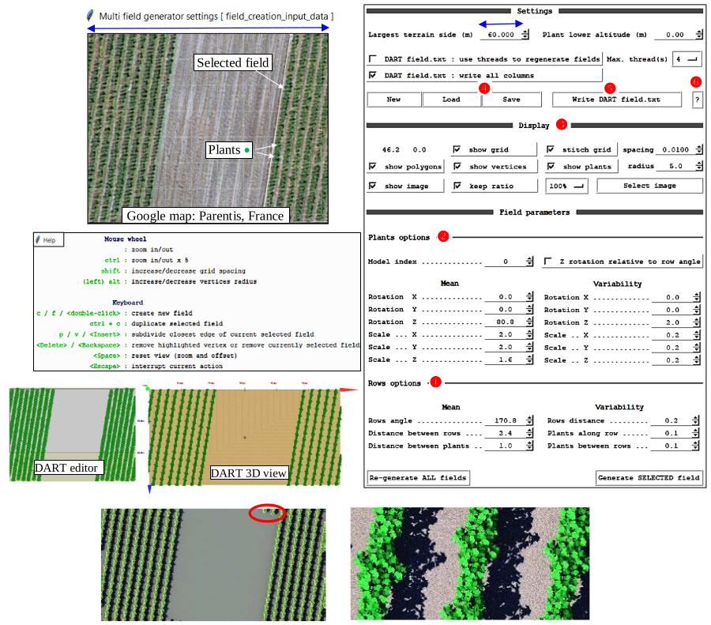

Python modules are provided in folder `DART\bin\python_script` (see below), with usage in their code or Readme files.

*Python modules. Modules with label * are directly run from DART GUI. They are not described here.*
</img>

DART GUI with menu "Tools/Python Script Launcher' (i.e., python_script_runner.bat;image below) cn launch most Python modules. For that, select the module to run and set input parameters (i.e., folders, file names, options).

*Python_script_runner.bat.*
</img>

### a) Inversion of in-situ irradiance in terms of aerosol and cloud parameters

<u>*Goal:*</u> to get a time series of aerosol and cloud parameters $k_a$ and $k_c$ so that DART BOA irradiance $E_{BOA,tot,\Delta \lambda}^{DART}(t) \:\:(W/m^2)$ or $SKYL_{BOA,tot,\Delta \lambda}^{DART}(t)$ matches measured $E_{BOA,tot,\Delta \lambda}^{measured}(t)$ or $SKYL_{BOA,tot,\Delta \lambda}^{measured}(t)$, with $k_a(t).\Delta \tau_{a,\lambda}$ and $k_c(t).\Delta \tau_{c,\lambda}$ the aerosol and cloud optical depths ($\Delta \tau_{a,\lambda}$ and $\Delta \lambda_{c,\lambda}$ are the aerosol and cloud spectral optical depths defined in the simulation).

<u>*Method:*</u>

- bi-section algorithm: DART iterative run per date t until DART matches measurements. $k_a$ is first searched in $[0;\: k_{a,max}]$ with $k_c = 0$; if $k_a$ is not found, there may be a cloud, and DART is iteratively run with ($k_{a,init},k_c$ variable) starting from ($k_{a,init},k_{c,init}$) to get $k_c(t)$; $k_a$ or $k_c = -9999$ if there is no solution. $k_c = 0$ if $k_{c,init} =0$.  
It treats the $1^{st}$ aerosol and $1^{st}$ aerosol-cloud if there is an aerosol-cloud model; $1^{st}$ and $2^{nd}$ aerosol otherwise.

!!! note
    If "Coupling Gain" (i.e., $\frac {E_{BOA,tot,\Delta \lambda}^{after\:coupling}} {E_{BOA,tot,\Delta \lambda}^{before\:coupling}}$ in the $E_{BOA,tot,\Delta \lambda}^{measured}(t)$ file)=1, $E_{BOA,tot,\Delta \lambda}^{after\:coupling}$ is adjusted to $E_{BOA,tot,\Delta \lambda}^{measured}(t)$, using DART computer intensive "atmosphere coupling" option; else, since Coupling Gain is usually slightly larger than 1, $E_{BOA,tot,\Delta \lambda}^{before\:coupling}$ is adjusted to $\frac {E_{BOA,tot,\Delta \lambda}^{measured}} {Coupling\:\:Gain}$, using DART with the "No Coupling" option.
    
- DART simulation (example): 1mx1m bare ground with reflectance close to the actual reflectance of the scene, $N_{bands}$ ($E_{BOA,\Delta \lambda}^{.DART}$ accuracy and computation time increase with $N_{bands}$), $N_{aerosol/cloud} \ge 2$ (prefix 'cloud' in the 'aerosol optical properties' file name indicates an 'aerosol-cloud').

!!! note
    No need to simulate DART products because the method uses $E_{BOA,\lambda}^{DART}(t)$ stored in `simulation.properties.txt`.

<u>*Parameters:*</u> 

- Folder of DART simulation (see previous image)
- Irradiance text file $\mathcal{I}$.txt. Per line/time: $E_{BOA,tot,\Delta \lambda}^{measured}, E_{BOA,diff,\Delta \lambda}^{measured}$ Year Month Day Hour Min. Sec. Coupling_Gain

!!! note
    If $\mathcal{I}$ has too many data, you can create a new $\mathcal{I}$ {set of Mean(N successive data)} with {average_time_series.py, parameter N}.
    
- Optional: 
    - i $k_a;k_c$ : aerosol & cloud initial multiplicative factors; default: $k_{a,init}(t)$ & $k_{c,init}(t)$ in DART simulation
    - t start time; end time: inversion over $[t_{start};\: t_{end}]$. Default: [0000 0 0 0 0 0 9999 0 0 0 0].
    - m $Iteration_{max}$: maximal number of iterations. Default: 20.
    - s $k_{a,max}$ : maximal aerosol optical depth. Default: 2.
    - e $\epsilon_1$ : maximal relative error $\frac {|E_{BOA,\Delta \lambda}^{DART}(t) - E_{BOA,\Delta \lambda}^{measured}(t)|} {E_{BOA,\Delta \lambda}^{measured}(t)}$. Default: 0.05.
    - ee $\epsilon_2$: maximal relative error if upper ki was found. Default: 0.
    - eee $\epsilon_{SKYL}$: SKYL adjustement if $SKYL_{measured} \in ]0;\: \epsilon_{SKYL}[$. Else $E_{tot}$ adjustment. Default: 0.1.

<u>Result:</u> anywhere (option –d); default: `simulation_name.result.txt` in folder of the python module. It stores per line:

$\frac {E_{BOA,tot,\Delta \lambda}^{measured}} {Coupling\:\:Gain}.E_{BOA,diff,\Delta \lambda}^{measured} - E_{BOA,tot,\Delta \lambda}^{measured}.\frac {coupling\:\:Gain\:-1} {coupling\:\:gain}$ Year Month Day Hour Min Sec $k_a \in [0; preset\:k_{a,max}]\:k_c \ge 0$ $E_{BOA,\Delta \lambda}^{DART}.E_{BOA,diff,\Delta \lambda}^{DART}.\frac {E_{BOA,\Delta \lambda}^{DART}} {E_{BOA,tot,\Delta \lambda}^{measured}}$

*`Python_script_runner.bat`. Here, it runs the script `cloud_aod_factor_inversion.py` with DART simulation `Aerosol_Cloud_OpticalDepth` and irradiance file `cloud_aod_inversion_irradiance_example.txt` $E_{BOA, \Delta \lambda}^{measured}(t)$*
</img>

<u>*Example:*</u>

- Simulation `Aerosol_Cloud_OpticalDepth`: 10 bands, [250nm 2750nm]. z=149m, 35.18°E, 9.54°N. Atmosphere: USSTD76, Rural23, $k_{H_2O} =0.3$. No coupling.
- $E_{BOA,\Delta \lambda}^{measured}$: file `cloud_aod_inversion_Irradiance_example.txt`: $\Delta t=30mn$, 23-24/06/2014, Coupling_Gain=1.02.
The image below shows that Coupling_Gain $\approx$ cst over a day with constant atmosphere conditions.
- Inversion done with a relative error error $\epsilon=0.01$ (option –e 0.01). It is much slower than if $\epsilon=0.05$.

</img>

Hourly $E_{BOA}$ before coupling (BC) and after coupling (AC) from morning to evening, for 3 atmosphere conditions: $(k_a,k_c)$ = (1,0), (4,0), (4,0.3). The associated gains $\frac {E_{BOA,AC}} {E_{BOA,BC}}$ are nearly constant during the day with relatively low values: 1.017, 1.025, and 1.062. It explains that the ionversion is made with a gain equal to 1.02, and therefore without the "Atmosphere radiative coupling".

The retrieved atmosphere parameters $k_a(t)$ and $k_c(t)$ lead to $E_{BOA,tot,\Delta \lambda}^{measured}(t) \approx E_{BOA,tot,\Delta \lambda}^{DART}(t)$ (see below). A few abrupt $k_a$ changes occur early and late in the day with low irradiance values. They can be explained by experimental factors such as the time accuracy of measurements. $k_a$ changes during the day are probably due to cloud sudden occurrence. Basic knowledge of atmosphere conditions is useful to imptove results, for instance to pre-set a
smaller range of $k_a$.

*$E_{BOA,tot,\Delta \lambda}^{measured}(t)$ and $E_{BOA,tot,\Delta \lambda}^{DART}(t)$. Nasrallah, Tunisia on 23-24/06/2014. The inversion is done with $\epsilon=0.01$ (option –e 0.01). It is much faster if $\epsilon=0.05$ ( ' instead of 90').*
</img>

!!!note
     Erroneous results may indicate:
     - Incorrect DART parameters: atmosphere (aerosol optical depth, water vapor content,…) and/or site coordinates.
     - Incorrect time of measurements (e.g., in case of an integration time $\Delta t$, time should correspond to $\Delta t/2$).

### b) Satellite image inversion (urban material reflectance): op_inversion.py

<u>*Goal.*</u> To invert a satellite image $S_{\lambda}(u,v)$ of a city as reflectance maps $F_{i,\lambda}(u,v).\rho_i,\lambda$ at $\Delta r_{sat}$, per chosen urban optical property $OP_i$ (material), using an urban geometric database. $\rho_{i,\lambda} =$ DART simulation initial $OP_i$. In short, $F_{i,\lambda}(u,v)$ is assessed. It is noted $k_{i,\lambda}(x,y)$ at $\Delta r_{DART}$. 

<u>*Geometric database.*</u> basel river extracted.obj (10km x 11km. 6 groups i: DEM, roof,…). 

<u>*Sentinel 2 satellite image*</u> $S_{\lambda}(u,v)$: `sat.mp#` of Basel : 7km x 6.5km. $0.49\mu m, 0.56\mu m, 0.665\mu m$. 

<u>*Per band inversion method.*</u> First, put $S_{\lambda}(u,v)$ in `workspace_name/iter1/input/bandx` (x=1: $0.49\mu m$, 2: $0.56\mu m, 3: 0.665\mu m$), and set DART to create images per type of scene element and to use factors $k_{i,\lambda,n}(x,y)$. DART is run n times. A $1^{st}$ scattering order equation assesses $k_{i,\lambda,n}(x,y)$ at n=1, and a bisection / Newton method up-dates it at n>1; the workspace stores it $\forall n$.

<u>*DART simulation.*</u>

1. Basel 05082015.20m.3bands : 5060mx5320mx160m, $\Delta x=\Delta z=20m$. Tree file trees `updated*.txt` & basel river extracted.obj; consistent coordinates) + workspace basel.
2. Basel 05082015.20m.3bands SubZone (: 438mx417mx92.5m, $\Delta x=\Delta z=0.5m$, `dsm.obj` created by "tools" ; (103, 88) - (120, 105) in satellite image) + workspace_sub_zone1. 

!!! warning
    In the "Optical and temperatures" menu, set "", with default multiplicative factors equal to 1, and . The inversion procedure automatically sets the option .

<u>*Start.*</u> Run op_inversion.bat in `DART\bin\python_script\OpticalPropertiesInversion` to run the GUI and specify input / output data (see below) in its 4 tabs (cf. below).

<u>*Settings.*</u> An existing workspace () or data (: DART home, working simulation, DART & satellite images; option: tree text file name, satellite image sub-zone coordinates) to create it are specified. File `.settings` stores it.

!!! note
    In order to create a new inversion, first create an empty "workspace" folder using Windows or Unix, and then click on the “Select” button to choose it. Do not forget to click on “Create” button after selecting the simulation.

*Tab "Settings". Workspace name () and data to create it if it does not exist (): names of DART simulation, satellite image, and tree text file, and sub-zone coordinates in the satellite image if needed.*
</img>

*Reflectance images of a sub-zone (workspace_sub_zone1) at iteration n=3. a) Satellite: $\Delta r=25m$. b) DART: $\Delta r=25m$. c) DART: $\Delta r=0.5m$; 25m resolution $F_{\lambda,i}(u,v)$ impacts it. Border effects  (i.e., larger errors) occur at bottom left & right corners since the scene and DEM are not symmetric. d) 3D view of errors: $\Delta r=1m$.*
</img>

<u>*Process.*</u> DART simulation must be previously run, because the inversion procedure does not run it. Three tabs () allow one to run a given iteration (), all up to a given iteration () or to continue up to a given iteration (). At any iteration n, new maps Fm,x,n(u,v) per selected band x () and OP m (; other OPs are constant) are derived from the comparison of satellite and DART images. They are stored in folder `Workspace/itern/output/bandx`. At iteration n+1, they are copied in DART input/bandx folder, and DART is run with "new OP = initial OP x $F_{m,x,n}(u,v)$". At iteration n=0, $F_{m,x,n}(u,v)=1 \forall u,v$ (i.e., DART option "Use an array of multiplicative factors" is automatically unset).

The procedure works with any user-selected numbers () of iterations, and threads for the inversion (auto: available computer cores) and for DART (auto: number of cores set in DART). Three accuracy thresholds () can be used per pixel (u,v): (1) a surface element with relative contribution < threshold is neglected. (2) At iteration 1, a pixel inversion result is accepted only if $F_{m,x,1}(u,v)$ < predefined Max{$F_{m,x,1}(u,v)$}. (3) At iteration n >1, a pixel is not treated if its relative error is smaller than a threshold.

Spatial interpolations () "DART $\rightarrow$ Satellite" and "Satellite $\rightarrow$ DART" are used since pixel sizes of DART and satellite images usually differ. Nearest neighbor method (index 0 of "Spline int…") is usually optimal.

*Tab "Process": operation mode (), spectral bands to process (), optical properties to invert (), computer threads and iteration number (), accuracy level (), and spatial interpolation mode ().*
</img>

!!! note
    The optical properties of elements that are not selected keep their initial value during the inversion procedure.

<u>*View.*</u> Data (: error estimates, images,…) are viewed per iteration () and band (), per type of product ():

- in: the DART image and the scene component images (e.g., River).
- out: maps of multiplicative factors. DART uses them for simulating images (in) t the following iteration.

The workspace stores all products: satellite image, DART images at full or satellite image size, the absolute difference image "Satellite - DART", and the DART image and image difference histograms.

*Tab "View": satellite image and results (: Images / Histograms / Errors) per iteration (), per band () and per DART output (). Options "Equalize" and "Clip" () are for improving the visual aspect of images.*
</img>

<u>*Tools.*</u>

- Option `Match Obj/Trees/subzone to satellite image` (): to superimpose the 3D object and/or tree file to the satellite image. The help menu (key h) indicates all possible options.
- Options `Apply to Obj` and `Apply to tree file` (): to copy the 3D object geometric transformations in the 3D object "Geometric properties" section of the DART simulation, and/or create a new tree text file that should be specified for the DART simulation. Note that an 'Untransformed tree text file' can be used.

*Tab tools. It is used to match the 3D object and the tree file to the satellite image. The left panel displays the geometric coordinates. It can be used also to define a sub zone (shortcut "R").*
</img>

A satellite image sub-zone can be defined: strike key r and draw a rectangular sub-zone. Its coordinates in DART and satellite images appear on the screen (). To run the inversion procedure for this sub-zone, input these DART coordinates into the sub-scene definition of a new DART simulation and input these satellite image coordinates into the Tab "Setting" of a new workspace.

*Selection of sub-zone  in Sentinel 2 image and 'dsm.obj'.*
</img>

Simulation 'Basel_05082015.20m.3bands_SubZone' uses the sub-zone 3D object "dsm.obj" (DART "maket" module can create it) because loading it is faster than loading `basel_river_extracted.obj`.

*Algorithm of the inversion method. It relies on the iterative calculation of DART radiance images per type of element that is present in the urban landscape.*
</img>

*Results of workspace_basel. a) Sentinel 2 image (2015/8/5) and DART images at iterations n=0, 1 and 8. At n=0, OP is unique for urban elements of the same type (e.g., roofs). b) Relative error decreases with n (n=0: 70%, n=1: 13%, n=2: 3.3%, n=3: 1.4%, n=5: 1%,...). c) Larger errors occur for pixels with $\rho_{satellite} > 1$.*
</img>

!!! note
    Apart from creating scene using obj file, scene can also be created using DART elements. For per element, only one optical property can be assigned.

The image below indicates the types of DART elements that can be considered for the inversion. Note that only one optical property must be assigned pet type of element. For example, an unique optical property for all houses. The sopatial multiplicative factor allows one to have spatially variable optical properties for the roofs.

*Types of DART elements that can be considered for the inversion. Note er optical property for each element. For example, please do not assign different optical property to different houses.*
</img>

**On-going work:** accelerate DART simulations with new DART fast mode and decrease RAM with tree cloning.

### c) Mapping an area with agricultural fields: multi_field_generator.py

<u>*Objective:*</u> manual creation of a field crop area. Any other scene element can be added.

<u>*Method:*</u> interactive definition of field vertices, and field (: vertices, row orientation, distance between plants,…) and 3D plant (: rotation, scale,…) parameter per field, possibly with an underlying image () of the study area. The resulting field_map.txt file () can be saved and later edited. Copy and paste is possible on any field. The command " Write DART field.txt" creates the DART field.txt. A help (: ?) is provided.

<u>*Example of DART simulation:*</u> CropFieldCreation

*a) DART-Lux image of the scene simulated with the field.txt file () created by the Python module `DART\bin\python_script\CropFieldCreation\multi_field_generator.py`. Border effects at the top correspond to grapevines at the bottom that are only partly in the scene. The latter ones should be removed in the `field.txt` file in order to reove the border effects. b) Zoom of DART-Lux image at 2cm resolution.*
</img>

### d) Change the size of all or part of 3D objects: changeObjSize_***.py

<u>*Objective:*</u> to scale all or part of the triangles of an input 3D object. The output 3D object is identical to the input 3D object except that its triangles are scaled. The output 3D object appears with the same colors as the
input 3D object if the mtl file of the input object is in the folder of the output object.

<u>*2 scripts:*</u>

- changeObjLeavesSize_multiple_barycenters_groups.py: triangles of a specified group are scaled and each barycenter (center of gravity) of connected triangles of the group is preserved. The image below illustrates the scaling of the corncob of a maize 3D object.
- changeObjSize_unique_barycenter.py: all triangles are scaled, and the barycenter of all the connected triangles is preserved.

!!! note
    Triangles must be logically order in the input `*.obj` file.

*Run of `changeObjLeavesSize_multiple_barycenters_groups.py` with `python_script_runner.bat`*
</img>

### e) DART DAO: to create a scene from a LAI array (DART\bin\python_script\DAO)

<u>*Objective:*</u> to create a DART DAO turbid scene, and to derive DAO and non DAO triangle scenes for DART-FT and Lux

- 1) Copy the empty file dao.nfm in the DART folder. Then, DAO python scripts, for example run with , create DAO turbid and triangle scenes in the folder "output/Scene".
!!!warning
    The DAO replaces the maket module, so that running this module will destroy the scene generated by the DAO. 

- 2) Create the simulation 'Turb': 3m x 3m scene, 1m x 1m cells, 90 bands $\in$ [400;850nm], DSM, 1 Lambertian optical property $\rho_{ground}$ = 'clay brown', 1 Vegetation optical property: default SIF parameters and leaf biochemistry / structure.

- 3) Run the Maket module. It generates a DAO scene with expected scene and cell dimensions.

- 4)  Create the DAO 3D turbid scene. 2 methods are proposed: 
    - 3D LAI array importation (here: `LAI_Array.txt`: scene layers from top to bottom separated by "***")  
    <u>Usage:</u> `Create_TurbidScene_From_LAI_Array.py SimulationName LAI_Array_name`
    - Creation of a random LAI distribution (here: $LAI_{cell} \in$ [0 1)  
    <u>Usage:</u> `Create_TurbidScene_Random.py SimulationName`

- 5) Create the DAO 3D triangle scene from the DAO 3D turbid scene, with $5\times 10^{-3}$ accuracy per $LAI_{cell}$.
    - Save 'Turb' as simulation 'Tri' and copy the folder 'Turb\output' into 'Tri' where you remove the Vegetation optical property and add a Lambertian optical property (it must be the same as 'Turb' vegetation optical property if 'Tri' and 'Turb' results are to be compared). Then run the "direction" and "phase" modules (not the maket module!).
    - Conversion of the turbid LAI cells as cells filled with triangles  
    <u>Usage:</u> `Turbid_To_Triangles.py SimulationName triangle_cells`  
    'triangle_cells': this folder stores N random samples of M objects that simulate a turbid cell (here: $LAI_m$ 3D object = 0.01, 0.02, 0.05, 0.1, 0.2, 0.3, 0.4, 0.5, 1) with triangles (area $A_{triangle} = 5\times 10^{-5}m^2$). The conversion rule is: "triangle cell" 
    - Scene $LAI_{cell} < 0.5$: the turbid medium is replaced by 2 triangles cells at most:
        - $1^{st}$ triangle cell: it can be only enlarged, by 5% at most (if expected scaling > 5% $\implies$ 2nd cell).
        - $2^{nd}$ triangle cell: it can be enlarged or shrunk.
    - Scene $LAI_{cell} > 0.5$: the turbid medium is replaced by 3 triangles cells at most:
        - $1^{st}$ triangle cell: it cannot be scaled (if precision > $5\times 10^{-3} \implies 2^{nd}$ cell).
        - $2^{nd}$ triangle cell: it can be only enlarged, by 5% at most (if expected scaling > 5% $\implies$ 3rd cell).
        - $3^{rd}$ triangle cell: it can be enlarged or shrunk.   
<u>*Examples:*</u> - LAIcell = 0.23 (≈ 0.2 + 0.02 x 1.22472) ⇒ 2 triangle cells: LAIn = 0.2 and LAIn = 0.02 scaled by 1.2247.
"triangle cells"
    - $LAI_{cell}$ = 0.48 ($\approx$ 0.4 + 0.1 x 0.89442) $\implies$ 2 triangle cells: $LAI_n = 0.4$ and $LAI_n = 0.1$ shrunk by 0.8944.
    - $LAI_{cell}= 0.64$ ($\approx$ 0.5 + 0.1 + 0.05 x0.8944) $\implies$ 3 cells: $LAI_n= 0.5, LAI_n= 0.1, LAI_n= 0.05$ shrunk by 0.8944.
    - $LAI_{cell} = 0.93$ ($\approx$ 0.5 + 0.4 x 1.03682) $\implies$ 2 triangle cells: $LAI_n = 0.5$ and $LAI_n = 0.4$ scaled by 1.0368.

- 6) DART-FT sequence $(\theta_s=30° / 60°; \phi_s=225°)$; do not run the Maket module: DAO turbid & triangle scenes. $\rho_{scene}$ , $\rho_{PSI}$ and $\rho_{PSII}$ depend on $\theta_{sun}$. $\rho_{PSx,turbid}$ and $\rho_{PSx,facet}$ are very close (see below).$\rho_{scene,turbid}$ and $\rho_{scene,facet differ}$. Differences decrease with smaller $A_{triangle}$ ($\implies$ triangle cell $\implies$ turbid cell) and high spatial resolution DEM.

- 7) DART-FT / Lux sequence ($\theta_s=30° / 60°; \phi_s=225°)$: save 'Tri' as 'Tri_no_DAO'. Then, remove the DAO scene and add a field of 3D objects created with: `Turbid_To_Triangles_Field.py Turb path_to_store_field.txt path_to_store_DSM.obj` `Field.txt` is such that you import 3 LAI objects, among 10 objects, per LAI value in folder "cellules_triangle", per LAI ascending order.  
Advice: in the LUT of DART-Lux, only store results for the nadir direction.

*Total, PS1 and PS2 reflectance of the turbid scene and its associated triangle scene. $\theta_s=30°$ and 60°.*
</img>

!!! note
    DAO is being adapted to create scenes that are adapted to DART-Lux, in order to reduce computer time and RAM.
