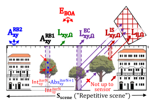
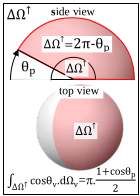
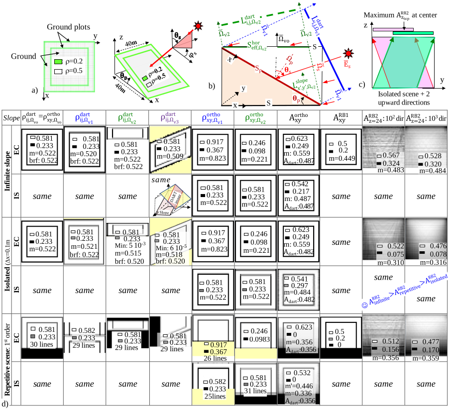
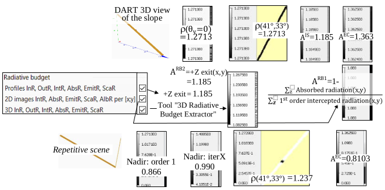
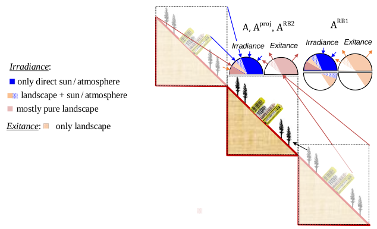
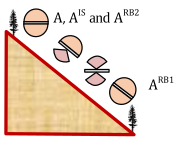
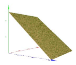
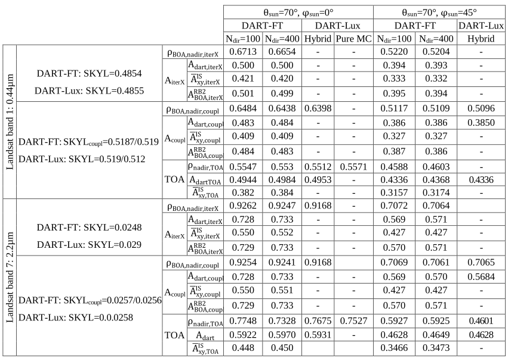

DART has several albedo products per scene mode (Repetitive scene, Infinite slope, Isolated scene: [here](../../DART_functionalities_and_products/4-Radiative_modes_sub_modes/4.10/earth_scene.md#4101-ground-surface), see [part 3](./annex2.md#3-infinite-homogeneous-slope) of this page). Their meanings differ:

</img>

- $A_{dart} = \frac {\sum_{2\pi^{+}} \bar{L}_{ij, \Omega_v}.cos(\theta_v).\Delta \Omega_v} {E_{BOA}} = \frac {M_{BOA}} {E_{BOA}}$; $\overline{L}_{ij,\Omega_v} = \frac {\bar{W}_{ij}(\Omega_v, \Delta \Omega_v)} {S.cos(\theta_v,\Delta \Omega_v)}$, ij = sensor image coordinates, $\overline{W}_{ij}(\Omega_v, \Delta \Omega_v)=$ spatial mean of DART source vectors, $S=S_{scene}$ if "Repetitive scene"; else $S=S_{slope}.\frac {|\bar{\Omega_p}.\bar{\Omega_v}|} {cos(\theta_v)}. A_{dart}$ is computed without ortho-projection procedure. It is stored in `dart.txt` and `simulation.properties.txt`.

- Radiance based albedo per DSM pixel: $A_{xy}^{proj} = \frac {M_{\Delta \lambda}^{proj} = \sum_v L_{xy,\bar{\Omega}_v}^{proj}.|\bar{\Omega}_p.\bar{\Omega}_v|.\Delta \Omega_v\:with\:\bar{\Omega}_p \in 2\pi^{+} (horizontal\:sensor);\:L_{xy,\bar{\Omega}_v}^{proj} = 0\:if\: \bar{\Omega}_p.\bar{\Omega}_v < 0} {E_{top,hor}^{\downarrow}:irradiance\:of\:top\:scene\:(downward\:rays)}$  
Ortho radiance images $L_{xy,\Omega_v}^{proj}$ are interpolated $L_{ij,\Omega_v}$ sensor radiance images (stored or not) with projection method 'proj' : EC, IS ($L_{xy}^{IS} =L_{ij,\Omega_v}.\delta_{ij}$), RC; they greatly differ. IS represents actual ortho-rectification. Partial pixel filling of edges of images can impact $L_{ij,\Omega_v}$ images and therefore $L_{xy,\Omega_v}^{proj}$ and $A_{xy}^{proj}$. Usually: $\overline{A}_{xy}^{EC} > A_{dart} > \overline{A}_{xy}^{IS}$. For perfectly smooth slopes: $A_{dart} = \overline{A}_{xy}^{IS}$.

- RB-based "albedo per scene column xy": $A_{xy}^{RB1} = \frac {\sum_z \:Absorbed\:radiation(x,y)} {\sum_z 1^{st}\:order\:intercepted\:(x,y,z);\:folder\:RB\:ILLUDIF\:(sum+atm.)}$ with rays $\uparrow$ and $\downarrow$. Only computed if user-RB components include 'Interception' and 'Absorption'.

!!! warning
    No coupling and radiation from (x',y').

- RB-based "top scene albedo": $A_{xy}^{RB2} = \frac {M_{\Delta \lambda,xy}^{\uparrow}\:of\:top\:face\:per\:top\:scene\:cell} {E_{top,hor}^{\downarrow}: top\:scene\:irradiance\:(rays \downarrow)}$. Tool `3D RB Extractor` gives $E_{top,hor}^{\downarrow}$ and $M_{\Delta \lambda,xy}^{\uparrow}$.

$A_{x,y}^{RB2}$ is the actual scene albedo. Scattered rays are only upward in $A_{x,y}^{proj}$ and $A_{x,y}^{RB2}$, conversely to $A_{x,y}^{RB1}$. For a pure infinite slope (no 3D element): $\overline{A}_{x,y}^{RB2} = \overline{A}_{x,y}^{IS} = A_{dart}$, with $\overline{A}_{x,y}^{RB2} \neq \overline{A}_{x,y}^{IS}$ and $\overline{A}_{x,y}^{IS} \approx$ local in-situ albedo (horizontal sensors).

### 1) Homogeneous smooth infinite slope
$(\Omega_p, \rho_p,\Omega_s \rightarrow \Omega_v$) and direct sun (SKYL=0)

<u>*Slope :*</u> Irradiance in $\Delta \Omega^{\downarrow} = 2\pi - \theta_p (\iff \overline{\Omega}_p.\overline{\Omega}' < 0)$. Exitance $M_{p,x',y'}^{\uparrow}$. Upward exitance $M_{p,x',y'}^{\uparrow}$ in $\Delta \Omega^{\uparrow} = 2\pi - \theta_p (\iff \overline{\Omega}_p.\overline{\Omega}' > 0)$.

$E_p = E_s.|\overline{\Omega}_p.\overline{\Omega}_s| + \int_{\Delta \Omega^{\downarrow}} L_{atm,\Omega}.|\overline{\Omega}_p.\overline{\Omega}|.d\Omega$ $\implies L_{p,x',y',\Omega_v} = \int_{\Delta \Omega^{\downarrow}} \frac {\rho_{p,x',y',\Omega_s \rightarrow \Omega_v}} {\pi}.E_p(\Omega_s).d\Omega_s$

$M_{p,x',y'} = \int_{2\pi} L_{p,x',y',\Omega_v}.|\overline{\Omega}_p.\overline{\Omega}_v|.d\Omega_v > M_{p,x',y'}^{\uparrow} = \int_{\Delta \Omega^{\uparrow}} L_{p,x',y',\Omega_v}.|\overline{\Omega}_p.\overline{\Omega}_v|.d\Omega_v$

</img>

<u>*Sensor:*</u> Radiance $L_{i,j,\Omega_v}^{dart} = L_{p,x',y',\Omega_v}$. Reflectance $\rho_{i,j,\Omega_v}^{dart}= \frac {\pi.L_{i,j,\Omega_v}^{dart}} {E_{BOA}} = \frac {\int_{\Delta \Omega^{\downarrow}} \rho_{p,x',y'}(\Omega',\Omega_v).E_p(\Omega').d\Omega'} {E_{BOA}}$

- Lambertian slope + isotropic SKYL: 
    - $\rho = \rho_p.[(1 - SKYL).\xi_{ps} + SKYL.\frac {1 + cos(\theta_p)} {2}]$, with $\xi_{ps} = \frac {|\overline{\Omega}_p.\overline{\Omega}_s|} {|\overline{\Omega}_n.\overline{\Omega}_s|} \forall \Omega_v$
    - $A = \rho_p.[(1 - SKYL).\xi_{ps} + SKYL.\frac {1 + cos(\theta_p)} {2}].\frac {1 + cos(\theta_p)} {2}$

<u>DART ortho-radiance $L_{xy,\Omega_v}^{proj}$, ortho-reflectance $\rho_{xy,\Omega_v}^{proj}$, exitance $M_{xy}^{proj}$ and albedo $A_{xy}^{proj}$ images</u>

$M_{xy}^{proj} = \int_{2\pi^{+}} L_{xy,\Omega_v}^{proj}.cos(\theta_v).d\Omega_v, A_{xy}^{proj} = \frac {1} {\pi}.\int_{2\pi^{+}} \rho_{xy,\Omega_v}^{proj}.cos(\theta_v).d\Omega_v$

- EC: $L_{xy,\Omega_v}^{EC}.\Delta x.\Delta y.cos(\theta_v) = \sum_z L_{xyz,\Omega_v}^{EC}.\Delta x.\Delta y.cos(\theta_v) = \sum_{ij} L_{ij(xyz),\Omega_v}^{dart}.\frac {\Delta x.\Delta y} {cos(\theta_p)}.|\overline{\Omega}_p.\overline{\Omega}_v| \implies L_{xy,\Omega_v}^{EC} = L_{ij,\Omega_v}^{dart}.\xi_{vp}$ with $\xi_{vp} = \frac {|\overline{\Omega}_p.\overline{\Omega}_v|} {cos(\theta_p).cos(\theta_v)}$ if $\overline{\Omega}_v \in \Delta \Omega^{\uparrow}$; else: 0 $\implies \rho_{xy,\Omega_v}^{EC} = \rho_{ij,\Omega_v}^{dart}.\xi_{vp} = \rho_{p,xy}.\xi_{ps}.\xi_{vp}$.

- IS: $L_{xyz,\Omega_v}^{IS} = L_{ij(xyz),\Omega_v}^{dart} \implies \rho_{xyz,\Omega_v}^{IS} = \rho_{ij(xyz),\Omega_v}^{dart} = \rho_{p,xy}.\xi_{ps}$. It does not depend on $\Omega_v$.

Direct sun + Lambertian infinite slope $\rho_p$ (S: top scene horizontal surface):

S upward exitance: $M_{S,x,y}^{\uparrow} = \int_{\Delta \Omega^{\uparrow}} L_{S,xy,\Omega_v} cos(\theta_v).d\Omega_v = L_{p,x,y}.\frac {\pi.(1 + cos(\theta_p))} {2} \implies A_s = \rho_p.\frac {|\overline{\Omega}_p.\overline{\Omega}_s|} {cos(\theta_s)}.\frac {1 + cos(\theta_p)} {2}$ since $L_{p,x,y} = \frac {\rho_p} {\pi}.E_s.|\overline{\Omega}_p.\overline{\Omega}_s|$

DART albedo:

- $A_{xy}^{EC} = \frac {\rho_p} {\pi}.\xi_{ps}.\int_{\Delta \Omega^{\uparrow}} \xi_{vp}.cos(\theta_v).d\Omega_v = \frac {\rho_p} {\pi}.\xi_{ps}.\int_{\Delta \Omega^{\uparrow}} \frac {|\bar{\Omega}_p.\bar{\Omega}_v|} {cos(\theta_p)}.d\Omega_v = \frac {\rho_p} {\pi}.\xi_{ps}.\int_{\Delta \Omega^{\uparrow}} \frac {cos(\theta_{vp})} {cos(\theta_p)}.d\Omega_{vp} = \rho_p.\frac {|\bar{\Omega}_p.\bar{\Omega}_s|} {cos(\theta_s)}.\frac {1 + cos(\theta_p)} {2.cos(\theta_p)} = \frac {A_s} {cos(\theta_p)}$
- $A_{xy}^{IS} = \rho_p.\xi_{ps}.\frac {1} {\pi}.\int_{\Delta \Omega^{\uparrow}} cos(\theta_v).d\Omega_v = \rho_p \frac {|\bar{\Omega}_p.\bar{\Omega}_s|} {cos(\theta_s)}.\frac {1 + cos(\theta_p)} {2} = A_s$.

### 2) Infinite slope 
(40mx40m, $\rho_g =0.5$), 2 ground plots ($\rho_{plot}=0.2$): $\overline{\rho}_p=0.449$, direct sun $\Omega$

$(\theta_p =30°, \phi_p=0°) \implies \Delta \omega^{\uparrow}=5.24sr$ and $\xi_{ps} =1.163$.

<u>*Simulation:*</u> `Slope_square_isolated_IS` + File: Albedos_DART.xlsx.

<u>*Theory*</u> $\implies \rho_{i,j,\Omega_v}^{dart} = \xi_{ps}.\rho_{p,xy} \in [0.233;\: 0.581], \overline{\rho}_{i,j,\Omega_v}^{dart} =0.522.A_s(\rho_p)=1.253.\rho_p \in [0.251;\: 0.626]$.

$A_{xy}^{EC} \in [0.249;\: 0.623]$; $\overline{A}_{xy}^{EC} =0.559$. $A_{xy}^{IS} \in [0.217;\: 0.542]$; $\overline{A}_{xy}^{IS} =0.487$

The image below shows $\rho_{ij,\Omega_v}^{dart}(\Omega_{v0} , \Omega_{v1} , \Omega_{v2} , \Omega_{v3})$, ortho images $\rho_{xy,\Omega_v}^{proj}(\Omega_{v0} , \Omega_{v1} , \Omega_{v2})$ and albedo images $(A_{xy}^{proj} , A_{xy,z_{top}}^{RB1} , A_{xy,z_{top}}^{RB2})$, with "proj" = EC and IS, for the 3 DART modes ('Infinite slope', 'Isolated scene', 'Repetitive scene' at order 1): "Infinite slope" is very close to theory: $A_{dart} =A_{xy}^{IS}=0.487 \approx A_{z=24}^{RB2} \neq A_{xy}^{EC} =0.559$. Note that $A_{xy}^{IS}$ can differ from $A_{z=24}^{RB2}$ with other topography.

*DART albedo and ortho reflectance (3 viewing directions: nadir $\Omega_{v0}, \Omega_{v1} (\theta_v=45°, \phi_v=180°) and \Omega_{v2}$ $(\theta_v=45°, \phi_v=0°)$ of a 40m x 40m scene (i.e., Ox parallel slope $\overline{\Omega}_p (\theta_p=40°,\phi_p=0°)$ + 2 plots). Direct sun $\overline{\Omega}_s(\theta_s=40°, \phi_s=45°). \Delta x=\Delta z=1m$, except for "Isolated scene" where $\Delta x=0.1m$ to decrease border effects. a) Scene nadir and 3D views. b) Scene vertical profile with 3 viewing directions. c) Schema that explains that $A_{xy,z=24}^{RB2}$ is maximum in the scene central part. d) DART sensor images $\rho_{ij,\Omega_v}^{dart}$ for $\Omega_{v0} , \Omega_{v1} , \Omega_{v2}$ and $\Omega_{v3} (\theta_v=45°,\phi_v=90°)$, ortho-images $\rho_{xy,\Omega_v}^{proj}$ for $\Omega_{v1}$ and $\Omega_{v2}$, and albedo images $A_{xy}^{ortho}, A_{xy}^{RB1}$ and $A_{xy}^{RB2}$.*
</img>

### 3) Infinite homogeneous slope
($\rho_p = 1, \theta_p=\phi_p=30°)$: slope azimuth rotation is simulated with {
: -30°, $\phi_{p}=0°$}. $\theta_{sun}=40°, \phi_{sun}=45°$. SKYL=0. Viewing directions $\Omega_{vi}$ of section 2). (see below, <u>simulation</u>: Slope_rectangle_IS)

$\frac {DART\:Theory} {Theory} < 10^{-3}.\rho_{xy,\Omega_v}^{IS} = \rho_{xy,\Omega_v} = 0$ or $\approx \rho_p.\frac {|\bar{\Omega}_p.\bar{\Omega}_s|} {cos(\Theta_s)} = 1.271 \:\forall \Omega_v.\:\rho_{xy,\Omega_v}^{EC} \in [0 (if E_p=0) \:5.4]. \rho_{xy,\Omega_{v1}}^{EC} = 1.097, \rho_{xy,\Omega_{v2}}^{EC}=0.636$, $\rho_{xy,\Omega_{v3}}^{EC} = 1.638. A_{x,y}^{EC} = 1.363$ (theory: 1.369). $A_{x,y}^{RB,1}=1. A_{dart}^{EC}=A_{dart}^{IS} = A_{x,y}^{IS} = A_{x,y}^{RB,2}=1.185$; it is >1 because $E_p > E_{horizontal\:surface}$.

Slope + isotropic SKYL: $\rho = \rho_p.[(1 - SKYL).\frac {|\bar{\Omega}_p.\bar{\Omega}_s|} {cos(\Theta_s)} +  SKYL.\frac {1 + cos(\theta_p)} {2}], A=\rho_p[(1 - SKYL).\frac {|\bar{\Omega}_p.\bar{\Omega}_s|} {cos(\theta_s)} + SKYL.\frac {1 + cos(\theta_p)} {2}].\frac {1 + cos(\theta_p)} {2}$.

*Slope: reflectance and albedo images. $\rho_p=1, \Omega_{slope}(30°,30°). \Omega_{sun}(40°,45°).$ a) Infinite slope: radiance-derived albedo. b) Infinite slope: RB-derived albedo. c) Repetitive scene.*
</img>

*Albedo: infinite slope mode, without air in the landscape.*
</img>

**Simulation of field measured albedo** $A_{field}$. Apart $A_{xy}^{RB1}$, DART albedos (i.e., $\frac {exitance} {irradiance}$) are defined with the irradiance of the horizontal top scene surface. The exitance is that of an horizontal surface for the "Repetitive scene", and for
$A_{x,y}^{RB2}$. It is a variable horizontal surface for the "Isolated scene" and "Infinite slope". Therefore, an oblique surface, $A_{field}$ should be simulated with 2 fish eye cameras (option: "inside scene") with given sensor dimensions and orientation: 1 camera gives local irradiance and 1 camera gives local exitance. (Wu et al., 2018, JGR-A). Less advised RB-based method: $A_{field} = \frac {Interception\: by\: face\: 1} {Interception\: by \:face\:2}$ for a "double face" facet with sensor dimensions and orientation.

*Simulation of in-situ measured albedo $A_{field}$ with cameras.*
</img>

### 4) Lambertian slope 
$(\theta_p=40°,\phi_p=0°, \rho_g=0.5)$ + **Vegetation plot** (LAI=0.5, h=0.2m, leaf
size $0.003m^2$, default leaf biochemistry). **Atmosphere radiative transfer**.

<u>*DART-Lux and FT*</u> (`Infinite_slope_Vegetation_plot`): 2 sun directions. $\Delta x=1m$, Infinite slope.

- DART-FT: $\Delta_{illu}=0.1m$ (it is too large). $N_{dir}=100$ and 400 directions: larger $N_{dir} \implies$ more accurate illumination, exitance. $N_{iterations}=10$.
- DART-Lux: $N_{samples \:per\: pixel}=2000$ and $\Delta t=60$".

</img>

*DART-FT and DART-Lux albedo A and nadir reflectance $\rho$ for a slope ($\rho_{ground}=0.5$) with grass (LAI=0.5). To reduce computer time: decrease $N_{iterations}$ (DART-FT) and $N_{samples\: per\: pixel}$ (DART-Lux). DART-FT becomes more accurate and closer to DART-Lux if its illumination grid is denser.*
</img>

