This section informs how to import AERONET and ECMWF data. The 2 provided python scripts are not up-to date.

**Atmosphere.py**

Usage: 

- to read AERONET and ECMWF atmosphere data.

- to create files of atmosphere data and to insert them in the DART SQL atmosphere database.

Functions: 

- ECMWFTemperatureToAtmosphereDatabase ()
 
- temperatureInterpolation()

- createHG_Parameters()

- createAerosols_Parameters()

- createGasModel()

**SkinTemperature.py**
Usage: to interpolate ECMWF ground temperature over one day 

Function: skinTemperatureInterpolation()

***Function: ECMWFTemperatureToAtmosphereDatabase()*** in the script `Atmosphere.py`

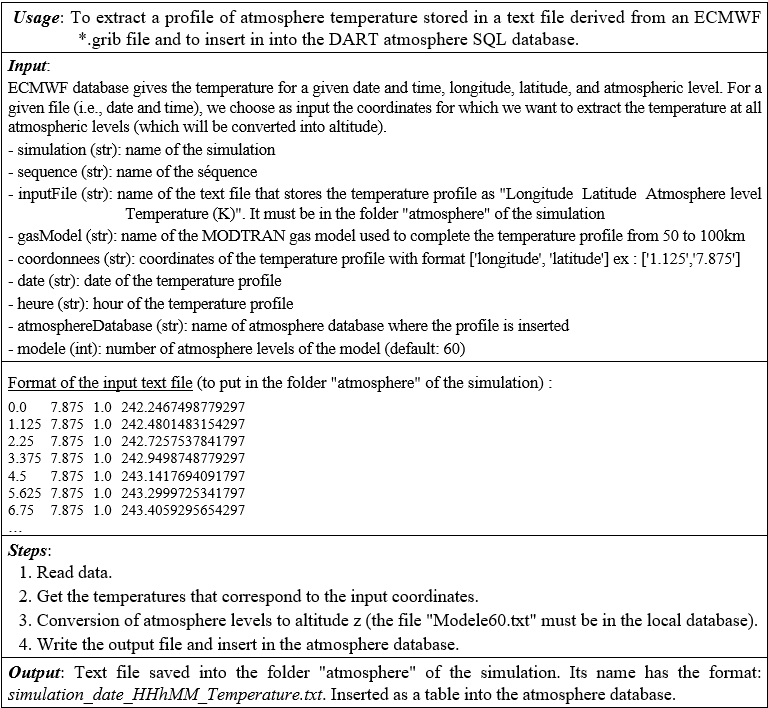

***Function: temperatureInterpolation()***

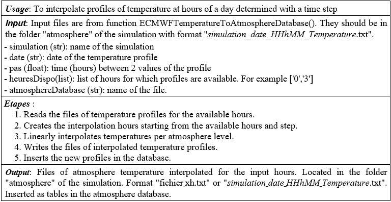

***Function: createHG_Parameters()*** in the script `atmosphere.py`.

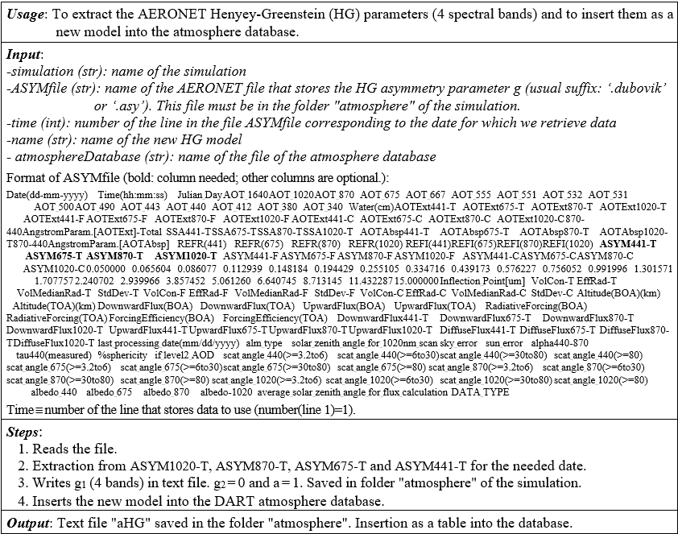

***Function: createAerosols_AOD()*** in the script `atmosphere.py`

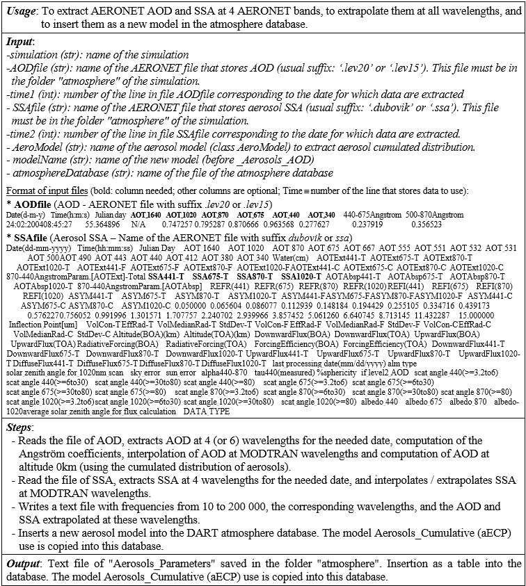

***Function: createGasTrans()*** in the script `atmosphere.py`.

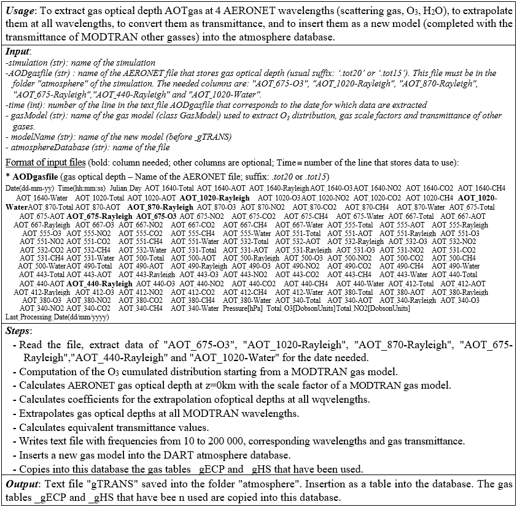

***Function: skinTemperatureInterpolation()*** in the script `skinTemperature.py`.

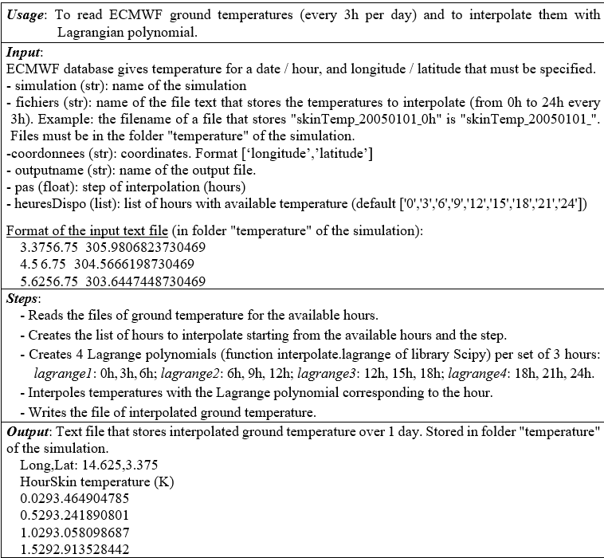

## AERONET: download and adaptation to DART

AERONET [https://aeronet.gsfc.nasa.gov](https://aeronet.gsfc.nasa.gov) provides the aerosol optical depth (AOD), inversion products, and precipitable water, including daily and monthly averages, derived from observations (CWL/BW: 340/2, 380/4, 440/10, 500/10, 675/10, 870/10, 937/10, 1020/10, 1640/25 nm) in hundreds world sites. AOD is computed for three data quality levels: 1.0 (unscreened), 1.5 (cloud-screened), and 2.0 (cloud screened and quality-assured). 

- Aerosol optical thickness/depth AOT depth (AOT_λ)

- Gas optical depth: AOT_λ-Rayleigh, AOT_λ-O3, 
AOT_λ-NO2, AOT_λ-CH4, AOT_λ-CO2, AOT_λ-Water

- Aerosol single scattering albedo SSA (SSAλ_T)

- Asymmetry parameter g of the scattering phase function of aerosols (ASYMλ-T).

### I. Download of AERONET data (Aerosol Optical Depth and Aerosol Inversions sections) 

Download (text file in a zip file) can be per measuring station, per product: 'aerosol optical thickness', 'gas and aerosol optical thickness' and 'SSA + asymmetry parameter', with site coordinates and altitude in the file header. Daily and monthly averages (not for "gas optical thickness"). 

- ***Aerosol Optical Depth for a given site*** 
    - Click on "Data Display" and search for the site by clicking on the map. Click on the site name below the map.
    - In the new page that shows data availability by level, choose a year and download data (Figure below).

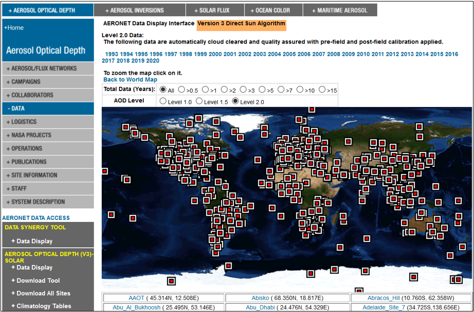
*Selection of AERONET measuring site.*
</img>

In the downloaded zip file, measurements, specified by a specific date and time, are per line, with each column standing for the data: AOT_440, AOT_675, 440-870Angstrom,... The separator is a commas ",".

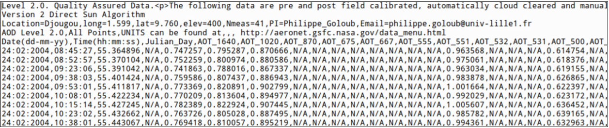
*Structure of the downloaded file. Separators are commas ",".*
</img>

- ***Daily and monthly averages for a given site***
    - Click on "Download Tool", and then on the name of the desired site. Then, select the products for the level available over the entire period of availability of the measurements.
    - Check the desired level for the line "Aerosol Optical Depth with Precipitable Water and Angstrom Parameter".
    - Monthly averages: select "Monthly Averages" in Data Format to get a file (name ending with mon). Its columns store the averages derived from Daily averages, and the averages derived from daily averages weighted by the number of measurements in the day (Weighted Average). Each lines is a month of the year.
    - Daily averages: select "Daily Averages" (name of the file ending with day).

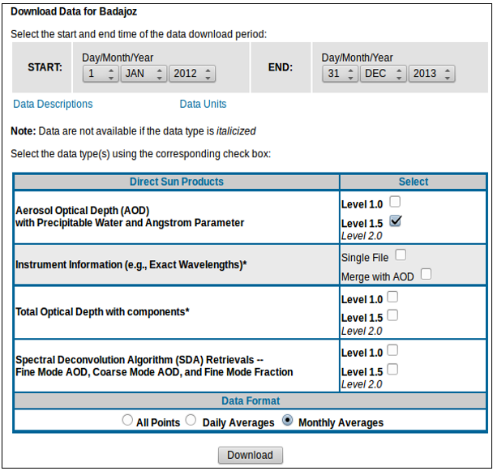
*Download AERONET daily and monthly averages.*
</img>

- ***Gas and aerosol optical depth*** 
 In the "Aerosol Optical Depth" section, select the site and desired level (line "Total Optical Depth with components"). The downloaded text file stores gas and aerosol optical thickness (no daily/monthly average).

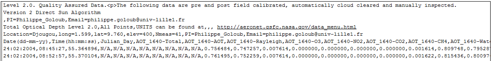
*Structure of the downloaded file. Separators are commas ",".*
</img>

- ***SSA and Asymmetry parameter g for a site*** 
    - In the "Aerosol Inversion" section, click on "Data Display" and select the site by clicking on the map.
    - Once the desired site has been found, click on its name below the map.
    - Select the desired product (SSA or g). Note data availability according to the level: 1.0, 1.5 and 2.0.
    - Choose a year, and click on “Level 2.0” (or another one) download link at the page bottom left.

SSA and g data are in the downloaded zip file: text file (ending in .ssa for SSA and .asy for asymmetry parameters). Each lie represents a measurement (specified by a specific date and time). Columns represent the data separated by commas ",": SSA441-T, SSA_675-T, ASYM441-T,... 

If the name of the site is known and if we want daily / monthly values and /or SSA / ASYM in the same file:

- Click on "Download Tool", and then on the name of the desired site.

- Select the products for the level available over the entire period of availability of the measurements.

- Select the lines "Single Scattering Albedo" for the albedo and "Asymmetry Factor" for the asymmetry parameter (or any other desired parameter).

- To download all the products, select "Combined File (all products without phase functions)".

- Monthly averages: select "Monthly Averages" in Data Format. There is one row per month and per type of average (monthly average calculated from daily averages: Daily Average, calculated from daily averages weighted by the number of daily measurements: Weighted Average).

- Daily averages: select "Daily Averages".

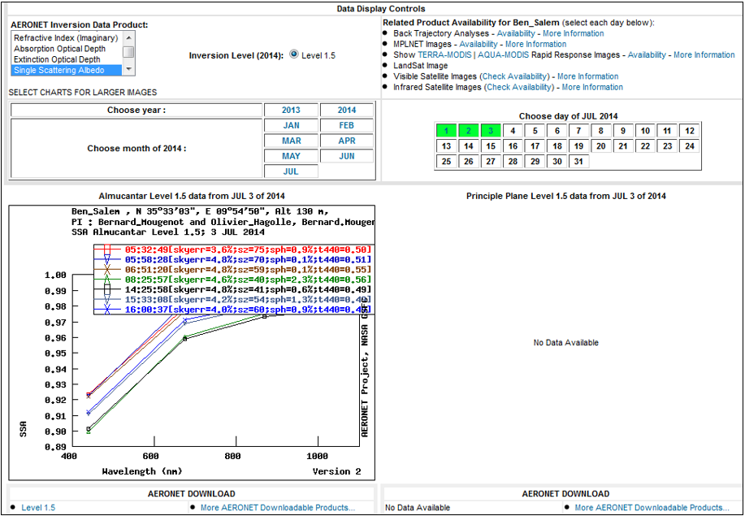
*Menu for downloading SSA and Asymmetry parameter g for a site.*
</img>

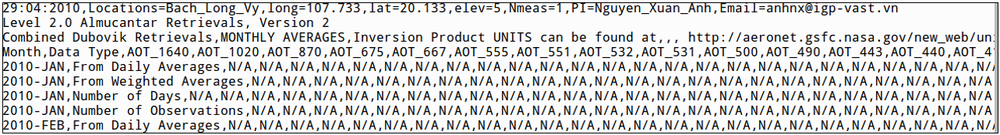
*Downloaded file. Separators are commas ",". 1 type of data per text file (suffix .ssa for the albedo, and .asy for the asymmetry parameter), or data grouped in the same text file if you selected "Combined File".*
</img>

- ***Data for all sites*** 
A given type of data can be downloaded (tar.gz file) for all AERONET sites (except gas optical thickness). 
a) Aerosol AODs: section "Aerosol Optical Depth" > "Download All Sites"
Select All Points ($\implies$ all measurements) or Daily Average or Monthly Average ($\implies$ daily or monthly averages).
b) SSA and g: section "Aerosol Inversions" > "Download All Sites"

### II. Adaptation of AERONET data to DART 
The gas and aerosol models in the DART atmosphere database result from MODTRAN simulations at [10 - 40015cm-1] ([0.25 - 1000µm]). Since they are for a few wavelengths (e.g., AOD at 440nm, 675nm, 870nm and 1020nm), AERONET data (Figure below) must be interpolated / extrapolated to any wavelength of DART database.

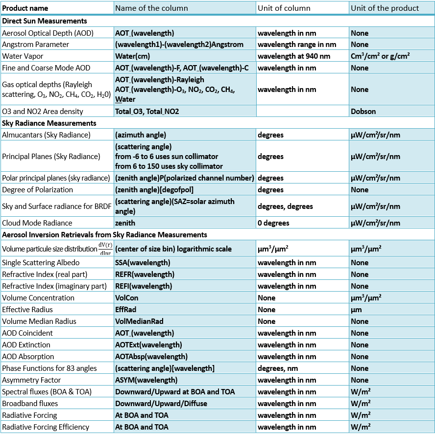
*AERONET data:*
</img>

Below, index A is for AERONET data, and index db is for DART database data. Some steps are identical for all parameters. For example, if AERONET $AOD_{A,z’}(\lambda_0)$ known at altitude z’, $AOD_{A,0}(\lambda_0)$ is extrapolated with given gas / aerosol model of DART database, and $AOD_{A,0}(\lambda)$ is extrapolated such that $AOD_{A,0}(\lambda) = AOD_{A,0}(\lambda_0) . f(\lambda_0)$.

- ***Asymmetry parameter g*** 

AERONET gives only 1 asymmetry parameter for the aerosol phase function. It is the "forward scattering" parameter $g_1$ of the DART atmospheric database (table aHG per aerosol model). Therefore, the “small” aerosol back-scatter peak is not considered: $g_2=0$ and multiplicative factor $a=1$. In short, the module `phase.exe` of DART makes a linear spectral interpolation on $g_A(440), g_A(675), g_A(870)$ and $g_A(1020)$, with constant values beyond the minimal and maximal wavelengths, with $g_1(\lambda) = g_A(\lambda), g_2(\lambda)=0, a(\lambda)=1$.

- ***Aerosol optical depth (AOD)***  AERONET gives $AOD_{A,z}$ at 440nm, 675nm, 870nm, 1020nm, and possibly 1640nm and 340nm; z = site altitude.
    - **Angström coefficient**   $AOD(\lambda)=AOD(\lambda_0).(\frac{\lambda_0}{\lambda})^{\beta_{\lambda_1,\lambda_2}}$ for $\lambda$  and $\lambda_0 \in [\lambda_1 \lambda_2]$  and $\beta_{\lambda_1,\lambda_2}$ the Angström coefficient over $[\lambda_1 \lambda_2]$. The Angström coefficients given by AERONET are not directly used. Actually, we recalculate them. For example, for the interval [440 nm; 675 nm], we have:   $AOD(675)=AOD(440)\times (\frac{440}{675})^{\beta_{440\ 675}}$  with  $\beta_{440\ 675}= \frac{ln(\frac{AOD(675)}{AOD(440)})}{ln(\frac{440}{675})}$   It gives $\beta_{440\ 675}, \beta_{675\ 870}, \beta_{870\ 1020}$ and also $\beta_{340\ 440}$ and $\beta_{1020\ 1640}$ if $AOD_A(1640)$ and $AOD_A(340)$ exist.
    - **Aerosol spectral optical depth at the site attitude z'** 
    
    If we have $AOD_A(340)$, and consequently $\beta_{340\ 440}$:
    
    - For $λ \in [0 - 440 nm]$:  $AOD_{z'}(\lambda)=AOD_A(340) \times (\frac{340}{\lambda})^{\beta_{340\ 440}}$
    
    - For $λ \in [440 - 675 nm]$: $AOD_{z'}(\lambda)=AOD_A(440) \times (\frac{440}{\lambda})^{\beta_{440\ 675}}$

    If we do not have $AOD_A(340)$:
    
    - For $λ \in [0 - 675 nm]$: $AOD_{z'}(\lambda)=AOD_A(440) \times (\frac{440}{\lambda})^{\beta_{440\ 675}}$

    - For $λ \in [675 - 870 nm]$: $AOD_{z'}(\lambda)=AOD_A(675) \times (\frac{675}{\lambda})^{\beta_{675\ 870}}$

    If we do not have $AOD_A(1640)$:

    - For $λ > [ 870 nm]$: $AOD_{z'}(\lambda)=AOD_A(1020) \times (\frac{1020}{\lambda})^{\beta_{870\ 1020}}$

    If we do have $AOD_A(1640)$, and consequently  $\beta_{1020\ 1640}$:

    - For $λ \in [870 - 1020 nm]$: $AOD_{z'}(\lambda)=AOD_A(870) \times (\frac{870}{\lambda})^{\beta_{870\ 1020}}$

    - For $λ > [ 1020 nm]$: $AOD_{z'}(\lambda)=AOD_A(1640) \times (\frac{1640}{\lambda})^{\beta_{1020\ 1640}}$

    - **Aerosol spectral optical depth at z=0km**

    The optical thickness of AERONET is for the altitude of the measuring site z '. However, the optical thickness at the input of DART (table aAOD) must be for the altitude z = 0km. In order to get it, we use:   $AOD_{A,0}=AOD_{A,z'}.\frac{\int_0^\infty N(z).dz}{\int_0^{z'}f N(z).dz}=AOD_{A,z'}.\frac{N_{0,db}}{N_{z',db}}$
     $N(z)$ is the aerosol normalized vertical density profile (aECP table per aerosol model) for a finite number of altitudes (z integer in km) in the DART database. $N_{0,db}=N(z=0km)$. $N_{z'}=N(z') is usually computed with an exponential law of scale factor Hi that links $N_i$ at level $i$, to $N_{i+1}$ at level $i + 1$.
      $N_{i+1}=N_i \times e^{\frac{z_{i+1}-z_i}{H_i}} \implies H_i= - \frac{z_{i+1}-z_i}{ln\frac{N_{i+1}}{N_i}}$
     Therefore, there is no need to know scale factors in order to compute $N_{z,db}$ for $z'$ between levels $i$ and $i+1$:
      $N_{z'}=N_{i,db} \times e^{- \frac{-(z'-z_i)}{H_i}} = N_{i,db} \times e^{\frac{- \frac{(z'-z_i)}{(z_{i+1}-z_i)}}{ln\frac{N_{i+1,db}}{N_{idb}}}} = N_{i,db} \times(\frac{N_{i+1,db}}{N_{idb}})^{\frac{-(z'-z_i)}{z_j-z_{i+1}}}$
      Knowledge of $N_{z’,db}$  leads to $AOD_{A,0}$ at any wavelength: $AOD_{A,0}(λ) = AOD_{A,z’}(λ) \times \frac{N_{0,db}}{N_z}$.

    - **Aerosol SSA**  SSA is computed for wavelengths of DART database with a linear interpolation between the AERONET SSA values (440nm, 675nm, 870nm, 1020nm), and as a constant value outside the interval [440.1020 nm].
        - $\lambda < 440 nm$: SSA(λ) = SSAA(440)
        - $\lambda \in [440 - 675nm]$: linear interpolation between SSAA(440) and SSAA(675)
        - $\lambda \in [675 – 870nm]$: linear interpolation between SSAA(675) and SSAA(870)
        - $\lambda \in [870 - 1020nm]$: linear interpolation between SSAA(870) and SSAA(1020)
        - $\lambda > 1020 nm$: SSA(λ) = SSAA(1020)
    
    - **$0_3$ transmittance**   $O_3$ transmittance $T_{O_3} (\lambda)$ at $z=0km$ is needed, whereas AERONET gives $O_3$ optical depth $AOD_{O_3,A}(675)$ at $675nm$ for the altitude $z'$ of the measuring site. $T_{O_3} (\lambda)$ is computed using $O_3$ normalized vertical profile $N_{O_3,z}$ (table gECP). As for the aerosols, between levels $i$ and $i+1$:   $N_{O_3,z'}=N_{O_3,i}\times \frac{N_{O_3,i+1}}{N_{O_3,i}}^{-\frac{z'-z_i}{z_i-z_{i+1}}}$  It leads to AODO3 at z=0km for λ=675 nm: $AOD_{O_3,A,0}(675)=AOD_{O_3,A,z'}(675) \times (\frac{N_{O_3,0}}{N_{O_3,z'}})$  With the assumption that AOD is proportional to the total quantity of $O_3$:   $AOD_{O_3}(\lambda)=AOD_{O_3,db}(\lambda) \times \frac{AOD_{O_3,A,0}(675)}{AOD_{O_3,db}(675)}= AOD_{O_3,db}(\lambda) \times f_{O_3}(675)$     with $AOD_{O_3,db}(675) = - ln (T_{O_3,db} (675))$ for a given gas model (table gTrans).    $f_{O_3}(675)=frac{AOD_{O_3,A,0}(675)}{AOD_{O_3,db}(675)}$ is the relative O3 proportion in AERONET compared to DART database.   $\implies T_{O_3} (\lambda)= e^{-AOD_{O_3}(\lambda)}=e^{AOD_{O_3,db}(\lambda)}=T_{O_3,db}(\lambda)^{f_{O_3}(675)}$

    - **H2O transmittance**  AERONET AODH2O,A(1020) is for the band 1015 - 1025nm] for altitude z' of the measuring site. In order to compute $AOD_{H_2O,A}(1020)$ at $z=0$, we use the H2O height scale H_H2Odb (cf. DART Handbook).
      $AOD_{H_2O,A,0}(1020)=AOD_{H_2O,A,z'}(1020) \times e^{-\frac{z'}{H_{H_2O,db}}}$ 
     Due to the strong spectral variability of $AOD_{H_2O}$, we use $f_{H_2O}(1020)=\frac{AOD_{H_2O,A,0}(1020)\times \sum_i \delta\lambda_i}{\sum_i AOD_{H_2O,db,i}\times \delta\lambda_i}$ with $i \in [1015 - 1025]$ and $\delta\lambda_i$ = interval per $AOD_{H_2O,db,i}$ in the DART data base and $AOD_{H_2O,db,i}=-ln[T_{H_2O,db}(\lambda_i)]$. 
      $\implies AOD_{H_2O}(\lambda)=AOD_{db}(\lambda).f_{H_2O,db}(1020)$.
      $\implies T_{H_2O}(\lambda)=e^{-AOD_{H_2O}(\lambda)}=e^{-AOD_{H_2O,db}(\lambda) \times f_{H_2O}(1020)}=T_{H_2O,db,}(\lambda)^{f_{H_2O}(1020)}$

    - **Transmittance of scattering gasses**   $AOD$ at $z=0$ is computed with $AOD_{scat,A}(440), AOD_{scat,A}(675), AOD_{scat,A}(870), AOD_{scat,A}(1020)$ at the site altitude z’, using the height factor $H_{m,db}$ of scattering gasses (cf. DART Handbook):   $AOD_{scat,A,0}(\lambda_0)=AOD_{scat,A,z'}(\lambda_0)\times e^{-\frac{z'}{H_{m,db}}}$.     $f_{scat}(\lambda_0)=\frac{AOD_{scat,A,0}(\lambda_0)}{AOD_{scat,db}(\lambda_0)}$, $AOD_{scat,db}(\lambda_0)=-ln[T_{scat,db}(\lambda_0)]$ and $\lambda_0 =440, 675, 870, 1020nm$. $f_{scat}(\lambda_0)=1$ if $T_{scat,db}(\lambda_0)=1$.    $T_{scat}(\lambda)=e^{-AOD_{scat}(\lambda)}=e^{-AOD_{scat,db}(\lambda) \times f_{scat}(\lambda_0)}=T_{scat,db}(\lambda)^{f_{scat}(\lambda_0)}$
        - $\lambda < 440 nm: T_{scat}(λ) = T_{scat,db}(\lambda)^{f_{scat}(440)}$
        - $\lambda \in [440 - 675nm]: T_{scat}(\lambda) = T_{scat,db}(\lambda)^{f_{scat} [440,675](\lambda)}$
        - $\lambda \in  [675 – 870nm]: T_{scat,db}(\lambda)^{f_{scat} [675,870](\lambda)}$
        - $\lambda \in  [870 - 1020nm]: T_{scat,db}(\lambda)^{f_{scat} [870,1020](\lambda)}$
        - $\lambda > 1020 nm: T_{scat}(λ) = T_{scat,db}(\lambda)^{f_{scat}(1020)}$   with $f_{scat} [\lambda_1,\lambda_2](\lambda)$ the factor $f_{scat}$ linearly interpolated between $f_{scat}(\lambda_1)$ and $f_{scat}(\lambda_2)$ at $\lambda$.
    
    - **Transmittance of absorbing gasses** (CO2, CH4, CO, N2O, O2, N2, other gases).  AERONET gives the optical thickness of CO2 and CH4. We assume that the variation of quantity of these gases compared to these same gases in the gas model chosen in the DART database is equal to the corresponding variation of the scattering gases between the DART model and the AERONET values. This assumption is based on the fact that $CO2, CH4, CO, N2O, O2, N2,..$ are well mixed with the scattering gases. Therefore, we use the same factors as for the scattering gasses:
        - $\lambda < 440 nm: T_g(\lambda) = T_{g,db}(\lambda)^{f_{scat}(440)}$
        - $\lambda \in [440 - 675nm]: T_g(\lambda) = T_{g,db}(\lambda)^{f_{scat} [440,675](\lambda)}$
        - $\lambda \in [675 – 870nm]: TT_g(\lambda) = T_{g,db}(\lambda)^{f_{scat} [675,870](\lambda)}$
        - $\lambda \in [870 - 1020nm]: T_g(\lambda) = T_{g,db}(\lambda)^{f_{scat} [870,1020](\lambda)}$
        - $\lambda > 1020 nm: T_g(\lambda) = T_{g,db}(\lambda)^{f_{scat}(1020)}$

    - **Upward – Downward transmittance** (Trans Eq.)Using the above transmittance values: $Trans\ eq = (T_{CO_2} . T_{CH_4} . T_{CO} . T_{O_3} . T_{H_2O} . T_{N_2O} . T_{O_2} . T_{N_2} . T_{other gases} . T_{scat})^2$.

## ECMWF data to DART

([http://apps.ecmwf.int/datasets/data/macc_reanalysis/](http://apps.ecmwf.int/datasets/data/macc_reanalysis/), [http://data-portal.ecmwf.int/data/d/macc_reanalysis/levtype=ml/](http://data-portal.ecmwf.int/data/d/macc_reanalysis/levtype=ml/))

The ECMWF database stores climatological data at 3h time intervals in a day, on the whole globe (resolution 1.125° x 1.125°). The data is in .grib or NetCDF format. Here, we consider the retrieval of:

- Atmospheric temperature profiles, given by atmospheric level: 60 atmospheric layers, up to 0.1hPa or about 35.6 km altitude (model level: temperature)

- Soil temperatures (surface: skin temperature)

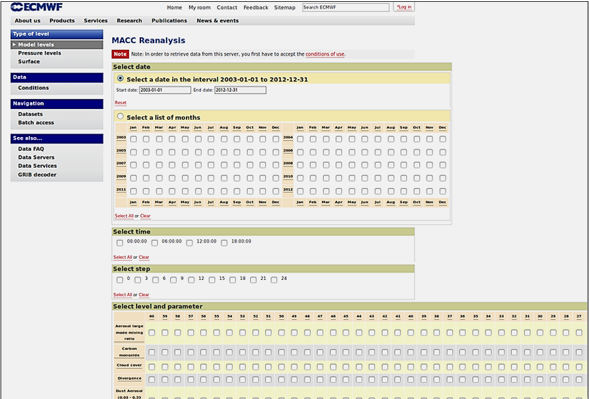

Download method with "Model levels" (top left): 

1. Select Date / Select a list of months

2. Select time

3. Select time step

4. Select level and parameter. For profiles of atmosphere temperature, select the line "Temperature". 

5. Click on "Retrieve GRIB", and then on "Retrieve Now".

Read and extract an atmosphere temperature profile: 

1. Open the free software "Integrated Data Viewer" (IDV) ([www.unidata.ucar.edu/software/idv/#home](www.unidata.ucar.edu/software/idv/#home)), go the Dashboard and select "Data Choosers" to select the grib file downloaded from the database. 

2. Once the file open, go to "Field Selector", and for the field "Temperature" display General > Grid Table. Select the expected date if the file has several dates, and then click on "Create Display".

3. In "Displays", check "Show native coordinates". Data can be displayed per available date. They can be sorted per longitude (column "lon"), latitude ("lat"), atmosphere level ("hybrid"). The last column gives the corresponding temperature (K). 

4. A temperature profile of interest is copied (Ctrl + C) into a text file thatcan be converted by the function ECMWFTemperatureToAtmosphereDatabase() into a text file that the DART atmosphere database can import.

The procedure is identical for ground temperatures (skin temperature), except they are in the category "Surface". The function skinTemperatureInterpolation() uses the text files that store data extracted over 1 day (step of 3h).

