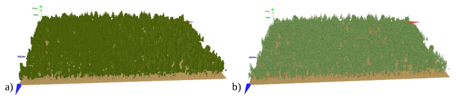
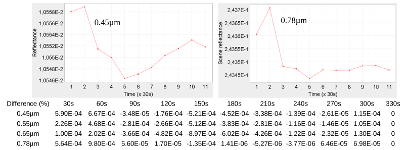
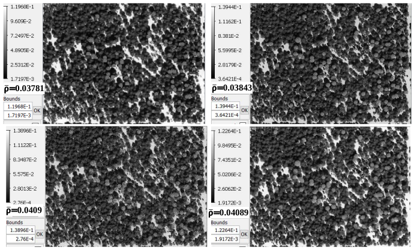
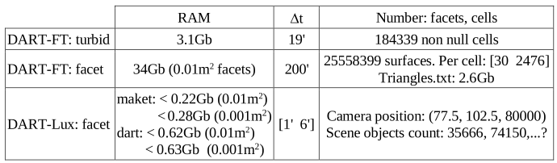

<u>*Objective:*</u> to illustrate the use of DART-Lux to simulate images (here: nadir image) and BRF of forests, with a comparison with DART-FT where leaf elements are simulated as turbid volumes and $0.01m^2$ facets.

<u>*Scene:*</u> 155m x 205m plot of Howland forest, USA. 45.2N, 68.73W. 2003/07/06, 11h. $0.45\mu m, 0.55\mu m, 0.65_mu m, 0.78\mu m$; $\Delta \lambda=0.05\mu m$. `trees_Howland.txt`: 750 aspen trees (type 0), 7239 hemlock trees (type 1). Optical properties: aspen_low / aspen_low_bf for aspen leaf upper / bottom faces, hemlock_low for hemlock leaf, bark_howland for
trunks, sandy_loam_brown for ground. Spatial resolution: 0.5m.

*Howland forest plot. DART-FT trees are simulated as turbid volumes (a) and $0.01m^2$ facets (b).*
</img>

To optimize DART-Lux, trees must be clones of a limited number of basic 3D trees simulated with facets. Since, trees
of the same type in trees_Howland.txt are proportional, any tree of each tree type (i.e., aspen, hemlock) can be a
reference tree that can be used to create a basic 3D tree. Here, the larger tree of each tree type is the "reference": trunk
height below crown = 12.81m for aspen and 11.57m for hemlock.

Tree crowns are ellipsoids for aspen and cones for hemlock. The simulation Create_tree_ellipsoid creates a 3D object (default name: `dsm.obj`) using a `trees.txt` file that stores the dimensions of the reference aspen tree with a location (here: (5m, 5m)) in the center of a small square scene (here: 10m x 10m). This tree is also defined by the expected LAD (here: spherical) and a plausible LAI (here: $LAI_{init}=1$). Here, the resulting 3D object ((i.e., `tree_ellipsoid.obj`) contains 10018 triangles that make up the tree and ground scene facets. It is transformed into the basic `tree_ellipsoid.obj` by manually adding a comment mark (//) at the start of the 2 lines ("f 1 2 3" and "f 4 5 6") that define the 2 triangles of the ground scene. Similarly, the simulation `Create_tree_cone` creates a `dsm.obj` that is manually transformed as the `tree_cone.obj`. Then, the file `trees_Howland.txt` is manually transformed into the file `Field_3D_objects.txt` that stores the field (i.e., xyz location, scaling and rotation) of the two 3D objects (i.e., `tree_ellipsoid.obj`, `tree_cone.obj`); the scaling values of the 2 reference trees are equal to 1.

Then, the maket module is run with the Howland scene and the optional product "Triangle area products" / "By type / color", after having set a specific color name per group (i.e., trunk, leaves) of the two 3D objects. The file `input / dart.typ` stores the code associated to each color name; here: 102 for aspen and 103 for hemlock. The file `simulation.properties.txt` gives the area of scene elements per code (i.e., color name). Here, "Leaf (102) aspen area = $11434m^2$", which implies $LAI_{aspen} = 0.3598$ instead of 0.4. Similarly, "Leaf (103) hemlock area = 115460m2", which implies $LAI_{aspen} = 3.634$ instead of 3.6. In order to get the correct aspen and hemlock LAI values, the two 3D objects are xyz scaled: 0.4/0.3598 instead of 1 for aspen, and 3.6/3.634 instead of 1 for hemlock, which allows the maket module to give the correct LAI values: $LAI_{aspen}=0.4$ and $LAI_{hemlock}=3.6$.

The image below shows the evolution of DART-Lux scene reflectance $\rho_{scene}$ as a function of time. After 30s, the relative accuracy on ρscene is already better than $10^{-3}$. DART Lux and DART-FT do not give exactly the same $\rho_{scene}$. This is due to the fact that DART Lux does not yet simulate leaves with different optical properties on its 2 faces.

*DART-Lux scene reflectance with time, from 30s to 330s.*
</img>

Below, the table shows the DART-FT and DART-Lux RAM needs and computer times. As expected, DART-Lux is much faster and needs much less RAM than DART-FT. The RAM demand increases very little if the 3D models are more accurate (e.g., facets of $0.001m^2$ instead of $0.01m^2$).

*DART-FT: a) "turbid" and b) "0.01m2 triangles". DART-Lux: c) 30s (left) and d) 230s.*
</img>

*RAM and computer time (∆t) requirements of DART-FT and DART-Lux. Howland forest.*
</img>

