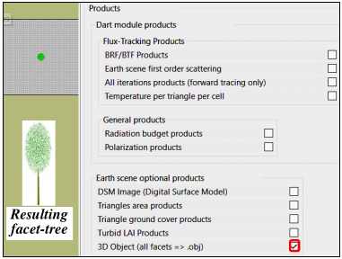
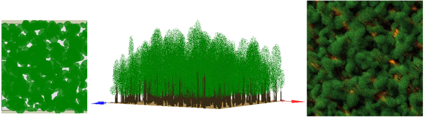

# Annex 5: Field of trees that are the clones of a DART created 3D (facet) tree

<u>*Approach*</u>: create the 3D tree `3D_tree.obj` with Maket module, then the field of trees, then the scene.

<u>*Target scene*</u>: 100m x 100m, $LAI_{scene} = 4$, $N_{trees} = 500$ $\implies$ mean $\overline{Leaf\:area}_{tree} = 80m^2$ and $\overline{LAI}_{tree} = 0.008$

**Step 1**: DART 3D tree creation (simulation "Create_3D_tree")

- Scene: horizontal bare ground scene with a tree (mean dimensions, $\overline{Leaf\:area}_{tree}$ = 80m2) in its center. Here, the scene size is 100 x 100m in order to be adapted to any tree crown horizontal dimension, and the area of the facets of the tree crown is $0.003m^2$ (smaller facet area and larger the computer volume of the 3D tree).

- Run *Maket* (adapted to DART-FT, and soon DART-Lux) after setting its only product "3D object". It gives the 3D object `dsm.obj` that stores all facets of the tree and the 2 facets of the ground.

- `3D_tree.obj`: `dms.obj` whose you comment out the 2 ground faces (i.e., `// f 1 2 3` and `//f 4 5 6`).

</img>

**Step 2**: Creation of the field of trees "field_3D_trees.txt"  
Any tool (e.g., `TreeReport.txt` of DART created trees) can give `field_3D_trees.txt`. Here, Excel `filecreate_field_tree.xlsx` is used with parameters for tree position ($N_{trees}$, radius of tree presence) and dimensions. Notethe use of independent random numbers for tree dimensions with thresholds to avoid too large and too small trees.

**Step 3**: Scene creation (simulation 3D_scene)  
100m x 100m scene with 500 trees using `3D_tree.obj` and `field_3D_trees.txt`. The image below shows results. 

Here, in addition to the scene creation, the Maket module computes the area ($A_{leaf} = 40744.2 m^2$, $A_{trunk} = 11167.8 \:m^2$, $A_{ground} = 10000 \:m^2$) per scene element. As expected, $LAI_{scene} \approx 4$. In order to get exactly 4, a DART python code can scale the leaves; note that if $x_{scale} = y_{scale} = z_{scale}$, $LAI = LAI_0.x.\sqrt{x_{scale}}$.

*DART 2D / 3D scene and RGB image. $\rho_{ground}$: loam_gravelly_brown. $\rho_{leaf}$: rass_rye. $\rho_{bark}$: bark_deciduous.*
</img>

