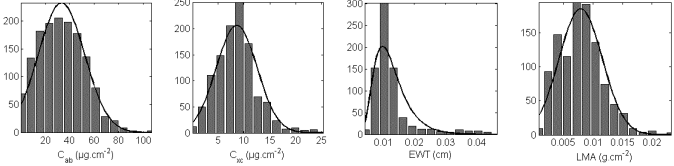
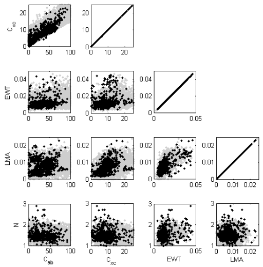

# Annex 6: Optimal domain of leaf variables to get leaf optical properties

The domain of PROSPECT/FLUSPECT input parameters should be defined using prior information on the correlation between these parameters, and per parameter of interest. Feret et al. (2011) compute joint distribution, marginal distribution and correlations using 700-1200 leaf samples ($N_{samples}$ depends on type of chemical constituent) from various sources (ANGERS, LOPEX, A. Gitelson, A. Richardson, …). The first image below shows marginal distributions for Chl, Car, EWT and LMA, and the second shows co-distributions, including the Leaf structure parameter N. Samples are created by a multivariate normal random numbers function (e.g. *‘mvnrnd’* in Matlab) using the mean value of each variable and the covariance matrices.

*Marginal distribution for leaf chemical constituents.*
</img>

*Pairwise co-distribution of leaf chemical and structural constituents.*
</img>

Leaf variables must verify PROSPECT constraints: leaf chemical constituent > 0, and leaf structure $\in [0\:3]$

If the dataset is aimed to estimate a variable x, the distribution of x may be converted from normal to uniform. Then, one gets a larger number of variable combinations, and one divides the range of variation of x into n equal intervals, with a same number of samples selected from the initial dataset.

If canopy variables vary, these variables are generated using user’s distribution merged to the leaf variables. Example: random selection of LAI using a uniform distribution, independent from leaf variables. However, correlations between LAI and Chlorophyll content may be considered.
