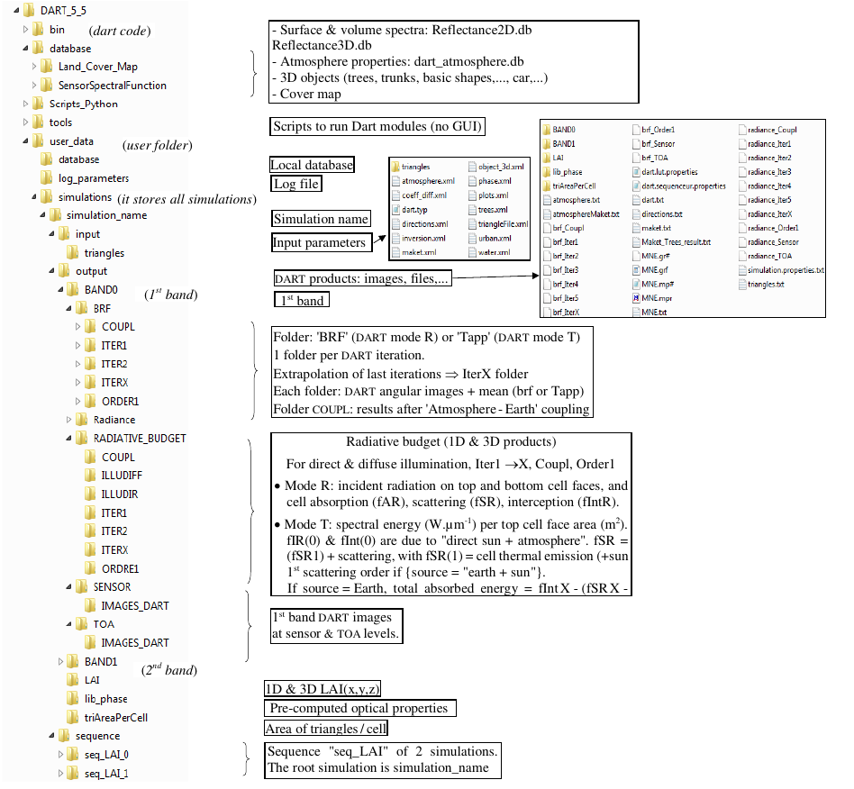

# File Architecture

DART installation: unzip the DART installation file, then install DART into a folder (*e.g.*, D:\DART) not directly created / managed by the Windows operating system (e.g., 'Users'). DART (see below) has 4 sub-folders: "bin: code", "database: 3D objects, atmosphere,…", "tools: scripts to run DART modules, with / without the GUI", and "user_data". User_data has 3 sub-folders: "database: user databases", "log_parameter: log data", and "simulations" where all DART simulations can only be here). In addition, Each simulation has 2 sub-folders:

- ***Folder "input"***: input parameters to run a simulation: radiative mode (DART-FT, DART-RC, DART-Lux), spectral bands, Earth / Atmosphere scene: geometry and optical / temperature properties, products (images,…) to simulate and store,… XML files store them: `directions.xml`, `maket.xml`, `object_3D.xml`, `phase.xml`, `atmosphere.xml`,…
- ***Folder "output"***. It stores results (simulated landscape, DART images,…) in different folders.

*Folders 'Dart', 'user_data' and 'simulation_name', and its associated sequence 'seq_LAI'.*</img>

