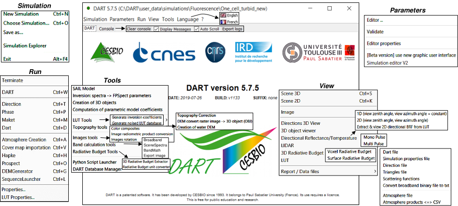
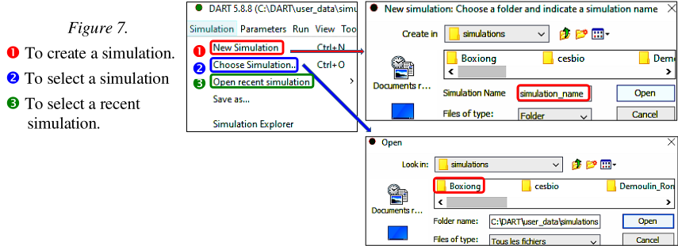
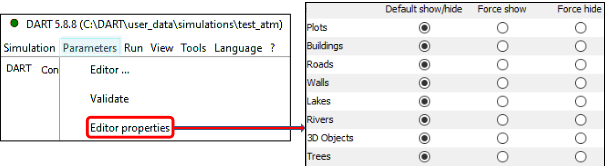

# Graphical User Interface

*Graphic User Interface of DART.*</img>

The DART Graphic User Interface (GUI) allows one to create, edit and run DART simulations, and to process and view results (see above), using 7 sub-menus (several GUIs can be opened simultaneously):

- <u>*"Simulations"*</u>. To create (*i.e.*, to create files xml) and select (see below) a simulation.

</img>

- <u>*"Parameters"*</u>:

    - **"Editor properties"** (see below): to prevent / authorize the display of Earth scene elements: plots, trees, buildings,... Indeed, their display can be very time consuming if they are very numerous.

*Editor Properties*
</img>

    - **"Validate"**: Basic check of the consistency of DART input parameters.
    - **"Editor"** Input of simulation parameters to create the Earth/Atmosphere scene, define products,...
    
- <u>*"Run"*</u> To run DART modules separately or all together.

- <u>*"View"*</u> To display the simulated 3D landscape and results (e.g., curves 1D/2D of BRF, images, etc.).

- <u>*"Tools"*</u> To process results (images, LUT,…) of DART simulations to get new results (e.g., color composite).

- <u>*"Language"*</u> To select the language: English or French (not maintained).

- <u>*"Console"*</u> To display useful information during the DART run. Several display options are available.
