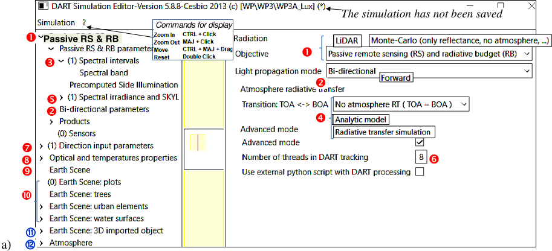
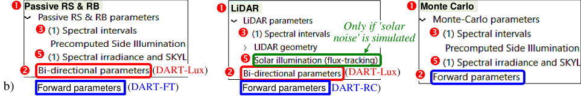
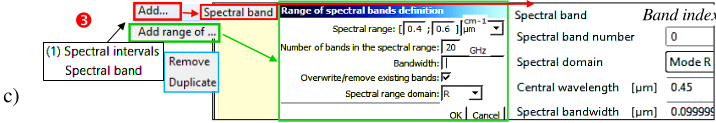
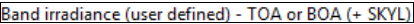
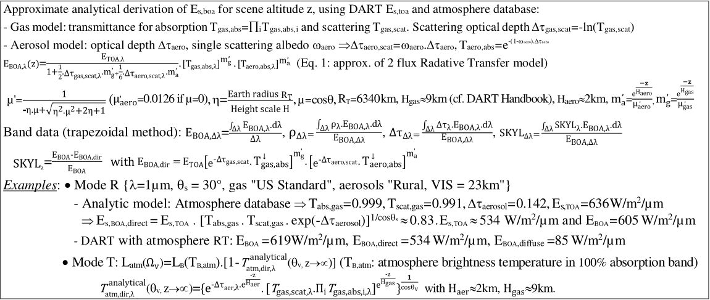

# Editor of Simulation

The menu "Editor of simulation" (See above) has 4 panels:

- <u>*Left panel.*</u> Its tree structure is that in the xml files that store DART parameters, with a node per group of parameters. Right click on a node or sub-node to create or duplicate it; a number between brackets is the number of sub nodes.

- <u>*Central panel.*</u> It displays the scene that is currently created. Coordinates of the mouse are in the bottom page.

- <u>*Right panel.*</u> To edit the parameters of the functionality selected on the left panel.

- <u>*Bottom panel.*</u> It shows error and warning messages. A click leads to the place of the GUI where the issue occurs.

DART has 3 operating modes and 2 operating sub-modes that can be selected on the right panel:

+ 3 operating modes : 'LiDAR', 'Monte Carlo' and 'Passive RS & RB' (RS: Remote sensing, RB: Radiative budget),
+ 2 operating sub-modes : 'Forward', 'Bi-directional' light propagation. 'Bi-directional' is idle in 'Monte Carlo'.

</img>

</img>

*DART GUI. a) Menu of mode 'Passive RS & RB' and sub-mode "Bi-directional". b)  DART 3 modes (Passive RS & RB, LiDAR, Monte Carlo) and 2 sub-modes  (Forward, Bi-directional). c) Spectral band.*
</img>

 

Spectral interval ($\bar{\lambda}$, $\Delta \lambda$, M). Central wavelength $\bar{\lambda}$ . Bandwidth $\Delta \lambda$. Spectral mode M = R (source =sun or LiDAR),
T (source = Earth / atm. thermal emission) or $R+T$. 

2 options for T: *Planck* (default; $W/m^2/µm/sr$) or *Boltzmann* ($W/m^2$). Optical properties are computed over $\Delta \lambda$, possibly with $E_{BOA}(\lambda)$ weight. A right click adds intervals:

- Add, remove or duplicate 1 band at a time.

- Add / delete N bands:
    - $[\lambda_{min};\:\lambda_{max}] \mu m$. If $\Delta \lambda$ is not specified, bands are adjacent: $\Delta \lambda=\frac {\lambda_{max} - \lambda_{min}} {N}$
    - $[\nu_{min};\:\nu_{max}]cm^{-1}$. If $\Delta \nu$ is not specified $\implies \bar{\lambda_{i}}=\frac {10000} {\nu_{min} + (2i+1).\frac {\nu_{max}-\nu_{min}} {2.N}}$, $\Delta \lambda=\frac {10000} {\nu_{min} + (2i+1).\frac {\nu_{max}-\nu_{min}} {2.N} - \frac {\Delta \nu} {2}} - \frac {10000} {\nu_{min} + (2i+1).\frac {\nu_{max}-\nu_{min}} {2.N} + \frac {\Delta \nu} {2}}$
    - $\Delta \nu$ specified $\implies$ equally spaced $\nu_{mean,i}$ and $\Delta \nu=\frac {\nu_{min} - \nu_{max}} {N}$. $\bar{\lambda_{i}}=\frac {\frac {10000} {\nu_{min}+(i+1).\Delta\nu} + \frac {10000} {\nu_{min}+i.\Delta\nu}} {2}$, $\Delta \lambda = \frac {10000} {\nu_{min}+i.\Delta\nu} - \frac {10000} {\nu_{min}+(i+1).\Delta\nu}$

 Transition TOA $\Leftrightarrow$ BOA (see below). There exists 3 atmosphere RT modes:

*BOA / TOA illumination. Input parameters are in bold red. $E_{TOA,\lambda,\Omega s} = E_{TOA,\lambda}^{cst}.cos(\theta s)$. CIE model is being introduced.*</img>

- No atmosphere RT ($E_{BOA} = E_{TOA}$): the atmosphere is an interface with illumination ($E_{BOA}$, SKYL) or $L(\Omega^{\downarrow})$.
- Analytic model $f_{analytic}$ (*more detailed at the end of the page*): it derives $E_{BOA}$ from $E_{TOA}$ in 'Passive RS & RB', and in 'LiDAR + Solar noise'.
- Radiative transfer simulation $f_{RT}$ derives $E_{BOA}$ from $E_{TOA}$ in 'Passive RS & RB', and in 'LiDAR + Solar noise'.

 $E_{BOA}$, SKYL. They can be specified only if option  is set. In the 'LiDAR mode, it is activate only if the option appears "solar noise" is simulated.

 'Number of threads. Simulation time is divided by up to the number of cores of the calculator.

'Direction input parameters'. "Passive & RB + Forward sub mode (*i.e.*, DART-FT)": to set viewing directions and discrete directions for tracking rays. "Bi-directional mode (*i.e.*, DART-LUX): to set viewing directions.

 'Optical and temperatures properties'. To set optical and temperature properties to be assigned to scene elements.

 "Earth Scene". Global parameters (size, ground optical properties). Spatial resolution is only for DART-FT.

 'Earth Scene: Plots', 'Trees', 'Urban elements' (house, small wall), 'Water surfaces' (lake, river).

 "Earth Scene: 3D Imported Object". To import and manage 3D objects (facets).

 'Atmosphere':  gas and aerosol models, atmospheric geometry,...

*The analytic model $f_{analytic}$ $E_{s,BOA,diffuse} = SKYL_{\Delta \lambda}.E_{BOA,\Delta \lambda}. E_{s,BOA,direct} = (1 – SKYL_{\Delta \lambda}) E_{BOA,\Delta \lambda}$. DART-FT and Lux.*</img>

