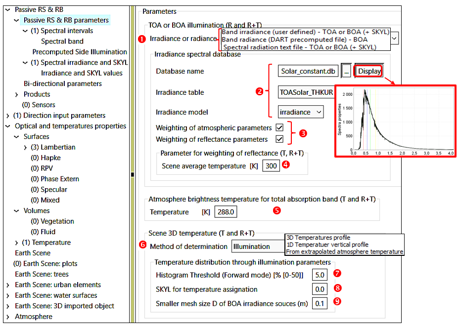

DART parameters and products depend on the DART mode ([See the chapter before](../../3-Editor_of_simulation/editor_of_simulation.md)). Compared to DART-FT and DART-RC, DART-Lux is often more accurate with less computer time (CT) and memory for RS products (VIS/NIR/TIR camera spectrometer, LiDAR, SIF, RB) of large and complex landscapes [here](../../../Tutorials/T0/t0.md#c-lidar-discrete-return-wp0gc-ct-23), but usually needs larger CT for schematic scenes (e.g., horizontal bare ground). For RB products,it is advised only for simulating the RB of parts of the scene.

*The image at the end of the page* shows radiative parameters that are identical in the 'Forward' and 'Bi-directional' sub-modes of 'Passive RS & RB', and also in 'LiDAR' if solar noise is simulated. 

TOA or BOA solar illumination modes ([See the chapter before](../../3-Editor_of_simulation/editor_of_simulation.md)):

- $\bar{E}_{s,TOA,\lambda}$ or $\bar{E}_{s,BOA,\lambda}$: spectral solar constant from an irradiance table of a SQL database `Solar_constant.db` .

- $\bar{E}_{TOA,\Delta \lambda}$ or {$\bar{E}_{BOA,\Delta \lambda}, SKYL_{\Delta \lambda}$}: per band $\Delta \lambda$ (defined in GUI)
*("Solar constant" or "irradiance of horizontal surface")*.

- $\bar{E}_{TOA,\lambda}$ or {$\bar{E}_{BOA,\lambda}, SKYL_{\lambda}$}: per wavelength $\lambda$ (defined by a text file) *("Solar constant" or "irradiance of horizontal surface")*.

- Radiance $L_{BOA, \lambda}(\Omega)$. It can be pre-computed by DART.

Possibility to weight atmosphere parameters (e.g., transmittance) with $E_{TOA}(\lambda)$ and reflectance with $E_{BOA}(\lambda)$.

Scene mean temperature. It is used to determine the equivalent wavelength in mode T (i.e., $L_{B}(\lambda_{eq},T) =\frac {\int_{\Delta \lambda}L_B(\lambda,T).d\lambda} {\Delta \lambda}$)

Atmosphere brightness temperature $T_{atm}$. Only for "modes T and R+T without atmosphere RT".

Scene 3D temperature (modes T & R+T). 4 methods can set scene elements temperature.

a) Illumination.

- *'Forward'* tracking: a preliminary simulation with an user-defined illumination (grid  + SKYL ) computes the irradiance $E_j$ of any element j (facet, turbid), with temperature property $(T_i ,
\Delta T_i)$. Then, $T_j$ is derived from $E_j$ with Boltzmann's law and an histogram threshold () on {$E_j$}.

- *'Bi-directional'*: during the ray tracking stage, the temperature of each interacting point is
derived from its irradiance and its temperature property.

b) 3D temperature profile. A 3D matrix T(x,y,z) (per cell, from top to bottom) is imported.

c) 1D temperature vertical profile. A 1D T(z) temperature file (per layer, from top to bottom) is imported.

d) Extrapolation of the atmosphere temperature vertical profile.

*Identical illumination parameters for 'Passive RS & RT' and 'LiDAR'.*
</img>

