### a) **Ground *surface***

Three types of scenes with a top empty layer (see below):

- <u>*Repetitive scene:*</u> (default): the DEM last line and row are replaced by its 1st line and row. The repetition of a slope is not a slope!
    - DART-FT: infinite repetition of the Earth scene, including its DEM. A ray that exits a scene through a vertical side re-renters it through its opposite vertical side. 
    - DART-Lux: rays propagate in a scene that is ($2.N_{scene \:repetition} + 1$) times the user-defined scene. 
- <u>*Infinite slope*</u>: repetitive + continuous DEM: the last n lines and rows are modified so that last line and row altitudes are those of the scene 1st line and row to a vertical shift $\Delta h_{row}$ or $\Delta h_{line}$. The repetition of a slope is an infinite slope: simple slopes are perfectly simulated. 
    - DART-FT: rays that the scene by a vertical side re-renter by its opposite vertical side with $\frac{\Delta h_{row}}{\Delta h_{line}}$ shift. 
    - DART-Lux: rays propagate in a scene that is ($2.N_{scene \:repetition} + 1$) times the user-defined scene.
- <u>*Isolated scene*</u>: there is nothing around the scene. The DEM is not modified. Rays that exit the scene through a vertical side do not re-renter it ($\implies$ no surrounding elements to induce neighboring effects). In DART-Lux, it corresponds to $N_{scene \:repetition}$ = 0.
!!! note
    The "Infinite slope" and "Repetitive scene" options lead to identical scenes if there is no topography. 

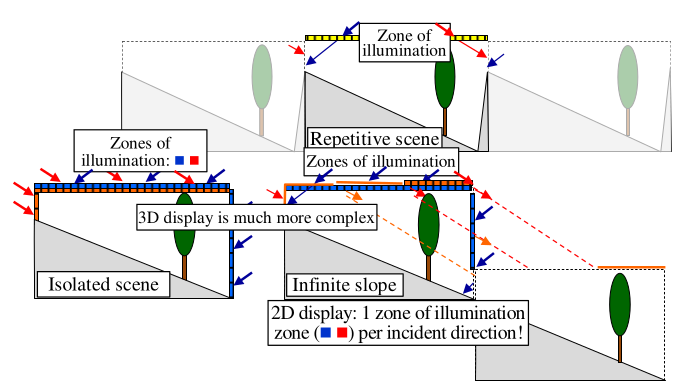
*a) Repetitive scene. b) Isolated scene. c) Infinite slope.*
</img>

The simulated "ground" scene (see below) is also characterized by:

- Sub scene or scene : 3D zone where radiation is tracked. If a sub-scene is simulated, its coordinates are input.

- Scene horizontal dimension : $\Delta X, \Delta Y$.
!!!note
    DART-FT is voxelized with user-defined cell dimensions $\Delta x = \Delta y, \Delta z$.

- Optical and Temperature properties .

- DEM (Digital Elevation Model) : imported 3D object or raster image (with scene dimensions). DART vectorizes the DEM raster image with a few diagonal connection strategies ( "Lowest difference", "Random",…). The *DEMGenerator* module () creates DEM raster images from the scene simulation menu () or menu.

- Coordinates : altitude, latitude, longitude; they are only to compute sun direction angles with the option "date".

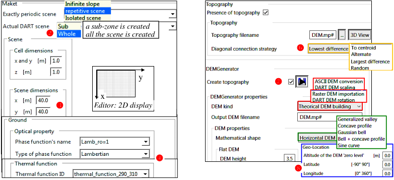
*Earth scene creation. The Editor's 2D display, with its x and y axes, is shown.*
</img>

### b) **Plots**

Plots are surfaces or volumes with a quadrilateral (4 points) horizontal section. "Volume" plots have a height and a bottom side altitude. There are 5 types of plots:

- Ground: a surface (optical properties 2D_...) replaces the local ground zone of the DART scene.
- Vegetation: volume optical property + plot LAI ($m^2$ leaf / $m^2$ plot) or leaf volume density $u_f$ ($m^2$ leaf / $m^3$ cell). It is a turbid medium or set of triangles with optical properties automatically derived from the volume optical property.
- Ground + Vegetation: combination of the 2 above options.
- Fluid: volume with particle optical property (3D_Flu...) + particle density (/$m^3$).
- Water: fluid + surface above it. Option not finalized. It can be created manually with Fluid option.

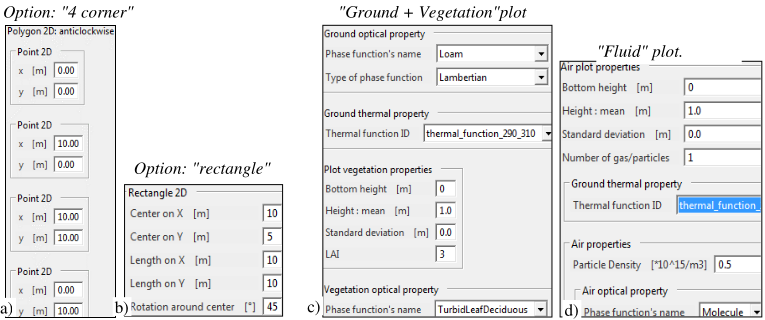
*Plot creation: options "4 corners" (a) and "rectangle" (b). "Ground+ Vegetation" (c) and "Fluid" (d) plots.*
</img>

Three methods to create plots:

- Input in the GUI of plot coordinates and properties (see above): mouse right click on 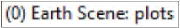
- Import a CoverMap (VII.5):  raster image (pixel value = index of land/fluid unit) +  text file ([here](../../../Format_DART_files/1-All_dart_modes/all_dart_modes.md#17-plots-plotstxt-and-information-file-covermapexampletxt), see below) that gives properties (e.g., optical properties,…) per CoverMap unit. Plots are stored either in the `plots.xml` file or in a `plots.txt` file , which is usually more convenient if there are many plots.
- Import a plots.txt file (, IV.17), see below), that can have been created by the "CoverMapImportation" tool.

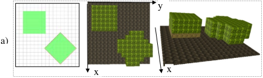
*Plots. a) DART editor: 2 vegetation plots.*
</img>

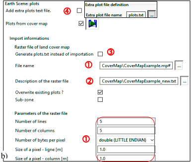
*b) Menu for importing the CoverMap CoverMapExample.mp#*
</img>

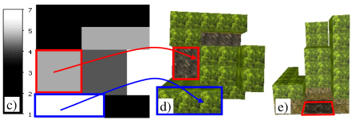
*c), stored in DART database ([here](../../../Format_DART_files/1-All_dart_modes/all_dart_modes.md#17-plots-plotstxt-and-information-file-covermapexampletxt)). d, e) Nadir and oblique view of the 3D scene.*
</img>

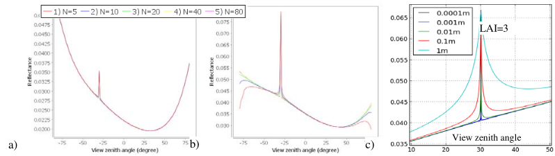
*Plot simulations with N layers (a: LAI =1, b: LAI=7) and 5 leaf dimensions (c). $\theta_s = 30°$*
</img>

### c) **Trees**

A DART created tree is characterized by{Tree species, Trunk + Crown: turbid cells or isocele triangles}:

- ***Tree species***: trees of species $s\in[1\:S]$ share properties (e.g., branches in DART created tree, optical properties, C(s) crown layers ($c\in [0\:C-1]$): see below, leaf / twig area density $u_l$ (s), crown shape and dimensions).
- ***Trunk***: 8 trapezoids (i.e., horizontal section = octagon), below and within the crown.
- ***Crown***: volume (ellipsoid: 0, ellipsoid composed: 1, truncated cone: 3, trapezoid: 4, conique composed: 5).
    - <u>*Crown level*</u> c(s): relative height %h(c(s)) (level height = %h x crown height), relative $u_l$ (%$u_l(c(s))$, relative trunk diameter, leaf and trunk optical properties OP(c(s)), and horizontal profiles of clumping (hole volume proportion h(%r)) and $u_l$ (%$u_l(c(s),%r)$): $u_l(c(s),%r)=%u_l(c(s),%r).u_l)$, with %r the relative distance "trunk - crown local radius" (see below) $\implies$ LAI & clumping vertical/horizontal profiles can be simulated.
!!!note
    The use of relative values is adapted to simulate trees of the same tree species with different dimensions.
- 
    - <u>*Turbid crown*</u>: turbid + empty / hole cells. A turbid cell is created only if leaves occupy > 50% cell volume. It can contain several leaf / twig species with specific LAI / $u_f$ ($m^2$ leaves / $m^3$), TAI (Twig Area Index), LAD,... Then, the leaf occupation of the cell cannot exceed 100%: leaf elements that exceed 100% are stored in other cells.
    - <u>*Triangle crown*</u>: isosceles triangles (heigth =2 .base) that are defined by their area A or number. No twigs.

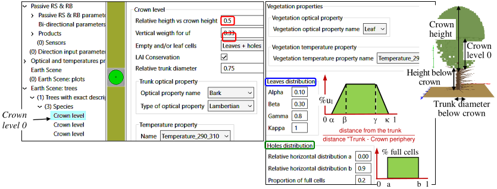
*Crown. Level 0 (bottom): $height = 0.5 x H_{crown}$, vertical relative $u_l = 0.33$, trunk diameter = 0.75 x Diameter of Trunk below crown, horizontal profile of holes and $u_l$.*
</img>

<u>How to specify $u_l$</u>: [www.fs.fed.us/psw/topics/urban_forestry/products/cufr_94_PP01_39.pdf](https://www.fs.fed.us/psw/topics/urban_forestry/products/cufr_94_PP01_39.pdf). For example: $u_l \approx 0.5m^{-1}$ (no dense tree) if tree DBH=0.4m, crown heigh = 8m, crown diameter $\approx 12m$, leaf area $\approx 300m^2$.

Three methods allow one to specify the spatial distribution, dimensions and tree species of trees:

1. <u>*Exact location + Exact dimensions.*</u>  
Text file (e.g., trees.txt in DART database) with labelled columns: Species_ID for tree species, POS_X & POS_Y for location, lai for tree leaf area or leaf area density per tree, rotation per tree (see below),… Option 2) can use it.  

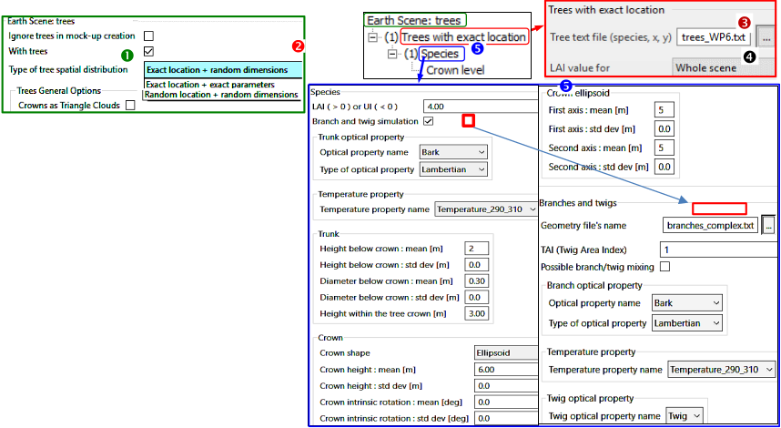
*Tree menu: mode. Tree presence , Mode "Exact position + Random dimensions"  with file that stores tree location  and zone where LAI is known , Tree crown content .*
</img>

2. <u>*Exact location + Random dimensions.*</u>  
Only labels "Species_ID, POS_X, POS_Y" of file 1) are used. The GUI sets other parameters (mean, $\sigma$: see below).  

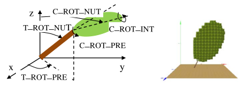
*Tree trunk and crown rotations (nutation, precession, intrinsic).*
</img>

3. <u>*Random location + Random dimensions.*</u>  
Per species, trees are randomy set in disks (radius r), with probability of presence, centred on the nodes of a $\Delta x/\Delta y$ grid over the scene (grid option), quadrilateral (zone option) or ellipse (fctdistribution option) (see below).

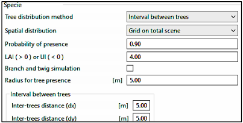
*Tree menu: option "Random position + Random dimensions. Trees are located inside disks (5m radius) centred at the nodes of a grid defined by $\Delta x=\Delta y=5m$.*
</img>

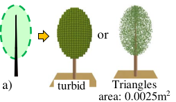
*Tree crown shapes. a) Ellipsoidal.*
</img>

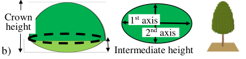
*Tree crown shapes b) Ellipsoid composed.*
</img>

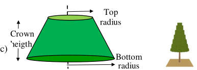
*Tree crown shapes c)Truncated cone.*
</img>

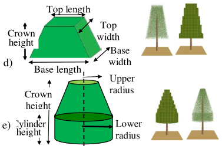
*Tree crown shapes d) Trapezoid. e) Conique composed (cylinder + truncated cone).*
</img>

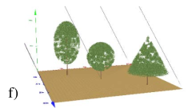
*Tree crown shapes f) Tree crowns with 2 levels and LAI / hole vertical profiles.*
</img>

### d) **Urban**

Urban surfaces (roof,...) can be "Single face" or "Double faces" (surface = 2 triangles with opposite normal vectors and specific optical properties). Houses in the same building can have the same properties (see below).

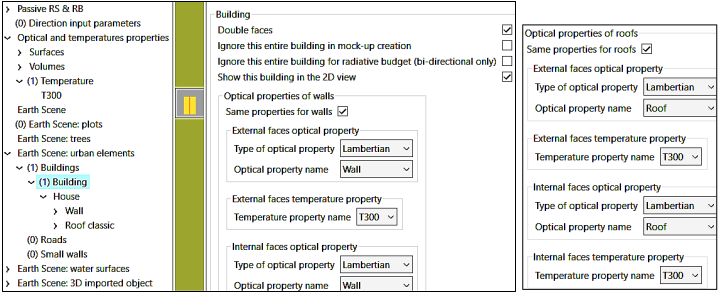
*Optical properties of a building with 1 house.*
</img>

House = 4 walls (4 top corners (x, y, z); 2 corners can be identical) + 1 roof with 4 predefined types (see below):

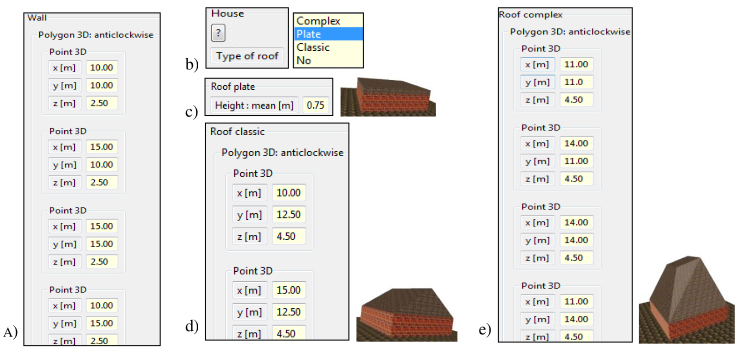
*House geometric parameters. a) Walls: 4 points (x,y,z). b) Roof type. c) "No roof": roof with null thickness (2 triangles). c) "Plate roof": roof with a depth. d) "Classic roof" (2 points): 2 slopes. e) "Complex roof" (4 points).*
</img>

- "No": there is a roof with a null depth. It is defined by the wall top corners.
- "Plate": the roof is defined by 4 points at a height $\Delta z$ above the 4 wall top corners
- "Classic": the roof is defined by 2 points (x, y, z).
- "Complex": the roof is defined by 4 points (x, y, z).

Elements other than houses can be created: roads (see below) and small walls.

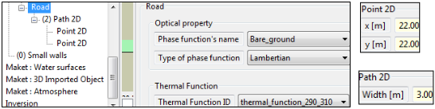
*Road: juxtaposition of segments that are defined by their width and extremities.*
</img>

### e) **Water surfaces**

Water volumes can be simulated (e.g., fluid plot + top specular/refractive surface). Water surfaces are opaque (see below) with possible priority on trees and vegetation plots (e.g., mangrove forests).Their horizontal projection is:

- Lake: ellipse defined by its center and its two axes along the Ox and Oy axes.
- River: specific width + segments between successive points (x,y).

!!! note
    To simulate within water RT, define water plots.

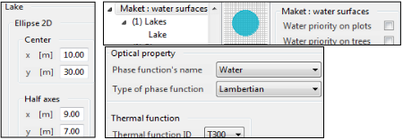
*Water surfaces.*
</img>

### f) **3D imported object**

DART imports 3D objects (set of groups of triangles) in obj format; cf examples in DART database (see below). It cannot edit it, but can manage its geometry (location, scale, rotation) and OP per group of triangles. Blender can edit them (export option for DART: Apply, modifiers, Write materials, Triangulate faces, Material groups, Z forward, Yup).

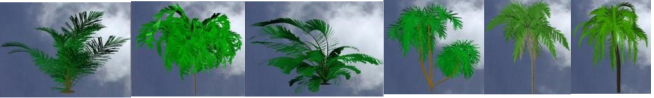
*Examples of 3D trees.*
</img>

1) <u>*Example of importation*</u>: *cherry tree* (`Merisier_adulte.obj`; in DART database)

A 3D object can be defined as a "DEM", "on top of a DEM" or "Independent of DEM", with options per group 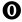:

- Scene symmetry: a 3D object that exits partly the scene can appear on the scene opposite side ().
- Ignore/Hide the 3D object when creating the scene. Option available per group of 3D object (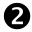).
- Color of the disk that represents the 3D object in the editor ().
- Transformation of all triangles of the 3D object into turbid medium (); it can be performed per group. The resulting LAI can be directly computed or specified by the user.
- Assign the same optical properties to all triangles of the 3D object ().
- "Mono face" or "Double face" (surface = 2 equal triangles with opposite normal, and possibly different OPs .

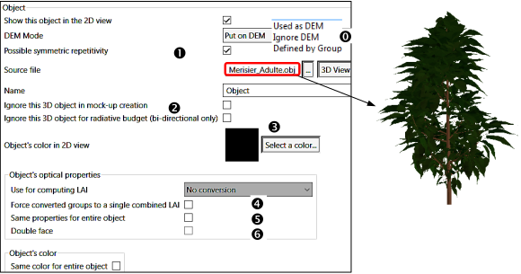
*Import and display of a 3D object.*
</img>

2) <u>*Colors*</u>: they qare very useful for setting the material of facets in the same group of the 3D object (cf. input/dart.typ), and also to get nice 3D views (e.g., color 'Bark' for group 'Trunk' see below) 

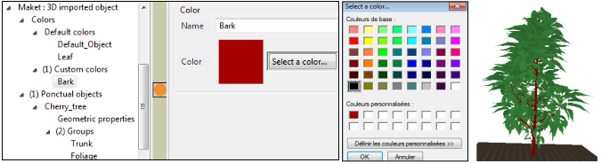
*Management of colors for displaying the 3D objects in the main GUI.*
</img>

3) <u>*Geometry*</u>: 3D object position (x, y, z), scale factor (x, y, z) and rotation (3 angles) can be specified.

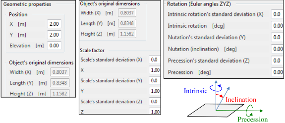
*Management of the geometry of 3D objects.*
</img>

Rotations are relative to the point (0,0,0). Hence, results can differ a lot depending on the 3D object coordinates. The maket module must be run after setting thegeometry of 3D objects.

4) <u>*Group properties*</u>  
Facet properties (e.g., facets with single or double face option) are identical for all groups of the 3D object or defined per group of the object. The "display" option shows the 3D object. A click on the group (e.g., "Foliage " and "Trunk" in see below) displays only the triangles of that group. It allows one to verify that one treats the correct group. The transformation "Triangles → Turbid medium" can be done for the whole 3D object or part of its groups.

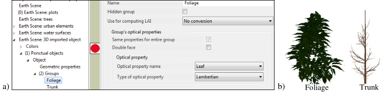
*Management of the geometry of 3D objects. a) Menu. b) Display per user selected group.*
</img>

5) <u>*Transformation of triangles into turbid medium*</u>  
It can be useful to convert a 3D object with many facets as a volume of cells filled with turbid medium, each with:

- $A_{cell}$ : automatically computed value per cell that is the area $A_{f,cell}$ of facets per cell with a multiplicative factor (default value is 1), or a user-defined LAI value for the derived turbid vegetation, or a user-defined leaf area (m²).
- $LAD_{cell}$: $LAD$ (e.g., spherical) for all cells or $LAD$ per cell {$N$ areas $A_{cell}^n$ (SimulationProperties: $\sum_{n=1}^N A_{cell}^n = A_{f,cell}$) + $N$ elliptical $LADs$ $g_n(θ_1)=\frac {f(\epsilon,ALA_n)} {\sqrt{1-\epsilon².cos(θ_1-ALA_n)}}$, Average Leaf Angle $ALA_n \approx \frac {(2n-1).\pi} {4.N}$, eccentricity $\epsilon_n = 1-e^{1-N}$.

- Optical property (3D_Veg_...): it is user-specified as a volume optical property (i.e., turbid medium). 

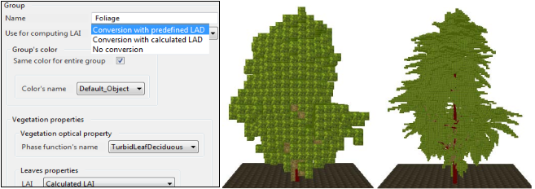
*Transforming a group of triangles into turbid medium with 1m and 0.2m resolutions.*
</img>

6) <u>*Fields of 3D objects*</u>  
DART creates fields of 3D objects (see below) using a text file that gives each object location ([here](../../../Format_DART_files/1-All_dart_modes/all_dart_modes.md#19-3d-object-obj-and-mtl-files-and-object-field)) and possibly each object specific geometric transformation ([here](../../../Format_DART_files/1-All_dart_modes/all_dart_modes.md#19-3d-object-obj-and-mtl-files-and-object-field)).

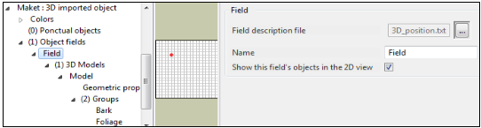
*Specification of a field of 3D objects.*
</img>

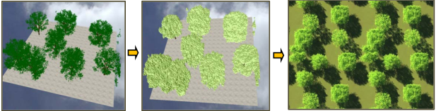
*Example of transformation "Triangle to Turbid"*
</img>

### g) **DAO**

The document `DAO_documentation.pdf` (`…\DART\bin\python_script\DAO`) presents the Python API that allows one to modify or create from scratch a DART scene. In order to run it with DART, one is advised to create all other information (i.e., discrete directions, optical properties, atmosphere) with DART.