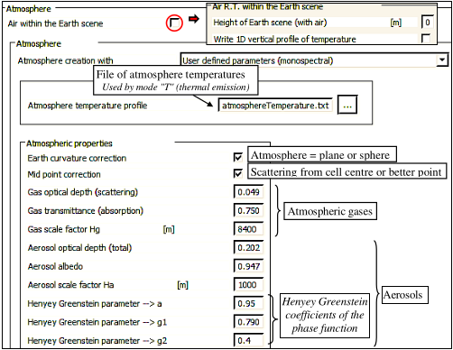
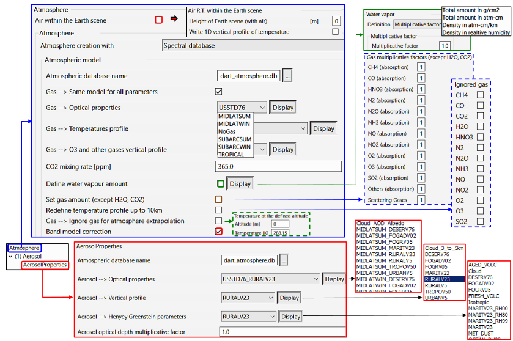
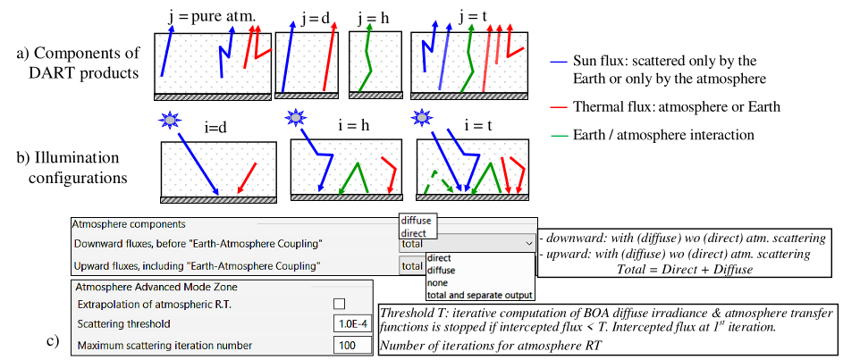
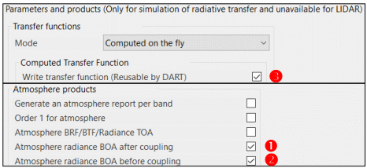
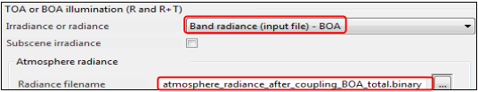
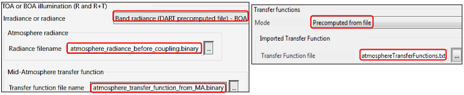
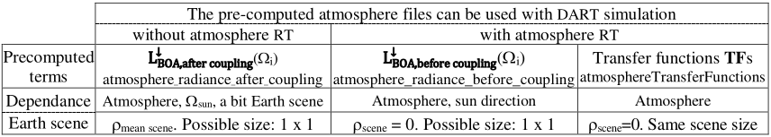
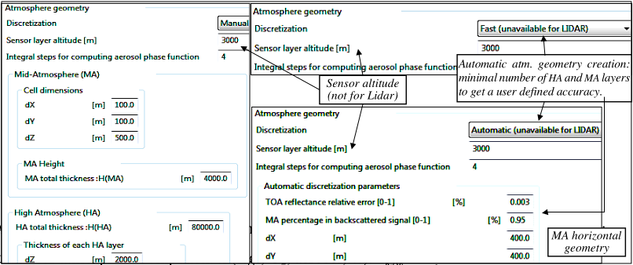

### 1) **Atmosphere geometric and optical properties**

The phase module computes gas, aerosol and cloud scattering transfer functions T({$\Omega_i ,\Delta \Omega_i$}→{$\Omega_j ,\Delta \Omega_j$}), as integrals on $\Delta \Omega_i$ and $\Delta \Omega_j$. The Earth scene can contain air as plots of fluid or extrapolation of all or part of atmosphere gases. The atmosphere can be simulated without or with an atmosphere database.

- **Atmosphere without database: single band**

Parameters: gas/aerosol geometry (exponential scale height $H_{gas}, H_{aerosol}$), OPs (optical depth, scattering phase function).

- **Atmosphere with database (cf. IV.12):spectral**
    - <u>*Gases*</u>: spectral transmittance (TRANS) of absorbing and scattering gases and gas density profile (DENS). 6 models: 'Mid-latitude summer + winter', 'Sub-Arctic summer + winter', 'Tropical', 'US standard 1976'. $H_2O$ transmittance $T_{H_2O}$ (table gas_model_g$H_2O$): for N $H_2O$ contents (default value x 0.1 n; $n \in [1\:;\:N]$).
    - <u>*Aerosols*</u>: extinction coefficient vertical profile (ECP), spectral optical depth $\Delta \tau(\lambda)$ & single scattering albedo $\omega(\lambda)$ (gas_model_AOD) and coefficients (g1, g2, a) of 2 Henyey Greenstein scattering phase functions (HG). The term “gas_model” indicates 1 of the 6 gas models.

ECP: 8 aerosol models - `Rural V=23km & V=5km`, `Maritime V=23km`, `Urban V=5km`, `Troposphere V=50km`, `Fog radiation V=0.5km`, `Fog advective V=0.2km`, `Desert V=76km`; V = visibility. gas_model_AOD: 48 models (i.e., the above 8 aerosol models for each of the 6 gas models). HG: 26 models - `Rural`, `Maritime`, `Urban`, `Ocean` and `Troposphere V=50km` for 4 relative humidities (RH: 0, 70, 80, 99%) + 6 models independent of humidity: `Fog radiation V=0.5km`, `Fog advective V=0.2km`, `Desert V=76km`, `STRT H2SO4`, `Aged Volcanic` and `MET_Dust`. 

There is also a "Cloud" model with spectrally constant ECP and scattering albedo.

Two approaches allow one to simulate actual atmosphere conditions, for any $\Delta \lambda_{user}$:

1. Import new data (Aeronet: [aeronet.gsfc.nasa.gov/](https://aeronet.gsfc.nasa.gov/), ECMWF: [www.ecmwf.int/](https://www.ecmwf.int/),...) into atmosphere database.

2. Automatic weighting / interpolation of the atmosphere database, using options that directly modify:
    - Gas (scattering, absorbing other than $H_2O$ / $CO_2$) amount: multiplicative factor on default gas profile.
    - $H_2O$ content, defined either as total amount, density or multiplicative factor on default $H_2O$ profile. Atmosphere transmittance $T_{H_2O}\:\forall\: \Delta \lambda_{use}$ is derived from interpolation on tables of gas_model_g$H_2O$.
    - CO2 concentration: mixing rate (ppm).
    - Aerosol optical depth: factor $K_{aer} \implies \Delta \tau_{aer}(\lambda) = K_{aer}.\Delta \tau_{aer,database}(\lambda)$ ($\Delta \tau_{rural,V10}=0.301, \Delta \tau_{rural,V23}=0.554$)
    - Temperature profile up to 10km: one sets $T_0$ for $z' \implies T_{atm}(z) \rightarrow T_{atm}(z) + (T_0 - T_{atm}(z'))$,  $\forall z < 10km$.
    
    
<u>*Band model correction*</u>. Since Beer law is inaccurate in gas absorption bands $\Delta \lambda$, we use $T_{atm}^{\uparrow}(\lambda, \Delta \lambda) = \frac {T_{atm}^{\downarrow \uparrow}(\lambda, \Delta \lambda)} {T_{atm}^{\downarrow}(\lambda, \Delta \lambda)}$ in modes R and R+T if $\lambda > 3 \mu m$, $T_{atm}^{\downarrow \uparrow}(\lambda, \Delta \lambda) = [T_{atm}^{\downarrow}(\lambda, \Delta \lambda)]^2$.

$T_{atm}^{\downarrow \uparrow}(\lambda, \Delta \lambda)$ is corrected if water vapor load differs from its default value in the atmosphere database:

$T_{gas,abs}^{\uparrow \downarrow} = T_{gas,abs, database}^{\uparrow \downarrow}.\frac {T_{H_20}^2} {T_{H_20,database}^2}$ and $T_{H_20}=$ linear interpolation on $T_{H_20,database}$ in database `*_gH20`.

*The Atmosphere menu "without database"; only with user-defined parameters.*
</img>

*The Atmosphere menu with the database.*
</img>

*Selection of components of DART products (reflectance $\rho$, radiance L, irradiance E, exitance M, albedo A images) at Sensor level for 3 illumination configurations.*

- a) *Upward products "j": None ($L_{TOA}^{\uparrow}$), pure atmosphere, Direct (d), Diffuse (h), Total (t).*
- b) *3 illumination configurations: Direct (d), Diffuse (h) and Total (t).*
- c) *Menu for selecting the different products and illumination configurations.*
</img>

- ** Pre-computation of atmosphere optical properties** 

$\rho_{TOA}(\Omega_v)$ and radiance $L_{TOA}(\Omega_v)$ of Earth surfaces depend on their reflectance $\rho_{BOA,Earth}(\Omega_i,\Omega_j)$, with $(\Omega_i\in 2\pi^{-}, \Omega_j \in 2\pi^{+})$, direct sun irradiance $E_{BOA,sun}(\Omega_s)$ and atmosphere directional radiance $L_{atm}^{\downarrow}(\Omega_i)$ that depend on wavelength and atmosphere conditions. $L_{atm}^{\downarrow}(\Omega_i)$ is often assumed to be isotropic and quantified by $SKYL(\lambda) = \frac {Atmosphere\:irradiance} {Total\:irradiance}$.

Atmosphere RT is computer intensive, especially with many bands. Therefore, if many simulations are run with the same atmosphere and sun direction, DART should pre-compute $L_{BOA}^{\downarrow}(\Omega_i)$ and transfer functions (TF) that represent radiation transfer "$BOA \rightarrow MA$" (i.e., $TF_{BOA \rightarrow XXX}, TF_{MA \rightarrow XXX}$) to a few levels xxx, in order to later simulate $L_{TOA}(\Omega_v)$ from $L_{BOA}(\Omega_j)$, with $\Omega_j \in 2\pi^{+}$. TFs depend only on {atmosphere, spectral bands}, and not on sun direction and Earth surface properties, conversely to $L_{BOA}^{\downarrow}(\Omega_i)$ and $L_a(\Omega_v)$. They must be computed for the scene dimensions, spectral bands and discrete directions (within canopy cameras can be any) of the DART simulation of interest. Cell dimensions must be identical if MA layers have several cells. TFs cannot be used by DART atmosphere Monte Carlo RT.

DART pre-computes $L_{BOA}^{\downarrow}(\Omega_i)$ and TFs with {atmosphere RT + options , , : see below}. It stores them as 4 files:

- $L_{BOA,after\:coupling}^{\downarrow}(\Omega_i)$ : function of {atmosphere, $\Omega_{sun}$, N bands}. It can be simulated with {1 ground cell scene, $\rho_{ground} \approx <\rho_{scene}>_{xy}$} to reduce computer time. DART will use it to get BOA products without atmosphere RT simulation.
- $L_{BOA,before\:coupling}^{\downarrow}(\Omega_i)$ : function of {atmosphere, $\Omega_{sun}$, N bands}. DART will use it with atmosphere RT simulation.}
- TFs : 2 files ($TF_{BOA \rightarrow XX}, TF_{MA \rightarrow XX}$): they do not depend on sun direction. They can be simulated with {flat scene, $\rho_{ground} = 0$}. DART will use them with atmosphere RT.

*Pre-computation of:*

-  $L_{BOA,after\:coupling}^{\downarrow}(\Omega_i)$,
-  $L_{BOA,before\:coupling}^{\downarrow}(\Omega_i)$,
-  TFs
</img>

***a) Use of the pre-computed atmosphere radiance  $L_{BOA}^{\downarrow}(\Omega_i)= L_{BOA,after\:coupling}(\Omega_i)$***  
<u>*Step 1*</u>: Pre-compute M radiance files {$L_{BOA}^{\downarrow}(\Omega_i)$}$_m$ for the M configurations {atmosphere, $\Omega_{sun}$, N bands} of interest.

<u>*Step 2*</u>: Run DART with {No atmosphere RT, $L_{BOA}^{\downarrow}(\Omega_i)$}. $L_{BOA, backscattered}^{\downarrow}(\Omega)$. Being a ratio, $\rho_{BOA}(\Omega)=\frac {\pi.L_{BOA}^{\uparrow}(\Omega)} {\int_{2\pi^{-}} L_{BOA}^{\downarrow}(\Omega).cos(\theta_i).d\Omega_i}$ is more accurate than $L_{BOA}^{\uparrow}(\Omega)$ because $L_{BOA,backscattered}^{\downarrow}(\Omega)$ can be inaccurate if $L_{BOA}^{\downarrow}(\Omega_i)$ is not pre-computed with a the studied scene.

*Use of $L_{BOA,after\:coupling}^{\downarrow}(\Omega_i).$ $TF_{MA \rightarrow XX}$ and $TF_{BOA \rightarrow XX}$ are not used*
</img>

***b) Use of the pre-computed atmosphere transfer functions and radiance $L_{BOA}^{\downarrow}(\Omega)= L_{BOA,before\:coupling}^{\downarrow}(\Omega)$***

<u>*Step 1</u>*: Pre-compute $L_{BOA,before\:coupling}^{\downarrow}(\Omega_i)$ and TFs ($TF_{BOA \rightarrow XXX}, TF_{MA \rightarrow XXX}$). A 1x1 scene can be used.

<u>*Step 2*</u>: Run DART with {atmosphere RT, pre-computed TFs and $L_{BOA,before\:coupling}^{\downarrow}(\Omega_i)$} and any surface parameters. Results are those of DART simulations with full atmosphere RT, with much shorter computer time. Slight 
differences can appear if mean reflectance values are computed after being weighted by sun irradiance.

*Use of $L_{BOA,before\:coupling}^{\downarrow}(\Omega_i)$, $TF_{MA \rightarrow XX}$ and $TF_{BOA \rightarrow XX}$*
</img>

*Step 1: pre-computation of atmosphere radiance $L_{BOA}^{\downarrow}(\Omega)$ and transfer functions TFs.*
</img>

- **Atmosphere geometry**

It has 3 levels: Earth scene (BOA), mid atmosphere MA (cell array with $N_{layer,MA}$ levels) $\subset [BOA\:altitude\:h_{MA,HA}]$ and high atmosphere HA ($N_{layer,HA}$ layers) above MA. Its parameters $N_{layer,MA}, N_{layer,HA}$ and $h_{MA,HA}$ are input or automatically
computed. They can greatly affect the accuracy of DART products at BOA, TOA and any sensor height $h_{sensor}$.

- **Automatic**: $h_{MA,HA} \Leftrightarrow$ Backscattered BOA irradiance = x% . Backscattered atmosphere irradiance. ($N_{layer,HA},N_{layer,MA}$) $\Leftrightarrow$ relative error on $1^{st}$ order TOA upward and BOA downward irradiance $< \epsilon$ for the band with larger $\Delta \tau_{atm}$. One sets: $x, \epsilon$ and MA cell size $(\Delta x, \Delta y)$. On-going upgrade to consider temperature and extinction coefficient profiles.
- **Fast**: automatic mode with {x = 0.95, $\epsilon$ = 0.02, ($\Delta x, \Delta y$) = scene dimensions}. Usually, it is faster.
- **Manual**: one sets $h_{MA,HA}$, $(\Delta x, \Delta y, \Delta z$) in MA and $\Delta z$ in HA. In a sequence, manual mode is advised if atmosphere geometry (e.g., number of atmosphere layers) must be constant.

*The atmosphere menu 'Geometry'.*
</img>

Sun TOA and BOA irradiance can be used to get band atmosphere transmittance and material optical properties:

- **Atmosphere unit conversion** (Shunlin Liang, Quantitative Remote Sensing of Land Surfaces p. 225, etc)

!!! note
    Gas cst R = 8.3144621 J/K/Mol, $k = \frac {R} {N_A}=1.38 10^{-23}$ J/K, Avogadro number $N_A= 6.022*10^{23} mol./Mole$. STP (standard T: 0°C, P:1atm)

Uncondensed gas: 1 atm cm $\equiv \frac {Molar\:mass\:M} {Volume_{Mole}:22.4\: 10^3\:cm^3}\:g/cm^2 \equiv \frac {N_A} {22.4\: 10^3\:cm^3}=2.69 \:10^{19}\:mol./cm^2$.

<u>*Water vapor*</u> ($M_{H_2O} \approx 18g$): 1 cm $H_2O$ precipitable = 1 $g/cm^2$ liquid $H_2O=\frac {N_A} {M_{H_20}} mol/cm^2 = 3.34\:10^{22}\:mol/cm^2$.

At STP: 1 atm cm $\equiv \frac {M_{H_2O}} {22.4\: 10^3 cm^3} \approx 0.804g/cm^2 \Leftrightarrow 1g\:H_2O/cm^2 \equiv 1.244\:10^3\:atm\:cm$.

$P_{saturation}P_{H_2O}^{*} \approx 611.2e^{\frac {17.62(T-273.15)} {T-29.97}}\:Pa$. Relative humidity $RH=\frac {P_{H_2O}} {P_{H_2O}^{*}} \in [0\:1]$. $T_{dew\:point} = \frac {c.[ln(\frac {RH} {100}) + \frac {b.T} {c + T}]} {b - [ln(\frac {RH} {100}) + \frac {b.T} {c + T}]}$, b=18.678, c=257.14 °C

Ideal gas law $\implies$ Vapor density: $\frac {P_{H_2O}} {R.T}$ Mole/$m^3$ = $\frac {P_{H_2O}} {k.T}$ mol/$m^3$=$\frac {216.67.P_{H_2O}} {T}\:g/m^3.\int_{\Delta z} g/cm^3 \implies X\:g_{H_2O}/cm^2 \implies 1.244\:10^3X\:atm\:cm$.

!!! note
    Gas profile unit in DART file `atmosphere.txt`: atm cm/km ($N_2$: $g/cm^2km$).
