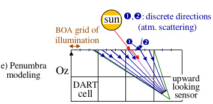

DART-FT (flux tracking) iteratively tracks rays on N discrete directions in a voxelized scene. (see below) 

*Major steps of DART-FT*
</img>

### a) **Parameters of the Forward light mode**
- ***Expert parameters***

*Advanced parameters of the 'Forward' light mode of 'Passive RS & RB' (DART-FT).*
</img>

    - Number of threads: computation time is divided by up to the number of cores of the calculator.
    - $Threshold_{propagation}$ k: ray $W(\Omega_n, \Delta \Omega_n)$ with energy $< k.\Delta \Omega$ . Mean intensity (W/sr) at iteration 1 & 2 is stopped.
    - $Threshold_{Albedo\: /\: Thermal\:exitance}$: test on 2 last iterations for stopping the simulation.
    - Maximum number that a ray can cross the scene. Default value is 1000.
    - BOA illumination smaller mesh size $D \implies \eta= \frac {\Delta x.\Delta y} {D^2.(N_{sun}+N_{atm})}$ incident rays per BOA cell ($N_{atm}=0$ if  SKLY = 0, $N_{sun} =0$, if SKYL=1). $D_{sun} =Max(D,\frac {D} {\sqrt{1 - SKYL}})$, $D_{atm}=Max(D,\sqrt{\frac {N_{horiz}^{atm\downarrow}} {SKYL}})$. SKYL=$\frac {E_{atm}} {E_{total}}$ with $N_{horiz}^{atm\downarrow}$ downward DART directions ($\Delta \Omega_{in}=2\pi^{-}$).
    $\eta$ must be $\geq 10^2$ for avoiding stripes and mis-calculation of temperature in the Earth scene. Vertical side of scene 'isolated / infinite slope': $E_{sun,vert} = E_{sun,boa}.tan(\theta_s)$, with $N_{vert}^{atm\downarrow}$ directions ($\Delta \Omega_{in}=\pi^{-}) \implies D_{sun,vert}=Max(D,\frac {D} {(1-SKYL).tan(\theta_s)}$), $E_{atm, vert} = E_{atm}.\frac {\sum_{N_{vert}^{atm\downarrow}}cos(\theta .\Delta \Omega)} {\pi} \approx \frac {E_{atm}} {2} \implies D_{atm, vert} = D_{atm}.\sqrt{\frac {\pi.N_{vert}^{atm\downarrow}} {N_{horiz}^{atm\downarrow}.\sum_{N_{vert}^{atm\downarrow}}cos(\theta .\Delta \Omega)}} \approx D_{atm}$
    - Illumination sources spatial distribution. Default distribution is 'semi random'.
    - Factor $N \implies N^3$ sub-cells ($\implies$ barycenters of scattering points per sub-cell) and $6N^2$ sub-faces ($\implies$ barycenters of exit points per sub-face) per cell. N is divided per 2 at each iteration down to 1.
    - Factor $M \implies N^2$ . $M^2$ sub-faces per cell face ($\implies$ barycenter per sub-face)
    - Surfacic sub-division S for thermal emission: at least 1 thermal emission per grid element.
    - $K^2$ integration points per sub-face for pre-computing thermal emission.
    - Store intercepted power per direction: set for computing polarization on surfaces
    - Use of barycenters on intercepting surface and sub-face: their use greatly decreases simulation time.
    - Use sparse voxel acceleration: rays are not tracked through empty voxels.
    - Number of triangles for acceleration in a voxel: Embree is used only in voxels with larger number of triangles
    - Triangle storage method: facet 3D objects in the scene can be a clone of a reference 3D facet object.
    - Use sparse voxel acceleration: acceleration technique in "empty" volumes.
    - Minimum number of triangles inside a voxel in order to use the Embree acceleration technique.

- ***Maximal scattering order*** $N_{max}$ *(See below)*: maximal $N_{iteration}$ for scenes only made of facets. Any scene radiative term Y (i.e., RB, $L(\Omega)$,…) is extrapolated to $Y_{\infty}$ with last iteration $Y_{n}$ (cf. DART Handbook): $Y_{\infty} = Y_n+\alpha_n.\frac {e^{-\beta_n.(n+1)}} {1-e^{-\beta_n}}$, assuming $\Delta Y_n = Y_n - Y_{n-1} \approx \alpha_n.e^{-\beta_n.n}$

*DART-FT: maximal scattering order*
</img>

!!! Note
    Advised $N_{max}$ for vegetation: 3-4 in VIS, >5 in NIR, 2 in TIR (Cao et al., 2018, TGRS; Guo, Cao et al., 2019, GRSL)

- ***Cell dimensions*** *(See below)*: They set the pixel size of DART-FT images and the voxel size of RB products of DART-FT and DART-Lux.

*Cell dimensions*
</img>

### b) **Radiative budget (RB)**

RB products (; see the image below) are fluxes (i.e., thermal emission, intercepted, scattered, absorbed, exitance, SIF) in/out actual or fictive surfaces / volumes (e.g.,cell side). They are 3D RB per facet (+ derived 2D / 1D / scalar data), total and per type u of scene element. For DART created facet and turbid elements, u is predefined [Here](../../../Format_DART_files/2-DART_FT/dart_ft.md#makettxt)(*e.g.*, $u_{ground}=2$). For imported 3D objects, $u_{facet} = 100 + material$ (i.e., color assigneed to the group of the 3D object)and is  stored in the file `input/dart.typ`. The RB products are stored in text / binary files or NetCDF (on-going) files in "output\BANDn\RADIATIVE_BUDGET". The option "View / Report" reads binary RB files.

!!! Note
    DART-FT: RB can be per stage. Illudir: direct sun; Illudif: direct sun + sky; Iter1,..., IterX (infinite extrapolation of mean 3D/1D RB data of last stages) and Coupl if atmosphere RT. Intermediate Iter_n are present if requested. Power intercepted at iteration n-1 is scattered and absorbed at iteration n:  $Int^{Iter n-1} = Abs^{Iter n} + Scat^{Iter n}$. Therefore: $\xi_{cell,scat,u}^{ijk}=\xi_{cell,abs,u}^{ijk}=\xi_{cell,scat}^{ijk}=\xi_{cell,abs}^{ijk}$ =0 at Illudir and Illudif, and $Int^{IterX}$ is slightly larger than $Abs^{IterX}+ Scat^{IterX}$.

!!! Note
    The terms "Intercepted" and "Scattered" can be difficult to interpretate, conversely to "Absorbed". For example, "Intercepted" can be larger than scene irradiance if a facet intercepts several times the same photons.

- 3D RB:
    - $RB_{cell}: RB_{all elements in cell ijk}$. File *RadiativeBudget3D* . Up to 18 terms {$\xi_{cell, \alpha}^{ijk} :\alpha$=in, out, int, abs, scat, emit;$\xi_{face,\beta}^{ijk} = \sum_{face} \xi_{face,\beta}^{ijk} : \beta=in,out$}: $\xi =$ power $W$ density or $\frac {W_{cell,\alpha} or W_{face,\alpha}} {scene \: irradiance}$ that enters/ exits a cell or cell face.

    - $RB_{cell,u}$: $RB_{elements-of-type-u-in-cell}$. File RadiativeBudget_3D_ Turbid for 'turbid', *RadiativeBudget_3D_ Ground* for 'ground' and *RadiativeBudget_3D_typeNum=u* for other types. Up to 4 terms: $\xi_{cell,\alpha,u}^{ijk} (\alpha$: int, abs, scat, emit)

!!! warning
    
    With option *'Use sparse voxel acceleration'*: empty cells are ignored  $\implies$ in / out fluxes on their faces are null.
    
- Power intercepted at iteration n-1 is scattered and absorbed at iteration n:
!!! Note
    RB unit: % of BOA irradiance, $W/m^2/\mu m$ or $W/\mu m$. It is $W/m^2$ or W only for {mode T (i.e., sources are only "thermal") + "Boltzmann" option (i.e., thermal radiation = integral over the spectrum)}. *A Radiative budget tool* can convert the unit of RB products. RB expressions vary with their 3D/2D/1D/scalar nature and unit:

    - $W/m^2/\mu m$ ($W/m^2$: mode T + Boltzmann): $\xi_{cell, \alpha}^{ijk} = \frac {W_{cell,\alpha}} {\Delta x.\Delta y}$, $\xi_{cell,\alpha,u}=\frac {W_{cell,\alpha,u}} {\Delta x.\Delta y}$, $\xi_{face,\beta}=\frac {W_{face,\beta}} {\Delta x.\Delta y}$. This is per scene $m^2$.

    - %:$\xi_{cell, \alpha}^{ijk} = \frac {W_{cell, \alpha}} {W_{\Delta x.\Delta y}^{BOA}}$, $\xi_{cell, \alpha, u}^{ijk} = \frac {W_{cell, \alpha, u}} {W_{\Delta x.\Delta y}^{BOA}}$, $\xi_{face, \beta}^{ijk} = \frac {W_{face, \beta}} {W_{\Delta x.\Delta y}^{BOA}}$, $W_{\Delta x.\Delta y}^{BOA} = BOA$ incident power ($W_{\Delta x.\Delta y}^{BOA, coupl}$ if atmosphere RT) on $\Delta x.\Delta y$.
    - If {Unit = %, No atm. coupling, 'Repetitive scene' mode}: $\xi_{face,in}^{ijk_{max}}$ (+Z) = 1-SKYL in Illudir and later.
!!! note
    The tool "3D radiative budget extractor" it used $RB_{cell}$ 2D (i.e., scene xy, xz, yz section) and x,y,z 1D RBs from $\forall x,y,z$.

!!! warning
    
    "Infinite slope" mode: $\frac {\sum_{i,j} \xi_{face, out}^{ijk_{max}}(+z)} {\sum_{i,j} \xi_{face, in}^{ijk_{max}}(+z)} \neq$ Albedo, conversely to "Repetitive scene" mode, since scene exitance  involves upward rays  that exit the scene through its vertical sides.

    *RS & RB products:* 
    - *Remote sensing (RS) products: BRF (reflectance) / BTF (temperature).*
    - *Radiative budget (RB) products with indication of the folders and files that store them.*
    - *RB and RS options: '1st scattering order (DART-FT only)' used with 'Images only' is very fast because DART only simulates "1st order scattering for the user specified viewing directions".*

- 2D: $RB_{image} \xi_{\alpha}^{ij} = \sum_k \xi_{cell,\alpha}^{ijk}$ and $\xi_{u,\alpha}^{ij} = \sum_k \xi_{cell,u,\alpha}$. File `simulation.properties.txt` stores $\bar{\xi}_{\alpha}^{ij}$ and $\bar{\xi}_{u,\alpha}^{ij}$ . $Albedo^{ij} =1 - \frac {\xi_{abs}^{ij}} {W_{\Delta x \Delta y}^{BOA}}$

- 1D:
    - RadiativeBudget_profile: $\bar{\xi}_{\alpha}(k)=\frac {\sum_{ij}\xi_{cell,\alpha}^{ijk} \: \forall\:cells\:of\:scene\:layer\:k} {Number\:of\:cells\:per\:scene\:layer}$
    - RadiativeBudget_profile = u: $\bar{\xi}_{\alpha,u}(k)=\frac {\sum_{ij}\xi_{cell,u, \alpha}^{ijk} \: \forall\:cells\:of\:scene\:layer\:k} {Number\:of\:cells\:per\:scene\:layer}$ If unit is %: $\sum_u \sum_k \bar{\xi}_{int,u}(k)=\sum_k \bar{\xi}_{int}(k)=1$

- $RB_u$ per type u *(RadiativeBudget Triangle)*: unit %: $\frac {power\:density\:for\:u\:relative} {BOA\:irradiance}=\frac {\sum_{ij}\xi_{u,\alpha}^{ij}} {\sum_{ijk}A_{u}^{ijk}}.\frac {\Delta x.\Delta y} {W_{\Delta x.\Delta y}^{BOA}}$ with area $A_u^{ijk}$ of element of type u in cell ijk. Unit $W/(m^2$ of u): $\frac {\sum_{ij}\xi_{u,\alpha}^{ij}} {\sum_{ijk}A_{u}^{ijk}}$ (if vegetation cover: $\frac {\sum_{ij}\xi_{u,\alpha}^{ij}} {\sum_{ijk}A_{u}^{ijk}}$. LAI $W/m^2$ of scene area). Unit W: $\sum_f W_{f,u,\alpha}$.

- $RB_{facet,f}$ per facet f *(RadiativeBudget Figures)*: 1 line{objectName (DART-LUX), $\frac {W_{f,u,\alpha}} {A_f}.\frac {\Delta x.\Delta y} {W_{\Delta x.\Delta y}^{BOA}}$ % $\:(\frac {W/m^2 of facet} {W/m^2 of scene}),\:\:\frac {W_{f,u,\alpha}} {A_f}\:W/m^2$ of facet, or $W_{f,u,\alpha}$ in $W$ per face 1 and face 2 of facet, facet area $A_f$} per facet f. DART-FT order of facets as in the binary file `triangles.txt`.DART-LUX: results grouped per scene element. Multiply by $\frac{A_f}{\Delta x \Delta y}$ to get the unit W/m² of scene.

Here, *the table below* shows that a vegetation plot simulated as turbid medium or facets have very close RB if facets are very small. From Illudif to IterX, $E_{scene}$ (cell $4^{top face}$) = constant and $E_{ground} (cell 0^{top face})$ increases. $RB_{cell} = RB_{cell,ground} + RB_{cell,plot}$. Note: $Int^{Iter n-1} = Abs^{Iter n} + Scat^{Iter n}$ lead to $Int^{IterX} \approx Abs^{IterX}+ Scat^{IterX}$.

[WP4](../../../Tutorials/T4/t4.md) illustrates also vegetation 3D RB. 

*$RB_{0.56\mu m}$ (unit: %) of a 1 x 1 x 1m vegetation plot 25cm above ground, simulated as turbid medium (left) and facets (right). $Grid_{illumination}$ $D=10-3m$. $\Delta x_{cell}=\Delta y_{cell}=1m, ∆=\Delta z_{cell}=25cm \implies$ 6 layers.
$\theta_{sun}=30°, \phi_{sun}=180°. \rho_{ground}=0.38. \rho_{leaf}=\tau_{leaf}=0.2.$ LAI=2. LAD: spherical. {TOA → BOA analytic model, gas: USSTD76, aerosol: Rural 23km} $\implies$  $E_{TOA}=1594 W/m^2/\mu m, E_{BOA}=1347 W/m^2/\mu m,$ SKYL=0.294. 6 iterations.*
</img>

!!!note
    % $E_{ground}$ = direct + diffuse transmitance of vegetation.
    Here, 3D RB =1D RB since any mock-up layer is a single cell. 

*a) Mock-up: turbid cells. b) Direction oversampled around sun direction to simulate sun upward looking sensors*
</img>

*c) Nadir image.*
</img>

*d) Mock-up layer 15. Crown cell (7,37,15) " 3D $RB_{\Delta \lambda}$ file" shows $RB_{cell}$. Ground $\xi_{int}$*
</img>

*e) Illudir, f) Illudif.*
</img>

The images below show the 3D $RB_{0.56\mu m}$ of a schematic building (2 superimposed `buildingWindowBlock.obj`: 4 walls, 2 windows per wall, rooftop swimming pool). $E_{BOA}=1347W/m^2/\mu m$, SKYL=0.294, $\theta_{sun}=30°, \phi_{sun}=225°, grid_{illumination}$ = 2mm, cell size = 5cm. Surfaces are lambertian ($\rho_{roof}=\rho_{ground}=5.77$, $\rho_{wall}=26.24$), apart the swimming pool that has a specular component. Below, the b) image shows RS images for 3 viewing directions ($\theta_v,\phi_v$): nadir ($\theta_v=0°$), oblique (30°,135°) and sat specular (30°,45°). $\rho_{pool}^{sat}$ is maximal for the specular direction. $ρ_{surface}^{sat}$ has a noise due to discrete cell size and llumination: e.g., $\rho_{roof,nadir} \in [5.77 5.83]$ with *&#961;&#772;*_{roof,nadir}=5.77. The c) and d) images show 3D $RB_{facet}$ and $RB_{cell}$ for interception at direct sun illumination (i.e., Illudir), total illumination (i.e., Illudif), and infinite scattering order IterX. $RB_{facet}$ is extreme for infinitesimal facets that are over / under irradiated: e.g., $%f_{int,IterX}^{roof}$ reaches 1.6, but $%\bar{f}_{int,IterX}^{roof}. $RB_{cell}$ no such extreme values since cells have the same size. Windows have the same irradiance as walls, but scatter less.

*DART-FT radiative budget and remote sensing (RS) images of a schematic building.*

*a) Mock-up.*
</img>

*b) RS images. 3 viewing directions $(\theta_v,\phi_v)$: nadir $(\theta_v=0°)$, (30°,135°), "specular" (30°,45°). 3D $RB_{facet}$*
</img>

*c) and $RB_{cell}$ d): interception at Illudir, Illudif and IterX, and absorption and scattering at IterX.*
</img>

*e) Mean radiation per bar (% triangle area). f) Ground and roof absorption images. g) Vertical sections of $RB_{abs}$ with sunlit and shadowed wall*
</img>

### c) **Remote sensing (RS)**

- ***Parallel projection*** 

The products are images per viewing direction $\Omega_V$  and their averages (i.e., files 'brf: reflectance', 'tapp: brightness temperature', 'radiance $(W/m2/µm)$'. Image names are 'imax_VZ=yyVA=zz', with x = index, yy = zenith angle and zz = azimuth angle of $\Omega_V$ . DART-FT BOA data are in folder *Bandm/Y/Itern/Image_Dart with Bandm* =  folder that stores products of spectral band m, Y = BRF, Tapp or Radiance, and Iter*n* = folder for products of iteration n. In DART-Lux, the term iteration refers to the storage of data by time or sample step. A better storage is being devised.

- Maximal zenith angle $(\theta_v)$ of images: storage of images with $\theta_v < \theta_{max}$. to reduce computer memory.
- Keep non projected images: images on BOA horizontal plane.
- Sensor plane:horizontal plane images  projected in the sensor plane (see next image).
- Image per type of Earth scene element (for any satellite / sensor).
- Horizontal and Sensor plane image oversampling.
- Number of repetitive scenes: N x N duplication (only to ease image interpretation).
- OrthoImages $L_{xy,\Omega}^{ortho}$ and $\rho_{xy,\Omega}^{ortho}$ per viewing direction $\Omega$. They are derived from DART sensor images $L_{ij,\Omega}^{sensor}$
$ρ_{ijy,\Omega}^{sensor}$ using one of three possible projection methods (see next image):
    - Energy conservation (EC). Upward orthopower $W_{xy,\Omega}^{ortho} = \sum_z W_{xyz,\Omega}^{*}$ with $W_{xyz,\Omega}^{*} =$power that exits the scene column xy along $\Omega$ and reaches the sensor: $L_{xy,\Omega} = \sum_z L_{xyz,\Omega}.\frac {Area\:of\:projected\:cells\:xyz\:on\:sensor\:plane} {Cell\:horizontal\:area\:\Delta x.\Delta y.x.cos(\theta)}$; it can be very large at xy with a wall. It is only theoretical since $L_{xyz,\Omega}$ is unknown in actual configurations. Wu et al., 2019, RSE.
    - Industry standard (IS), also called radiance conservation. Back tracing "Sensor pixel (i,j) $\rightarrow$ Scene" gives $M_{xyz}$; then, $L_{xy,\Omega}^{ortho}=L_{ij,\Omega}^{sensor}.\delta_{ij}^{nadir}$ with $\delta_{ij}^{nadir} = 1$ if nadir transmittance "$M_{xyz} \rightarrow$ top scene"=1; else $\delta_{ij}^{nadir}=0$. IS images $\bar{L}_{xy, \Omega}^{ortho}$ are equal to standard orthorectified RS images $\bar{L}_{xy,\Omega}^{standard ortho}$ if back tracing uses enough rays per pixel.
    - Reflectance conservation. $\rho_{xy, \Omega}^{ortho}= \rho_{ij}^{sensor}$ with the same projection method as the IS projection method.
    
- Fluid transmittance images ($\frac {L_{sensor}} {L_{target}}$): BOA satellite and sensor inside the scene.
- Spreading of rays: spread area in DART images depends on the cross area of elements from which rays come.
- Exitance $M_{xy}^{ortho} = \int_{2\pi^{+}} L_{xy, \Omega}^{ortho}.cos(\theta).d\Omega$ and albedo $A_{xy}^{ortho} = \frac {M_{xy}^{ortho}} {E_{top\:scene}}$ ortho-images.

*Ortho images: a) IS: a downward vertical ray starts from the top scene until it reaches a scene element from which a ray is sent to the sensor image to get the the radiance $L_{xy, \Omega}^{IS}$ b) EC: sum of all radiance values from the column (x,y) to $\Omega$ gives $L_{xy, \Omega}^{EC}$*
</img>

- ***Non parallel projection*** *(see below, [Work Package VII.9](../../../Tutorials/T7/t7.md))*
    - 1) <u>*Above scene, downward looking sensor.*</u> In the "Forward" sub-mode, the sensor must be at the 'Atmosphere-Sensor' level if atmospheric RT is simulated. A blue frame in the GUI delimits the viewed zone at the scene lower altitude. A "Multiple-frame-camera sensor" text file can set Satellite / airborne parameters {camera position (x,y,z), intrinsic rotation, nutation (zenith), precession (azimuth), image size (length, width)}.
        - Pushbroom (not yet in DART-Lux): one sets the flight direction (azimuth angle) and platform azimuth.
        - Frame (pinhole) & spherical camera: (orientation, position) + FOV or viewed zone. Camera axis orientation is defined with the "Intrinsic ZYZ" option (Intrinsic rotation (anti-clockwise) along camera axis, Zenith and Azimuth angles of the camera axis; [https://en.wikipedia.org/wiki/Euler_angles](https://en.wikipedia.org/wiki/Euler_angles)) or "Tait-Bryan angles" option. If it is not defined, default camera orientation is the scene center (Dx/2, Dy/2, 0) at ground level.
    - 2) <u>*Inside scene upward/downward camera*</u>. A ray $\Omega_{BOA\rightarrow sensor}$ (atmosphere + direct sun; not a discrete direction) is sent per illumination grid sub-center to the sensor focal point. To get direct sun in upward images, simulate penumbra $(\Delta \theta_{sun} \approx 0.5°, \Delta \Omega_sun \approx 6.8 10-5 sr$); then, $\Omega_{BOA \rightarrow sensor}$ intersects the sun surface. Interpolation on discrete directions  ,... gives the atmosphere rays. Image Camera VZ=0: downward camera.

*a) Sensor menu. Above Earth scene: b) Pushbroom menu, c) Frame camera menu and images. Inside Earth scene:*
</img>

*d) Pinhole camera & images*
</img>

*e) Penumbra modeling*
</img>

*f) Spherical camera: sphere (center O, radius OS), with an image plane tangent to it in S (here: downward looking $(\theta_v =0°)$ camera with $\theta_{max}$ =180°) with Lambert azimuthal projection: point (X,Y,Z) on the sphere (except the antipode) is projected along a circular arc centered at S to a point (x,y,-1) in the plane tangent in S: [https://en.wikipedia.org/wiki/Lambert_azimuthal_equal-area_projection](https://en.wikipedia.org/wiki/Lambert_azimuthal_equal-area_projection).*
</img>

- $\theta=acos(Z), \Phi=acos(\frac {X} {\sqrt{X^2 + Z^2}})$. Case Y=0: if $X > 0, \Phi=0, else \Phi=\pi.$ Case X=0: if Y>0, $\Phi=\frac {\pi} {2} else \Phi=\frac {3.\pi} {2}$
- X=$\frac {X} {I}.\sqrt{1 - \frac {u^2 + v^2} {4}}, Y=\frac {y} {J}.\sqrt{1 - \frac {u^2 + v^2} {4}}, Z=\frac {u^2+v^2} {2}-1$, with $u=\frac{\frac {2.x} {I} -1} {\eta}$, $v=\frac{\frac {2.x} {J} -1} {\eta}$, $\eta = \frac {|sin(\pi-\theta_{max})|} {\sqrt{\frac {2} {1-cos(\pi-\theta_{max})}}}$; the image has (I,J) pixels.

### d) **Sun induced fluorescence (SIF)**

DART, as the SCOPE model, has an imbedded Fluspect model to simulate the SIF of vegetation.

<u>*Fluspect*</u>. It gives $n_{mat}$ matrices $\overline{\overline{M}}_{ij}$ for forward and backward SIF emission, per photosystem (PS), for excitation flux i in [400 750nm] and SIF flux j in [640 850nm] with $\Delta \lambda_i=\Delta \lambda_j=1nm$ and fluxes in $\mu mol$ $photons/m^2/s$. $Fluspect_{2017}$ considers 2 PS ($\implies$ $n_{mat}$ = 4). $Fluspect_{2021}$ considers 1 combined PS ($\implies$ $n_{mat}$ = 2). 

$\mathcal{N}_{mol,i} \mu mol$ photons $/ m^2 / s / nm$ (i.e., $N_{mol,i} =10^3 N_{mol,i} \mu mol$ photons / $m^2 / s / \mu m$) in band $\Delta \lambda_i=1nm$ incident of a leaf ceate $\mathcal{N}_{mol,j}^{SIF}$ SIF $\mu mol$ photons / $m^2$ / s / nm (i.e., $N_{mol,j}^{SIF} =10^3 \mathcal{N}_{mol,j}^{SIF} \mu mol$ photons / $m^2$ / s /$\mu m$) in band $\Delta \lambda_j = 1$ nm: $\mathcal{N}_{mol,j}^{SIF}.\Delta \lambda_j = \mathcal{M}_{ij}.\mathcal{N}_{mol,i}.\Delta \lambda_i$. It implies $N_{mol,j}^{SIF} = \mathcal{M}_{ij}.N_{mol,i}$. Since leaf irradiance $E_i = N_{mol,i}.N_A.\frac {h.c} {\lambda_i}$ and exitance $F_ij = N_{mol,j}^{SIF}.N_A.\frac {h.c} {\lambda_j}$ in $W/m^2/\mu m$, we have: $F_j = M_{ij}.E_i$ with $M_{ij}=\mathcal{M}_{ij}.\frac {\lambda_i} {\lambda_j}$.

<u>*DART*</u>. it has any number of U excitation bands $(\lambda_u , \Delta \lambda_u)$ and V SIF bands $(\lambda_v , \Delta \lambda_v)$ that are treated as combinations of Fluspect 1nm bands: $\Delta \lambda_v = \sum_j \beta_{vj}.\Delta \lambda_j, \Delta \lambda_u = \sum_i \alpha_{ui}.\Delta \lambda_i$. The Phase module gives $n_{mat}$ "leaf" matrices $\overline{\overline{M}}_{uv}$ by spectral resampling the $n_{mat} M_{ij}$. DART leaf SIF exitance is per PS for turbid-and facet-vegetation, for given PS fluorescence quantum yield. Spectral exitance at band v due to spectral irradiance $E_u (W/m^2/\mu m)$ at band u is: $\overline{F}_v = \overline{\overline{M}}_{uv}.\overline{E}_u$. It is accurate only if the U bands cover all the SIF excitation domain, with no band overlap.

The spectral resampling that creates $\overline{\overline{M}}_{uv}$ from $\overline{\overline{M}}_{ij}$ is a two successive weighted arithmetic averaging:

- <u>*Step 1*</u>: at Fluspect band $(\lambda_j ,\Delta \lambda_j)$, irradiance $E_u (\lambda_u ,\Delta \lambda_u : \mu m)$ gives: $F_{uj} = M_{uj}.E_u.\Delta \lambda_u (W/m^2/\mu m)$ with $M_{uj} = \frac {\sum_i \alpha_{ui}.\Delta \lambda_i.M_{ij}} {\sum_i \alpha_{ui}.\Delta \lambda_i}$
- <u>*Step 2*</u>: at band $(\lambda_v , \Delta \lambda_v)$, DART fluorescent exitance is $F_v = M_{uv}.E_u.\Delta \lambda_u (W/m^2/\mu m)$ with $M_{uv} = \frac {\sum_j \beta_{uj}.\Delta \lambda_j.M_{uj}} {\sum_j \beta_{uj}.\Delta \lambda_j}$

!!! note
    $M_{uv} = \frac {\sum_{j=1}^{n} \sum_{i=1}^{m} M_{ij}} {m.n}$ if bands $\Delta \lambda_u$ and $\Delta \lambda_v$ are integer numbers in nanometers (*i.e.*, integer numbers of Fluspect bands).
    
!!! warning
    Leaf irradiance $E_{leaf}$ in Fluspect matrices is in $\mu mol photons/m^2/s$. Because DART fluxes are in $W/m^2/\mu m$, they are weighted by $\frac {\lambda_i} {\lambda_j}$. Up to DART V 1201, as up to SCOPE V 2, this factor $\frac {\lambda_i} {\lambda_j}$ was not used.
    
DART works with:

- 1 combined photosystem: use of Optipar2021 ProspectPro (see the table below). $E_{leaf}$ is in $\mu mol .photons/m^2/s/\mu m$. It is consistent with SCOPE V2.0 and later. This is the default and advised mode.
- 2 photosystems: use of Optipar2017_ProspectD or Optipar2021 ProspectPro_2PS. $E_{leaf}$ is in $W/m^2/\mu m$. It is consistent with SCOPE up to V2.0.

*Values of Optipar2021 at $0.4\mu m$ and $0.76\mu m$. K: specific absorption coefficient $(nm^{-1})$.*
</img>

<u>*Menu "Optical and … properties"*</u> (see below, a.): it sets if SIF is simulated and if leaf SIF yield is per triangle (file 'yieldsPerTriangle' in menu "Optical ... properties") or per optical property (see below, b.). Because bioclimatology (e.g., temperature) affects leaf SIF efficiency and SCOPE model considers that, SCOPE was modified to export its simulated leaf SIF efficiency relative to leaf Fluspect SIF as 2 arrays: *etau*$(n, \theta, \phi)$ for sun leaves and *etah*(n) for shade leaves, with canopy layer index n, leaf zenith angle $\theta$ and leaf azimuth angle $\phi$. DART can import *etau* and *etah* (menu "Bio-climatic profile": see below .c) and distributes them per optical property in $N_{layer}$ layers between the minimal and maximal altitudes of the facets of S that have this optical property, whatever the presence of topography, urban elements, etc. This method can be inaccurate for large facets because the altitude of a facet is that of its centroid. The SIF optical properties of 2 sets $S_1$ and $S_2$ can be linked (e.g., sun / shade leaves of a same tree). Then, the $N_{layer}$ layers are between the smaller and larger altitudes of the whole set {${S_1 , S_2}$}.

</img>
</img>

*Fluorescence menus and eta matrices (below)*
</img>

$etau = \begin{pmatrix}
a_{1,1,1} & ... & a_{1,1,N_{\phi}} \\
... & ... & ... \\
a_{1,N_{\theta},1} & ... & a_{1,N_{theta},N_{\phi}} \\
a_{n,1,1} & ... & a_{n,1,N_{\phi}} \\
... & ... & ... \\
a_{N_{layer},N_{\theta},1} & ... & a_{N_{layer},N_{theta},N_{\phi}} \\
\end{pmatrix}$ and  $etah = \begin{pmatrix} a1 \\ . \\ . \\ . \\ a_{N_{layer}} \\ \end{pmatrix}$

$\rightarrow$ Photosynthesis: modeling this quantum process needs $E_{APAR}^{Chl}$ in PPFD (Photosynthetic Photon Flux Density: $\mu mol/m^2/s)$: flux of moles of PAR (Photosynthetically Active Radiation: 400-700 nm) photons absorbed by Chl. Conversion factors $\eta_{in} and \eta_{abs}^{Chl}$ "Watt $\rightarrow \mu mole/s$" for incident and Chl absorbed radiation depend on light spectral composition and hence on atmosphere and $\Omega_{sun}$ . For DART spectral bands $\Delta \lambda_i$ with $PAR= \sum_{i=1}^{I} \Delta \lambda_i$ and $k_{abs}^{Chl}(\lambda) = \frac {E_{abs}^{Chl}(\lambda)} {E_{abs}^{total}(\lambda)}$ (PROSPECT/FLUSPECT product):

$\eta_{in, \Delta \lambda_i} = \frac {10^6} {h.c.N_A}.\frac {\int_{\Delta \lambda_i}L_B(\lambda,T).\lambda.d\lambda} {\int_{\Delta \lambda_i}L_B(\lambda,T).d\lambda}$ ($\lambda$ in m) with $\eta_{in, PAR} \approx 4.56$ if $T=5800K$

$\eta_{abs,\Delta \lambda_i}^{Chl} = \frac {10^6} {h.c.N_A}.\frac {\int_{\Delta \lambda_i}k_{abs}^{Chl}(\lambda).L_B(\lambda,T).\lambda.[1 - \omega_{l}(\lambda)].d\lambda} {\int_{\Delta \lambda_i}L_B(\lambda,T).[1 - \omega_l(\lambda)].d\lambda} = \frac {N_{\Delta \lambda_i}(\mu mol/m^2/s)} {E_{abs,\Delta \lambda_i} (W/m^2)} \implies N_{APAR}\:(\mu mol/m^2/s)=\sum_{i=1}^{I} \eta_{abs, \Delta \lambda_i}^{Chl}.E_{abs, \Delta \lambda_i}^{total} (W/m^2)$
