### a) **Bi-directional parameters** (see next image)

- Numbers of scattering events  and scene repetitions $N_{scene \:repetitions}$ .
- Periodic save method . Simulation result can be save every $\Delta t$ or $\Delta N_{sample}$  Then, the term "Itern" indicates that the result is the $n^{th}$ save storage. Setting $CT_{max}=0$ or $N_{sample,max}=0$ makes the save option idle.
- Target pixel size (m) .
- Maximal rending time per image and / or BRF/BTF $CT_{max}$ .
- Target sample density $N_{samples}$: per pixel for images . $N_{samples}$ reaches $N_{sample,max}$ if $CT_{max}$ is large enough.
- Atmosphere RT  is "Hybrid" (DART-FT atmosphere RT) or "Monte Carlo" (atmosphere: rectangle parallelepiped with horizontal square dimension, surrounded by horizontal plane) user-defined optical and temperature properties. Its accuracy depends on the accuracyof the simulated BOA exitance  , which depends on the angular resolution and number of samples per direction of the BRF map.
- The sampler : Pure random, Sobol or Metropolis.
- The Russian roulette acceleration  and associated parameters (cut-off depth and Surviving probability).
- Radiative budget (cf.III.4.3.b): sampling grid (m), number of incident direction, ray density per point xyz.

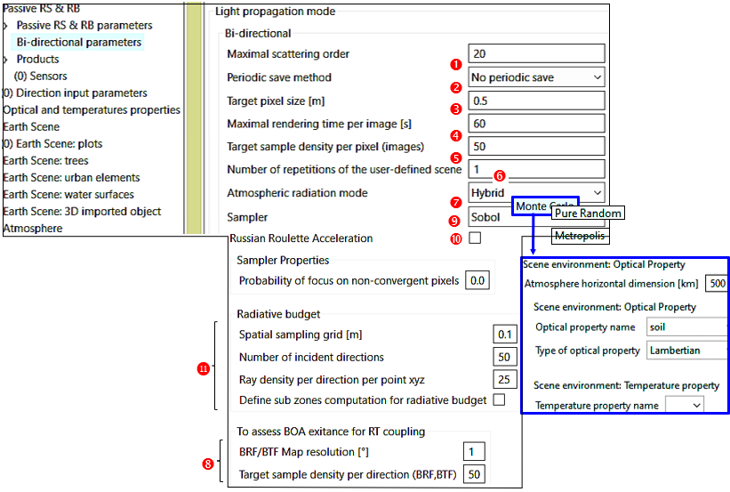
*Bi-directional 'Passive RS & RB', for "Hybrid" and "Monte Carlo" modeling of atmosphere RT.*
</img>

### b) ** Remote Sensing products **

Several major differences between DART-FT and DART-Lux are indicated below.

- The format of 3D objects is "ply", whereas it is "obj" for DART-FT.
- DART-Lux CT is proportional to the number of images to simulate, conversely to DART-FT.
- Spatial resolution. Conversely to DART-Lux, DART-FT uses a same voxel array to simulate landscapes, images and RB. Therefore, DART-Lux spatial resolution is the voxel horizontal dimension of the scene, whereas the pixel size of DART-Lux images is independent of the landscape simulation. Therefore, there is no need to re-run Maket to simulate images if we simulate DART-Lux images with different pixel sizes.
- $N_{discrete}$ discrete directions. DART-FT uses them to simulate the radiative transfer, and possibly to simulate images. DART-Lux does not use discrete directions to track radiation. It onlys uses them to specify the images to simulate.
- Scene BRF. DART-FT simulates simultaneously the scene reflectance $\rho_{scene}(\Omega_v)$ for the $N_{discrete}$ directions $\Omega_v$ and derives the scene BRF (i.e., brf file) from these $\rho_{scene}(\Omega_v)$. DART-Lux works differently: it computes sequentially
each requested $\rho_{scene}(\Omega_v)$, with computation time increasing with the number of $\Omega_v$. Therefore, if the LUT default option or the "BRF" product are set, a dome sensor (e.g., 90x360 orthographical detectors with $\Delta \Omega=1°$ x $1° < 2.10^{-4}$ sr), with infinite radius to capture all upward radiance from the Earth scene, simulates the scene BRF as a 90x360 map with steps $\Delta \theta=\Delta \phi=1°$, and user-defined $N_{sample/pixel}$ . Radiance is supposed to be isotropic within each $\Delta \Omega$. Each pixel i of the BRF map stores a mean reflectance $\rho(\Omega_i)$ such that $Albedo = E_{scene}.\sum_i \rho(\Omega_i).cos(\theta_i).\Delta \Omega_i$. The DART-Lux *brf* file stores the $\rho_{scene}(\Omega_j)$ of the simulated images, and the $\rho_{scene}(\Omega_k)$ of all DART discrete and added directions $(\Omega_k, \Delta \Omega_k)$, with $\rho_{scene}(\Omega_k)$ being computed by resamplings the BRF map.

<u>*BRF algorithm.*</u> In backward mode (*i.e.*, random walk from the sensor), a direction $\omega_0$ is sampled with {directional PDF $p(\omega_0)=\frac {p(\theta, \phi)} {sin(\theta)}=\frac {p(\theta).p(\phi |\theta)} {sin(\theta)}$ with $p(\theta)=\frac {1} {\pi /2},\:p(\phi |\theta)=\frac {1} {2.\pi}$} and a start vertex $q_0$ is uniformly sampled on the
scene ortho-projected surface $A_{ortho}(\omega_0)$ along $\omega_0$ with area PDF $p(q_0)=\frac {1} {A_{ortho}(\omega_0)}$. In forward mode, a local direction is sampled according to PDF $p(\omega_0)$ at each vertex in the scene towards the hemispheric sensor. All directions sampled in $(\omega_0 ,\Delta \Omega)$ contribute to the pixel $\omega_0$ of the BRF map.

!!! note
    The simulation of additional BRF maps for added angular region and oversampled planes is being added.

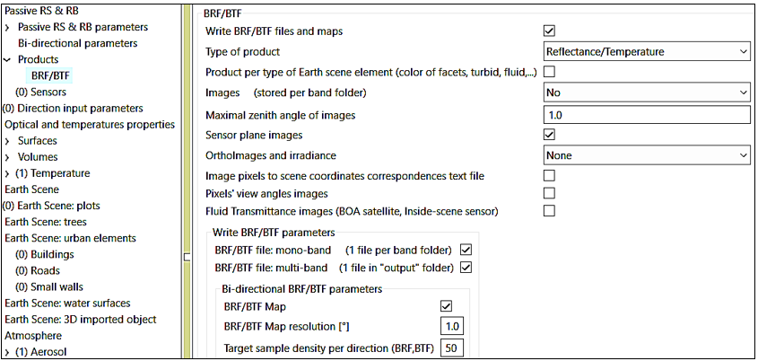
*BRF/BTF products*
</img>

The image a) below illustrates image creation in the sensor plane. The image b) below illustrates the creation of the BRF map (i.e., 90 x 360 pixels) that stores directional values over 90° x 360°. This BRF map is used to compute and store directional values in the get the brf, radiance and $t_{app}$ files, according to the user-selected discrete and added directions. 
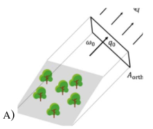</img>
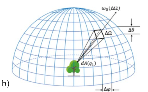</img>
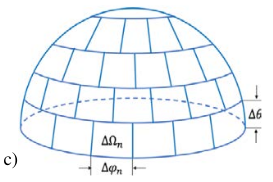
*a) Radiation from the scene along direction $\omega_0$ reaches the camera lens and is projected along $\omega_0$ on a virtual orthographical plane Aortho ($\omega_0$). b) Each sensor / pixel on the regular dome sensor (constant $(\Delta \theta, \Delta \phi)$ per solid angle $\Delta \Omega$, infinite radius) captures all radiation along $(\omega_0 ,\Delta \Omega)$. c) DART discrete directions $\Delta \Omega_n(\Delta \theta_n ,\Delta \phi_n)$.*
</img>

The last image shows the DART-Lux nadir image and BRF map of a schematic house. The default DART-Lux number of samples per pixel (i.e., 50) can be increased or decreased depending on the expected accuracy. It also shows a 2D BRF plot that results of the interpolation of data in the brf file, and a 2D BRF plot that is the projection of the BRF map. The later one is noisier.

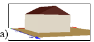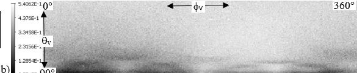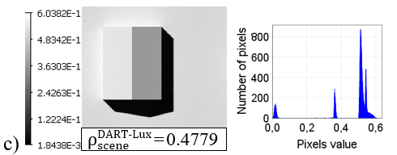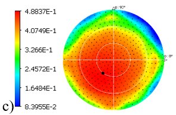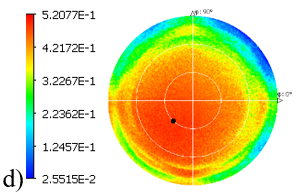
*DART-Lux: nadir image, histogram and BRF. a) 20 x 20m scene. $\rho_{ground}=\rho_{house}=0.5.$ $\theta_s=30°,\phi_{sun}=225°$. b) BRF map: 90 rows x 60 columns. c) Image and its histogram. d) 2D BRF plots of the brf file derived from the BRF map using 500 upward diections. e) 2D BRF plot of the BRF file directly derived from the BRF map.*
</img>

The BRF map can be defined for any angular range ${\Delta\theta, \Delta\phi}$, which needs smaller computation time than for the standard range ${\Delta\theta=90° \Delta\phi=360°}$. It can be also computed for sensors on a plane or and an hemispherical dome that observe a plane surface (i.e., target) defined by its dimensions (xy in meter), center (xyz in meter), normal (xyz in meter) and distance to the plane or hemispherical dome.

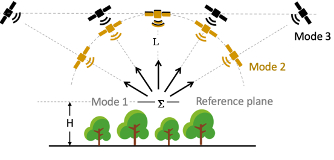
*The three modes of the BRF camera (menu: Sensor): radiance from a user-defined surface $\sum$ at altitude H, for any angular resolution and range L. Mode 1: radiance of $\sum$. Mode 2: radiance at a given distance L to the centre of $\sum$. Mode 3: radiance at any user-defined altitude L. *
</img>

### c) **Radiative budget**

Compared to DART-FT, DART-Lux has the same RB products with same file format except for RBfacet, without extrapolation and intermediate stages (Illudir, Iter_n,…). The accuracy and CT of $RB_{scene}$ depend on 3 parameters:

- Spatial sampling grid $\Delta s$ : 1 sample 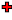 per grid volume for volumes and 1 sample 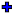 per centroid of sub-facet (i.e., segmented facet per grid volume).	
- Number of incident directions  in addition to sun direction.	
- Ray density per direction per point xyz . It decreases Monte Carlo noise.

!!! note
    DART-Lux gives RB for 1 stage (e.g., $RB_{illudir}$ if $N_{scat} = 1$ and no atmosphere), whereas DART-FT gives RB at all stages.This situation will be improved.
It is more computer intensive. Its computer time CT is reduced by computing RB (Figure 24) for parallelepiped sub-zones  and/or selected elements (DART elements : house,... and/or objects  or groups of 3D objects).

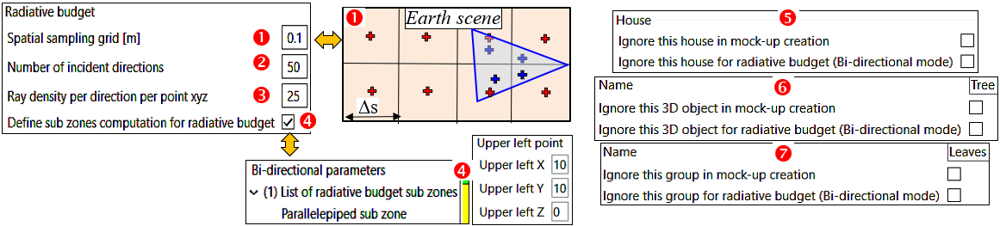
*DART-Lux RB. a) Parameters. b) Selected zone. c) Selected DART element, 3D object or group of 3D object.*
</img>

