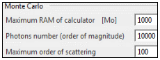

It is pure MC, much simpler than DART-Lux, designed to assess DART-FT accuracy. It only tracks photons in the Earth scene in mode R with few options: no atmosphere, no thermal emission,... The image below shows its specific parameters. DART-RC uses it.

*Monte Carlo mode.*
</img>

