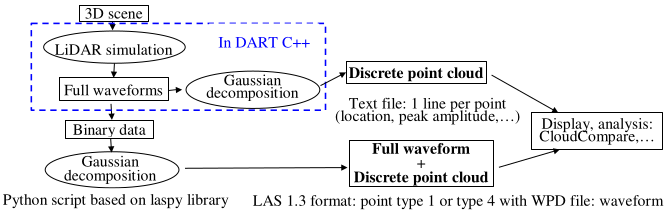

DART-RC mode extends DART-MC mode to simulate single- and multi-pulse waveforms of urban/ natural scenes, possibly with solar signal/noise, using a unique pulse definition. It tracks so-called DART photons that have a weight (*i.e*., float number) to simulate the LiDAR signal with reasonable computer time with a forward MC method. DART-RC (RC = RayCarlo) "tracking method" combines Ray Tracking and MC methods. MC methods compute the location of the intercepted photon in turbid / fluid cells and its scattering direction. The ray tracking method gives the fraction of intercepted photons in atmosphere layers and turbid/ fluid cells, the scattered and absorbed fractions per photon interception and the photon fraction that heads to the LiDAR.

<u>*Atmosphere*</u>: extinction coefficients are horizontally homogeneous and vertically continuous (except for treating atmosphere sphericity) with a formalism (*i.e.*, degree 3 polynomial per atmosphere layer) that reduces computer time for deriving the location of the interaction point from the MC computed ray path optical depth.

### a) **Single pulse**

- <u>*Pulse duration*</u> $\Delta t_{pulse}$: DART photons are emitted simultaneously. A post processing convolves them assuming that the emitted pulse is a centered Gauss function $A.e^{[-t^2/2.\sigma_t^2]}$ (see below) with half pulse duration $n_{\sigma}.\sigma_t$. One sets $n_{\sigma}$ (), and $\sigma_t$ is defined by setting a pulse relative power x () and time $\Delta t_x$ () such that pulse amplitude equals x.A. If x = 0.5, 2$\Delta t_x$ is the "full width at half maximum (FWHM)" of emitted pulse.

!!! note
    Any 1D distribution can be imported as the LiDAR temporal pulse using the option *'Import a pulse time file'*.

*LiDAR Gauss pulse. Amplitude A. Standard deviation $\sigma_t$. is derived from x and $t_x$.*
</img>

- <u>*Pulse energy*</u> $W_{pulse}$  (see below): $N_{photons,LiDAR}=\frac {W_{pulse}} {h.\nu}$ monochromatic photons; Planck's constant h, frequency $\nu$.

- <u>*Illumination*</u> (see below):  $N_{photons, LiDAR}$ being too large, $N_{photons,DART}$ DART photons $\approx N_{photons,input}$ are launched to the
footprint from sub-centers (i,j). Default footprint 2D energy is $P_l(\beta)=\hat{P}_{l,\beta}.e^{\frac {-\beta^2} {2.s_{\beta}^2}}$ with $\beta$ the angular offset from the pulse central  direction. Standard deviation $s_{\beta}$ defines the cone half beam divergence $\theta_{fp}$ (*i.e.*, within footprint angular divergence). Parameter "Fraction of photons at LiDAR radius" $\eta=\frac {pulse\:energy\:at\:footprint\:edge} {pulse\:energy\:at\:footprint\:center}$. It is used to calculate the standard deviation $s_{\beta}$. Its default value is 0.368 ($e^{-1}$).

!!! note
    - 2D distributions w(i,j) can be imported as a LiDAR pulse energy image with option *'Import a pulse spatial file'*.
    - The ratio $\frac {N_{photons,lidar}} {N_{photons,dart}}$ is used to get results in terms of actual photons instead of dart photons.
    - Results converge and become more accurate if $N_{photons,DART}$ increases. The optimal value of $N_{photons,DART}$ depends on the footprint size and scene complexity. For example, it can be 70~200 for TLS simulation, 1000~5000 for ALS simulation, and 100.000~1.000.000 for satellite LiDAR simulation.

- <u>*Acquisition*</u> (*see below*): rate (1ns $\implies$ distance resolution = 15cm); higher scattering order; larger RAM for MC (box method); Filter: data stored from $1^{st}$ to last non zero bins; no MC variability: same result for successive simulations.

- <u>*LiDAR geometry*</u> (*see below*):
    - *Lidar altitude* H.
    - *Telescope area* $A_t =\pi r_t^2$ ($r_t$ = radius): used to compute solid angle from any location (x,y,z) to LiDAR.
    - *Zenith and azimuth angles*: the LiDAR direction $\overrightarrow{\Omega}_L (\theta_L, \phi_L)$. Viewing and illumination directions are equal.
    - *Lidar footprint position (x,y)*: center of footprint and ground FOV at BOA level.
    - *Footprint and FOV sizes*: angles or radii at BOA level. The beam width at the laser generator 'exit gate' is $d_l$. 2D energy distribution is kept along the cone path while the footprint radius $r_{fp}$ increases; $r_{fp} =R.tan(\theta_{fp}) + \frac {d_l} {2}$ with R the sensor-to-target range. $d_l$ is usually negligible for airborne and space LiDAR, conversely to TLS. The FOV radius is $r_{FOV} =R.tan(\theta_{FOV} + \frac {r_t} {2}$ with R the sensor-to-target range, rt the radii of LiDAR telescope.
    - *Height above / below scene minimal altitude*: photons are stored for the interval $[z_0 - H_1 , z_0 + H_2]$.
    

*Single pulse menu. a) LiDAR mode. b) Energy time distribution. c) Energy spatial distribution. d) Acquisition. e) LiDAR geometry. f) Footprint and FOV ellipses: $r_{\parallel,fp}=H.\frac {tan(\theta_{fp})} {cos^2(\theta_L)}$, $r_{\perp,fp}=H.\frac {tan(\theta_{fp})} {cos(\theta_L)}$; $r_{\parallel,FOV}=\frac {H.\frac {tan(\theta_{fp})} {cos(\theta_L)} + r_t} {cos(\theta_L)}$, $r_{\perp,FOV}=H.\frac {tan(\theta_{FOV})} {cos(\theta_L)} + r_t$*
</img>

- <u>***Single-pulse waveform products***</u> (*see below*) images and text files

	- *Photons images*: ground image (2D distribution of photons intercepted by the ground), BOA incident pulse, BOA LiDAR image in the plane perpendicular to the viewing direction, and reflectance image.
    

*Lidar single-pulse products.*
</img>

    - *Convolved waveform:*
	    - `pulse.txt` ([here](../../../Format_DART_files/3-DART_RC/dart_rc.md#output-files-single-pulse)): time pulse function $A.e^{-t^2/2.\sigma_t^2}$ used to convolve the LiDAR DART waveform.
        - LIDAR_DART_wave.txt (`LIDAR_DART_wave_1stOrder.txt`) ([here](../../../Format_DART_files/3-DART_RC/dart_rc.md#output-files-single-pulse)): (1st-order) not convolved waveform. 4 columns: bin, time, length, number of photons.
	    - LIDAR_CONVOLVED_wave.txt (LIDAR_CONVOLVED_wave_1stOrder.txt) ([here](../../../Format_DART_files/3-DART_RC/dart_rc.md#output-files-single-pulse)): (1st-order) convolved waveform. 2 columns (time, number of photons).
    - Photon Information ([here](../../../Format_DART_files/3-DART_RC/dart_rc.md#output-files-single-pulse)): $(x_{lidar}, y_{lidar}), R_f, R_{FOV}, q_{lidar}, f_{lidar}$, ground path length and bin number, bin duration, $s_t$, number of $s_t$ in the pulse, pulse length, number of bins in the pulse, pulse itself. Allow a 3D view of photon interactions in “View $\rightarrow$ LiDAR $\rightarrow$ mono pulse”.
    - `stat_illumination_MC0.txt` ([here](../../../Format_DART_files/3-DART_RC/dart_rc.md#output-files-single-pulse)): statistics of illumination per spectral band.

### b) **Multiple pulse**

Three modes are possible: Waveform, Photon counting and Discrete Return (see below).

*DART "multiple pulse" mode.*
</img>

The acquisition grid (see below) is an irregular grid defined by an imported file (`Lidar_files/Swath_ALS.txt`) that sets the characteristics of each pulse, or a regular grid with the following input of parameters:

1. Start point and end point of the central axis of the swath region,
2. Position of the ground control point and LiDAR viewing direction for that point,
3. Grid mesh along the azimuth and range directions.

A waveform is simulated per grid node with a viewing direction defined by the telescope and pushbroom scan line (i.e., same azimuth view direction for all nodes on a same line). This energy per bin can be converted into discrete return and photon counting data through specific approaches.

- <u>*Lidar parameters*</u> (see below): as "Single pulse" option, except that "Lidar direction" changes per swath node.

*a) Lidar "multiple pulse+ ALS mode" swath menu. b) Scan grid.*
</img>

- <u>*Multiple-pulse waveform products*</u> (See below): images and text files
    - Images that show all pulses.
    - `LIDAR_IMAGE_panel.txt` ([here](../../../Format_DART_files/3-DART_RC/dart_rc.md#output-files-multi-pulse)): multi-pulse geometry information, which is used as ancillary file for DART LiDAR viewer (view $\rightarrow$ LiDAR $\rightarrow$ multi pulse).
    - `LIDAR_IMAGE_FILE.binary` ([here](../../../Format_DART_files/3-DART_RC/dart_rc.md#output-files-multi-pulse)): the simulated multi-pulse waveforms.
    - `LIDAR_IMAGE_STATUS.txt` ([here](../../../Format_DART_files/3-DART_RC/dart_rc.md#output-files-multi-pulse)): positions of key bytes in `LIDAR_IMAGE_FILE.binary` file. It is updated simultaneously with the binary file.

*Menu of lidar multi-pulse waveform products*
</img>

### c) **Discrete points: point cloud** 

Two methods (See below) can derive a point cloud (industrial format), with 5 intensity products, from DART waveform binary files using Gaussian Decomposition (GD).

*DART calculation of LiDAR point cloud and export in LAS format.*
</img>

1. DART external process (script `DART2LAS.py` based on laspy library): it converts a DART LiDAR multi-pulse output file to a LAS File:

    - inputFile: `LiDAR_IMAGE_FILE.binary`.
    - outputFile: output LAS file with format LAS1.3 point cloud point type 1 or 4. If type 4 waveform is selected, a `*wdp` file is also generated to store the waveform. The reading of type 4 is supported by the latest version of Cloudcompare ([www.danielgm.net/cc/](https://www.danielgm.net/cc/); <u>Girardeau-Montaut</u>, 2011) in Windows system.
    - g: type: float: set a fixed digital gain for the amplitude $\rightarrow$ volts conversion. If this option is not set, the python file will read through `LiDAR_IMAGE_FILE.binary` and find the maximum amplitude of all the waveforms and normalize it to integer range 0-127.
    - t: type: int: output intensity format type. 1: Peak amplitude of gaussian profile. 2: Integration of decomposed gaussian profile (default). 3: Sigma of gaussian profile (integer value of s (unit: number of acquisition bins)).
    - w: if “-w” is set, LAS1.3 type 4 (waveform format) will be generated. Otherwise, the script only stores the decomposed points in a simple format (LAS1.3 type 4)

2. DART internal processing: it is advised if the storage of the waveforms used to get the cloud point needs too much computer volume, which may be the case for TLS simulation. It uses 3 parameters:
    - *Minimum apparent reflectance* $\rho_{min}$ : a point is not be recorded if its apparent reflectance $\rho < \rho_{min}$ .
    - *Number of points per pulse.*
    - *Output intensity value type*: 1 or all of 5 intensity products (cf. below).

Points are stored in the file `DetectedPoints.txt` ([here](../../../Format_DART_files/3-DART_RC/dart_rc.md#output-files-multi-pulse)). Its header (1st row) gives the data format. It eases its reading in Excel and CloudCompare (use option 'skip lines 1' and 'extract scalar field names from 1st line').

<u>*Theoretical Background of Gaussian Decomposition (GD)*</u>

GD derives N points from waveforms. The received power is: $P_r(t)=\sum_{i=1}^N \hat{P}_i.e^{- \frac {(t-t_i)^2} {2s_{p,i}^2}}$ (1) with $s_{p,i} = \sqrt{s_s^2+s_i^2}$ (2) the standard deviation per Gaussian echo at time $t_i$, with the time-gated peak amplitude: $\hat{P}_i = \frac {\sigma_i} {C_{cal}.R_i^4.s_{p,i}}$ (2) $\sigma_i$ is the total cross section of a Gaussian cluster of scatterers at distance $R_i$.

$s_i$ represents signal broadening due to the observed medium (e.g., cluster of leaves or surface that is oblique relative to the LiDAR direction), and $s_s$ represents signal broadening due to the pulse duration. $s_s$ is an instrument-specific constant unless each transmitted pulse temporal profile is known (Mallet and Bretar, 2009). $s_{p,i} \approx s_s$ if $s_s \gg s_i$ (very small footprint compared to the corresponding distance of the pulse duration). Hence, GD distinction of different targets depends on target size, surface angle, gap size, and acquisition frequency.

$C_{cal} = \frac {4.\pi .\beta_t^2} {\eta .D_r^2.\hat{S}.s_s}$ (3) is a calibration constant, with $\eta$ the product of system and atmospheric transmission factors. Wagner et al. (2006) consider that the backscatter cross section of scatterers with an effective cross section $A_s$ and a bi-conical reflectance factor $\rho$ for the LiDAR direction is: $\sigma = \frac {4.\pi} {\Omega}.\rho .A_s$ (4) with $\Omega$ the solid angle of the cone where scattered intensity (W/sr) is assumed to be uniiform. For echo i, we have: $\sigma_i = \frac {4\pi}.\rho_i.A_{s,i}$ (5).

An apparent bi-conical reflectance factor $\rho_{a,i}$ of the cluster of scatterers at distance $R_i$ is defined for a theoretical surface $A_{foot,i}=\frac {\pi R_i^2 \beta_t^2} {4}$ (neglecting $d_l$) equal to the footprint area at a distance $R_i$ along the pulse direction: $\sigma_i = \frac {4\pi} {\Omega}.\rho_{a,i}.A_{foot,i}$ (6). Conversely to Wagner et al. (2006), scattered radiance, and not intensity, is assumed to be isotropic. Hence, for a backscattered power $P_{r,i}$, the power entering a receiver of area $A_t$ is $\frac {P_{r,i}} {\pi}.\frac {A_t} {R_i^2}$ and not $\frac {P_{r,i}} {\Omega}.\frac {A_t} {R_i^2}$. Hence, the expression of $\sigma_i$ in Eq. 7 is modified: $\sigma_i =4.\rho_{a,i}.A_{s,i} =\pi .\rho_{a,i}.R_i^2.\beta_t^2$ (7)

- ***The 5 tyes of "intensity" products***

	- 1) *Peak Amplitude* $\hat{P}_i$ (without GD). It is determined using a fast method (i.e., zero-crossing).

	- 2) *Fitted Peak Amplitude* $\hat{P}_i$ (with GD). ti , $\hat{P}_i$ and $s_{p,i}$ are computed with non-linear least-square minimization and curve-fitting (Newville et al., 2016).
	- 3) *Standard Deviation* $s_{p,i}$ (with GD) (unit: number of bins).
	- 4) *Total return power* $P_i$ (with GD): $P_i = \int \hat{P}_i.e^{- \frac {(t-t_i)^2} {2s_{p,i}^2}}dt = \sqrt{2\pi}.\hat{P}_i.s_{p,i}$ (8) (Milenković et al., 2017).
	- 5) Apparent reflectance $\rho_{a,i}$ (with GD). The combination of Eq. (3) and Eq. (9) gives $\sigma_i$ as a function of $P_i$: $\sigma_i = \frac {P_i.C_{cal}.R_i^4} {\sqrt{2\pi}}$ (9). Eq. (8) and Eq. (10) lead to $\rho_{a,i}=\frac {P_i.C_{cal}.R_i^2} {\pi \sqrt{2\pi}.\beta_t^2}$ (10). Using Eq. (4). $\rho_{a,i}$ can be written as a ratio of transmitted and received powers: $\rho_{a,i}=\frac {\pi} {\Delta \Omega_i.\eta}.\frac {P_i} {P_t}$ (11) with $P_t=\sqrt{2\pi}.\hat{S}.s_s$ the total pulse power, and $\Delta \Omega_i=\frac {D_r^2.\pi} {4.R_i^2}$ the solid angle from target i to receiver of diameter $D_r$ at distance $R_i$.

Computation of $P_i =\sqrt{2\pi}.\hat{P}_i.s_{p,i}$ i ⋅sp,i requires $\hat{P}_i$ and $s_{p,i}$, except if $s_s \gg s_i$ . Present LiDAR devices do not give $\hat{P}_i$ and $s_{p,i}$. They only give quantities often called "intensity" with various definitions. Hence, an accurate calculation of $\rho_{a,i}$ requires to record (Brown et al., 2005) or process (Wagner, 2010) the complete waveform with GD. Some discrete-return LiDAR devices give a "reflectance" product by fitting an "intensity" output with reference targets with different reflectance values (10%, 20%,…) at various distances. The online waveform processing of Riegl devices (Pfennigbauer et al., 2009, 2010) may provide the complete information without recording the waveforms, but the details of the method remain unpublished.

### d) **Photon counting**

The method (Yin et al, 2016) implemented in DART internal processing is used to derive a photon counting data. It uses 3 parameters of single-photon detector:

- *Quantum efficiency* $P_Q$: the probability to detect a photon that reaches the detector.
- *Detector dead time* $t_{dead}$ : the period needed by the detector to recover from a detection event, before another photon can be detected.
- *Dark count rate* $f_{dark}$: the detector’s thermal noise count rate without any light source. The file DetectedPoints.txt ([here](../../../Format_DART_files/3-DART_RC/dart_rc.md#output-files-multi-pulse)) stores photon counts. Its header (1st row) gives the data format. It eases its reading in Excel and CloudCompare (use option 'skip lines 1' and 'extract scalar field names from 1st line').

### e) **TLS**

A TLS single-pulse simulation is defined by TLS location (see below, a.). The waveform storage range is defined by the reference point location and range around it (see below b.).

For TLS multi-pulse simulation, apart from the above parameters, TLS swath (see below c.) is defined the viewing direction (target $\rightarrow$ LiDAR), angular (zenith and azimuth) range and resolution.

</img>
</img>

*TLS mode. a) LiDAR position; b) measured range; c) swath.*

</img>

### f) **Solar noise**

<u>*3 options*</u>: "Only Lidar", "Only solar noise" and "Lidar with Solar noise". Solar noise is a constant, simulated with DART flux tracking method, including several iterations, in the Earth scene.

In single-pulse mode, the solar noise is defaulted simulated by pinhole camera configuration that mimics the lidar sensor. In multi-pulse mode, airborne configuration should select the pushbroom camera. If solar noise is simulated, we get:

- Scene reflectance / radiance images (i.e., "flux tracking mode) due to sun flux only.
- 1 image / node of the swath grid "ima_camera_lidar_SN_i_j_VZ=000_1_VA=270_0". Index i is grid line (i.e., azimuth) number of the swath region, from the start point to end point. Index j is grid column number (i.e., range) of the swath region, from the left to right view.
- `Solar_noise.txt` ([here](../../../Format_DART_files/3-DART_RC/dart_rc.md#output-files-multi-pulse)): i, j, average sun radiance $(W/m^2/sr/\mu m)$, Solar power received by LiDAR (W), Solar energy per bin (J), Number of sun photons per bin.
- `rad0.txt` ([here](../../../Format_DART_files/3-DART_RC/dart_rc.md#output-files-multi-pulse)): average sun radiances of nodes.
