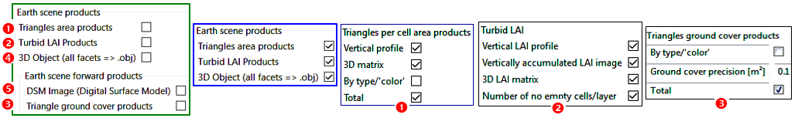

DART simulates several scene products (i.e., non radiometric products) (Figure 35): 

- "Triangle area products" : triangle area (total and per type of triangle), per cell in the Earth scene. 
- "LAI (leaf a rea index)" : 1D profile and 3D distribution (x,y,z) in the Earth scene.
- "Triangle ground cover products" : ground cover (total and per triangle type), per Earth scene cell.
- "3D object (obj file) : it cconsists of all fates in the DART simulated scene.
- "DSM" : xy distribution of scene local maximal altitude, as raster image and/or 3D object (*.obj).

*Earth scene (i.e., Market) optional products of DART-FT and DART-LUX.*
</img>

