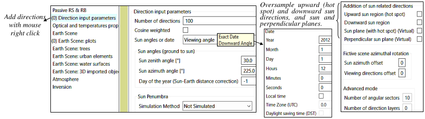
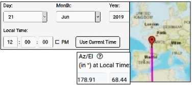
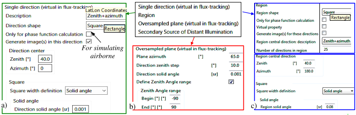
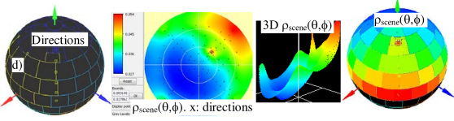
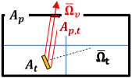

DART-FT and DART-RC track radiation along discrete that sub-divide the $4\pi$ space and contribute to RT modeling, and virtual directions only to give scene with a very low computer cost. Each direction $(\Omega, \Delta \Omega)$ crosses the center of gravity of its solid angle $\Delta \Omega$. The 'Direction' module (see the menu image below) creates these directions. It does not create sun direction; $\Delta \Omega_{sun}=0$ (incident radiance files use: $cos(\theta_{sun}).\Delta \Omega_{sun}=0.1$), except if "Sun penumbra" is simulated ($\Delta \Omega_{sun} \approx7 10^{-5}$ sr). DART-Lux uses these directions only to set the viewing directions of the simulated images and of the terms of the brf/btf file that is derived from the 90°x360° BRF/BTF map. The *'Direction'* module has a number of options:

*Menu Direction. Convention: 'Viewing angle': $\theta_s \in [0° 90°[$. 'Downward angle': $\theta_s \in ]90° 180°]$.*
</img>

- Number of directions $(\Omega, \Delta \Omega)$ that sample the $4\pi$ space with $\Delta \Omega \approx cst$ except the vertical up and down direction
- Sun angles or date: sun angles $(\theta_{sun}, \phi_{sun})$ are input or derived from time (date, time zone,...) and scene location, with NOAA sun calculator ([www.esrl.noaa.gov/gmd/grad/solcalc](https://www.esrl.noaa.gov/gmd/grad/solcalc)).

</img>

- Automatic addition of sun related directions (cf. DART Handbook for "VIS/TIR hot spot" theory):
    - "Upward sun region (hot spot)": adds $N_{up}$ directions in a region $\Delta \Omega_{region}$ around the hot spot.
    - "Downward sun region": adds $N_{down}$ directions in a region $\Delta \Omega_{region}$ around the sun direction.
    - "Sun (hot spot) and Perpendicular sun plane": adds virtual directions that sample these planes with a step $\Delta \theta$.
    - "Perpendicular sun plane": adds directions along the perpendicular sun plane with a step $\Delta \theta$.

- Mode expert: number of angular sectors to store $W_{int}(\Omega)$ used to simulate scattering in next DART_FT iteration.
- Add user defined directions (`right click` on "Direction input parameters": see below). Images are created or not.
    1. <u>Single direction</u> (virtual in DART-FT): directions defined by {zenith $\theta$, azimuth $\phi$} or {satellite coordinates (lat, lon, altitude) + solid angle with rectangle $(\Delta \theta, \Delta \phi)$ or square $(\Delta \Omega or (\Delta \theta, \Delta \phi)$) shape.
    2. <u>Oversampled plane</u> (virtual in DART-FT): adds directions in a vertical plane $\Phi$. Step $\Delta \theta$ and solid angle $\Delta \omega$.
    3. <u>Region</u>: non virtual directions sample an angular region (e.g., hot spot). It is defined by:
        - Central direction: {zenith / azimuth angles} or {satellite + scene locations (latitude, longitude, altitude)
        - Angular shape: it can be rectangle $(\Delta \theta, \Delta \phi)$ or square $(\Delta \Omega or \Delta \theta or \Delta \phi)$
    4. <u>Secondary source of distant illumination</u>: to simulate an additional source of illumination.

*Menu Direction. Convention: 'Viewing angle': $\theta_s$ $\epsilon$ [0° 90°[. 'Downward angle': $\theta_s$ $\epsilon$  ]90° 180°]*
</img>

</img>

*Addition of direction. a) Single direction. b) Oversampled plane. c) Angular region. d) 3D plot of directions. e) 2D and 3D plots of $\rho_{scene}(\Omega)$ with hot spot $(\theta_s=30°, \phi_s=45°)$. Crosses show DART discrete directions. d) $\rho(\Omega)$ on top of a).*
</img>

*DART-FT automatic approximation with discrete directions.*
</img>

A target (area $A_t$, normal $\overline{\Omega}$, radiance $L_t(\overline{\Omega}_v)$) gives radiance $L_p(\overline{\Omega}_v)$ at DART pixel (area $A_p$). Its projection on pixel is $A_{p,t}$. Its cross section along $\overline{\Omega}$ is $A_t.|\overline{\Omega}_t.\overline{\Omega}_v|=A_{p,t}.cos(\theta_v)$. Then: $L_p(\overline{\Omega}_v) = L_t(\overline{\Omega}_v).\frac {A_t.\overline{\Omega}_t.\overline{\Omega}_v.\Delta \Omega_v} {A_p.\int_{\Delta \Omega}cos(\theta_v).d\Omega_v}=L_t(\overline{\Omega}_v).\frac {A_{p,t}.cos(\theta_v).\Delta \Omega_v} {A_p.\int_{\Delta \Omega}cos(\theta_v).d\Omega_v}$. If $A_{pt}=A_p:L_p(\overline{\Omega}_v) = L_t(\overline{\Omega}_v)$. It is inexact for non horizontal surfaces since: $\int_{\Delta \Omega} cos(\theta_v).d\Omega_v \neq cos(\theta_v).\Delta \Omega_v$. However, energy conservation needs: $\sum_{2\pi} cos(\theta_v).\Delta \Omega_v = \pi$. Hence, a normalization is applied to the non virtual downward directions the solid angla of which crosses the target plane.

