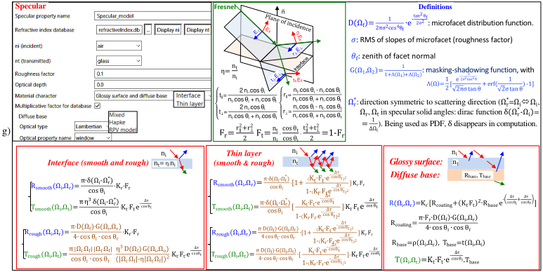

Any surface (i.e., adjacent facets) and volume (i.e., material inside a closed surface made of facets) has an optical property (OP) and a temperature property. There are 2 types of facets:

- "double face" option: each face of the facet has a specific OP and temperature property, or
- "single face" option: the facet upper face (i.e., positive normal) has an optical property and the other face is opaque (i.e., lost energy) except in DEM facets where it is transparent (see below).

Several options are possible for managing OPs and temperature properties.

 On-line OP creation without importing it in OP database, by multiplying OP's terms (reflectance $\rho$,…) by factors.

Example: lambertian $\rho=0.3$ is set in the GUI by multiplying the table `reflect_equal_1_transm_equal_1.txt` by 0.3.

To mimic part of the diffuse transmittance $t_{dif}$ of DART-FT lambertian facets as a direct transmittance $t_{dir}$. It reduces computer time to transmit radiation through the lambertian facets that simulate the scene.

 3D variability of OP and temperature property: it can be mimicked using 3D temperature and / or OP multiplicative factors stored in a text file (separator: ';'. ' ', 'new line', 'tab',...) that starts from cell (0,0,0), increases y, then x, then z. The header "Subzone" must be used for subzones.

*Single (a) / Double face (b) options. Facet with normal $\overrightarrow{\Omega}_{facet}$. Incident ray $\overrightarrow{\Omega}_{ray}$. Rays interact with a facet only if $\overline{\Omega}_{facet}.\overline{\Omega}_{ray} < 0 \implies$ the faces of the same facet never interact*
</img>

In addition, band OP $(\rho_{\Delta \lambda},t_{\Delta \lambda})$ is a spectral integral of $(\rho_{\lambda},t_{\lambda})$ weighted or not by BOA spectral irradiance $E_{BOA,\lambda}$:

- Mode R: $\rho_{\Delta \lambda} = \frac {\int_{\Delta \lambda} \rho_{\lambda}.E_{BOA,\lambda}.d\lambda} {\int_{\Delta \lambda} E_{BOA,\lambda}.d\lambda}$, $t_{\Delta \lambda}= \frac {\int_{\Delta \lambda} t_{\lambda}.E_{BOA,\lambda}.d\lambda} {\int_{\Delta \lambda} E_{BOA,\lambda}.d\lambda}.(\rho_{\lambda},t_{\lambda})$ from SQL database `*.db` or from Prospect/Fluspect model.
- Mode T: $\rho_{\Delta \lambda} = \frac {\int_{\Delta \lambda} \rho_{\lambda}.L_{B,\lambda}.d\lambda} {\int_{\Delta \lambda} L_{B,\lambda}.d\lambda}$, $t_{\Delta \lambda}= \frac {\int_{\Delta \lambda} t_{\lambda}.L_{B,\lambda}.d\lambda} {\int_{\Delta \lambda} L_{B,\lambda}.d\lambda}$ with Planck radiance computed at mean scene temperature $T_{scene}$.
- Mode T+R: $\rho_{\Delta \lambda} = \frac {\int_{\Delta \lambda} \rho_{\lambda}.(\pi.L_{B,\lambda} + E_{BOA,\lambda}).d\lambda} {\int_{\Delta \lambda} (\pi.L_{B,\lambda} + E_{BOA,\lambda}).d\lambda}$, $t_{\Delta \lambda}= \frac {\int_{\Delta \lambda} t_{\lambda}.(\pi.L_{B,\lambda} + E_{BOA,\lambda}).d\lambda} {\int_{\Delta \lambda} (\pi.L_{B,\lambda} + E_{BOA,\lambda}).d\lambda}$

### a) **Spectral optical properties (OP)**

SQL databases (cf. 3) store OPs (e.g., `Lambertian_*.db` for surfaces). Their appear as indices (see below) in xml files.

*Optical properties*
</img>

***Surface.***

A facet has a direct transmittance tdir along its normal $\Omega_t$, an isotropic transmittance $t_{diff}$ and  reflectance $\rho$ isotropic or not. A flux $W_{in}(\Omega_i)$ intercepted by a facet gives: 

1. directly transmitted flux $[t_{dir}]^{\frac {1} {|\Omega_s.\Omega_t|}}.W_{in}$  
2. scattered flux $(1 - [t_{dir}]^{\frac {1} {|\Omega_s.\Omega_t|}}).\rho.W_{in}$ , and (3) transmitted diffuse flux $(1 - [t_{dir}]^{\frac {1} {|\Omega_s.\Omega_t|}}).t_{dif}.W_{in}$. Several "types" of surface OP are available:

- <u>*Lambertian*</u>: isotropic $\rho_{\lambda},t_{dif,\lambda}$ and $t_{dir,\lambda}$ from a database (e.g., `lambertian_vegetation.db`, `lambertian_mineral.db`), isotropic $\rho_{soil,\lambda} = f(soil,moisture,content,soil,type)$ from the Marmit-2 model (doi.org/10.1016/j.rse.2022.112951) or isotropic $\rho_{leaf,\lambda}$ and $t_{leaf,\lambda}$ from the Prospect / Fluspect model (doi.org/10.1016/0034-4257(90)90100-Z). This model stores $\rho_{leaf,\lambda}$ and $t_{leaf,\lambda}$ in a table "hc…" (i.e., index of input parameters) of database `ProspectVegetation.db`. It is run from the DART editor (tool ), from the menu "Run / Prospect" module in the GUI, or by setting "Prospect module" in "Run / Properties" (then, the Prospect module is run when DART is run).

!!! warning
    DART-FT (old option): $OP_{lambertian}$ defines $ρ_{spe}$ with `specular.db`; cf. DART Handbook): $\rho(\Omega_s,\Omega_t,\Omega_v)$ = $\rho_{non-spe}(\Omega_s,\Omega_t,\Omega_v)+ \rho_{spe}(\Psi_{nv})$ with $\rho_{spe}(\Psi_{nv}) = A.\rho_{Fresnel}(\Psi_{nv}).f(\Psi_{\Delta \Omega^{*},\Delta \Omega_n^{*}})$ in $\Delta \Omega_n^{*}$= {$DART\:direction \Delta \Omega_n \cap \Delta \Omega^{*}$ }. $\rho_{spe}$ has 4 parameters: surface refraction index and specular factor A, cone $\Delta \Omega^{*}$ , and directional distribution $f(\Psi_{\Delta \Omega^{*} ,\Delta \Omega_n^{*}})$ of intensity in $\Delta \Omega^{*}$. It is exact at scattering order N=1 and assumed to be due to isotropic radiation (Phase module computes $\rho_{spe,hh}$ and $t_{spe,hh}$ for N>1: $\rho_{spe,hd}(\Omega_n, \Delta \Omega_n) \approx 2.A_{face, in-out}.r_{Fresnel}^2(\theta_{n-local}).cos(\theta_{n-local}).sin(\theta_n).\Delta \theta_n.\Delta \phi_n$; exact if option "Flux Tracking $\rightarrow$ Store intercepted power per direction (for lambertian + specular)" is set).

$cos(\Psi_{\Delta \Omega^{*},\Delta \Omega_n^{*}}) =sin(\theta_{\Delta \Omega^{*}}).sin(\theta_{\Delta \Omega_n^{*}}).cos(\phi_{\Delta \Omega^{*}} - \phi_{\Delta \Omega_n^{*}})+cos(\theta_{\Delta \Omega^{*}}).cos(\theta_{\Delta \Omega_n^{*}})$;

$f(\Psi_{\Delta \Omega^{*},\Delta \Omega_n^{*}})=cst, \frac {\alpha_{in-out}^2} {4}-\Psi_{\Delta \Omega^{*},\Delta \Omega_n^{*}}^2\:or\:(cos(\Psi_{\Delta \Omega^{*},\Delta \Omega_n^{*}})^{k_{in-out}} - (cos(\frac {\alpha_{in-out}} {2}))^{k_{in-out}}$

- <u>*Hapke*</u>: from the analytical Hapke model (cf [III.7.3](../../7-Tools_menu/7.3/computation_parametric_model_coef.md)). $OP_{Hapke}$ is defined using `Hapke.db`.
- <u>*RPV*</u>: from the analytical RPV model (cf. [III.7.3](../../7-Tools_menu/7.3/computation_parametric_model_coef.md)) . $OP_{RPV}$ is defined using `RPV.db`.
- Phase extern: pre-computed $\rho(\theta_i,\psi_i,\theta_j,\psi_j,\lambda)$ (e.g., `BSDF_example.txt`) is automatically stored in `phase_extern.db`
- Specular: $\rho_{spe}$ of 3 types of media (see image g. below). DART-Lux is much simpler and efficient than DART-FT.
- Mixed: reflectance is a proportion of the above defined categories (e.g., 60% lambertian and 40% specular).

!!! note
    Thermal emissivity of opaque surface is approximated by: $\epsilon(\Omega_r) = 1 - \rho(\Omega_{nadir},\Omega_r)$ instead of $\epsilon(\Omega_r) = 1 - \rho(2\pi^{-},\Omega_r)$

The image below shows the menus for surface  optical properties:

- Lambertian "ground" (see image a. below). 2 cases are shown: the OP is defined using a spectral database  (here: `Lambertian_mineral.db`) or using the Marmit model  (here: soil moisture content (SMC) = 10 and 20).
- Lambertian "leaf" (see image b. below). It is defined by the PROSPECT/FLUSPECT model that gives table hc19497…. and fluorescence parameters.
- Mixed (see image c. below), Hapke model (see image d. below), RPV model (see image e. below), Phase extern (see image f. below).
- Specular (see image g. below): 3 types of media (smooth / rough "Interface", "Thin layer", glossy material over diffuse base). The input parameters include the refractive indices of the "incident medium" ni and "transmitted medium" $n_t$, the roughness factor and optical depth $\Delta \tau$ of the upper layer and the reflectance of the eventual base layer.

*Surface  optical properties. a) Lambertian "ground" (spectral database  (e.g., `Lambertian_mineral.db`) or Marmit model  (SMC = 10 and 20).*
</img>

*b) Lambertian "leaf" ( $\implies$ table hc19497… & fluorescence parameters from PROSPECT/FLUSPECT model).*
</img>

*c) Mixed OP.*
</img>

*d) Hapke.*
</img>

*e) RPV.*
</img>

*f) Phase extern.*
</img>

*g) Specular: 3 cases.*
</img>

***Volume***

- <u>*Vegetation*</u> (see below): for leaves / twigs in turbid tree crowns and plots simulatd as turbid medium (i.e., infinite number of infinitely small facets with a LAD : IV.12). The OP is isotropic (i.e., $\rho, t_{dif}, t_{dir} = 0$) per facet, from `lambertian*.db`  or `ProspectVegetation.db`  simulated by the ProspectFluspect model. Specular reflectance can be simulated with $T_{spe}(\Omega_s,\Omega_r)$ at scattering order 1 and $T_{spe}(\Omega_{sector},\Omega_r)$ at higher orders, using `roughness.db`. 

*Volume "Vegetation" optical property without (left) and with (right) Prospect / Fluspect model.*
</img>

Thermal hot spot (THS): the THS factor α can mimic the foliar THS (see below), but without any ground THS . Indeed, if $\alpha \neq 0$, Tleaf locally varies as Tleaf(angle "leaf normal, sun direction", altitude in the canopy) (cf. DART Handbook). However, for a statistical THS similar to SAIL and SCOPE models, we can use sunlit/shaded temperatures defined per temperature property or SCOPE 1D temperature profiles of sunlit and shaded leaves. Leaf clumping in turbid volumes is simulated with an analytical method .

!!! note
    A turbid volume can be converted to facets with the same OP as "Turbid vegetation". It corresponds to a "quasi turbid medium" if facets are very small, numerous and have the same LAD as the turbid medium.

*Thermal hot spot with factor a=0, 0.4, 2.*
</img>

Turbid plot. LAI=3. $\rho_{ground}=0$. $T_{ground}=0K$. $T_{leaf} \in [290, 310K]$

- <u>*Fluids*</u> (air, water, soot)

Fluid property: cross section $\sigma(m^2)$, spherical albedo $\omega$ and Rayleigh or double Henyey Greenstein phase function. Databases `Fluids.db` and `Fluid_gas_thermal.db` (gases at different temperatures). Fluid volume: N types of particles with N specific densities and fluid OPs.

</img>

*"Fluid" optical property.*
</img>

Geisa database gives absorbing gas cross sections. 

### b) **Temperature properties**

DART cannot simulate exactly the scene 3D temperature because it does not simulate the scene energy budget. It can use several methods to assign a more or less accurate temperature locally or to scene elements (see below):

- Illumination: the temperature of each scene element j is derived from its temperature property {${T_{mean,i},\Delta T_i}$} and its short wave irradiance $E_j$ that DART computes using the sun direction, a user defined short wave SKYL and the parameter "Smaller mesh size D of BOA irradiance sources" to compute $E_j$ ; smaller D lead to most accurate $E_j$ (i.e., temperature) and larger computer time. Conversely to DART-Lux (MC bi-directional mode), DART-FT (forward mode) uses an histogram threshold on $E_j$ values because its illumination is discrete.
- 3D matrix or 1D temperature vertical profile, possibly computed by an energy budget model. Their spatial sampling is equal to the size of the DART cell (voxel) size.
- From extrapolated atmosphere profile.

*Methods to set the scene 3D temperature.a) Illumination.*
</img>

*b) 3D and 1D temperature vertical profile.*
</img>

*c) From extrapolated atmosphere profile.*
</img>

The images below illustrates how to define a temperature property {$T_{mean,i}, \Delta T_i$}, called "T_mineral". A property can override an eventual 3D temperature matrix . The temperature of scene element j with temperature property {$T_{mean,i}, \Delta T_i$} is derived from its short wave irradiance $E_j: T_j=\sqrt[4]{A_i.E_j+B_i}$ with $A_i=\frac {T_{max,i}^4 - T_{min,i}^4} {E_{max,i}-E_{min,i}},\;B_i=\frac {T_{min,i}^4.E_{max,i}-T_{max,i}^4.E_{min,i}} {E_{max,i}-E_{min,i}}$. It ensures that the most (least) irridiated elements with temperature property i get $T_{mean,i} + \frac {\Delta T_i} {2}(T_{mean,i}-\frac {\Delta T_i} {2})$. The temperature can be the same on the 2 faces of the facet , which is useful for leaves, conversely to thick elements such as walls. The temperature of the elements of type i, can be reokaced by the calues of a 3D temperature matrix , by specified sunlit and shaded temperatures , or by values of 1D SCOPE temperature profiles .

*Temperature property {$T_{mean,i}, \Delta T_i$}. It can override an eventual 3D temperature matrix.*
</img>

