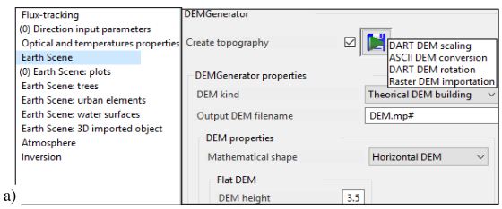
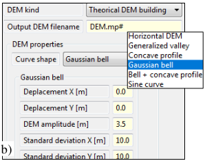
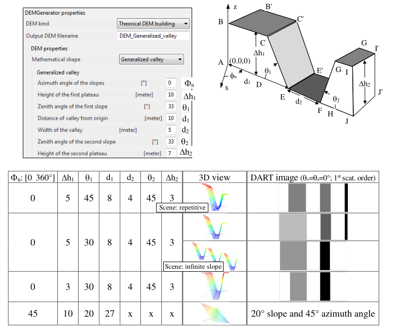

Menu "Run" runs / stops DART modules / sequences with three major options:

- <u>*"DART"*</u>: it runs sequentially the 4 main modules 'Direction', 'Phase', 'Maket' and 'Dart'.
- <u>*"Terminate"*</u>: it stops a DART simulation that is running.
- <u>*"Properties"*</u>: it specifies the modules that "DART" will run sequentially.
- <u>*"LUT properties"*</u>: it sets the results to store into the LUT (SQL database), in a single DART run

### **DART basic modules** 
- **Direction**. It subdivides $4\pi$ into N discrete directions $(\Omega, \Delta \Omega)$, adds directions, etc.
- **Phase**. It computes optical (scattering function,…) / geometrical (LAD: IV.2,…) terms.
- **Maket**. It creates the Earth (`maket.txt`) and atmosphere (`atmosphereMaket.txt`) scenes.
- **Dart**. It simulates radiative transfer in the "Earth - Atmosphere" system.
- **Atmosphere creation**. It creates the atmosphere scene without running "Maket" module.
- **Vegetation** (also run in DART GUI): land cover / fluid map import into Earth scene (cf. VII.5).
- **Hapke**. It fits $\rho(\Omega_v,\Omega_v)$ (e.g., text file '$\theta_s, \theta_v, \phi_s-\phi_v, \rho(\Omega_v)$', $\theta_s \in [90°\:180°]$) to Hapke model and stores coefficients in `External_Hapke_Parameters_0.txt`. Its can decrease computer time for scenes as {trees + bushes}:  
    1. Simulate $\rho_{bush}(\Omega)$ with resolution $\Delta r=0.1m$.
    2. Fit $\rho_{bush}(\Omega)$ with Hapke model $\rho_{b,H}(\Omega)$.
    3. Simulate $\rho_{scene}${$\Delta r=1m, \rho_{ground}(\Omega) = \rho_{b,H}(\Omega)$}.

- **Prospect** (Jacquemoud, Baret, 1990) / **Fluspect** (Verhoef, Van der Tol, Vilfen,…); also run in DART GUI. It stores leaf $(\rho_f, \tau_f)$ in tables in SQL databases `ProspectVegetation.db` (volume) and `ProspectLambertian.db` (surface). Each table corresponds to specific leaf parameters {$N, \alpha_{Chl}, \alpha_{Car}, \alpha_{brown}, \alpha_{H_2O}, \alpha_{dry\:matter}, \alpha_{carbon\:dry\:matter}, \alpha_{nitrogen\:dry\:matter}, \alpha_{violaxanthin},$ $\alpha_{zeaxanthin}, \alpha_{anthocyanin}$} whose name is set using a "FileHash".
- **DEMGenerator**. Sequences and the GUI () can run it. As other DART raster images, a DEM image is made of 2 files: a file (extension: mp#) that stores the altitudes, as double float numbers, and a header file (extension: *mpr*) that stores the characteristics of the `*.mp#` file. This module has 5 options: 
    1. Importation of DEM that is a raw (no header) binary (double or float) raster map that stores pixel altitudes (h00, h01, h02,…). Its numbers of lines and columns must be equal to those of the current DART scene.
    2. DEM creation: (DX, DY, $\Delta x, \Delta z$) of the scene. The maket module can export it as a 3D object, using 2 triangles per DART cell. 5 types of DEM: 0: Horizontal (1 param.: height). 1: Generalized valley (7 param.) to create slopes, valleys,…. 2: Concave profile (no param.), 3: Gauss bell (5 param.). 4: Gauss bell + Concave profile (1 param.: height) 5: Sinusoid along x axis (height + number of patterns).
    3. DEM creation using points (x,y,z) within the scene and stored in a text file with spaces as separators, 
    4. DEM spatial resampling to current simulation resolution and dimensions. DEM pixel size is derived from its spatial extent (i.e., $CoordBounds=x_{min}\:y_{min}\:x_{max}\:y_{max}$) and numbers of lines and rows (i.e., $Size=N_{lig}.N_{row}$).
    5. Rotation of an existing DEM: 90°, 180°, 270°.

*a) DEMGenerator: scaling, creation, ASCII conversion, rotation, raster importation.*
</img>

*b) Gauss bell creation.*
</img>

*Generalized valley:Parameters and examples. Slope angles have priority over plateau heights.*
</img>

