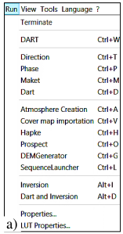
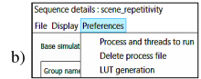
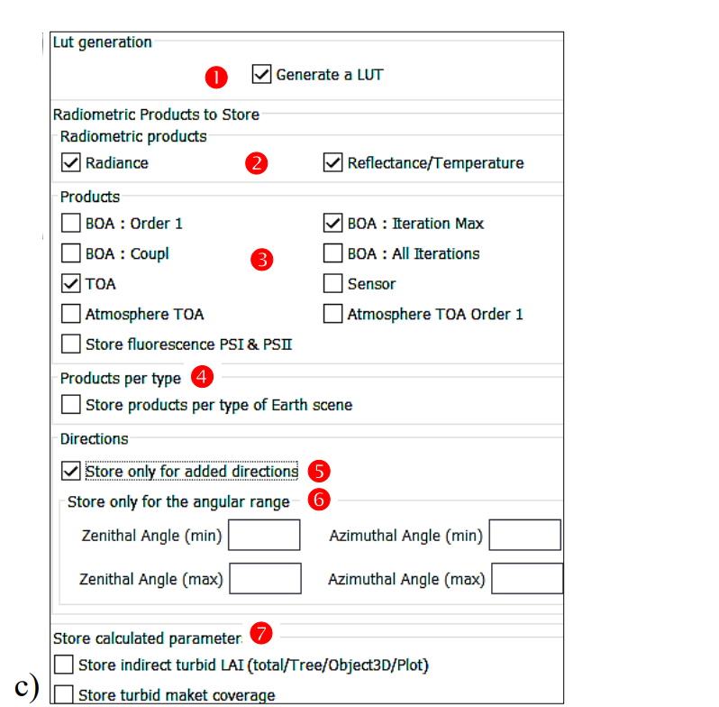

The LUT (i.e., SQL database) can store most non image 'radiometric products': scene BOA / TOA radiance $L_{scene}(\Omega_v)$, reflectance $\rho_{scene}(\Omega_v)$ or brightness temperature $T_{B,scene}(\Omega_v)$, irradiance,… Data can be displayed and exported. The option "LUT creation" and the data to store are set in the menu "Run / LUT Properties" for a single simulation and in the menu "Sequence Launcher / … / Preferences / LUT Generation" for a sequence of simulations. (see below). In these menus, if the the LUT's option "Store only for added directions" is unset, the LUT stores {$L_{scene}(\Omega_v), \rho_{scene}(\Omega_v)$ / $T_{B,scene}(\Omega_v)$} for $\Omega_v$ in $\Delta \Omega_v=90°*360°$. The option "Store only for the angular range" sets bounds for $\Omega_v$. DART-FT always computes {$L_{scene}(\Omega_v), \rho_{scene}(\Omega_v)$ / $T_{B,scene}(\Omega_v)$} whatever LUT options, conversely to DART-Lux that computes them if it is a selected DART-Lux product or if required in the LUT, presently with 1° angular steps over 90°x360°. It can greatly increase DART-Lux computer time for scenes with very few pixels.

*LUT: a) creation for a simulation.*
</img>

*LUT:b) a sequence of simulations.*
</img>

*c) data to store.*
</img>

 To store or not the LUT

 To store radiance $L_{scene}(\Omega_v), \rho_{scene}(\Omega_v)$ / $T_{B,scene}(\Omega_v)$.

 Selection of data to store

 To store products per type of scene element

 To store results only for added directions.

 To store $L_{scene}(\Omega_v), \rho_{scene}(\Omega_v)$ / $T_{B,scene}(\Omega_v)$ only for $\Delta \Omega_v$

 To store Earth scene parameters calculated by the Maket module.
