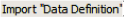

The Sequencer module creates, edits and runs a sequence of N simulations, each one being a copy of the root simulation, where J parameters $M_j$ , called "variable parameters", vary. A text file (e.g., `seq_W.xml`), stored at the level of the "output" folder of the root simulation indicates the $M_{j,k}$ values, with $k \in [1\:K_j]$, of the J parameters $M_j$.

To save time (CT) and hard disk memory (SSHD), DART only copies into the N simulations the files that differ from those in the root simulation (i.e., the unchanged files are read in the root simulation). WP1.B in section VII.1 illustrates the Sequencer module for the case {$M1 =\overline{\lambda}$, $M2 =\Delta \lambda$}.

!!! warning
    A spectral sequence (i.e., variable parameter = spectral band) must only be run with a mono-band root simulation.
    
1. <u>*Create sequence*</u> (`*.xml`): each Mj is defined as "enumerate" (list: $M_{j,o}, M_{j,1},…)$ or "arithmetic" ($M_{j,o}, step\: M_{j,k+1} - M_{j,k}$) that can be input as a csv file (1 line / $M_j$ : ). All $M_j$ can be in a same group ($\implies$ they vary together: N= K) or several groups ($\implies$ they vary independently; if the J $M_j$ are in J groups: $N=\prod_{j=1}^{J} K_j$).
    - <u>*Example*</u>: to study crop reflectance change with LAI and wavelength. One can set a group with Mo =LAI defined as {$LAI_0, LAI_1,…$} or {$LAI_0, \Delta LAI$} and a group with $M1 =\overline{\lambda}$ and $M2 =\Delta \lambda$ that are enumerate or arithmetic.
    - <u>*Options*</u> (i.e., menu "Preferences"): 3 major options are possible when creating or editing a sequence:
        - Processes and threads to run: to reduce computer time, do not run useless processes and run M simulations in parallel, with $M.N_{threads\:per\:simulation} <$ number of available threads.
        - Delete process file: to reduce SSHD, selected result files are automatically deleted, possibly only keeping the LUT.
        - LUT: as for a single simulation, a LUT (SQL database) can be created with specific data.

2. <u>*Edit sequence*</u>: edits a sequence of simulations (e.g., add, edit or delete parameters that vary).

3. <u>*Prepare and run sequence*</u>:
    - Creates launcher file (e.g., `seq_W_Launcher.xml`): N simulations with status "TO PROCESS" and specific parameters.
    - Creates and runs sequentially the N simulations. The status of a successfull simulation becomes "PROCESSED".
    The sequence starts at once if default option "Auto launch" is set.

4. <u>*Start/Continue sequence*</u>: starts the sequence with the launcher created by "Prepare sequence" or resumes the sequence if it failed (i.e., status of the simulation $\neq$ "PROCESSED") or was stopped with the "Stop sequence" icon. The status of the DART modules to run can be changed before continuing the sequence.

