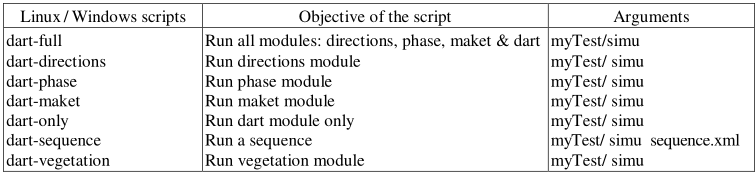

DART modules can be run from its GUI and with Linux and Windows command lines (e.g., [here](../../2-GUI/gui.md)). For example, to run the Python script `prepareLaunchSequence.bat` with sequence "seq_name", use with the command line:
```
prepareLaunchSequence.batseq_name.xmlseq_name_Launcher.xml
```

Scripts have 1 argument (e.g., myTest/simu in DART_LOCAL/simulations/myTest/simu). Only "dart-sequence" script has a $2^{nd}$ one: `sequence.xml` file without full path. Script file extension: `.sh` for Linux and `.bat` for Windows.

- **Linux**

- Scripts must be run with a Bash (Bourne Again Shell) shell that is present in (all?) linux installation. To check if you are using a Bash shell, just open a terminal window and type: `echo $SHELL`. You are using bash you should get the following line output: /bin/bash.
- To run a script using bash type: 
```
bash <your_script_name> <arguments>
```

- **Windows**

- Scripts (cf. examples in [this chapter](../../1-File_architecture/file_architecture.md)) must be run from the Windows command line interpreter. They use 3 environment variables that are defined in the `USERPROFILE\DART\dartrc.bat` file that the installer creates automatically, with `USERPROFILE = C:\Users\<username>` in recent Windows versions.
- To run a script: Open a command line interpreter (`cmd.exe`), go into `DART HOME\tools\windows` folder and type the script with its argument(s) (e.g.,`
dart-directions.bat myTest/test1`).

<center><p>*Linux/Windows scripts to run DART modules and their arguments. They are in the "tools" folder.*</p></img></center>
