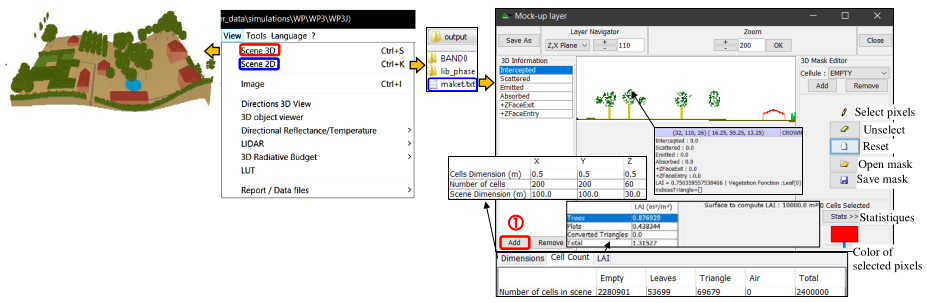

The 3D and 2D scene viewers (see below) display the scene. The 2D scene viewer is only for DART-FT. It has options:

- Display scene sections xy, yz and xz, with show (cell right click) of cell coordinates, LAI, cell name (e.g. crown), triangle indices, phase function name and 3D data (e.g., temperature, radiation budget terms $f_{scat}, f_{up},…$) if a 3D_Radiative_Budget file is set with "Add" button (), with possibility to save 2D displays views.
- Create and backup masks. It allows one to compute statistical results on part of the scene.

*Scene 3D and 2D views.*
</img>

