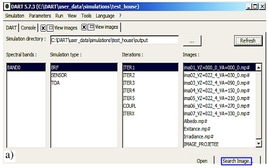
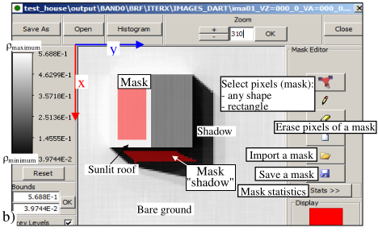
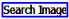

This menu displays images (ILWIS format: {binary file `*.mp#` + image information (number of rows,…) in text file `*.mpr`}, either in current simulation () or anywhere else (). It has 4 panels (see below):

1. Spectral bands: the spectral bands that are defined in the current simulation.
2. Simulation type: radiance and/or reflectance (mode R) or brightness temperature $T_B$ (mode T or R+T), possibly at 3 altitudes: TOA, Sensor and BOA. BRF stands for BOA reflectance and $T_{app}$ for BOA brightness temperature.
3. Iterations: the iterations of the DART simulation:
    - "Order1": images that correspond to exact order 1 scattering
    - "Iter1" to Iter ": iterations of the DART simulatio
    - "IterX": extrapolated DART iteration, before the Earth - Atmosphere radiative coupling.
    - "Coupl": images after the Earth - Atmosphere radiative coupling; only if atmosphere R.T. is simulated.

4. Images: remote sensing images onto sensor plane. They can be orthorectified and/or projected in the horizontal plane. Image names give the view zenith (VZ) and azimuth (VA) angles. Albedo / Exitance images can be created.

*a) Image menu.*
</img>

*b) Nadir image. $\rho_{ground}=\rho_{roof}=0.5$. Masks 'sunlit roof' and 'shadow'. : images in other folders.*
</img>

