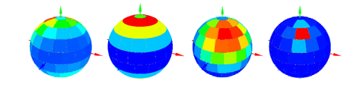

DART directions are shown on the $4\pi$ sphere to check their distribution (e.g., hot spot). $L_{scene}(\Omega), \rho_{scene}(\Omega), T_{B,scene}(\Omega)$ and scattering functions SFs can be overlaid and exported as text files. For SFs, the spectral band and incident direction (DART direction, sun direction) can be selected. In the atmosphere SF plot, one can select "gas" or "aerosol".

*3D display of scattering functions. a) Vegetation. b) Gas $(\theta_{in}=0°)$. c) Gas $(\theta_{in}=41°)$. d) Aerosol ($\theta_{in}=41°$). Displayed values are for discrete directions $(\Omega, \Delta \Omega$).*
</img>

