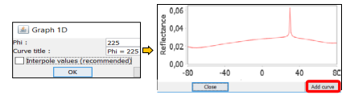
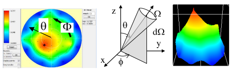
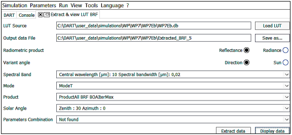

** $L(\Omega_v), \rho(\Omega_v), T_B(\Omega_v)$**

DART has $N = N_{auto} + N_{added}$ upward directions: $N_{auto}$ automatic upward directions, including $N_{auto}^{image}$ directions with image simulation, and $N_{added}$ upward directions ($N_{added}^{image}$ directions with image simulation, $N_{added}^{no\:image}$ directions without image simulation). The *brf / $T_{app}$ / radiance* file stores the reflectance / brightness temperature / radiance of all upward directions, possibly identical (only one is arbitrarily used) or very close (e.g., automatic and added directions).

- DART-FT *brf*: mean reflectance of the images of the N upward directions, even if the images are not stored. N is usually $\approx$ 100 because computation time (CT) greatly increases if N increases.
- DART-Lux *brf*: mean reflectance of the $N_{auto}^{image} + N_{added}^{image}$ images, and, if the option "BRF computation" is set, $\rho_{scene}$ for the $N_{auto}^{no\:image} + N_{added}^{no\:image}$ directions, interpolated on a BRF map ([here](../../4-Radiative_modes_sub_modes/4.3/passive_rs_rb_dart_lux.md#433-remote-sensing): 90x360 pixels; 1° step); a pixel (VZ,VA) corresponds to the viewing direction (VZ,VA). *brf* has no BRF map-derived data if $N_{auto}^{no\:image} + N_{added}^{no\:image} = 0$.

- **Graph 1D**: $L(\theta_v, \phi_v=cst), \rho(\theta_v, \phi_v=cst), T(\theta_v, \phi_v=cst)$.

*1D graph of $\rho_{scene}$. It can show several curves (option "Add curve"), interpolated or not.*
</img>

- **2D polar plots** $\rho(\theta,\phi), T(\theta,\phi)$ and $L(\theta,\phi)$: kind of bi-cubic interpolation on the *brf* file; possibly weird if directions are very close. Graphs can be saved in png, jpg and txt (interpolated data file). Cross = DART direction. Options: zoom, contrast enhancement, display of sun angles, 3D view,… Right click on 2D plot $\implies (\theta_v,\phi_v)$ and L, $\rho$ and $T_B$.

*Reflectance polar plot and 3D view. Distance from plot center = VZ angle $\theta$ (circles at 30°, 60°, 90°). Anti clockwise angle relative to the horizontal axis = azimuth angle $\phi$.*
</img>

$\rho_{scene}(\theta,\phi)$ and $T_{B,scene}(\theta,\phi)$ can also be extracted from the LUT and displayed (see below).

*Tool "View/Directional Reflectance,Temperature / Extract 2D … from LUT".*
</img>

