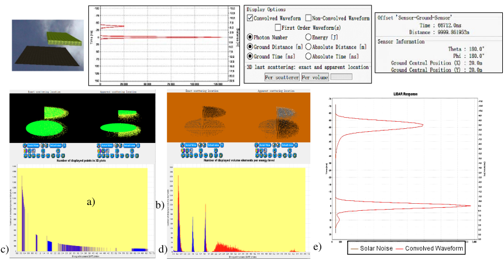
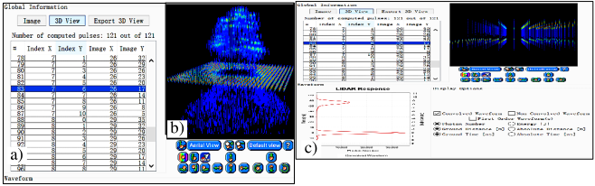

### **a) Mono pulse**

The menu (view $\rightarrow$ lidar $\rightarrow$ mono pulse) (see below) plots the waveform, and also 3D plots, and their histogram, of the LiDAR pulse with options *"Per scatterer"* and *"Per volume"* if the product "photon information" is created:

- <u>*Per scattering*</u>: plots per actual and per perceived location of the last scatterer. The histogram horizontal axis
shows the energy per scattering event in terms of actual photons. Its height is the number of scattering events
in the simulation. The cursor allows one to hide least energetic scattering events in the 3D displays.
- <u>*Per volume*</u> (i.e., cell): plots per actual and per perceived cell location. Histogram: horizontal axis = number
of photons scattered per cell, Vertical axis = number of cells that scatter a given number of photons per cell.

*Mono-pulse. a) 3D view of a "flying" plot. b) Convolved waveform: 1 peak for the ground and plot. Photon numbers are those at the entry of the lidar and not those launched by DART. c) 3D plot “Per scatterer” option. d) “Per volume” option. e) Waveform with solar noise. It is constant.*
</img>

### **b) Multi pulse**

The menu (view $\rightarrow$ lidar $\rightarrow$ multi pulse) (see below) displays the multi-pulse waveform based on the LiDAR binary and panel products. The "waveform" plot in the image b. below corresponds to the pulse selected in the image a. The image c. displays the 3D convolved waveforms colored by the energy level.

*LiDAR Multi-pulse. a) List of pulses. b) 3D plot of multi-pulse waveforms. c) Plot of the waveform selected in a).*
</img>

