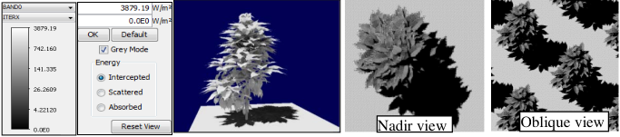

It plots the band RB of facets (see below) and volumes (simulate ground with facets to get an accurate ground RB).

*a) Radiative budget of a 3D object (cherry tree). b) Nadir and oblique views.*
</img>

