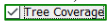
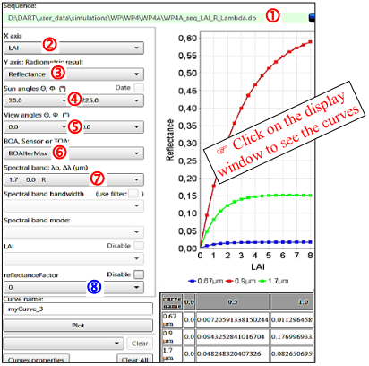

Option "View / LUT" is to plot and export (csv format) data from a multi-band simulation or a sequence of simulations with any variable input parameter(s). Y  axis is for radiance,… X axis  is the band for a multi-band simulation. For a sequence, X is any variable parameter ($\lambda$, LAI, sun  / view  angles, altitude , band , $\rho_{ground}$ ,...) or parameter (date, tree cover) derived from DART input parameters: ($\theta_{sun}, \phi_{sun}$) for 'date', (crown dimensions, density) for 'tree cover', if  is set in the sequencer LUT menu.

*LUT plot. $\rho_{turbid\:layer}(LAI)$. Sequence: 2 $\rho_{ground}$ (0: a, 1: b), 18 LAI ([0 8.5], $\Delta$ = 0.5), 3 bands (0.65, 0.9, 1.7$\mu$m). User setting: sequence , 0x  / 0y  axes, sun  / view  angles, altitude,.. , band , $\rho_{ground}$ .*
</img>

