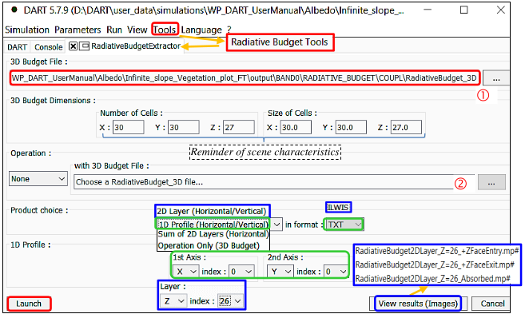

Using a 3D cell $RB_{\Delta \lambda}$ () or an addition / subtraction of two 3D cell $RB_{\Delta \lambda}$ ( + ) (see below), this tool gives:

- 2D $RB_{\Delta \lambda} \forall x, y or z \:plane$: text files or images (ILWIS format) that the menu "Search image" can display.	
- Energy budget 1D profiles for any (x, y), (x, z) or (y, z).

There are several 3D cell RB (i.e., cell interception / absorption / emission / scattering, cell face irradiance / exitance): for direct sun irradiance "ILLUDIR", direct and diffuse irradiance "ILLUDIFF", before ("IterX") and after ("Coupl") the atmosphere radiative coupling, if atmosphere RT is simulated, and also RB per iteration if set by the user.

!!! note
    $\frac {exitance\:of\:the\:top\:face\:of\:scene\:top\:cell\:xy\:(W/m^2/\mu m)} {irradiance\:of\:the\:top\:face\:of\:scene\:top\:cell\:xy\:(W/m^2/\mu m)}=$ exitance of the top face of scene top cell xy (%)=scene albedo $A_{xy}^{RB2}$

*3D RB extractor tool.*
</img>

Here, it extracts 1D RB profile (green) and 2D RB images (blue) from the 3D RB of an infinite slope with grass.
