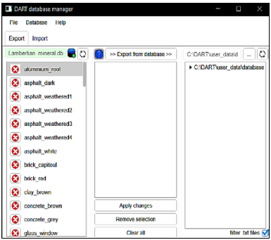

It creates / manages 2 types of DART input SQL databases:

- atmosphere. Example: `dart_atmosphere.db`
- optical property (III.4.9, IV.13)). Examples: `fluid.db`,`lambertian_mineral.db`, `lambertian_vegetation.db`,… 

It deletes tables, called models, in databases, exports them as text files (default folder: `DART\user\database`),imports them. 

<u>*Easy way to import*</u>: export a table of a DART database, modify its values (ascii format) and name, then import it. 

!!! note
    Tables of atmosphere database have a suffix per type of atmosphere table (e.g., _H2O for water vapor) that must be used when importing them. 
    
DART input databases can be managed by DART Python scripts & freewares (Firefox add-on SqLite manager: [addons.mozilla.org/fr/firefox/addon/sqlite-manager](https://addons.mozilla.org/fr/firefox/addon/sqlite-manager); SqliteBrowser: [sqlitebrowser.org](https://sqlitebrowser.org)) manage DART input databases.

*Tool "database manager".*
</img>

!!!note
    Imported text files: keep \n and remove the command \n.