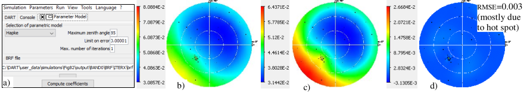

Python script `DisplayLutAndInversion\src\GenerateCoefficientsForOneSimulation.py` fits a mono-band reflectance file (brf) to a parametric model (Hapke, RPV 3-5 parameters, MRPV 4-5 parameters, Esteve) with $N_{iter}$ iterative calls to the iterative scipy function `fmin_bfgs.py` to get a relative $error < \epsilon_{max}$ for directions with maximal zenith angle $\theta_{max}$.

*BRF inversion. a) GUI. b) $BRF_{DART}$. c) $BRF_{fitted\:Hapke}$. d) $BRF_{difference}.\rho_{ground}=0.05$, LAI=2, $\theta_s=40°.\rho_{leaf \:deciduous}.550nm.$*
</img>

A text file (e.g., coefficients_Hapke) stores coefficients and RMSE. Increasing $N_{iter}$ does not always improve RMSE.

- <u>*Hapke*</u> (w, c1, c2, h1, h2): $R(\Omega_s,\Omega_v) = \frac {\omega} {4}.\frac {1} {cos(\theta_s)+cos(\theta_v)}.([1+B(\Omega_s,\Omega_v)].P(\Omega_s,\Omega_v) + H(\omega,\mu_s).H(\omega,\mu_v) - 1)$

$B(\Psi_{sv}) \approx h_1.[1 + \frac {1} {h_2}.tan(\frac {\Psi_{sv}} {2})]^{-1}\:\:H(\omega,x) = \frac {1 + 2.x} {1 + 2.x.\sqrt{1-\omega}}$

$\theta_s, \theta_v \in [0°\:90°] P(\Omega_s,\Omega_v) = 1 + c1.cos(\gamma_1) + c2.\frac {3.cos^2(\gamma_1) - 1} {2}$ for spheres with single scattering albedo $\omega$ ($\omega=1$ if one gets $\omega > 1$) and scattering phase function $P(\Omega_s,\Omega_v)$.

Here (Jacquemoud et al., 1992): $P(\Omega_s,\Omega_v) = 1 + c1.cos(\gamma_1) + c2.\frac {3.cos^2(\gamma_1) - 1} {2} + c_3.cos(\gamma_2) + c_4.\frac {3.cos^2(\gamma_2) - 1} {2}$

$cos(\gamma_1) =\Omega_s.\Omega_v= cos(\Psi_{sv}) = cos(\theta_s).cos(\theta_v)+ sin(\theta_s).sin(\theta_v).cos(\phi_{sv}), cos(\gamma_2)$ $= cos(\theta_s).cos()\theta_v)- sin(\theta_s).sin(\theta_v).cos(\phi_{sv}), \Phi_{sv}=\phi_v-\phi_s$

- <u>*RPV*</u> ($\rho_0$, k, g, h: [https://rami-benchmark.jrc.ec.europa.eu/_www/definition.php#def_rpv](https://rami-benchmark.jrc.ec.europa.eu/_www/definition.php#def_rpv)): $R(\Omega_s,\Omega_v) = \rho_0.M(\theta_s,\theta_v,k).F(\Psi_{sv},g).H(h,\Omega_s,\Omega_v)$

$M(\theta_s,\theta_v,k) =$ {$cos(\theta_s).cos(\theta_v).[cos(\theta_s) + cos(\theta_v)$]}$^{k-1}$, Henyey Greenstein function $F(\Psi_{sv},g)=\frac {1-g^2} {[1 + 2.g.cos(\Psi_{sv}) + g^2]^{3/2}}$

Hot spot $H = 1 + \frac {1-h} {1+G}$, $G = \sqrt{tan(\theta_s)^2+tan(\theta_v)^2-2.tan(\theta_s).tan(\theta_v).cos(\phi_s -\phi_v)}$, $\Psi_{sv} =acos(\overline{\Omega}_s.\overline{\Omega}_v)$ (DART RPV3: $\rho_0$,k,h)

- <u>*MRPV*</u> ($\rho_0$, k, c, h1, h2: RPV with new F and H terms): $R(\Omega_s,\Omega_v) = \rho_0.M(\theta_s,\theta_v,k).e^{-c.cos(\Psi_{sv})}.[1 + \frac {h_1} {1 + h_2.tan(\frac {\Psi_{sv}} {2})}]$

- <u>*Estève*</u> (c1,…, c6): $R(\Omega_s,\Omega_v) = (1 + c5.[1+\frac {1} {c_6}.tan(\frac {\Psi_{sv}} {2})]^{-1}).(c1 + c2.\theta_v.cos(\phi_{sv}) + c3.\theta_v^2.cos^2(\phi_{sv}) + c4.\theta_v^2.sin^2(\phi_{sv}))$
