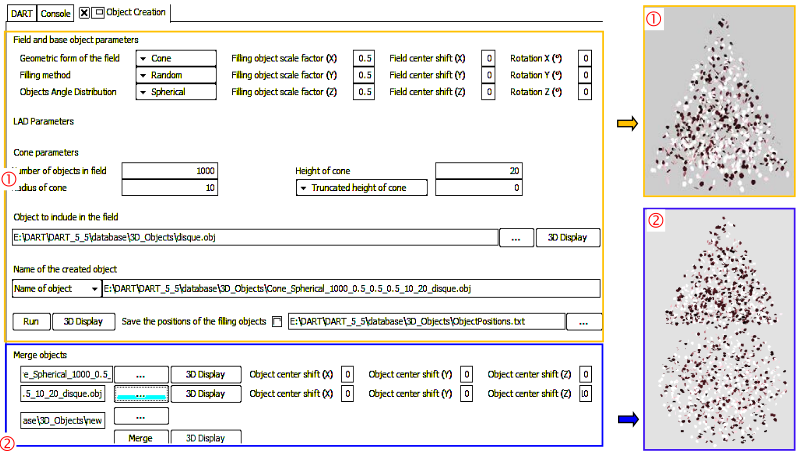

It creates two types of 3D objects (`*.obj`), compatible with DART ([here](../../6-View_menu/6.2/view_image.md)). The 3D object can be:

1. Set of N identical 3D objects. They are randomly or uniformly distributed in a volume V (i.e., box, sphere, cylinder, ellipsoid, cone) with given angular distribution of normals (e.g., spherical) and scale factors (x,y,z).
2. Juxtaposition of two 3D objects, possibly with some translation.

*Creation of a cone filled with disks. b) Juxtaposition of a cone and a sphere.*
</img>

