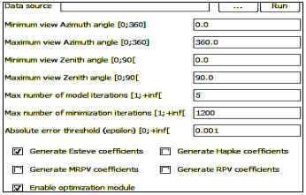

<u>*Generate inversion coefficients*</u>: a LUT of DART reflectance {$\rho(\Omega_s,\Omega_v,LAI,…)$} is transformed into a LUT of coefficients {$a_i(LAI,…)$} of a parametric reflectance model $M(\Omega_s,\Omega_v,a_1,a_2,…)$ that can be used for the inversion of remote sensing images (cf. "inversion procedure" in `Modules_User_Manual.pdf`) in terms of DART input (LAI,…) and/or derived (%C) parameters. 

<u>*Generate noised LUT*</u>: noise (gaussian, multiplicative, additional) is added to reflectance values {$\rho(\Omega_s,\Omega_v,LAI,…)$} of a DART LUT.

*BRF model inversion.*
</img>

