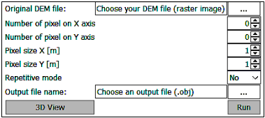
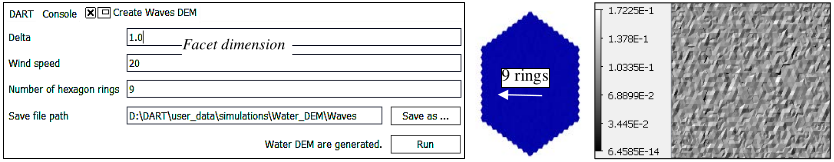
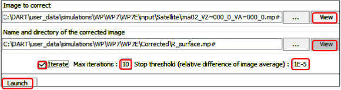

### **a) DEM convert raster map to 3D objects**

It creates a 3D object from a raster image.

*Creation of a 3D DEM object from a raster image.*
</img>

### **b) Creation of water DEM**

It creates a 3D object "water DSM" (juxtaposition of hexagons) due to a given windspeed (m/s).

*Creation of a 3D object "Water DEM".*
</img>

### **c) Topography correction**

Due to 3D effects (topography,…), the observed reflectance $\rho_{sat}$ and actual reflectance $\rho_{loc}$ of a surface (A) differ:

- Slope of (A) influences its local irradiance: $E_{loc}(x,y) = E_{sun}(x,y) + E_{sky}(x,y) + E_{env}(x,y) \forall (x,y)$, with direct sun $E_{sun}$, direct sky $E_{sky}$ and environment $E_{env}$ irradiance. $E_{loc}$ differs from the scene irradiance $E_{scene}(x,y)$.
- Surfaces around (A) tend to increase its $E_{env}$, and to decrease its direct sun $E_{sun}$ and atmosphere $E_{sky}$.

This DART tool derives $\rho_{loc}(x,y)$ from an atmospherically corrected satellite image $\rho_{sat}(x,y).\rho_{sat}$, $\rho_{loc}$ , $E_{scene}$ and $E_{loc}$ are linked to satellite radiance: $L_{sat} = \rho_{loc}(x,y,\Omega_v).\frac {E_{loc}(x,y)} {\pi} =\rho_{sat}(x,y,\Omega_v).\frac {E_{scene}} {\pi} \implies \rho_{loc}(x,y,\Omega_v) = \rho_{sat}(x,y,\Omega_v).\frac {E_{scene}} {E_{loc}(x,y)}$.

$E_{loc}(x,y)$ is needed for deriving $\rho_{loc}(x,y)$ from $\rho_{sat}(x,y,\Omega_v)$. Its usual estimation with analytic methods and local topography tends to be inaccurate. The DART tool computes iteratively $E_{loc}^{i}(x,y)$ and then derives $\rho_{loc}^{i+1}(x,y)$ from
$\rho_{sat}(x,y,\Omega_v)$. Conversely to $E_{sun}(x,y)$ and $E_{sky}(x,y)$, $E_{env}(x,y)$ varies with iteration i becaue it depends on $\rho_{loc}(x,y)$.

<u>*Steps to derive $\rho_{loc}(x,y,\Omega_v)$ from an atmospherically corrected and ortho-image $\rho_{sat}(x,y,\Omega_v)$*</u>

1. Set options {'OrthoImages (energy conservation)', 'Additional direction $\Omega_v$'} and run DART to create the mono band ortho-image $\rho_{sat}(x,y,\Omega_v)$ that you copy from folder "IMAGE_PROJETEE" to folder "input\Corrected".

2. Run the "Topographic correction" tool (see below; cf. WP7E, F) after setting its parameters: "File image of $\rho_{sat}(x,y,\Omega_v)$", "Folder" (here: "Corrected") to store image results (i.e., 'user_selected_name_iteri' $\rho_{loc}^{i}(x,y)$ and 'Rho_dart_iteri' $\rho_{DART}(x,y|\rho_{loc}^{i}(x,y),\Omega_v)$ per iteration i, initial 'Rho_satellite' $\rho_{sat}(x,y,\Omega_v)$), "Maximal number of iterations (here: 10)" and "Threshold" on $\frac {Mean[\rho_{DART}(x,y|\rho_{loc}^{i}(x,y),\Omega_v) - \rho_{sat}(x,y,\Omega_v)]} {Mean\:\rho_{sat}(x,y,\Omega_v)}$ (here: $10^{-5}$) to stop DART tool".

If N directions are added, the DART tool uses the $1^{st}$ one (i.e., $\Omega_v$). For i=0: $\rho_{loc}^0(x,y) = \overline{\rho}_{sat}(\Omega_v) = \overline{\rho}_{sat}(x,y,\Omega_v)$.

At iteration i, DART radiance along ($\Omega_v$) is: $L^i(x,y,\Omega_v) = \rho_{DART}(x,y|\rho_{loc}^{i}(x,y),\Omega_v).\frac {E_{scene}} {\pi}$

Using $L^i(x,y,\Omega_v) = \rho_{loc}^{i}(x,y).\frac {E_{loc}^{i}(x,y)} {\pi}$, we get $\frac {E_{scene}} {E_{loc}^{i}(x,y)} = \frac {\rho_{loc}^{i}(x,y)} {\rho_{DART}(x,y|\rho_{loc}^{i}(x,y),\Omega_v)}$

$\implies$ Local reflectance $\rho_{loc}^{i+1}(x,y) = \rho_{sat}(x,y,\Omega_v).\frac {\rho_{loc}^{i}(x,y)} {\rho_{DART}(x,y|\rho_{loc}^{i}(x,y),\Omega_v)}(\rho_{loc}^{1}(x,y)=\rho_{sat}(x,y,\Omega_v).\frac {\rho_{loc}^{0}} {\rho_{DART}(x,y|\rho_{loc}^{0},\Omega_v)})$

!!! note
    The DART tool is not adapted to landscapes that contain turbid / triangle vegetation.

*DART tool "Topography correction".*
</img>

