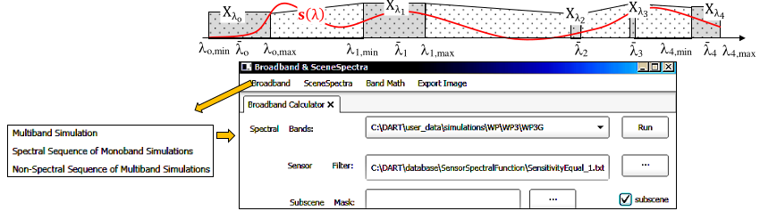
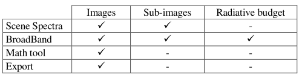

They process the $I_{\lambda}(i, j)$ images (i.e., BOA/Sensor/TOA radiance $L_{\lambda}(i, j)$, exitance $M_{\lambda}(i, j)$, irradiance $E_{\lambda}(i, j)$) of a scene or sub-scene, using a mask, of a multi-band simulation or spectral sequence of mono-band simulations. Broadband handles DART-FT $RB_{\Delta \lambda}$ and can run per simulation of a non-spectral sequence of multi-band simulations.

- <u>*Spectra*</u>: scene or sub-scene BOA / TOA / spectra in SceneSpectra folder. Note: DART LUT only gives scene spectra.

- <u>*Broadband:*</u> scene / sub-scene $X_{\Delta \lambda} = \frac {\int_{\Delta \lambda}s_{\lambda}.X_{\lambda}.d\lambda} {\int_{\Delta \lambda}s_{\lambda}.d\lambda}$ (Broadband folder) with rectangle + trapezoid methods, $X_{\lambda} =\:image\:I_{\lambda}(x,y)$ or 1D/2D/3D $RB_{\lambda}$ and sensor spectral sensitivity $s(\lambda)$ (default: $s(\lambda)=1$). With N bands over $[\lambda_{0, min};\:\lambda_{N-1,max}]$:

- Mode R, unit %: $X_{\Delta \lambda}=\frac {2.\sum_{0}^{N-1}\overline{s}_{\lambda_i}.X_{\lambda_i}.\overline{E}_{BOA,\lambda_i}.\Delta \lambda_i + \sum_{0}^{N-1}(s_{\lambda_i,max}.X_{\lambda_i}.E_{BOA,\lambda_i,max} + s_{\lambda_{i+1},min}.X_{\lambda_{i+1}}E_{BOA,\lambda_{i+1},min}).(\lambda_{i+1,min} - \lambda_{i,max})} {2.\sum_{0}^{N-1}\overline{s}_{\lambda_i}.\overline{E}_{BOA,\lambda_i}.\Delta \lambda_i + \sum_{0}^{N-1}(s_{\lambda_i,max}.E_{BOA,\lambda_i,max} + s_{\lambda_{i+1},min}.E_{BOA,\lambda_{i+1},min}).(\lambda_{i+1,min} - \lambda_{i,max})}$

- Mode R or T, unit $W/m^2/\mu m$: $X_{\lambda, \Delta \lambda} = \frac {2.\sum_{0}^{N-1}\overline{s}_{\lambda_i}.X_{\lambda_i}.\Delta \lambda_i + \sum_{0}^{N-1}(s_{\lambda_i,max}.X_{\lambda_i} + s_{\lambda_{i+1},min}.X_{\lambda_{i+1}}).(\lambda_{i+1,min} - \lambda_{i,max})} {2.\sum_{0}^{N-1}\overline{s}_{\lambda_i}.\Delta \lambda_i + \sum_{0}^{N-1}(s_{\lambda_i,max} + s_{\lambda_{i+1},min}).(\lambda_{i+1,min} - \lambda_{i,max})}$

*Broadband tool.*
</img>

"Rectangle" integral for DART bands, and "Trapezoid" for non simulated bands. a) Case of 5 non adjacent bands. b) Menu.

- <u>*Band math*</u>: basic image operations with arithmetic and logical operators (+, -, *, /, >,...). A operators are pre-defined for classical band ratio indices (NDVI,…). 
    - *Example of operation*: Image = if(Image1>5, Image1, Image2) ⇔ Image = (Image1>5) *  Image1 + (Image1<=5) * Image2
- <u>*Export*</u>: a single DART image or all images of a simulation are exported into ENVI and GeoTiff format.

*Band calculation tools and their application to images, sub-images and radative budget.*
</img>

