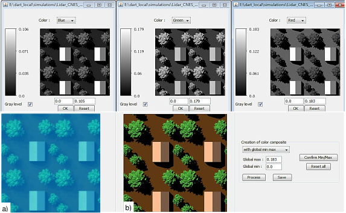

This tool creates RGB color composites of DART radiance, reflectance and temperature images (see below).

*RGB color composite of 3 DART images. a) TOA. b) BOA. 3D cherry tree (AMAP: [amap.cirad.fr](https://amap.cirad.fr)).*
</img>

