# DART Model

### Description

Developed since 1992, DART (Discrete Anisotropic Radiative Transfer: [https://dart.omp.eu](https://dart.omp.eu)) is one of the most comprehensive RT models for simulating the 3D RB (*i.e*., absorbed, emitted, scattered and intercepted radiation) and RS observations of natural (forest, agricultural crop,...) and urban landscapes, with topography and atmosphere (See below) over the entire optical domain (UV, VIS, NIR, TIR). It is adapted to any experimental (*e.g*., atmosphere, date / sun 
direction,..) and instrumental (*e.g.*, viewing direction, altitude, spatial / spectral resolutions,...) configurations. 

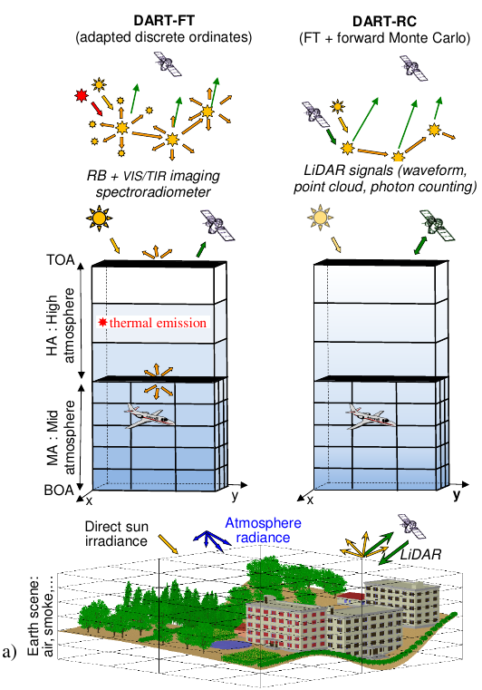 
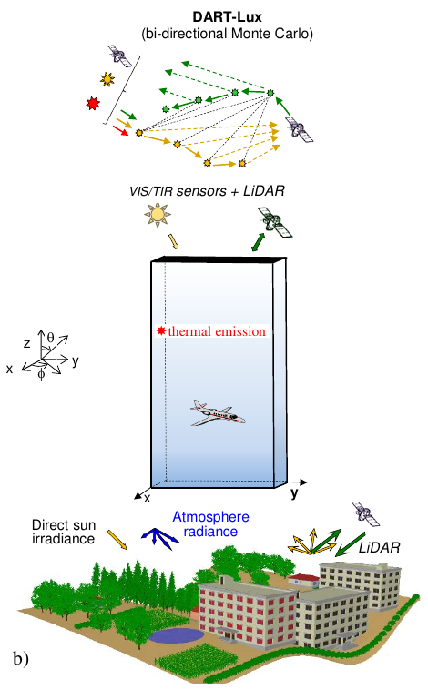 
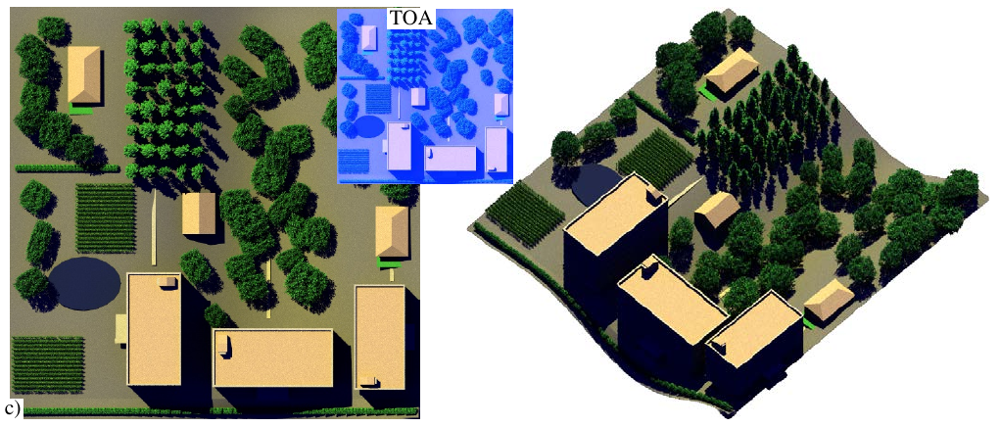*DART modeling: Earth-Atmosphere geometry (trees, maize fields,...) and radiation. a) DART-FT and DART-RC cell matrix with 3 atmosphere levels: top (i.e., layers), mid and within Earth scene. b) DART-L ux. c) BOA and TOA DART-Lux images (10 cm resolution).*</img>

It is adapted to any experimental (e.g., atmosphere, date / sun direction,..) and instrumental (e.g., viewing direction, altitude, spatial / spectral resolutions,...) configurations. DART accuracy has already been successfully tested for simulating vegetation canopy directional reflectance (RAMI experiments: [https://rami-benchmark.jrc.ec.europa.eu](https://rami-benchmark.jrc.ec.europa.eu), in-situ and airborne data) and brightness temperature at bottom (BOA) and top (TOA) of the atmosphere. It has many applications: 

1. RS image inversion
2. Satellite sensor design (e.g., LiDAR planned on NASA’s DESDynl mission: www.decadal.gsfc.nasa.gov/ DESDynl.html, LiDAR and high spatial resolution Pleiades mission of CNES : [https://pleiades.cnes.fr/fr](https://pleiades.cnes.fr/fr))
3. Impact study of canopy structure on satellite image texture and reflectance
4. 3-D photosynthesis and primary production rates in vegetation canopies
5. Design of chlorophyll index for evergreen conifer forests
6. Study of tropical forest texture, among others. It is increasingly used by research centers and space agencies (CNES , NASA,...). It was patented in 2003 (PCT / FR 02/01181). Toulouse III University (France) distributes its licenses. 

DART simulates two major products:

- <u>*Remote sensing acquisitions*</u> (forest and city below): imaging spectro-radiometers and scanning LiDAR (discrete return, waveform, photon counting) on-board satellite/aircraft (ALS: Airborne Laser Scanner) or terrestrial platforms (TLS: Terrestrial Laser Scanning). Terms BOA, Sensor and TOA indicate that simulated images are for a sensor at the bottom, within and top of the atmosphere. The DART folder " BRF " stores BOA products.
- <u>*Radiative budget*</u>: 3D emitted, scattered, intercepted and absorbed radiation, including sun induced fluorescence ( SIF) of vegetation. It is useful to model vegetation functioning (e.g., photosynthesis, fluorescence,...) and urban climate.

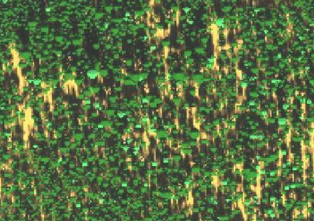 
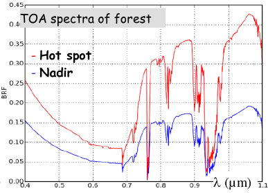
*DART simulated Chris hyperspectral sensor. Howland forest, USA. a) Image. b) TOA VIS-NIR spectra.*
</img> 

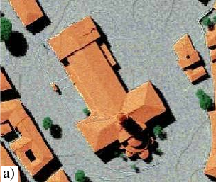 
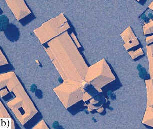 
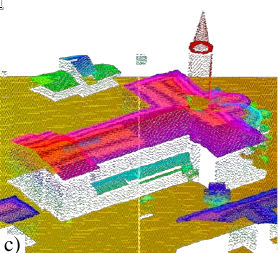 
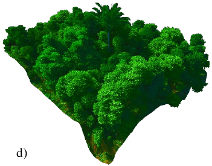 
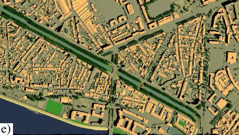 
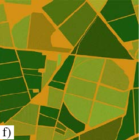
*DART simulations. BOA camera (a), TOA camera (b) and airborne LiDAR (c) images of St Sernin basilique and BOA camera (e) of Brienne district (Toulouse). d) Tropical forest. f) Grossetto agricultural region, Italy.*
</img> 

### Modes

DART has 3 major modes (see the table below):

- **DART-FT**: it simulates the RB and spectro-radiometer images of Earth surfaces with a so-called Flux Tracking (FT) approach, based on the "discrete ordinate" method with any number of discrete directions.
- **DART-RC**: it simulates LiDAR signals with a so-called Ray-Carlo (RC) approach that combines ray tracking and forward Monte Carlo (MC) methods.
- **DART-Lux**: it is developed since 2018 to improve DART-FT / RC accuracy and efficiency of to simulate complex and large landscapes. It adapts a Bidirectional Path Tracing (BPT) algorithm from LuxCoreRender [luxcorerender.org](https://luxcorerender.org), that solves the light transport equation with MC integration techniques. Unlike the path tracing algorithm (Kajiya, 1986), the BPT algorithm constructs paths that start from the camera at one end, and from a light source at the other end, and connects them. Its computation time and RAM need can be over $10^2$ times lower than DART-FT ([see this image](../Tutorials/T0/t0.md#c-lidar-discrete-return-wp0gc-ct-23)). It gradually integrates DART-FT and DART-RC features. It already simulates TOA and BOA reflectance, SIF, thermal emission and LiDAR signals of natural and urban and landscapes. RB is being completed.

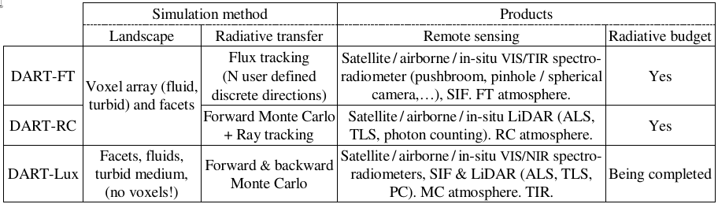
*DART modes to simulate urban and natural landscapes, and their RB and RS acquisitions.*
</img>

### Scenes

DART simulates complex 3D landscapes by combining imported scene elements (see below). A scene is made of facets (triangles) and volumes filled with turbid medium and fluids (air, soot, water,...). In DART-Lux, a volume has any shape, whereas it is part of a cell (voxel) array in DART-FT and DART-RC . "Turbid" is a statistical representation of vegetation: infinite number of infinitely small flat facets with an angular distribution ($sr^{-1}$), area volume density ($m^2/m^3$), and optical properties (lambertian, specular). Fluids are defined by their particle density, cross section, single scattering albedo and scattering phase function. Facets simulate vegetation, houses,... They have any orientation, area and optical property (lambertian / specular reflectance, isotropic / direct transmittance). DART has SQL databases for the atmosphere (gas / aerosol models) and spectral properties of elements (leaf,...). It has a GUI to enter and display input parameters (i.e., spectra, 3D scene,...), to specify and display products (images, lidar waveform, radiative budget,...), to transform products, to run sensitivity studies, etc.

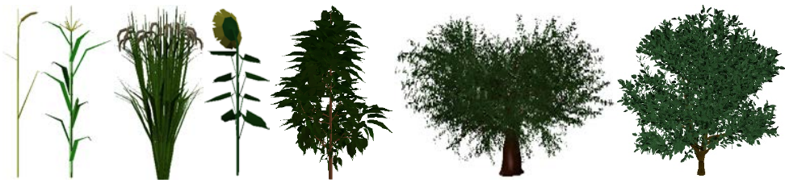 
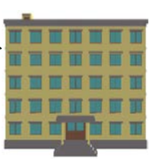 
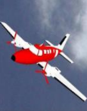
*3D objects provided with DART: wheat, maize, rice, sunflower, cherry tree, olive tree, citrus, building, plane.*
</img>

This manual was initially written for DART-FT and RC. Now, DART-Lux is being introduced. Therefore, the "DART-Lux" sections are not as up-to-date as expected. Also, a new GUI is on the way... At this stage, the DART user is advised to learn first DART-FT before DART-Lux.

!!! Note
    *Many DART papers on the DART web site [dart.omp.eu/index.php#/doc](https://dart.omp.eu/index.php#/doc)*
