DART stores input data as xml files in the "input" folder of the current simulation and results (e.g., reflectance files,…) in text and binary files in the "output" folder. 

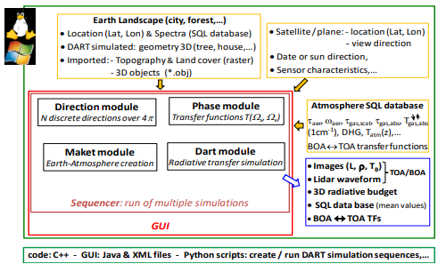
*General architecture of DART.*
</img>

### **1) Directions.txt & Directions.xml**

The module Directions (Section [III.4.8](../../DART_functionalities_and_products/4-Radiative_modes_sub_modes/4.8/directions_of_rays.md)) uses `directions.xml` (input parameters) to create DART discrete directions (`directions.txt`). Here (see below), it creates $\approx 1000$ directions in 10 sectors, $\theta_{sun}=50°$, $\phi_{sun}=225°$, no added direction.

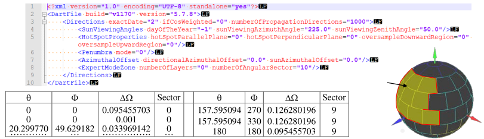
*Files direction.xml (top) and directions.txt (bottom), and 3D display of directions.*
</img>

### **2) LAD (Leaf Angle Distribution) derived files**

The Phase module computes the fraction of leaf area Af over $[\theta_f;\: \theta_f+\Delta \theta_f]$. Two files are created:

- <u> ***`LAD *.txt`*** </u> (text file) with *= SPHERIC, etc.: {$\theta_f$, normalized $g(\theta_f).sin(\theta_f)$; $\Delta \theta_f=0.5°=8.73\:10^{-3}\:rd$} created in the user database, if not yet present, for all LADs except the ellipsoidal / elliptical and "user defined" LADs (i.e., LADs derived from DeWit/Bunnik ([http://rami-benchmark.jrc.ec.europa.eu/html/definitions/definitions.php](http://rami-benchmark.jrc.ec.europa.eu/html/definitions/definitions.php)). Only the phase module uses it.

- <u> ***`leafAngleDistributionFunctionVector[i].txt`*** </u>: (text file); i=turbid index: {$LAD_{index}, \theta_f$, normalized $g(\theta_f).sin(\theta_f).\Delta \theta_f$; $\Delta \theta_f=user \:defined \geq 1°$} in 'output/lib_phase' if required or if maket module transforms turbid medium as triangles. $LAD_{index}$=0: uniform, 1: spheric, 2: erectophile, 3: planophile, 4: extremophile, 5: plagiophile, 6: horizontal, 7: vertical, 8: ellipsoidal, 9: elliptical,10: user defined (text file), 11: de Wit. 12: uniform bounded. Note that 6 / 7 are exactly vertical / horizontal only for triangles.

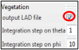</img>

The Phase module also computes binary files designed to manage scattering and interception (transmittance) events: 

<u>`j3D_....txt_diff`</u>: {$T_{diff}(\Omega_{sun},\Omega_i), T_{diff}(\Omega_{sector,k},\Omega_i), TG_{diff}(\Omega_i)$} of all bands, with j the leaf species index, $k \in [1;\:K$=Number_of_sectors] and $i \in [1;\:I$=Number_of_directions].

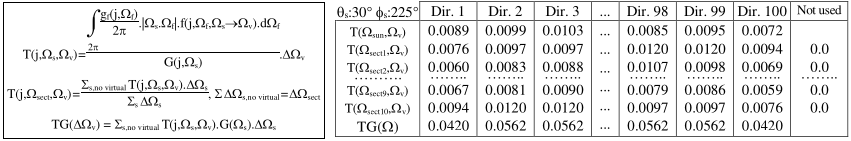
*File *_diff: $T(\Omega_s,\Omega_i), T(\Omega_{sector,k},\Omega_i), TG(\Omega_i)$ with $k \in [1;\: 10]$, $i \in [1;\: 100]$. DART option 'Specular' $\implies$ no line $TG(\Omega)$. $\rho_f:0.5$. $\tau_f:0.4.$ LAD spherical.*
</img>

<u>`j3D_...txt.spec`</u>: created per leaf species j if there is leaf specular scattering ($\implies$ possible polarization). For all spectral bands, each file stores: {$T_{spec}(j,\Omega_{sun},\Omega_V)_{v=1..N}$, $T_{Polarization}(j,\Omega_{sun},\Omega_V)_{v=1..N}$, $T_{spec}(j,\Omega_I, \Omega_V)_{I=1..S,v=1..N}$, $TG(j,\Omega_V)_{v=1..N}$, $TG_{spec}(j,\Omega_V)_{v=1..N}$, $S_1(j,\Omega_{sun},\Omega_V)_{v=1..N}$, $S_{1,moy}(j,\Omega_V)_{v=1..N}$, $S_M(j,\Omega_V)_{v=1..N}$, $p_1(j,\Omega_V)_{v=1..N}$}; S= Number of angular sectors.

<u>`*_diff_mc`</u> and <u>`*spec_mc`</u>: created for *Lidar and Monte Carlo modes* (see below).

*File `*_diff_mc`: $T(\Omega_n, \omega_i)$ with $n \in [1;\:N+1]$ and $i \in [1\:100]$. Sun direction is n=1*
</img>

<u>`j3D...transm` file</u> (see below): $G(\Omega_i)$ for "all directions of directions.txt + sun direction with null solid angle".

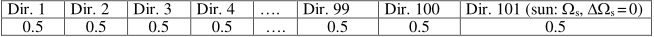
*File `j3D_...txt_transm` ($G(\Omega)$ for 100 directions + sun direction (101). Spherical LAD.*
</img>

### **3) Optical properties SQL databases (Lambertian_mineral.db,…)**

The "Database Manager" (III.7.11) manages DART SQL databases (see below) that store in tables optical properties from users or databases (e.g., [speclib.jpl.nasa.gov](https://speclib.jpl.nasa.gov), [icess.eri.ucsb.edu/modis/EMIS/html/em.html](https://icess.eri.ucsb.edu/modis/EMIS/html/em.html), [usgs.gov/labs/spec-lab](https://usgs.gov/labs/spec-lab)).

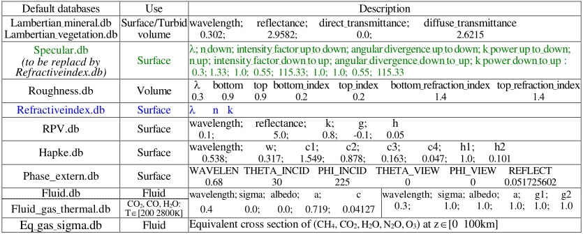
*Parameters (cf. III.4.9) of DART default databases with header and 1st line of one of their models.*
</img>

Surface: $\rho_{specular} = A.\rho_{Fresnel}$ (refraction index n): cst, Gaussian or parabolic in a cone (angular_divergence) around specular direction.

Turbid:for each surface element $\rho_{leaf,specular,turbid medium} = K_{fj}(\Psi_{fs}).\rho_{Fresnel}$ ($n_{inf}$ or $n_{sup}$), with $K_{fj}(\Psi_{fs})=K_{fj0}.e^{[-k_{fj}.tan(\Psi_{fs})]}$.

Units: $\mu m$ for wavelength, 1 = 100% for reflectance / transmittance, no unit for albedo, ° for angle, and $m^2$ for cross section (sigma). The optical depth of a gas/aerosol layer (volume density N, depth $\Delta l$) is: $N.Sigma.\Delta l$.

<u>*Fluids*</u>. Two types of scattering phase functions $\frac {P(\Psi_{sv})} {4\pi}$. Their selection is automatic: it depends on their number of parameters.

- Rayleigh (gas,…): $\frac {P(\Psi_{sv})} {4\pi}=\frac {1} {4\pi}.[a.(1+cos^2(\psi_{sv})) + c]$; $\Psi_{sv} = phase\:angle$ (forward scattering $\implies$ $\Psi_{sv}=0$), $cos(\Psi_{sv}) = [cos(\theta_v).cos(\theta_s) + sin(\theta_s).sin(\theta_v).cos(\Phi_v-\Phi_s)]$
    - Parameters for gases: $a=\frac {3} {2}.\frac {1 - \delta} {2 + \delta}$ with $\delta=$ polarization ratio ($\delta=0.0279$ at $0.65\mu m$), $c=\frac {3\delta} {2 + \delta}$
    - Actual Rayleigh function: $P(\Psi_{sv}) \approx \frac {3} {2}.\frac {1 - \delta} {2 + \delta}.[\frac {1 + \delta} {1 - \delta} + cos^2(\Psi_{sv}) \approx 0.7603 + 0.719.cos^2(\Psi_{sv})]$

- Double Henyey-Greenstein (aerosol,...): $\frac {P(\Psi_{sv})} {4\pi} = \frac {1} {4\pi}.[\frac {a.(1-g_1^2)} {[1 + g_1^2.2g_1.cos(\Psi_{sv})]^{3/2}} + \frac {(1-a).(1-g_2^2)} {[1 + g_2^2.2g_2.cos(\Psi_{sv})]^{3/2}}]\:\:\:(c \equiv g_1)$ with g=0 $\implies$ isotropic (forwward scattering = backward scattering). g=1 $\implies$ Dirac (forward scattering)

### **4) 3D factor matrix text file**

It stores multiplicative factors of an optical property per cell, ordered from bottom to top scene (see below), as in the 2D scene display of the simulation editor: origin = top left corner, then columns (y), then lines (x), then altitudes (z).

Field separators are semi-column, space, or tab. If the option “Duplicate first voxel layer” is set, the input file is a 2D array that DART duplicates as a 3D array ($\implies$ constant optical property along the z-axis). If the simulated scene is a sub-zone, the first line of the file must contain the word: sub-zone.

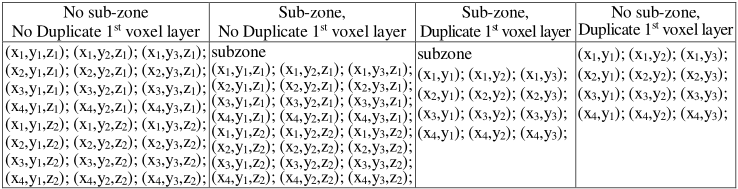
*3D factor matrix text file for a scene with x=4, y=3, z=2.*
</img>

### **5) Temperature: temperatures.txt and temperaturesPerTrianglePerCell.txt**

- <u>*temperatures.txt*</u>: 3D mean thermodynamic temperature per voxel (for all elements), from bottom to top.

- <u>*temperaturesPerTrianglePerCell.txt*</u>: thermodynamic temperatures of face 1 ($T_1$) and face 2 ($T_2$) of each triangle t per cell (i,j,k). Per line: i.j.k.t:$T_1$;$T_2$;A, with triangle area A.

### **6) Triangles area per voxel, dart.typ,…**

- <u>*`triAreaPerCell.txt`*</u> text files (folder "triAreaPerCell"): area of all triangles and triangles of type X, per cell.

- <u>*`dart.typ`*</u> (text file in input folder): list of present materials (i.e., colors defined in "3D imported object").

### **7) Plots: Plots.txt and information file CoverMapExample.txt**

Plots (ground, vegetation, fluid) can be created in DART GUI (stored in plots.xml file) and/or added using either:

- `plots.txt` file. An example is in DART database; the file header gives the format. Very useful if there are many plots.
- CoverMap image and a text file (`CoverMap.txt`) that links pixel values Pi and plot parameters (type,…). Examples are in DART database: `CoverMapExample.mp#` ([example](../../Tutorials/T5/t5.md#1-cover-map-importation-wp5a-ct10): $P_i$ = 1, 3, 5 and 7) and `CoverMapExample.txt` (see below).

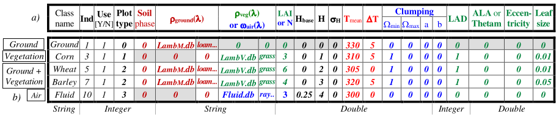
*Format of the information file of CoverMap.This example (`CoverMapExample.txt`) is in DART database.*
</img>

Each line the field values of a plot, separated by blank characters or tabulation. Useless fields have any value (e.g., 0):

- Class name. It must not contain any blank character!
- Class index. It is the pixel value in the raster map.
- Use of plot: 1 if the plot is used, 0 if it is not used.
- H: Average height of the vegetation plot or fluid plot
- Leaf size (m): for simulating hot spot in short waves.
- Type of soil phase function: Lambertian: 0, Lambertian + specular: 1, or Hapke: 2
- HBase: Height of the base of the vegetation plot or fluid plot above the ground
- $\Omega_{min}, \Omega_{max}$, a, b: Angular weights of vegetation function $G(\Omega)$ (default values (1,0, 0, 0)).
- LAD: Leaf Angle Distribution 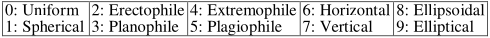
- After 'LAD column': ellipsoidal LAD $\implies$ {ALA,0}, elliptical LAD $\implies$ {Thetam, Eccentricity}, other LAD $\implies$ {0,0}
- $T_{mean}, \Delta T$: Mean temperature and temperature range (K)
- Name of the spectral database.
- Type of plot: Ground: 0, Vegetation: 1, Ground + Vegetation: 2, Air: 3
- $\sigma_H$: Standard deviation of vegetation or fluid's height.
- Vegetation plot's LAI or fluid plot's particle volume density.

### **8) Turbid trees: Tree.txt and Branch.txt**

<u>***`Tree.txt`***</u>: a line per tree. It stores tree parameters in labelled columns (see below):

- SPECIES_ID: species, POS_X: X, POS_Y: Y, T_HEI_BELOW: Trunk height below crown,
- T_HEI_WITHIN (Trunk height within crown), T_DIA_BELOW (Trunk diameter below crown),
- T_ROT_NUT / T_ROT_PRE (°): Trunk nutation / precession rotation (°),
- C_TYPE: Crown type (0 = ellipsoid, 1=ellipsoid composed, 2=cone, 3=trapezoid, 4=cone composed),
- C_HEI: Crown height,
- C_ROT_INT / C_ROT_NUT / C_ROT_PRE (°): Crown intrinsic / nutation / precession rotation,
- C_GEO_1: Crown geometry. 
    - If crown type = ellipsoid or ellipsoid composed, C_GEO_1 = 1st axis, 
    - if crown type = cone or cone composed, C_GEO_1 = bottom radius,
    - if crown type = trapezoid, C_GEO_1 = bottom length.
- C_GEO_2: Crown geometry. 
    - If crown type = ellipsoid or ellipsoid composed, C_GEO_2 = 2nd axis,
    - if crown type = cone or cone composed, C_GEO_2 = top radius,
    - if crown type = trapezoid, C_GEO_2 = bottom width.
- C_GEO_3: Crown geometry. 
    - If crown type = ellipsoid composed, C_GEO_3 = half heigth of lower ellipsoid if crown type = cone composed, C_GEO_3 = cylinder height,
    - if crown type = trapezoid, C_GEO_3 = top length,
    - if other crown type, C_GEO_3 = undefined.
- C_GEO_4: Crown geometry parameters. 
    - If crown type = trapezoid, C_GEO_4 = top width,
    - if other crown type, C_GEO_4 = undefined.
- LAI (optional): tree leaf area if LAI > 0 or leaf volume density if LAI < 0. If present, it replaces the LAI set in the GUI

*Case "Exact position + Exact dimensions": tree file in DART database. Trees 1, 2: ellipsoid, tree 3: cone.*
</img>

<u>***`Branch.txt`***</u> (schematic geometry): $N_{branches}$ followed by 1 branch / line: relativeHeight $\theta\:\phi$ relativeRadius relativeLength $N_{facets}$

- relativeHeight ([0 1]): relative height of branch origin on trunk; % of "trunk + crown" height.
- $\theta$ (°), $\phi$ (°): zenith and azimuth angles of the branch direction.
- relativeRadius ([0 1]): branch base relative radius; % of trunk radius at branch base level.
- relativeLength ([0 1]): branch relative length. For branches below the tree crown: % of mean crown radius.
For branches in the tree crown: % of the length "branch base - point of intersection "branch - tree crown".
- $N_{facets}$: number of facets (triangles) used to build the branch, in addition of the triangles of the branch base.

### **9) 3D object: * .obj and * .mtl files, and object field**

- **obj & mtl text files** ([web.cse.ohio-state.edu/~shen.94/581/Site/Lab3_files/Labhelp_Obj_parser.htm, en.wikipedia.org/wiki/Wavefront_.obj_file](https://web.cse.ohio-state.edu/~shen.94/581/Site/Lab3_files/Labhelp_Obj_parser.htm, en.wikipedia.org/wiki/Wavefront_.obj_file))

Data needed by DART is in bold. Obj file: it stores a 3D geometric model (**vertex coordinates, faces**, normals, textures, **group names**,…); each line starts from a special 1st character or word; indices start from 1. The mtl file stores **color per group**.

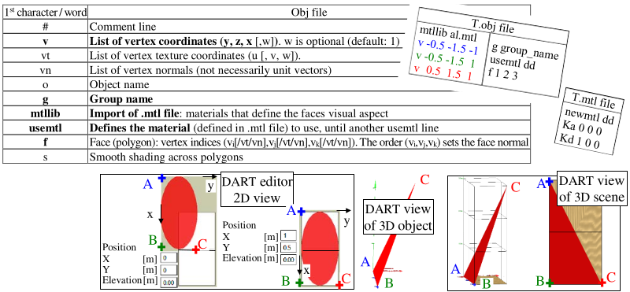
*`T.obj` and `T.mtl` of centred triangle ABC. $AB=\Delta x=2m$ in `T.obj` and DART. Note that DART only affects the display and not the values of $M_{xyz}, \Omega_{sun}\: and \:\Omega_{view}$.*
</img>

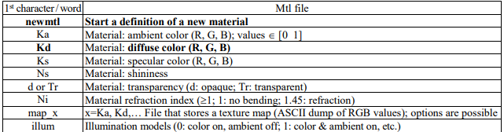
*obj and mlt files.*
</img>

- **Object field**: ASCII file with values in full (no scientific notation), separated by spaces or tabulations, with 1 line per description of object. Accepted comments: /* …. */ and // …. [end of line]'. There are 2 formats: "exact location + random characteristics" and "Exact location + Exact characteristics"

    1. <u>*Exact location + Random characteristics*</u>. Per line: Object_Model_Index $X_{pos}, Y_{pos}$ Object_Model_Index: Index of the model of the 3D object. Index 0 is for the 1st model to be input,... $(X_{pos}, Y_{pos})$: X and Y Positions (float number in meters) If location $(X_{pos}, Y_{pos})$ is outside the scene, the object will not be created.

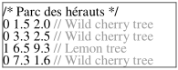
*Field file for case "exact location + random characteristics". The index informs on the object type. Here, index "0" informs that the $1^{st}$ object is "Wild cherry tree".*
</img>
  
    2. <u>*Exact location + Exact characteristics*</u>
        - Header: complete transformation
        - Per line: Object_Model_Index $X_{pos}, Y_{pos}, Z_{pos}, X_{scale}, Y_{scale}, Z_{scale}, Z_{rot}, Y_{rot}, Z_{rot}$ 
        
Object_Model_Index: Index of the 3D object. Index 0 is for the 1st model to be input in DART, etc.
    
$X_{pos}, Y_{pos}, Z_{pos}$: X, Y and Z Positions (float number in meters). By default: $Z_{pos} = 0$.

If location $(X_{pos}, Y_{pos}, Z_{pos})$ is outside the scene, the object will not be built.
$X_{scale}, Y_{scale}$ and $Z_{scale}$: X, Y and Z scale factors (float number; 1 by default)
$Z_{rot}, Y_{rot}$ and $Z_{rot}$: Oz (intrinsic), Oy (nutation) and Oz (precession) rotations (float number; 0 by default)

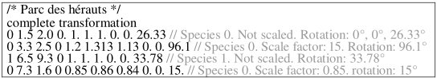
*Field file: case "exact location + exact characteristics". There are two 3D objects: indices 0, 1.*
</img>

### **10) Solar constant.db and BandIrradianceFile.txt**

<u>*Solar_constant.db*</u>: 10 spectral solar constant spectra {$E_{TOA}(\lambda)$: $W/m^2/\mu m$; specific spectral resolution} stored in tables: CebChKur, ChKur, Kurucz97 (default in Modtran): $[0.2 \:- \:200\mu m]$; FonTenla, Kurucz95, Kurucz2005: $[0.2 \:-\: 10^4\mu m]$; ThKur[^1] (Thuillier + corrected Kurucz): $[0.05\: -\: 10^3\mu m]$; TSIS2019_0025nm / TSIS2019_01nm / TSIS2019_1nm: $[0.2\mu m \: -\: 2.73\mu m]$ [https://lasp.colorado.edu/lisird/data/tsis1_hsrs](https://lasp.colorado.edu/lisird/data/tsis1_hsrs) extended to $10^5\mu m$ with Kurucz2005. Other tables can be added.

!!! note
    DART corrects $E_{TOA}(\lambda)$ of Earth-Sun distance d(J) with an equation $E_{TOA} \equiv \frac {1} {d(J)^2}$ similar to ESA [https://sentinel.esa.int/web/sentinel/technical-guides/sentinel-2-msi/level-1c/algorithm](https://sentinel.esa.int/web/sentinel/technical-guides/sentinel-2-msi/level-1c/algorithm).

<u>***`BandIrradianceFile.txt`***</u>: it stores $E_{BOA}(\lambda)$ (i.e., irradiance or solar constant depending on DART option) and $SKYL(\lambda)$. Options "No Atmosphere" and "Spectral radiation text file" can use it.

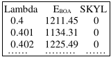</img>

### *11) Atmosphere SQL input databases (atmosphere.db, H2Oground.db)**

- ***Atmosphere.db***  
User data can be input. Henyey Greenstein parameters result from the fit of Lowtran scattering phase functions. All other spectral data must have the same resolution $\Delta \nu$. `Atmosphere.db` data are derived from the Modtran model $(\Delta \nu=1cm^{-1}$, 36 layers): 6 gas (USSTD76, SUBARCWIN,…) and 7 aerosol (RuralV5,…) models.

	1. <u>*Gas*</u> (index g): $g_{scat}$, $H_2O$, $O_3$, $N_2$, $CO_2$, $CO$, $CH_4$, $N_2O$, $O_2$, $NH_3$, $NO$, $NO_2$, $SO_2$, $HNO_3$, $g_{other}$
        - `*_gECP`: gas density (atm cm/km, except $N_2$: $g/cm^2.km$) at 36 layers, per gas model (*).
        - `*_gH2O`: spectral transmittance $T_{H_2O}$ ($T_{H_20}^{continuum}, T_{H_20}^{line-by-line}$), for N $H_2O$ content (default value x 0.1 n), with $n \in [1\:N]$ the index of the N tables (21 for USSTD, 16 for Sub Artic winter,…)
        - `*gTEMP`: gas temperature & pressure (atm-cm/km; for $N_2$ and gas_scat: relative density to air at STP) at 36 altitudes.
        - `*gTRANS`: total up and down spectral transmittance of absorbing gases $T_{gas,abs}^{\uparrow \downarrow}$ (t_total_ud_abs), and spectral transmittance of all scattering gases $T_{gas,scat}$ (t_mol_scat) and per absorbing gas $T_{gas,abs}.T_{H_2O} = T_{H_2O}^{continuum}.T_{H_2O}^{line}$
        - `*g_pH2O`: $H_2O$ content (atm.cm, $g/cm^2$ + atm.cm/km at 0 & 1km), temperature (K) at 0 & 1km altitude.

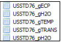
*Gas table.*
</img>

	2. <u>*Aerosol tables*</u> (index a)  
        - `*gas_model_*_aAOD`: spectral Aerosol Optical Depth (AOD) per gas model *.
        - `*aECP`: normalized Extinction Coefficient vertical Profile at 36 altitudes.
        - `*aHG`: Henyey Greenstein (HG) coefficients (a, $g_1$, $g_2$) at 27 wavelengths.
        - `*_RH00_aHG`, `*_RH80_aHG`, `*_RH99_aHG`: HG coefficients per aerosol model that depends on humidity, for 0%, 80% and 99% relative humidity (RH). `*aHG` is for RH=70%. From the fit of Lowtran scattering phase functions.
        - `*_AGED_VOLC_aHG`, `*_FRESH_VOLC_aHG`, `*_STRT_H2SO4_aHG`, `*_MET_DUST_aHG`: HG coefficients for aerosols that do not depend on humidity.

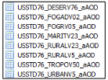</img> 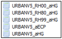</img>

!!! note 
	Modtran simulations without aerosol are used to compute the absorption gas "Direct - Direct" transmittance $T_{gas}^{\uparrow \downarrow}$ and scattering gas direct transmittance $T_{gas,scat}(T_{gas,scat} = T_{gas,scat}$); for the latter one, $\rho_{ground} = 1$ in DART simulations.

<u>*Band $\Delta \lambda$ without gas absorption*</u>: $T_{gas}^{\uparrow \downarrow} \approx T_{gas,abs}^2$, with $T_{gas,abs} = T_{CO2,abs}.T_{CO,abs}.T_{CH_4,abs}....T_{O_3,abs}$.

<u>*Band $\Delta \lambda$ with gas absorption*</u>: Beer law becomes inaccurate $\implies$ $T_{gas,abs}^{\uparrow \downarrow} \neq (T_{gas,abs}^{\downarrow})^2$. DART uses downward transmittance $T_{gas,abs}^{\downarrow} = T_{gas,abs} = T_{CO_2,abs}.T_{CO,abs}....T_{O_3,abs}$ and upward transmittance is $T_{gas,abs}^{\uparrow} = \frac {T_{gas}^{\downarrow \uparrow}} {T_{gas,abs}^{\downarrow}.T_{gas,abs}^{2}}$

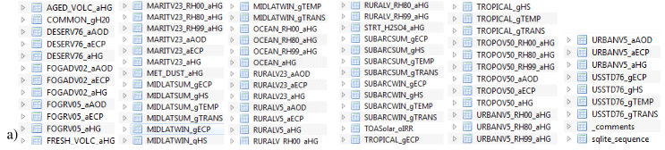
*a) Tables of
atmosphere database.*</u></img>

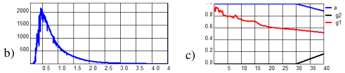
*b) $E_{TOA}$. c) HG coefficients.*
</img>

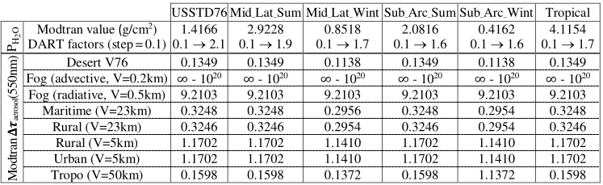
*DART database. a) Modtran $P_{H_2O}^{Mod}$ per gas model and $T_{atm,H_2O}(\nu ;\Delta \nu =1cm^{-1})$ for $n.P_{H_2O}^{Mod}$ with $n \in [1\:N]$. N is gas dependant (21 for USSTD76,...). For any $P_{H_2O}$, DART interpolates on the n $T_{atm,H_2O}$. b) $\Delta \tau_{a}^{Mod}$ (550nm) for 8 aerosol types, per gas model; inaccurate for fog because $T_{fog}^{Mod}$ is with 4 digits.*
</img>

- ***H2Oground.db***  
Modtran-derived $H_2O$ cross section at 71 bands ([$7\mu m\: 14\mu m]$, $\Delta \lambda=0.1\mu m$), 8 distances (1m, 10m, 50m, 100m, 150m, 250m, 500m, 1km), 8 pressures (880Pa, 920Pa, 950Pa, 980Pa, 1kPa, 1013.15Pa, 1025Pa, 1050Pa), 36 relative humidities ([0.3 1], $\Delta rh=0.02$), and 29 temperatures ([259K 315K], $\Delta T=2K$). Maket Atmosphere can use it with a mean distance value for scenes with "air", to compute extinction coefficients that replace those of the atmosphere extrapolated into the scene. It can greatly improve the simulation of TIR camera in the scene.

### **12) Atmosphere output files**

- ***Atmosphere.nc*** 

The phase module creates it using the atmosphere.xml file and atmosphere database. For each DART band, it stores: the 1D profiles (36 levels) of temperature, pressure, and gas and aerosol density, and also the transmittance for scattering gasses, the transmittance for absorption of most gases, the total up-and-down transmittance for gas absorption, the aerosol optical depth, single scattering albedo and Henyey Greenstein parameters, and the equivalent absorption cross section (z from 0 to 100km, $\Delta l$=7km) of 5 gases (CO2, H2O, O3, CH4, N2O). These quantities are used to simulate atmosphere RT and to derive EBOA from ETOA (analytic model).

- ***AtmosphereMaket.nc***

The maket module creates it if there is "Atmosphere RT". It stores the atmosphere geometry (number of layers for each MA and HA atmosphere, etc.), and information per layer n: temperature, transmittance for gas scattering and gas absorption, up-and-down transmittance for gas absorption, Henyey Greenstein coefficients of aerosols, gas and aerosol mean gas and aerosol extinction coefficients and scattering albedo ($\alpha_{e,gas,n}$, $\omega_{gas,n},$ $\alpha_{e,aerosol,n}$, $\omega_{aerosol,n}$), and coefficients {$A_n,B_n,C_n,D_n$} used to compute $\alpha_{e,gas}(z)$, $\omega_{gas}(z)$, $\alpha_{e,aerosol}(z)$, $\omega_{aerosol}(z)$. With the relative altitude ($t(z=z_n)=0, t(z_n+\Delta z_n)=\Delta z_n$): optical depth $\delta \tau_n(t) = A_n.t^3 + B_n.t^2 + C_n.t+D_n$, extinction coefficient $\alpha_{e,n}(t)=-3A_n.t^2- 2B_n.t-C_n$. We have: $\delta \tau_n(0)=\Delta \tau_n, \delta \tau_n(\Delta z_n)=0$, $\alpha_{e,n}(0)=\alpha_e(z_n)$, $\alpha_{e,n}(\Delta z_n)=\alpha_e(z_n+\Delta z_n)$.

- ***Atmosphere radiance***: 4 products stored in the folder "output", if required in the "Atmosphere" menu.
    - ***atmosphere_radiance_before_coupling.binary (see images below).*** . {$N_{direction}, cos(\theta).\Delta \Omega$, $N_{MA horizontal cells}$, X} with $X = L_{atm,BOA}^{\downarrow}$ ($L_{direct sun,BOA}^{\downarrow}$ with $cos(\theta_{sun}.\Delta \Omega_{sun}=0.1$), $L_{atm,sensor}^{\uparrow}$, $L_{atm,sensor}^{\downarrow}$ ($L_{direct,sun,sensor}^{\downarrow}$), $L_{atm,TOA}^{\uparrow}$ $\forall \Omega$, and TOA irradiance $\downarrow$, absorbed energy $(W_{HA,abs}, W_{MA,abs})$ before Earth-Atmosphere coupling for $(\lambda_1,\lambda_2,…)$}. DART simulations, possibly with a different number of spectral bands can use it. Data "… shifts…." is for the option "scene with infinite slope". Option "View" can export/import it: binary $\Leftrightarrow$ csv.
    - ***atmosphere_radiance_after_coupling_BOA_total.binary (see images below):*** . It has the same format as 'atmosphere_radiance_before_coupling', for BOA level only.
    - ***AtmosphereOrder1Radiance*** (radiance\TOA folder): {$\theta,\phi, L_{atm,TOA,order1,\lambda}^{\uparrow}(\theta,\phi)$}. No ground interaction.
    - ***AtmosphereRadiance*** (radiance\TOA folder): {$\theta,\phi, L_{atm,TOA,total,\lambda}^{\uparrow}(\theta,\phi)$}. No ground interaction.
    
- ***Atmosphere scattering function: binary file AtmospherePhaseFunction $T(\Omega_s, \Omega_v)$ for gas and aerosol.***  
The menu "View/Report-Data files / Scattering functions" exports this file as a text file. The menu "View / Directions 3D" displays all $T(\Omega_s^{'},\Omega_v)$ for incident $\Omega_s^{'}$ (option "Incident"), and all $T(\Omega_s, \Omega_v^{'})$ for scattered $\Omega_v^{'}$ (option "scattered").

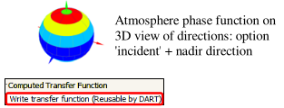

- ***Atmosphere spectral transfer functions TF.***  
dart computes these TFs if in the "Atmosphere" menu one sets the option. These TFs are used in further simulations for fast derivation of TOA and Sensor products from BOA products without simulating atmosphere RT, which saves computer time.
	- ***atmosphere_transfer_function_from_MA.binary ***(see below): it is created if one asks for "Atmosphere radiance before coupling": $TF_{MA-HA}^{scat}(\Omega^{\uparrow}, \Omega^{\uparrow})$, $TF_{MA-BA}^{scat}(\Delta i, \Delta j, \Omega^{\uparrow}, \Omega^{\downarrow})$, $TF_{MA-Sensor}^{scat}(\Delta i, \Delta j, \Omega^{\uparrow}, \Omega^{\uparrow \:or\: \downarrow})$
	- ***atmosphereTransferFunctions.binary*** (see below): transfer functions (BOA $\rightarrow$ BOA,Sensor,TOA): $TF_{BA-BA}^{scat}(\Delta i, \Delta j, \Omega^{\uparrow}, \Omega^{\downarrow})$, $TF_{BA-HA}^{scat}(\Delta i, \Delta j, \Omega^{\uparrow}, \Omega^{\uparrow})$, $TF_{BA-Sensor}^{scat}(\Delta i, \Delta j, \Omega^{\uparrow}, \Omega^{\uparrow})$ and $TF_{BA-Sensor}^{scat}(\Delta i, \Delta j, \Omega^{\uparrow}, \Omega^{\downarrow})$, from $TF_{BA-BA}^{scat}(\Omega^{\uparrow}, \Omega^{\downarrow})$, etc. 

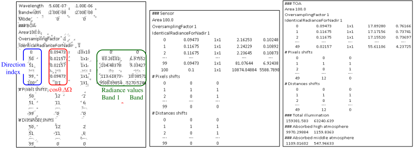
*`Atmosphere_radiance_before_coupl.binary`. Here: 2 bands in mode R, 10 x 10 scene, atmosphere = HA + MA layers with 1 horizontal cell. No pixel / distance shift with "repetitive" scenes. 101 direction indices (sun direction index = 100; $cos(\theta_{sun}.\Delta \Omega_{sun}=0.1 \implies E_{sun}=0.1.L_{sun}$). Rows: '$cos(\theta).\Delta \Omega$', 'BOA / Sensor / TOA spectral radiance: $W/m^2/sr/\mu m$'.*
</img>

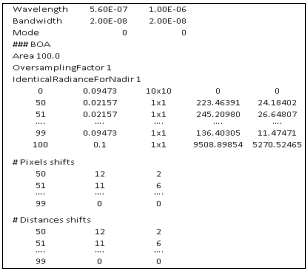
*`Atmosphere_radiance_after_coupl.binary`. Same options as the previous tables.*
</img>

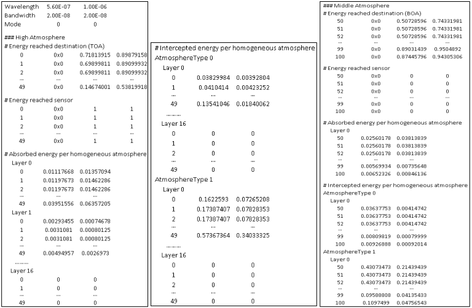
*`atmosphere_transfer_function_from_MA.binary`. Here, same options as the previous tables.*
</img>

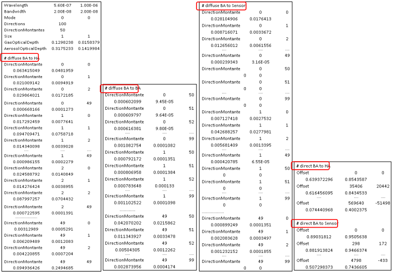
*`atmosphere_transfer_function_from_MA.binary`. Transfer functions: $TF_{BA-HA}^{scat}(\Omega^{\uparrow}, \Omega^{\uparrow})$, $TF_{BA-Sensor}^{scat}(\Omega^{\uparrow}, \Omega^{\downarrow})$, $TF_{BA-Sensor}^{scat}(\Omega^{\uparrow}, \Omega^{\uparrow})$, $TF_{BA-BA}^{scat}(\Omega^{\uparrow}, \Omega^{\downarrow})$, $TF_{BA-HA}^{dir}(\Omega^{\uparrow}, \Omega^{\uparrow})$ + offset, $TF_{BA-Sensor}^{dir}(\Omega^{\uparrow}, \Omega^{\downarrow})$ + offset. Same options as the previous tables.*
</img>

- ***AtmosphereReport.txt*** (folder BANDn of each band n).  
It is created by dart module. It stores:
    - energy intercepted, absorbed, incident on TOA & BOA (total sum must be a constant) during sun illumination $(W/\mu m)$ and "BOA $\rightarrow$ TOA" transfer (no unit: initial energy per direction = 2048) per iteration of atmosphere R.T. The number of iterations is lmited by its maximal value and a threshold set in the "Atmosphere" menu.
    - BOA SKYL and irradiance ($E_{dir}$: direct sun, $E_{diff}$: atmosphere, $E_{coupl}$: "Atmosphere - Earth" coupling, $E_{total}$: total; 2 units: $W/m^2/\mu m$ and %), with no, unique and infinite atmosphere backscattering

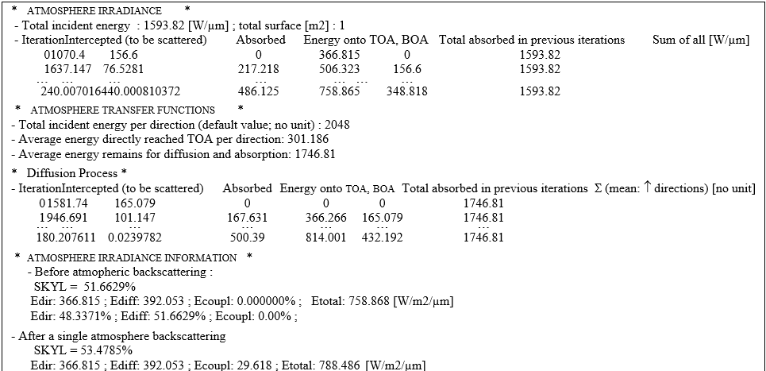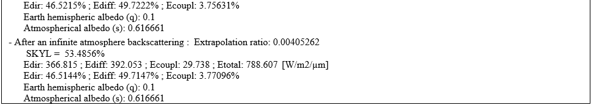
*Example of AtmosphereReport.txt file.*
</img>

### **13) Sensor input files**

- <u>*Sensor spectral sensitivity $s(\lambda)$*</u>:
    - $1^{st}$ line: $\lambda_{min}-\epsilon$ ($\lambda_{min}$ : $1^{st}$ wavelength with non zero gain)
    - $2^{nd}$ line: $\lambda_{min}$ xxx
    - ...
    - before last line: $\lambda_{max}$ xxx wavelength slightly smaller than.
    - Last line: $\lambda_{max} + \epsilon$ 0.00 ($\lambda_{max}$: last wavelength with non zero gain.)

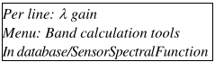</img>

- <u>***`Sensors.txt`***</u> (menu `Sensor/Frame Camera`): multi-frame-camera $\mathcal{C}$. 1 line per $\mathcal{C}$: $\mathcal{C}$ position $\mathcal{C}$ rotation (°) $\mathcal{C}$ ground area (projected zone on the ground (m).). Separator: space, tabulation

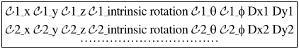</img>

- <u>***`theta.txt`, `phi.txt`***</u> (menu 'Sensor / Pushbroom'): $\theta$, $\phi$ (°) for pixels of pushbroom image at ground level (scene minimal altitude). Separator: space, tabulation.

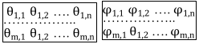</img>

### **14) Reflectance, temperature and Radiance files**

- Monoband results (see the image a. below): files $(\theta, \phi, X_{\Delta \lambda}(\theta,\phi))$, with $X = \rho$, T or L, and u = BOA, sensor or TOA. They are in Band i \ Iter j folders (n = band number, j = iteration number).
- Multi-band results (see the image b. below): files $(\theta, \phi, X_{\Delta \lambda_1}, X_{\Delta \lambda_2},…)$. They are in the "output" folder

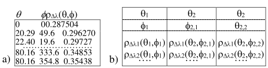
*a) Mono-band reflectance file. b) Multi-band reflectance file.*
</img>

### **15) Simulation.properties.txt and dart.txt**

- <u>***`Simulation.properties.txt`***</u>: DART modules input / output data. Keys indicate which module creates and/or uses it.

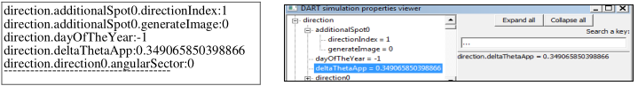
*Simulation.properties file (left) and its viewer in the "View" menu (right).*
</img>

- <u>***`dart.txt`***</u>: a few DART input data and results (i.e., $E_{TOA}, E_{BOA}, A_{BOA}, M_{BOA}$,... per band) that can be used to check thesimulation. Scene albedo $A_{BOA}$ / Brightness temperature $T_{BOA}$ and also exitance $M_{BOA}$ are per DART iteration and for an infinite extrapolation. They result of angular integrals of scene directional radiance. Note that the albedo image is the integral over the only stored DART ortho images. The extrapolated "A /T" allows one to determine the smaller number of iterations necessary to get an accurate "A /T.

### **16) Raster files (DART images, DEM,...)**

Format of raster image (binary file) is ILWIS: binary file (name.mp#) + header file (name.mpr) (see below).

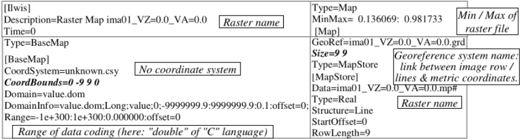
*Example of ILWIS header file. "CoordBounds" and "Size"are the only fields that DART needs.*
</img>

### **17) Radiative budget (RB) of voxels and triangles**

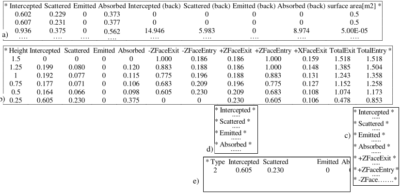
*RB files example. See Radiative budget (RB) for units and definitions. a) RadiativeBudgetFigures: per facet. b) RadiativeBudget_profile. c) RadiativeBudget_3D. d) RadiativeBudget_3D_ground, 3D_typeNum=u. e) RadiativeBudget_Triangles: per type of element.*
</img>

### **18) BroadBand files**

Broad band products can be computed using spectral weights (e.g., sensor spectral sensitivity: IV.14)

- ***`BroadBand_data.txt`***: it has 6 columns and a number of lines equal to the number of spectral bands:

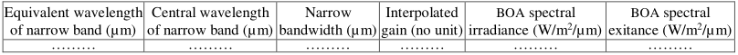
*RB files of example. See Radiative budget (RB) for units and definitions.*
</img>

- ***`Exitance.txt`***: broadband exitance in $W/m^2$ and $W/m^2/\mu m$.
- ***`Irradiance.txt`***: broadband irradiance in $W/m^2$ and $W/m^2/\mu m$.
- ***RadiativeBudget_3D & RadiativeBudget_profile***: 3D (cell) & 1D (scene layer) broadband radiative fluxes:

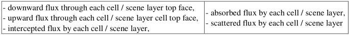
*RB files of example. See Radiative budget (RB) for units and definitions.*
</img>

- ***RadiativeBudget_per_element***: broadband irradiance $(W/m^2)$ and for each scene element the downward (incident), upward, intercepted, absorbed and scattered fluxes.

### **19) Fluorescence: input and output files**

<u>***`fluorescence_x_y.txt`***</u> (lib_phase folder): the Phase module creates it; x=type of turbid material (cf. 4)), y=index of Vegetation optical property (y=0 for the 1st element). It stores the 4 Fluspect matrices, after their spectral resampling to DART bands, in the following order: backward PSI, backward PSII, forward PSI, forward PSII.

In the case of N bands, each matrix is: 
$\begin{pmatrix} 
band\:1\rightarrow band\:1 & ... & band\:1\rightarrow band\:N \\
... & ... & ... \\
band\:N\rightarrow band\:1 & ... & band\:N\rightarrow band\:N \\
\end{pmatrix}$

<u>***y.Leaf_fluorescence***</u> (lib_phase folder): $T_{SIF}(\Omega_{in},\Omega_{out})$ function created by Phase module, similarly to {$T_{diff}(\Omega_{sun},\Omega_i)$, $T_{diff}(\Omega_{sector,k},\Omega_i)$, $TG_{diff}(\Omega_i)$} in section 2). y=index of Vegetation optical property; y=0 for the $1^{st}$ element.

<u>***`yieldsPerTriangle.txt`***</u>: $PSI_{fluorescence-yield}$ and $PSII_{fluorescence-yield}$ per triangle (1 line / triangle). PS yields are the same for all triangles if the file stores 2 values only.

<u>***`profileEta.bin` or `profileEta.txt`***</u>: same format for *etau* and *etah*: "line 1: $N_{layer}$ (number of layers) $N_\theta$ (number of $\theta$ values) $N_{\phi}$ (number of $\phi$ values)", "line 2: values of $\theta$ ", "line 3: values of $\phi$ ", "lines 4 to $N_{layer}$ +3: *eta* values". $N_{\theta} =N_{\phi} =1$ for *etah* . SCOPE default
values: $N_{layer} =60$ , $N_{\theta} =13$ ($\theta \in$ [5:10:75 ;81:2:89]) and $N_{\phi} =36$ ($\phi \in$ [5:10:355]).

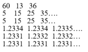</img>

[^1]: [www.researchgate.net/profile/Didier_Gillotay/publication/226667402_The_Solar_Spectral_Irradiance_from_200_to_2400_nm_as_Measured_by_the_SOLSPEC_Spectrometer_from_the_Atlas_and_Eureca_Missions/links/004635155b63cea072000000.pdf](https://www.researchgate.net/profile/Didier_Gillotay/publication/226667402_The_Solar_Spectral_Irradiance_from_200_to_2400_nm_as_Measured_by_the_SOLSPEC_Spectrometer_from_the_Atlas_and_Eureca_Missions/links/004635155b63cea072000000.pdf)
