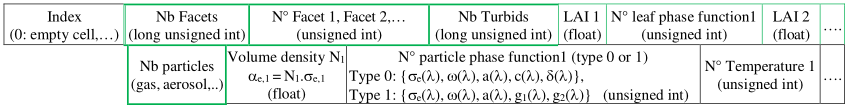
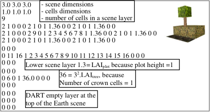
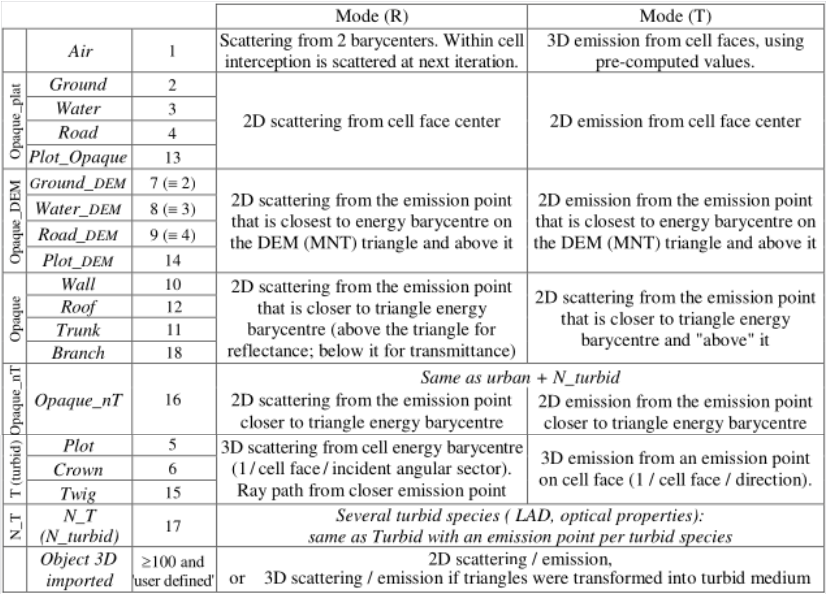
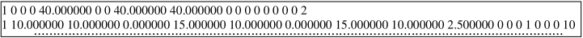

### **1) Maket.txt**

The Earth scene mock-up (i.e., 3D cell matrix) can be stored with DAO associated format or as a text file (`Maket.txt`: see below). Cells have the same format: index of the cell content (e.g., 4 for roads: see below), number $N_{fig}$ of facets, index of each facet, number $N_{turbid}$ of turbid media, and for each one the LAI and leaf phase function.

*Format of each DART cell in `maket.txt`.*
</img>

Terms {$\sigma_e(\lambda),…$} are in the `simulation.properties.txt` file. Dart module uses them. They can be user defined or derived from the Atmosphere database.

*Example of `maket.txt` file.*
</img>

$\Delta X=\Delta Y=3m$. $\Delta x=\Delta y=\Delta z=1m$. Trapezoid tree {$H_{trunk}=1.99m$, crown=1cell, $LAI_{tree}=4$}. Bottom cells (index 2): Ground + Vegetation plot {(0,1) - (3,3), $LAI_{plot}=1.36$}.

*Indices of scene elements in the maket.txt file. DEM: digital elevation model (MNT in French).*
</img>

###  **2) Triangles files: triangles.txt, %cover**

- <u>***`Triangle.txt`***</u> binary file (see below): all triangles of the mock-up (e.g., walls) in the same order as triangle radiative budget files. Note that this order varies per "Maket" run, because "Maket" is multithreaded.

*Triangle.txt file. Per line: triangle (0) or parallelogram (1) - (x,y,z) coordinates of the 3 triangle corners - Type of scatterer (i.e., lambertian,..) - Scatterer property index - Temperature property index - Simple (0) or double (1) face - Type of scatterer (i.e., lambertian,..) - Scatterer property index - Temperature property index - Type of surface (ground: 2, wall: 10,…).*
</img>

- <u>*coverRate images*</u> (folder coverRate): images that indicate the cover rate of all elements and per element.
