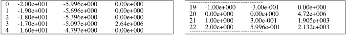
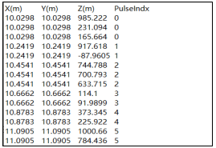

### **1) Input files**

The folder `…/DART/database/Lidar_files` provides the examples of three input files.

- ***`Impulse_time.txt`*** (see the image a. below): 1D temporal distribution of emitted laser pulse.
- ***`Impulse_spatial.txt`*** (see the image b. below): 2D spatial distribution of emitted laser pulse $(N(x_1,y_1), N(x_2,y_1)$,....) Map spatial separation and x / y offsets from the map center to the pulse center must be set.
- ***`Swath_ALS.txt`*** (see the image c. below): x,y,z,q,f,h per line (pulse). Any point (x,y,z: in meter) along each pulse path, viewing zenith $\theta$ ([0°(nadir) 90°]) and azimuth $\phi$ ([0°(south) 360°], counterclockwise direction) angles from target to Lidar, Lidar height h (in meter). For "Multiple pulse / ALS".

*Menu of LiDAR input files.*
</img>

### **2) Output files: Single pulse**

- ***`pulse.txt`***: time variation of the emitted laser pulse. Used to convolve raw DART lidar signal (`LIDAR_DART_wave.txt`).

*`Pulse.txt` example:bin, time, normalized energy.*
</img>

- ***`LIDAR_DART_wave.txt` (`LIDAR_DART_wave_1stOrder.txt`)***: raw DART waveform (i.e., photons emitted at same time).

*LIDAR_DART_wave.txt example: bin, time (ns), path length (m), number of photons. Ground bin is 20 here.*
</img>

- ***`LIDAR_CONVOLVED_wave.txt` (`LIDAR_CONVOLVED_wave_1stOrder.txt`)***: raw waveform convolved with emitted pulse

*LIDAR_CONVOLVED_wave.txt example: time relative to the ground, number of photons.*
</img>

- ***`photonInformations.binary`*** (only in DART-RC): Lidar 3D view uses it. Possibly very large.

*Example of photonInformations file: Photon total path (m), Number of scattering events, Photon weight, Bin index, Type of last scatterer, Boolean (0/1) that indicates if the photon interacted with the ground, Coordinates (x,y,z) of the last scattering point, 3D (x,y,z) waveform.*
</img>

- ***`statIllumination_MC0.txt`*** (only DART-RC)

Statistical results about lidar photons. Sum of photons: numbers of photons that are launched, that escaped the scene, that were absorbed, that reached the ground (index 1), that were lost,… 

Order 1 sum of photons: numbers of $1^{st}$-order photons that are scattered and absorbed, etc.

*Example of file `stat_illumination_MC0.txt`*
</img>

- **LiDAR images** (*DART-RC*): `LidarBOA.mp#`, `LidarBOAMaketFrame.mp#`, `LidarBOAReflectance.mp#`,
`LidarPulse.mp#`, `PhotonReachedGround(MaketFrame).mp#`, `PhotonReachedMaket(MaketFrame).mp#`

- **LiDAR images** (*DART-Lux LiDAR mode*):

    - **`ima_camera_lidar_i_j.mp#`**: number of returned photons projected at lidar location; i = grid line (i.e., azimuth) and j = column (i.e., range) of lidar pulses. i = j = 0 for single pulse. It is the sum of all "ima_camera_lidar_i_j_bin=k.mp#".

    - **`ima_camera_lidar_i_j_bin=k.mp#`**: returned laser power image at k bin. In the image below, “bin=133” corresponds to the ground elevation. If bin number >133, the returned photons are from the multiple scattering, the image records the apparent location of scatterers.

*Example of LiDAR image products in DART-Lux LiDAR.*
</img>

### **3) Output files: Multi pulse**

- **`LIDAR_IMAGE_FILE.binary`** (*Yin et al., PhD, CESBIO, 2015*) (see below): It stores $N_{Acq}$ lidar waveforms acquisitions. It has 4 parts: i) Bytes [1 50]: Product name and version number N.NN (e.g., 1.00, 1.01, ..., 1.10, ..., 2.00); ii) Bytes [51 62]: Format description record; iii) Bytes [63 90]: Global parameters record; iv) Bytes [91 …]: Data record.

*Format of LIDAR_IMAGE_FILE.binary file.*
</img>

- **`LIDAR_IMAGE_panel.txt`**: {i (grid line), j (grid column), look angle (>0 for Lidar right view, <0 for Lidar left view), viewing zenith (>0) and azimuth angles, illuminated and viewed disks radii at ground level in Lidar reference, footprint centers and Lidar sensor locations (x,y,z) in the Earth scene reference} per node of the swath grid.

*Example of `LIDAR_IMAGE_panel.txt`.*
</img>

- **`LIDAR_IMAGE_STATUS.txt`**  
It informs on simulation advance through a simultaneous update with the `LIDAR_IMAGE_FILE.binary` file.

*Example of `LIDAR_IMAGE_status.txt`.*
</img>

- **`Images 'LiDAR'`**: they show all pulses, except the LidarBOA, LidarBOAReflectance and LidarPulse images.

- **`DetectedPoints.txt`** in multi-pulse <u>*discrete return*</u> mode: Coordinates (x,y,z) of point cloud in Earth scene reference, Index of pulse, Number of returns, Index of returns, Intensity information related to *“output intensity value type”*.

*Example of Discrete return `DetectedPoints.txt` (option "Gaussian Decomp. All").*
</img>

- **`DetectedPoints.txt`** in multi-pulse <u>*photon counting*</u> mode: Coordinates (x,y,z) of photon cloud in the Earth scene reference, Index of pulse.

*Example of Photon counting `DetectedPoints.txt`.*
</img>

- ***Output files:*** **Solar noise**
    - **Solar images** (DART-RC): `ima_camera_lidar_SN_i_j_VZ=***_*_VA=***_*.mp#`
    - **Solar images** (DART-Lux LiDAR mode): `ima_camera_SN_i_j.mp#`,
    - **`Solar_noise.txt`** (see below): {i (grid line), j (grid column), average sun radiance ($W/m^2/sr/\mu m$), Solar power received by LiDAR (W), Solar energy per bin (J), Number of sun photons per bin}.  
    

*Example of `Solar_noise.txt`.*
</img>

    - **`rad0.txt`** (see below): a i*j array, average solar radiances of all nodes.

*`Example of rad0.txt`.*
</img>

