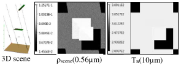

### **1) `Scene.cfg` and `Scene.scn`**

The scene description language (SDL: wiki.luxcorerender.org/LuxCore SDL Reference Manual v2.5) defines scene objects, materials, textures,... The *Phase* module creates the scene file `scene.scn` (optical / temperature properties, leaf size, LAD, name of turbid transfer function) and configuration file scene.cfg ($N_{spectral bands}$, name of scene.scn file) (see below). The *Maket* module updates the `scene.scn` file.

!!! warning
    File `scene.scn` is very large for scenes with many volumes (e.g., turbid cells), especially for large $N_{scene-repetition}$.

*Files `scene.cfg` and `scene.cn` of simulation *LuxFileFormat* (see below): 5 objects located in 3 *.ply files.*
</img>

*Simulation LuxFileFormat. a) 1 x 1m ground ($\rho_{lambertian0}$) + field of 2 squares: ($\Delta l= z=0.5m$; scale 0.4; no rotation), ($\Delta l=0.6m$, z=1m; scale 0.3; rotation 0°/-30°/0°)}. Square: 2 triangles, 2 groups (leaf: $\rho_{lambertian1}$, color *leaf*: index 102; stem: $\rho_{lambertian2}$, color trunk: index 103) $\implies$ 5 objects. T: 300K; $\Delta T: 20K$. b) $\overline{\lambda}: 0.56\mu m$; $\Delta \lambda: 0.02\mu m$, mode R. c) $\overline{\lambda}: 10\mu m$; $\Delta \lambda: 0\mu m$, mode T.*
</img>

### 2) **File `*.ply`**

Ply format ([https://en.wikipedia.org/wiki/PLY_(file_format)](https://en.wikipedia.org/wiki/PLY_(file_format)) was created in the mid-90s because the Wavefront `.obj` format lacked extensibility for arbitrary properties and groupings. A single object is a list of flat polygons with properties: color and transparency, surface normals, texture coordinates and data confidence values. Properties of polygon front and back faces can differ. Here, we have 3 `.ply` files: `triangle0.ply` (1 triangle), `triangle1.ply` (1 triangle) and `__FlatGroundDEM__.ply` (2 triangles). A volume is defined by its bounding facets (e.g., 12 triangles for a cube). DART stores ply files in binary; it can convert them to txt file (menu"View / ….).

*`Triangle1.ply` of simulation LuxFileFormat: 3 vertices, 1 face.*
</img>

### **3) File `RadiativeBudgetFigures.txt`**

*`RadiativeBudgetFigures.txt` (band 0 of simulation LuxFileFormat). Values depend on input parameters.*
</img>

### **4) File `cellVolumes.txt`**

`cellVolumes.txt` is used only for the computation of radiative budget of volumes. It stores for each cell containing a volume: the x, y, z indices of the cell, the type of the volume, the volume index and the volume density.
