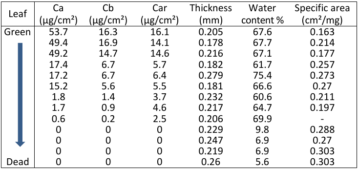
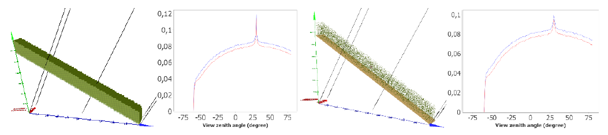

# **General Advices**

Computer time (CT) and memory (RAM) increase with the size and complexity of the simulated landscape, number of products and spatial resolution. Default DART input parameters are for a good "Accuracy ⇔ CT, RAM" trade-off; → then **modify them with care**. Files are first searched in the input folder, then in the user database, then in the DART database. 

With Windows systems, use ANSI coding for the format of text files. CT can be significantly reduced if you:

- Deactive the antivirus for the DART folder (only this one!) that contains the DART code and simulations.
- Deactivate the file indexation () on the disk partition used by DART, at least for SSD disks.
- Deactivate the "Windows search service" () in "Services".
 
Java memory may need to be increased to manage large images: `DART_JAVA_MAX_MEMORY=16g` *(in the `dartrc.bat` file)*

### **1) Optical and temperature properties**

Any number of optical and temperature properties can be used. Because computer time increases with the number
of defined volume properties to compute, one is advised to define only the properties that are actually used.

- Leaf biochemistry (Cab,...), optical properties and BRF. Check the databases: [opticleaf.ipgp.fr](http://opticleaf.ipgp.fr) (Lopex,...).
- Plant architecture at different growth stages: [here](https://ojs.openagrar.de/index.php/BBCH/article/viewFile/1841/2181).

Wheat biochemistry at different growth stages [http://link.springer.com/chapter/10.1007/978-94-009-2823-7_43](http://link.springer.com/chapter/10.1007/978-94-009-2823-7_43)
</img>

### **2) Simulation of the Earth scene**

- <u>*Earth scene dimensions</u> ($D_x = D_y$)*: it must include all the studied landscape of interest or its repetitive pattern. Topography is perfectly handled if the landscape right (bottom) / left (top) sides have equal altitudes to a shift.
- <u>*Spatial resolution $\Delta r$ of simulated images*</u>: $\Delta r$ is independent of the DART-Lux scene simulation and is equal to the DART-FT cell horizontal dimension ($\Delta x, \Delta y=\Delta x$). A DART-FT sequence with varying $\Delta x$ can give the optimal $\Delta x$ for which $\Delta x$ decreases $L_{scene}(\Delta x)/RB_{scene}(\Delta x)$ converges. The tool 'ImageResampling.py' can resample images. DART-FT CT increases if $\Delta x$ decreases for scenes made of turbid cells, and mostly depends on the number of facets for scenes made of facets.
- <u>*Horizontal ground*</u>: it should be a 3D object to get an accurate $RB_{ground}$, to work with variable spatial resolution,…
- <u>*Horizontally homogeneous scene*</u>: simulate the scene as a single cell $(Dx = Dy = \Delta x)$ to reduce CT, with $LAI_{cell} < 0.3$.

To simulate simple turbid homogeneous scenes with 3D models is usually more challenging than to simulate complex scenes because scene voxelization and Monte Carlo methods give rise to discretization effects conversely to analytical models. However, these effects are usually neglible compared to the effects of the 3D structure of actual landscapes.

Slope + Vegetation simulated as turbid medium (left) and triangles (right). $LAI=1$.
</img>

### **3) Simulation of the Atmosphere**

Layered atmosphere:

- mid-atmosphere (MA): $N_{MA,x}.N_{MA,y}$ cells $(\Delta x_{MA}, \Delta z_{MA})$ per layer, up to height $h_{MA}$.
- high atmosphere (HA): height $h_{HA}$ with layers of width $\Delta z_{HA}$, and 1 cell per layer.

The atmosphere "grid" $(h_{MA}, h_{HA},…)$ is user defined with "Manual" option, and automatically defined with the "Fast"
and "Automatic" options. The automatic "grid" is simulation specific. Hence, for a spectral sequence of simulations,
option "Manual" is advised to have the same atmosphere grid for all simulations.
Atmosphere radiative transfer computation time increases with smaller $\Delta x_{MA}, \Delta z_{MA}$ and $\Delta z_{HA}$ values

### **4) 'Forward' mode (DART-FT)**

- Threshold $T_1$ : to stop low energy rays $W$
    - Stop of unscattered sun rays $W_{sun}$ if $W_{sun} < T_1.E_{BOA,dir}.\Delta x.\Delta y$, with BOA direct sun irradiance $E_{BOA,dir}$.
    - Stop of unscattered atmosphere ray and scattered rays $W$ if $W < \frac {T_1.E_{BOA}.\Delta x.\Delta y.\Delta \Omega} {\pi}$, with BOA irradiance E_{BOA}.
    - Stop of unscattered thermal rays if $W < T_1.\frac {L_{B}(\bar{T}_{scene}).\Delta x.\Delta y. \Delta \Omega} {\pi}$, with Earth scene mean temperature $\bar{T}_{scene}$

- Threshold T2: to stop a simulation if scene exitance is nearly constant between 2 successive iterations.
DART is stopped if $\frac {\sum_i W_{k+1}(\Omega_i) - \sum_i W_k(\Omega_i)} {\sum_i W_k(\Omega_i)} < T_2$, with $\sum_i W_k(\Omega_i) =$ total exitance at iteration k.

- <u>*Illumination grid D (default: 0.1m; scattering, 3D temperature) & Sub-division S (default: 0.01m²; thermal emission)*</u>: adapt them to scene Dx, voxel $\Delta x$ and scene $\Delta r$ dimensions. $N_{sun rays}\approx \frac {D_x.D_y} {D^2}$. N facets of area $A \implies N.\frac {A} {S}$ thermal rays.

- <u>*Number of iterations*</u> $N_{iter}$: computation time increases with $N$ (default: 5).

- <u>*Store all iterations*</u>: use it only if necessary because it increases CT and computer memory.

- <u>*LUT*</u>: for saving CT and computer memory, store only the LUT and no other DART product if it is possible.

- <u>*Juxtaposition of DART images*</u>: objects (tree,…) on a side of a repetitive scene can cast shadows on the opposite scene side, which complexifies their interpretation. The juxtaposition of images simplifies this interpretation.

- <u>*Oversampling DART images*</u>: it can improve the visual aspect of DART images.

- <u>*Sequence computer time*</u>: run only useful processes and use the multithread method.

- <u>*Spectra simulation*</u> {$\lambda_i; j\in[1:J]$}: with large J and scene size, the needed RAM can be too large. A solution is to compute spectra as N sub-spectra {$\lambda_{i,n} ; n\in[1:N]$} with same atmosphere discretization, enough BOA illuminating rays to get a quasi exact ratio $\frac {Direct\:sun\:irradiance} {Atmosphere\:irradiance}$, and the same $\lambda_{1,n} \forall n$ to get identical centroids in turbid cells.

- <u>*How to avoid the creation of 1 folder per spectral band*</u>: unset the option "BRF/BTF mono-band" in "Product menu.
