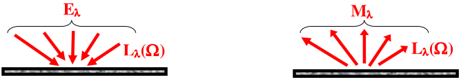

# **Physical bases**

### ***Main measures used***

- <u>*Solid angle*</u> $d\Omega$ (sr) along direction $\Omega(\theta,\phi)$: angle in 3D space $d\Omega = sin(\theta).d\theta.d\phi$ (See below)

*Solid angle $d\Omega$ centred on direction $\Omega(\theta,\phi)$ from a surface $\Sigma$..*
</img>

- <u>*Radiance*</u>: power along ($\Omega$) per sr and apparent $m^2$ of emitter/receiver surface $\Sigma$: $L_{\lambda}(\Omega): W/m^2/sr/\mu m; L_{\Sigma,\Delta \lambda}(\Omega): W/m^2/sr$

- <u>*Exitance*</u>: power (W) that exits a surface $\Sigma$ (See below) per $m^2$ of $\Sigma$: $M_{\Sigma,\lambda}=\int_{2\pi^{+}} L_{\Sigma,\lambda}(\Omega).cos(\theta).d\Omega\;\;\;\;W/m^2/\mu m\;\;\;\;M_{\Sigma,\Delta \lambda}=\int_{2\pi^{+}} L_{\Sigma,\Delta \lambda}(\Omega).cos(\theta).d\Omega\;\;\;\;W/m^2$

- <u>*Irradiance*</u>: power (W) that is incident on a surface $\Sigma$ (See below) per m of $\Sigma$: $E_{\Sigma,\lambda}=\int_{2\pi^{-}} L_{\Sigma,\lambda}(\Omega).|cos(\theta)|.d\Omega\;\;\;\;W/m^2/\mu m\;\;\;\;E_{\Sigma,\Delta \lambda}=\int_{2\pi^{-}} L_{\Sigma,\Delta \lambda}(\Omega).|cos(\theta)|.d\Omega\;\;\;\;W/m^2$

!!!note
	*Luminance $(cd/m^2)$ = $683.\int_{380}^{740} V(\lambda).L(\lambda).d\lambda$ Normalized luminous efficiency $V(\lambda)$ in [www.cvrl.org/lumindex.htm](http://www.cvrl.org/lumindex.htm)* 

- <u>*Reflectance factor of a surface*</u> $\Sigma$: $\rho_{\sigma,\lambda}(\Omega)=\frac {\pi.L_{\Sigma,\lambda}(\Omega)} {E_{\Sigma,\lambda}}$(See below).

*Surface irradiance $E_{\lambda}(left)$ and exitance $M_{\lambda}(right)$.*
</img>

Different reflectance factors are used for taking into account the fact that radiation can be:
	- along a unique direction (i.e., $d\Omega=0$). This is called "direct". Below, its index is "d".
	- within a cone ($\Omega, d\Omega \neq 0$). This is called "conical". Below, its index is "c".
	- along an hemisphere (i.e., $d\Omega = 2\pi$). This is called "hemispherical". Below, its index is "h".

- <u>*Lambertian surface*</u>: isotropic radiance $L_{\lambda}(\Omega) = cst \implies$ isotropic reflectance $\rho_{\lambda}(\Omega) = cst$ (See below).

*Different types of reflectance (direct d, hemispherical h, conical c)*
</img>

*$\rho_{dd}(\Omega)$ in the solar plane*
</img>

Variable scattering direction for a given illumination direction and 2 types of surfaces:

- lambertian surface: $\rho_{dd}(\Omega) = cst$. White surface $(\rho_{dd} = 1)$ and grey ($\rho_{dd} = cst < 1$).
- natural surface: $\rho_{dd}(\Omega)$ changes. Often maximal for the specular direction and local maximum for the illumination direction.

<u>*Bi-directional Reflectance Factor (BRF)*</u>: $\rho_{dd}(\Omega_s,\Omega_v,\lambda)= \frac {\pi.L_{\lambda}(\Omega_v).cos(\theta_v).\Delta \Omega_v} {E_{\lambda}(\Omega_s).cos(\theta_v).\Delta \Omega_v} = \frac {\pi.L_{\lambda}(\Omega_v)} {E_{\lambda}(\Omega_s)}$

<u>*Reflectance Factor direct-hemispherical*</u>: $\rho_{dh}(\Omega_v,\lambda)=\frac {M_{\lambda}} {E_{\lambda,s}}=\frac {\int_{2\pi^{+}}L_{\lambda}(\Omega_v).cos(\theta_v).\Delta \Omega_v} {L_{\lambda}(\Omega_s).cos(\theta_s).\Delta \Omega_s}$ ($\frac {exitance\:h} {irradiance\:d}$)

<u>*Reflectance Factor hemispherical-direct*</u>: $\rho_{hd}(\Omega_v, \lambda) = \frac {\pi.L_{\lambda,v}} {E_{\lambda,s}} = \frac {\pi.L_{\lambda}(\Omega_v)} {\int_{2\pi^{-}}L_{\lambda}(\Omega_s).cos(\theta_s).\Delta \Omega_s}$ ($\frac {\pi.radiance\:d} {irradiance\:h}$)

<u>*Reflectance Factor bi-hemispherical*</u>: $\rho_{hh}(\lambda)=\frac {M_{\lambda}} {E_{\lambda}}=\frac {\int_{2\pi^{+}}L_{\lambda}(\Omega_v).cos(\theta_v).\Delta \Omega_v} {\int_{2\pi^{-}}L_{\lambda}(\Omega_s).cos(\theta_s).\Delta \Omega_s}$

<u>*SKYL*</u>: $\frac {Sky\:(atmosphere)\:irradiance} {Total\:(direct\:sun+atmosphere)\:irradiance}$. It belongs to $[0;1]$

<u>*Albedo*</u>: $A_{dh}(\Delta \Omega_{i}=0, \Delta \lambda)=\frac {Exitance\:(h)\:over\:\Delta \lambda} {Irradiance\:(d)\:over\:\Delta \lambda\:along\:\Omega_{s}}$

$A_{hh}(2\pi^{-}, \Delta \lambda)=\frac {Exitance\:(h)\:over\:\Delta \lambda} {Irradiance\:(h)\:over\:\Delta \lambda\:along\:2\pi^{-}}$

It is the integral of reflectance $\rho(\lambda,\Omega_v)$, weighted by spectral irradiance (i.e., $E_{\lambda}(\Omega_i).\mu_i$ for $A_{dh}$ and $\int_{2\pi^{-}} L_{\lambda}(\Omega_s).\mu_s d\Omega_s.d\lambda$ for $A_{hh}$), over the spectral band $\Delta \lambda$ (i.e., all or part of the spectrum) and over all directions of the upper hemisphere ($2\pi^{+}$). It depends a lot on the Earth surface.

For plane Earth: $A_{dh}(\Omega_s, \Delta \lambda) = \frac {1} {\pi}.\frac {\int_{\Delta \lambda} \int_{2\pi} \rho_{dd}(\Omega_s, \Omega_v,\lambda).\mu_v.E_{\lambda}(\Omega_s).\mu_s.d\Omega_v.d\lambda} {\int_{\Delta \lambda} E_{\lambda}(\Omega_s).\mu_s.d\lambda}$ with $\Delta \lambda \approx [0.2;\:4 \mu m]$.

If $E_{\lambda} \approx\: cst$ over $\Delta \lambda: \:A_{dh}(\Omega_s, \Delta \lambda)\approx\frac {1} {\pi}.\int_{\Delta \lambda} \int_{2\pi} \rho_{dd}(\Omega_s, \Omega_v,\lambda).\mu_v.d\Omega_v.d\lambda \approx \frac {1} {\Delta \lambda} . \int_{\Delta \lambda} \rho_{dh}(\Omega_s, \lambda).d\lambda$ $\approx \rho_{dh, \Delta \lambda}(\Omega_s)$

<u>*Optical depth $\Delta \tau$*</u>: the direct transmittance along $\Omega_v$ of a medium with an optical depth $\Delta \tau$ is $e^{- \frac {\Delta \tau} {\mu_v}}$ with $\mu_v = cos(\theta_v)$.

DART **"Forward"** mode: a ray along direction $(\Omega,\Delta \Omega)$ carries the power $W(\Omega,\Delta \Omega)$. A ray that exits the scene at pixel $(\Delta x,\Delta y)$ gives rise to local radiance $L_{xy}(\Omega,\Delta \Omega)=\frac {W(\Omega, \Delta \Omega)(W)} {\Delta x.\Delta y.\int_{\Delta \Omega} cos(\theta).d\Omega\:(m^2.sr)}$ with $(\Delta \Omega = \int_{\Delta \theta}\int_{\Delta \phi} sin(\theta).d\theta.d\phi)$

- Surface of area A: it gives rise to:
    - $W_{scat}(\Omega, \Delta \Omega)=\frac {\rho(\Omega)} {\pi}.A.\int_{\Delta \Omega}cos(\theta).d\Omega$,
    - $W_{thermal}(\Omega, \Delta \Omega)=\epsilon(\Omega).A.L_{B}(T).\int_{\Delta \Omega} cos(\theta).d\Omega$
- Turbid media: it gives rise to:
$W_{scat}(\Omega, \Delta \Omega) \:\&\: W_{thermal}(\Omega, \Delta \Omega) \equiv \frac {\int_{\Delta \Omega} cos(\theta).d\Omega} {cos(\theta)}$. Fluids (spherical particules): $W_{thermal}(\Omega,\Delta \Omega) \equiv \Delta \Omega$
   

*Albedo of Earth material*
</img>

### ***Thermal emission***

<u>*Planck law*</u>: $L_{\lambda}(T)=\frac {2.h.c^2} {\lambda^5.(e^{\frac {h.c} {\lambda.k.T}})}$ ($W.m^{-2}.sr^{-1}.m^{-1}$) where $h=6.63\times10^{-34}$ J.s and $k=1.3807\times10^{-23}\:J.K^{-1}$

<u>*Wien law:*</u> $M(\lambda)$ is maximal for $\lambda_m=\frac {a} {T}\:(a=2899 \mu mK)$

<u>*Stephan-Boltzmann law:*</u> $M = \sigma.T^4$, where $\sigma = 5.6704 \times10^{-8} W.m^{-2}.K^{-4}$

<u>*Brightness temperature $T_B$ of a scene:*</u> temperature of the blackbody that emits the same radiance as the scene.

For a measured radiance $L_{mes,\lambda}(\Omega)$: $L_{m,\lambda}(\Omega)=L_{B,\lambda}(T_B) \implies T_B =L_{B,\lambda}^{-1}(L_{mes,\lambda}(\Omega))=f(\lambda,T,\Omega)=\frac {h.c} {k.\lambda} .\frac {1} {ln(1+\frac {2.h.c^2} {\lambda^5.L_{m,\lambda}(\Omega)})}$

<u>*Emissivity $\epsilon$:*</u> efficiency of thermal emission relative to blackbody. $\epsilon_{blackbody} = 1 \forall \lambda$.

For a fluid (e.g., atmosphere): $\epsilon(\Omega,\lambda) = 1 - \rho_{dh}(\Omega,\lambda) - t(\Omega,\lambda) \forall \lambda$. For an opaque surface: $\epsilon(\Omega,\lambda) = 1 - \rho_{dh}(\Omega,\lambda) \forall \lambda$

### ***TOA / satellite radiance $L_{TOA}(\Omega_V)$*** 

3 radiation sources arise at TOA level: 
</img>

Atmosphere: direct transmittance $e^{- \frac {\Delta \tau} {\mu_v}}$ , diffuse transmittance $t_{atm}$, total transmittance $T_{atm} =e^{- \frac {\Delta \tau} {\mu_v}} +t_{atm}$.

a) <u>*Sun scattered radiation*</u>

- Scene scattering with direct atmosphere transmission $\downarrow \uparrow$: $E_{sun}.e^{- \frac {\Delta \tau_{atm}} {\mu_s}}.\frac {\rho_{scene}} {\pi}(\Omega_s,\Omega_v).e^{- \frac {\Delta \tau_{atm}} {\mu_s}}$ </img>
- Scene scattering with diffuse atmosphere transmission: $E_{sun}.t_{atm}(\Omega_s,2\pi^{-}).\rho_{scene}(2\pi^{-},2\pi^{+}).T_{atm}(2\pi^{+},\Omega_v)$ </img>
- Atmosphere scattering, without interaction with the scene: $E_{sun}.\frac {\rho_{atm}} {\pi}(\Omega_s, \Omega_v)$ </img>
- Scene scattering with Earth-Atmosphere coupling: $E_{sun}.T_{atm}(\Omega_s,2\pi^{-}).\frac {\rho_{scene}(2\pi^{-},2\pi^{+})} {1-s_{atm}}.T_{atm}(2\pi^{+},\Omega_v)$. </img>

b) <u>*Scene thermal emission*</u> with atmosphere direct / diffuse transmission: $L_{scene}.T_{atm}(2\pi^{+},\Omega_v)$ </img>

c) <u>*Atmosphere thermal emission*</u> direct and scene scattered: $L_{atm}(\Omega_v) + \rho_{scene}(2\pi^{-}, 2\pi^{+}).L_{atm}(\Omega_v)$ </img>
