WP0 is a fast overview of DART, with limited practice. Other WPs introduce DART functionalities step by step. The advice is to start with WP1 (reflectance) and WP2 (thermal emission), then 'thematic' WPs: WP3: buildings, atmosphere; WP4: RB and SIF; WP5: fluids and cover map importation; WP6: trees; WP7: topography; WP8: LiDAR; WP9: sensors, etc.
WPs introduce the 2 DART light modes: DART-Lux (i.e., bi-directional Monte Carlo method) and DART-FT (discrete ordinate method, with voxelized landscape). DART-Lux and DART-FT use different formats for storing their representations of landscapes (i.e., scenes), but DART-Lux simulations can be easily transformed into DART-FT simulations, and vice versa. In an already created scene, any type of elements such as trees and buildings can be 
ignored, which leads to a new scene. It allows reversible modifications of the scene. Also, in DART-Lux, any type of element can be ignored when simulating the RB, in order to save computation time. Because it is much faster with much less RAM for complex landscapes, except for RB, DART-Lux increasingly replaces DART-FT.
!!! note
	- Answer questions asked in the WPs before going to the next step in the WPs. 
	- Close computer applications (e.g., internet,…) to reduce the computation time (CT) of simulations.
	- DART is installed (install.bat) in a user-selected folder Y. It creates "Y\DART\user_data\simulations". Y should not have accents and spaces, and for Windows operating system should not be created by it such as the folder 'Users'.
	- Download a WPx ([here](https://dart.omp.eu/index.php#/doc)) in `DART\user_data\simulations\WP\WPx`, unzip it to get all its WPx-Lux (DART-Lux) and WPx-FT (DART-FT) simulations. Any simulation has 2 sub-folders: "input" (i.e., input parameters) and "output" (i.e., simulation products).

*<u>Approach</u>*: WP0A introduces basic DART functionalities with a 3D scene. To save time, you do not need to run it if its output folder is available. Later, in order to discover other functionalities/products(e.g., LiDAR and time series), you create WP0B,WP0C,... as copies of WP0A using the option "save as", and ignoring some scene elements to reduce computer time (CT) of simulations. CTs are indicated for each WP. They are for a laptop with 8 cores.

### **1) Overview: WP0A-FT** (CT: 6'40"), **WP0A-Lux** (CT: 2'1" if N sample/pixel = N sample/direction =30)

<u>*Objective*</u>: overview (products, functionalities,…) of DART mode "Passive RS & RB". . Table below lists the parameters to set: blue color for bi-directional mode (i.e., DART-Lux), and green color for forward mode (i.e., DART-FT). 

<u>*Scene*</u> (see the scene below): : it consists of an imported tree and DART created elements (1 tree filled with facets, 1 house with 2 
skylights, 2 plots filled with facets and turbid medium) over a DEM: Digital Elevation Model. 

<u>*Products*</u>: orthographic at the top of atmosphere (TOA) and bottom of the atmosphere (BOA), BOA projective RS sensor 
images, and also 3D radiative budget for DART-FT.

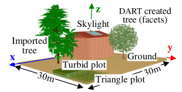
*3D scene / mock-up. Once it is created, it can be 
displayed with "View / Scene 3D".*
</img>

!!!Note
	When running the atmosphere radiative transfer with option "Discrete ordinates", disregard the warning message that indicates that the DART-computed scattering phase function of aerosols is normalized.

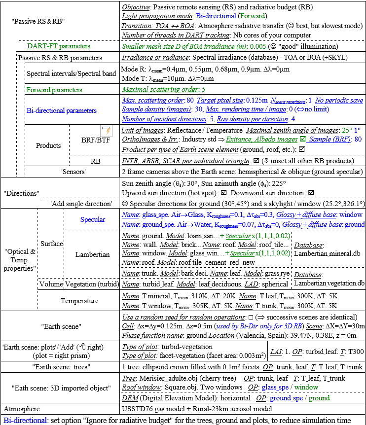
*Parameters of the Forward and Bi-directional light modes. OP: optical property. T: temperature.*
</img>

***The simulation editor:*** "Parameters/Editor".	
The simulation editor sets the simulation parameters.

- *<u>"Passive RS & RB"</u>* (see below): TOA→BOA transfer (here: Atmosphere radiative transfer), Earth-Atmosphere radiative coupling, and advanced parameters (here: 8 threads, illumination mesh D=0.005m,…).
	

*Passive RS & RB menu of DART-Lux (top) and DART-FT (bottom). Left panel: parameter selection. Right panel: parameter values. Central panel: scene 2D view.*
</img>

- *<u>"Passive RS & RB parameters"</u>*: scene irradiance E (see below) and spectral bands (see below). E can be set as TOA or BOA irradiance or as BOA radiance. Here, E is set at TOA with a sun irradiance database. A band consists in {Mean wavelength, Bandwidth, Mode (R: reflectance, T: pure thermal emission, R+T)}.
	
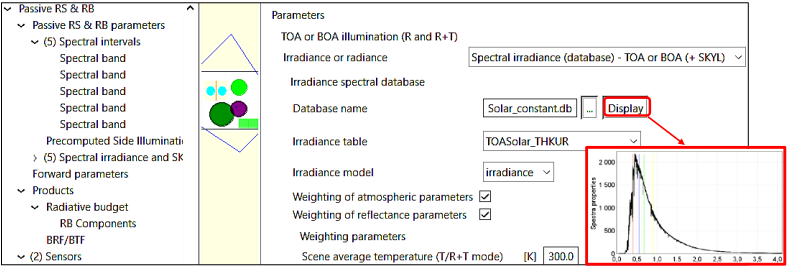
*Scene irradiance. 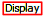  plots the irradiance table 'TOASolar_THKUR' of `Solar_constant.db` database. *
</img>

- *<u>"Spectral intervals"</u>* (see below): each spectral band is defined by its mode (R, R+T or T), mean wavelength $λ_{mean}$, and bandwidth Δλ.
	
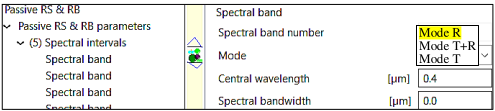
*Spectral band. Properties of band 1: mode R, $λ_{mean} =0.4 \mu m$, $\Delta λ =0$ .*
</img>

- *<u>"Products</u>*" (see below): radiative , general  and Earth scene  products. The bi-directional (DART-Lux) and forward (DART-FT) light modes BOA level have very similar products, with two major differences: 
	- Iterations: DART-FT is iterative and can give results per iteration. DART-Lux is not iterative. Then, the term "iteration" refers to data storage per time period or number of samples per pixel. 
	- Exitance / albedo: a single DART-FT simulation can simulate images for many viewing directions $\Omega_v$, including exitance and albedo images, without increasing computation time. Usually, DART-Lux simulates only a few images, because computation time increases with the number of images, and consequently does simulate exitance and albedo images. However, it simulates BRF / BTF maps (i.e., $L(\Omega_v), \rho(\Omega_v)$ and $T(\Omega_v) \forall \Omega_v$  for any zenith / azimuth step suvch that 1°), whose integral gives the exitance and albedo for all or part of the scene.	
- The radiative products include:
	- BRF/BTF products : radiance $L_{xy}(\Omega_v)$, reflectance $\rho_{xy}(\Omega_v)$ and brightness temperature $T_{xy}(\Omega_v)$, with BRF standing for $\rho$ and BTF for $T$. They are provided as raster images and / or mean values of these images. The images are for an orthographic projection. They can be orthorectified (default method: "Industry standard"). In order to save computation time and memory, the images can be stored only for directions with a zenith angle smaller than a threshold (default: 25° for DART-FT and 1° for DART-Lux). Their format is that of ILWIS (`*.mp#` and `*.mpr`); the GeoTiff format is being implemented. Their mean values are stored in text files (brf: reflectance, tap: brightness temperature); the NetCdf format is being implemented. Other products include "images per type of scene element" (i.e., radiation from the last scattering / emitting element of the scene), "fluid transmittance images" (BOA satellite, sensor), and "pixel view angle images".	
	- Temperature per triangle per cell.	
	- Fraction of sunlit par triangle per cell	
	- Fraction of sunlit per cell

- The general products include: 
	- Radiative budget (RB) products: 3D/2D/1D absorbed, emitted,... power per cell (x,y,z) and/or facet, stored in binary or text files, with different units (% of BOA irradiance, W/m2/µm, W/m2). They can be computationally 
expensive, especially for DART-Lux (it is being accelerated), which here simulates only RBfacet. 
	- Polarization products. 
	- Per light source products (e.g., thermal emission from the roofs).
- The Earth scene products include: 
	- Triangle area products: area of facets, as 1D or 3D arrays, and possibly per type of scene element (i.e., color). 
	- Turbid LAI products: 3D, 2D and 1D LAI of turbid volumes, 
	- 3D object": 3D object that consists of all facets of the scene, 
	- DSM image: Digital Surface Model of the scene, stored as a raster image (only for DART-FT).
	- Triangle ground cover: ground cover per type of scene element such as vegetation (only for DART-FT). 
!!! note
	The option "Save as" allows you to transform a DART-Lux simulation into a DART-FT simulation, and vice versa. It can be very useful in order to simulate products that a light propagation mode does not simulate.

*Menu "Products" of DART-Lux (top) and DART-FT (bottom).*
</img>

- *<u>"Sensor"</u>* (see below): in-situ / airborne cameras and pushbroom, defined by their location, field of view (FOV),... 
Here, 2 airborne viewing cameras are defined: an hemispherical camera (x=y=15m, 20m; not yet simulated by DART-Lux) and an oblique camera (x=y=35m, z=40m) whose ground FOV is outlined by a blue trapezoid. 

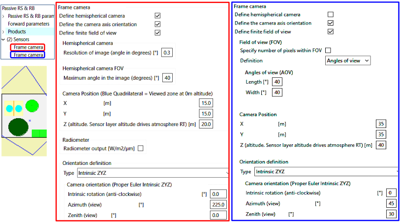
*Menu "Sensor". Two downward viewing cameras ( hemispherical (on the left) and oblique (on the right)) are defined.*
</img>

- *<u>"Direction input parameters"</u>* ([III.4.7](../../DART_functionalities_and_products/4-Radiative_modes_sub_modes/4.8/directions_of_rays.md), see below): any direction can be added to the 100 default discrete  directions. Here, 13 directions are added: 2 specular, 1 upward sun direction (hot spot) and 10 around sun direction. 

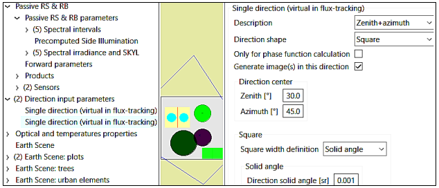
*Menu "Direction input parameters". Here, the viewing direction $(\theta=30°, \phi=45°)$ is defined.*
</img>

- *<u>"Optical and temperatures properties"</u>* (see below): optical properties of surfaces  and volumes  (i.e., turbid vegetation or fluids), and temperature properties . There are several surface optical properties (Figure 41): lambertian, RPV, Hapke and specular  models, and Phase extern (import of spectral directional reflectance/transmittance). These optical properties can be combined using the "Mixed model" option. The lambertian property is defined by "Lambertian reflectance + Lambertian transmittance + Direct transmittance". The lambertian reflectance is from a spectral database, leaf Prospect/Fluspect model, or soil MARMIT-2 model $\rho_{soil}$ = f(soil moisture content) for soils. The volume optical property  is for a volume filled with fluids or turbid medium (i.e., infinite number of of infinitely small plane elements randomly distributed and defined by a Leaf Angle Distribution (LAD), a lambertian transmittance and a lambertian reflectance, possibly with specular behavior, for adaxial (top) and abaxial (bottom) leaf faces). The temperature property  is defined by a mean temperature, a temperature range and the possibility to have equal or not temperatures on both sides of a surface. The optical and temperature properties can be weighted by spectral coefficients. For example, the multiplication ofv the model "Reflectance = 1" by a number a gives the optical property $\rho$ = a. In addition, the optical and temperature properties can be weighted by 3D matrices in order to get 3D variable properties.

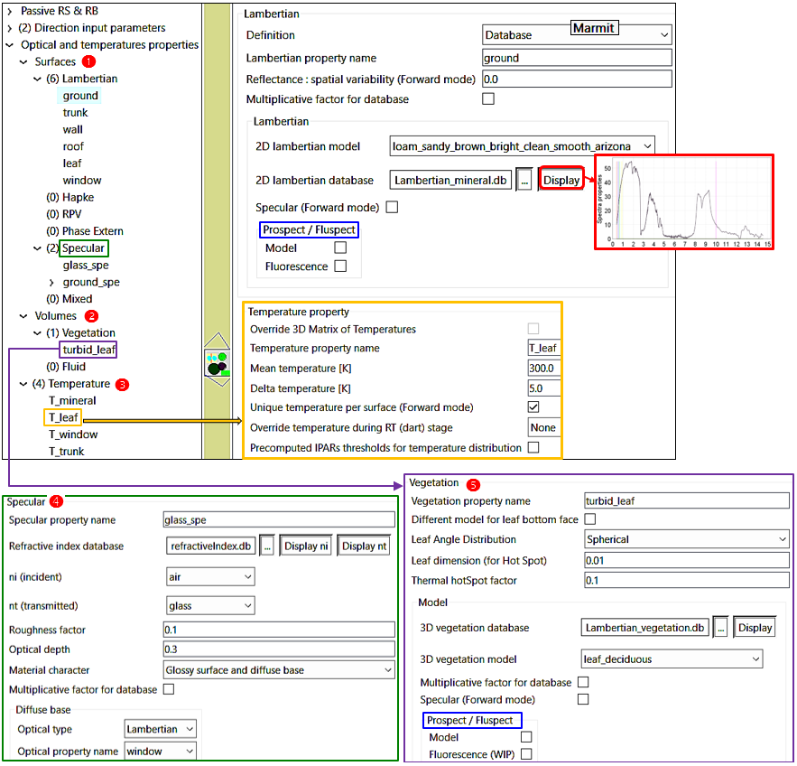
*Menu "Lambertian optical property". The property, called 'ground', is set with the loam_sandy…" model of the Lambertian_mineral database. A 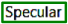 specular model is set.  module (not used here) computes leaf optical property, including leaf fluorescence, using leaf biochemistry.*
</img>

- *<u>"Scene"</u>* (see below: scene xy dimensions and cell xyz dimensions , raster DEM (Digital Elevation Model)  and scene location . DART-FT uses cells to voxelize the scene and set the resolution of the simulated images. DART-Lux uses cells only for 3D RB simulation. Schematic DEMs can be created . Successive DART scenes 
defined with random settings (e.g., random distribution of facets) differ if option "Use a random… " is set. Note for DART-Lux, the ground surface, as other scene elements, can be ignored in RB simulation to save CT.

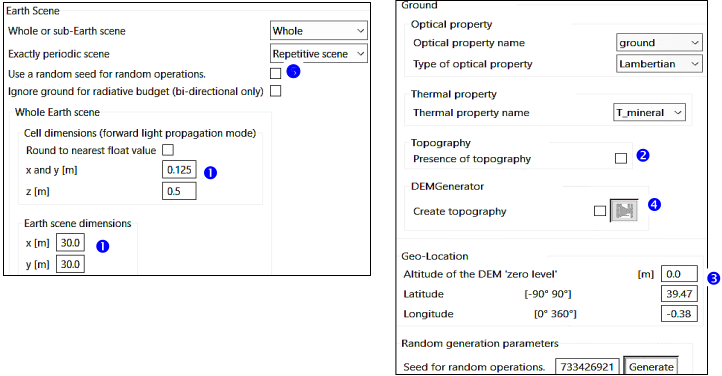
*Menu "Scene". Numbers are exactly coded only if they are equal to $m.2^{-n}$, with m and n integer numbers. Better to use numbers that are exactly coded, whenever possible.*
</img>

- *<u> "Plot"</u>* menu: plots (see below): to create plots (i.e., surface or right prisms) filled with turbid medium, facets or fluids, with a possible underlying surface. They can be at any altitude above the ground surface.

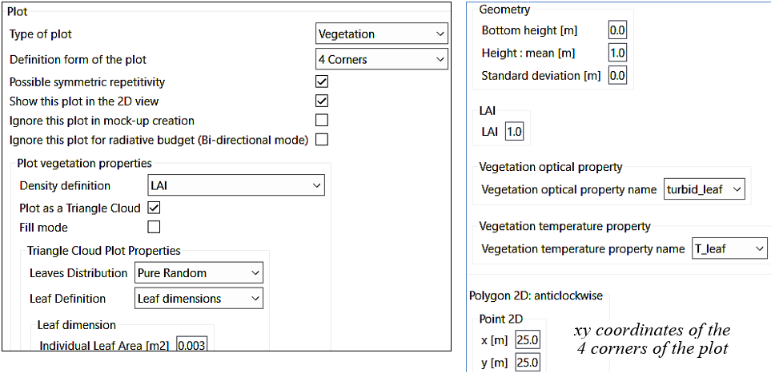
*Menu "Plot". Because the option "Vegetation" is set, the plot is a right prism characterized by LAI, LAD, $\rho_f, \tau_f$. Because the option "Plot as triangle cloud" is set, the volume medium is made of facets, and not turbid medium,; here, facets are defined by their area, and not their number.*
</img>

- *<u>"Tree"</u>* (Figure 120): DART created trees with schematic shapes (cone,...) filled with turbid medium or facets. Tree positions and dimensions are random or exact (i.e., option  ). Here, the text file 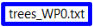 stores each tree trype, location and dimensions, but only the tree type and location are used by the option 'Exact location + random dimensions' as tree dimensions are set in the GUI. Note that all the tree information of  would be used with the option 'Exact location + Exact dimensions'. Note also, that trees can be ignored in the creation of the mock-up. This is useful for reversible modifications of the mock-up in the same simulation. In DART-Lux, trees can be ignored when simulating the RB, in order to save computation time.

!!!warning
	To edit the file trees_WP0.txt, use a text editor (e.g., NotePad++) that does not add hidden characters….

*Menu "Turbid trees" with option "Exact location + random dimensions". Option "Crowns as triangle clouds " implies that tree crowns are filled with 0.1 m² triangles..*
</img>

- *<u>"Urban elements"</u>* ([III.4.10](../../DART_functionalities_and_products/4-Radiative_modes_sub_modes/4.10/earth_scene.md#d-urban)): DART-created buildings (i.e., houses) with different schematic shapes. 

- *<u>"3D imported object"</u>* (Figure below): to import 3D objects (e.g., tree, forest, urban geometric database) and set their geometry (i.e., location, xyz scale factors, xyz rotations). It also sets optical properties and type of material (i.e., 
color), per group (i.e., set of triangles) or for the whole object. A 3D object or groups of it can be converted to turbid medium, which can be useful if the 3D object has a huge number of facets. The "Field" option is for creating a spatial distribution of 3D objects: a file stores the location, scale factors and rotations of clones of 3D objects.

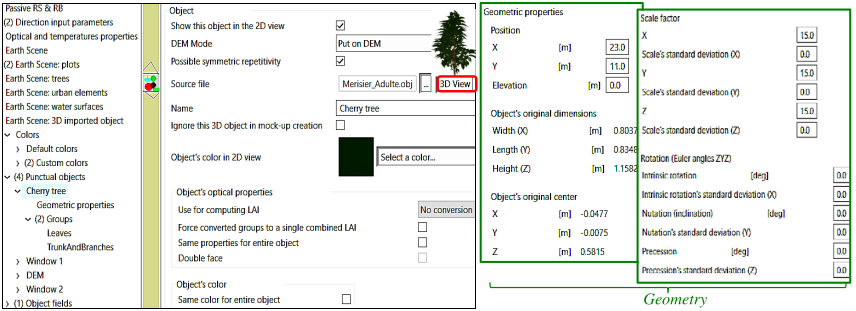
*Menu "3D object". Object optical and temperature properties, and geometry per group.*
</img>

- *<u>"Atmosphere"</u>* menu ([reminder here](../../DART_functionalities_and_products/4-Radiative_modes_sub_modes/4.11/atmosphere.md#atmosphere-with-database-cf-iv12spectral)): gas / aerosol geometry and optical properties (i.e., spectral single scattering albedo, transmittance for absorption and scattering,...), either imported or derived from the standard gas/ aerosol modelsin DART atmosphere database. Aerosol optical depth and water vapor content can be easily varied. 
  Atmospheric backscatter is only simulated if the atmospheric RT is simulated. Then, results can be for before and after atmospheric backscatter. DART-Lux images are only final images ρscene(x,y,Ω) (i.e., "after atmospheric backscatter" images if there is atmosphere RT), and/or the BRFmap (i.e., $\rho_̅{scene}(Ω) ∀Ω ∈2π^+$) before and after atmospheric backscatter.
  DART-FT images can be before and after atmospheric backscatter, with no BRFmap. 
  DART-Lux simulates the atmospheric RT using either an Hybrid method (i.e., discrete ordinate method of DARTFT) or a pure Monte Carlo method. The default method is "hybrid". 

**3D view of the scene of simulation T0A:** `View / Scene 3D`.

*3D scene / mock-up. Once it is created, it can be 
displayed with "View / Scene 3D".*
</img>

**2D view of the scene (not in DART-Lux):** `View / Scene 2D / maket.txt` (see below).

<u>*Layer navigator*</u>:  to set the xy, xz and yz sections and level.
  <u>*Zoom*</u>:  zoom of the scene.
  <u>*Mouse right click*</u>: cell coordinates, type of elements, data from text files (1 value per DART cell; here: output / `temperatures.txt` file) with the option  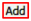 , indices of local triangles.
  <u> *3 sub-menus* </u> : scene information (LAI of turbid vegetation, scene size,…)
   

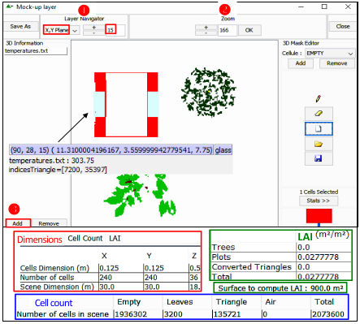
*Scene 2D view in DART-FT.*
</img>

**View of DART directions of rays:** `View / Directions 3D View`  
Discrete directions (central direction $\Omega_i(\theta_i, \phi_i)$, solid angle $\Delta \Omega_i$) sub-divide the $4\pi$ sphere with equal $\Delta \Omega_i$, except the 2 smaller vertical directions (see below). Discrete and virtual directions can also be added in regions ($\Delta \Omega_{hot spot}, \Delta \Omega_{specular}$,...), with an automatic reshape of the $4\pi$ sphere. Products can be for all upward discrete directions and also virtual directions added as single directions, and / or in planes and regions.  
<u>*DART-FT*</u>: it simulates RT only with the upward and downward discrete directions.  
<u>*DART-Lux*</u>: upward directions are only to set the viewing directions of the simulated images and terms of the brf/btf file derived from the 90°x360° BRF/BTF map. (*i.e.*, distribution of directional reflectance / radiance / brightness temperature). 

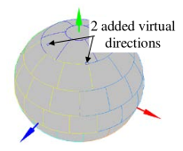
*DART directions: $10^2$ "discrete" and 2 "virtual".*
</img>

**View DART simulated images:** `View / Image`

The "View image" menu (Figure 121) allows you to display the DART simulated images:
- Col. 1 "Spectral bands": the spectral band of the image to display.

- Col. 2 "Simulation  type": reflectance, brightness temperature or radiance at 3 sensor altitudes (BOA, SENSOR, TOA). Note that BRF stands for BOA reflectance and Tapp stands for BOA brightness temperature.

- Col. 3 "Iterations": (1) DART-Lux: an iteration is a step of data storage per number of seconds or samples per pixel. IterX is the final product. It stands for "after the atmospheric backscattering stage" if there is atmosphere RT. (2) DART-FT: an iteration is a real iteration, and IterX is the extrapolation of last iterations. If there is atmosphere RT, IterX is "before atmospheric backscattering", and COUPL is "after atmosphere backscattering. 

- Col. 4 "Images": directional image imaxx_VZ=yy_VA=zz.mp#, with xx the image index, VZ the view zenith angle and VA the view azimuth angle. The BRFmap image exists only for DART-Lux. It represents ${\bar\rho_{scene}(\Omega)} \forall \Omega \in 2\pi^+$ . The Albedo, Exitance and Irradiance images exist only for DART-FT. 

- Col. 5 "Projected Images": it exists if the product "Orthorectified" is a product that is requested. 

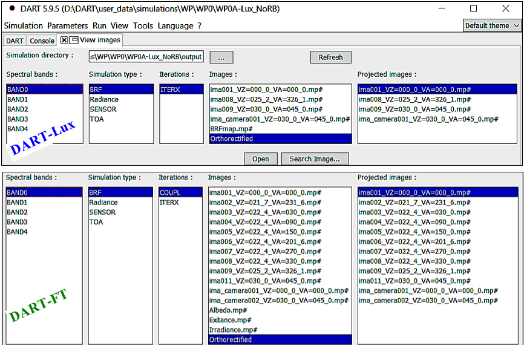
*"Image display" menu of WP0A-Lux_NoRB (bottom) and WP0A-FT (bottom).*
</img>

The figure below shows DART-Lux inadir image ($N_{sample/pixel} = 20$ and $10^3$) and BRF-map ($N_{sample/direction} = 20$ and $90$) at $0.4 \mu m$. Larger $N_{sample/pixel}$ and $N_{sample/direction}$ improve accuracy but increase CT. Pure Monte Carlo is the most accurate method.

*DART-Lux images at 0.4µm. a) Nadir image with 20 and 103 samples per pixel. b) BRF-map with 30 and 90 samples per viewing direction.*
</img>

The figure below shows DART-Lux orthographic reflectance images at 1µm: nadir image and oblique viewing image ($\theta =30°, \phi =45°$) with its orthorectified image, the DART (x, y) reference system. In the nadir image, the orientation of shadow highlight the sun direction ($\theta sun=30°, \phi sun=45°$). In the oblique image, the observed reflectance of the ground is very large because the viewing direction is the specular direction of the ground given the sun direction. The red arrow indicates the viewing direction ($\theta =30°, \phi =45°$). The yellow color indicates zones that are not seen by the sensor. In the orthorectified image, the yellow color indicates zones that are not seen by the sensor.

* DART-Lux reflectance images at 1µm. a) Nadir image. b) Oblique image (θ=30°, φ=45°) and its orthorectified image.*
</img>

DART simulates element images $Im_i$ such that $Im = \sum_i Im_i$. The figure below shows roof and ground images at $0.4 \mu m$. 

*DART-Lux element orthographic and camera images at 0.4µm. a) Ground surface. b) Roof.*
</img>

The figure below shows DART-Lux and DART-FT color composite images created by the tool 'Tools / Color Composites', for BOA and TOA nadir and oblique orthographic views, and BOA oblique cameras with perspective views. DART-Lux and DART-FT images differ due to their different parametrizations of specular reflectance.  
!!!Question
	- Ground and window specular reflectance is observed for specific viewing directions, only. Why?
	- TOA images are bluer than BOA images. Why?
	- Camera images: they are geometrically distorted and specular phenomena occurs in part of them only. Why?

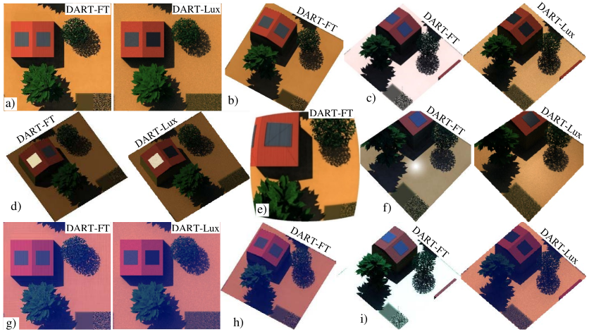
*DART-FT and DART-Lux RGB images with perspective $(\Delta \Omega_v>0)$ and orthographic $(\Delta \Omega_v=0)$ projection.

- BOA sensor $(\Delta \Omega_v=0)$: a) nadir. b) oblique: $\theta_s=22°$,$\phi_s=30°$. Ground (c: $\theta_s=30°$,$\phi_s=45°$) and window (d) specular directions.
- Low altitude camera $(\Delta \Omega_v>0)$: hemispherical (e), oblique along ground specular direction (f).
- TOA sensor $(\Delta \Omega_v=0)$: nadir (g), oblique (h), and ground (i: $\theta_s=30°,\phi_s=45°$) specular direction.*
</img>

$\rho(\Omega)$, $T(\Omega)$ and $L(\Omega)$ can be plotted using the LUT, the brf/temperature file, and also the DART-Lux 90°x360° BRF map. For DART-Lux, these directional data are the average values of the simulated images and data derived from the 90°x360° BRF / BTF map. Figure below shows the DART-Lux scene BOA reflectance and brightness temperature plotted using "View / Directional … / 2D …". It is very anisotropic in the 5 bands, in particular due to:

- Hot spot effect: local maximum around sun direction (•). It increases with wavelength because BOA irradiance is more and more directional. It also occurs in the TIR because only warmer elements are seen in this direction. 
- Specular effect: $\rho_{BOA}^{short \ wave}(\Omega)$  is locally maximal for direction $(\theta_v=30°, \phi_v=45°)$. $T_B(\Omega)$ has no such maximum.

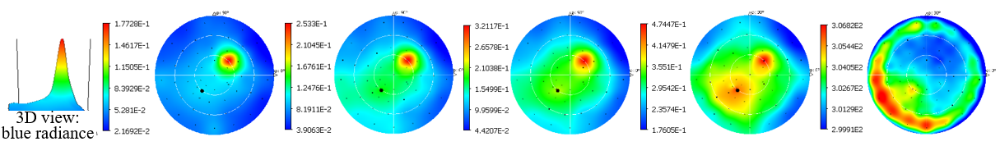
*DART-LUX $\rho_{BOA}^{blue}(\Omega), \rho_{BOA}^{green}(\Omega), \rho_{BOA}^{red}(\Omega), \rho_{BOA}^{NIR}(\Omega)$. The black disc indicates the sun direction.*
</img>

**LUT display:** `View / LUT / File / WP0A-FT.db`

A LUT is a SQL database (here: `WP0A-FT.db`) that stores scene radiometric data of the scene: TOA irradiance $E_{TOA}$, BOA direct $E_{BOA,dir}$ / diffuse $E_{BOA,dif}$ / total $E_{BOA}$ irradiance,... To create the LUT of a multi-band simulation, if the "Run / LUT properties" menu select "LUT creation" and the data to store. The tool "LUT display" menu (the image a. below) selects its LUT and plot its data (the image b. below). Here, $E_{BOA}$  and $E_{TOA}$  are maximal in the green band (the image c. below) and TOA and BOA reflectance in nadir (0°) and ground specular ($\theta_v=30°, \phi_v=45°$) directions (the image d. below) greatly differ, which stresses the anisotropy of BOA and TOA reflectance. The plots can be exported

!!!Question
	DART "analytical atmosphere" is more accurate for simulating reflectance than for simulating radiance. Why? 

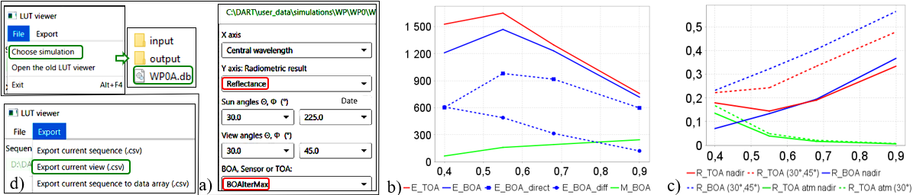
*LUT. a) LUT selection: (WP0A-LUX.db) and data to plot. b) TOA irradiance, TOA irradiance and exitance. c) Nadir and oblique $(\theta=30°)$ TOA and BOA reflectance, TOA atmosphere reflectance. d) Export of the plot. *
</img>

**3D radiative budget (RB):** "View / 3D radiative budget / Surface radiative budget (see below)

RB products are numerous: intercepted, absorbed, emitted and scattered energy per triangle, per cell (x,y,z), per type of element (e.g., leaf),..., for direct sun and total illumination,… and 3D, 2D and 1D. Figure below shows: 3D RB triangle irradiance $E_{dir,0.55\mu m}$ (a), $E_{total,0.55\mu m}$ (b), and absorbed image (c). Here, the RB of DART-Lux is only for the ground and the house because its simulation is less computationally efficient than for DART-FT.

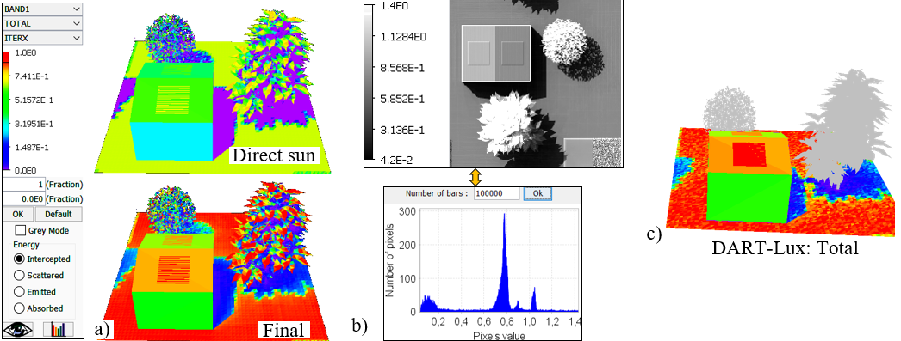
*DART-FT 3D RB (unit %). Facet irradiance: a) DART-FT facet direct sun $E_{sun direct ,0.55\mu m}$ and final $E_{total,0.55\mu m}$ irradiance. b) DART-FT image "Absorbed Energy". c) DART-LUX facet $E_{final}^{ground}$ and $E_{final}^{ground}$.$0.55 \mu m$. Unit % *
</img>

    
The choice of methods and products can greatly influence CT, RAM and hard disk (HD) memory, especially for DART-FT, as illustrated by the table below.

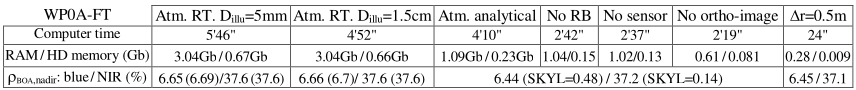
*CT, RAM and HD needed by dart module for WP0A-FT, depending on input parameters and selected products.*
</img>

**`View dart.txt`:** "View / Report files / Dart file" (see below)

The file dart.txt stores major input parameters, results and log data useful to check simulations. For DART-Lux:

- Input data: scene size, number of scene repetitions, upward sun direction, light radiation mode, maximal scattering order, Russian roulette depth, sampler, image pixel size, number of samples per pixel, number of samples per direction, maximum simulation time per image, number of threads, spectral bands , atmosphere geometry ,…

- Results: illumination (irradiance and SKYL per band ), scene exitance and albedo / brightness temperature .

- Memory usage and processing time. They depend on the scene model and the requested products.

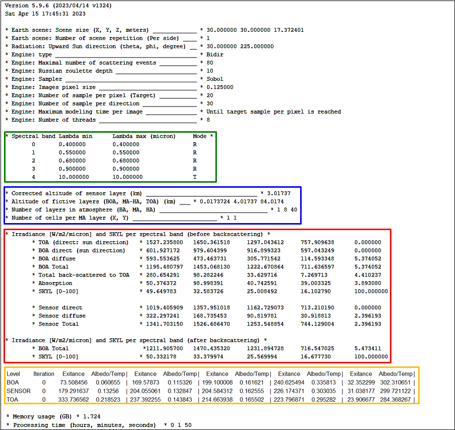
*File dart.txt file of WP0A-Lux.*
</img>

### **2) BOA and TOA scene spectra: WP0B-FT** (CT: 7"), **WP0B-Lux** (CT: 7")

<u>*Objective :*</u> to simulate scen TOA and BOA spectra.

- **Copy WP0A-LUX as WP0B-LUX** with DART tool `Simulation / Save as`.

- **Simulation editor:**
	- "Passive RS & RB" menu: set "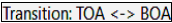 *Analytic model*" It is faster than with "Atmosphere RT", but is less accurate and does not give TOA data. For DART-FT, set *"Illumination mesh D: 0.015m"*.
	- "Spectral intervals" menu ( right click: ): add 200 bands over [$0.4\mu m\: 0.8\mu m$] ($\implies \Delta \lambda=2nm$) in mode R.
	- "Products" menu: remove the RB product.
	- "Products/BRF" set "**Image No**" and "**Product per type of Earth scene element: $\Box$**" ($\implies$ results only in the LUT).
	- "Sensors" menu: remove the 2 frame cameras (i.e., delete "").
	- "Directions" menu: remove the 2 added directions.
	- Optical properties / Lambertian" menu: unset or remove the property 'Specular'. Then, all surfaces are lambertian.
	- "Earth scene" menu: set 'Lambertian: ground' for the "Earth scene" (DART-FT: set $\Delta x_{cell} = \Delta y_{cell} = 1m$).
	- "Plots" menu: hide the 2 plots with the option 
	- "3D imported object" menu: hide objects "DEM" and "Cherry tree" with 
	- "Atmosphere": unselect the product "TOA atmosphere radiance" and display (Gas → Optical properties": ) the transmittance (see the image a. below) of scattering gases and absorbing gas

- **Run WP0B-FT:** `Run / DART`

- **DART spectra from the LUT:** `View / LUT`
  DART-Lux and DART-FT differ because specular optical properties differ. The image b. below shows:
	- TOA irradiance $E_{TOA}$, BOA irradiance EBOA, BOA exitance $M_{BOA}$. $E_{BOA}(\lambda) \ll E_{TOA}(\lambda)$ at $\approx$ 760nm, 700nm, 720nm. $\implies$ Why?
	- BOA radiance $L_{BOA}(\lambda)$ for 3 directions $(\theta_v=0°, 22°,41°)$kj. It illustrates the anisotropy of Earth surface radiance.
	- BOA scene reflectance $\rho_{BOA}$. TOA scene $\rho_{TOA}$ / atmosphere ρatm reflectance (*only if 'Atmosphere RT' is run*; not to do)

!!! Question
    $\rho_{TOA} > \rho_{BOA}$ for small $\lambda$ and $\rho_{TOA} < \rho_{BOA}$ for large $\lambda$. Why? ($\rho_{TOA} \approx \rho_{atm} + T_{atm}.\rho_{BOA}$)

!!! note
    DART-Lux directional data $L_{BOA}(\lambda)$ and data integrated over $2\pi^+$ (i.e., albedo and exitance) are derived from the BRF map. The later is simulated if user-specified or if the LUT has the option "**Only for added directions $\Box$**". 

- <u>"*Analytic model" vs. "Atmosphere RT*":</u> with 200 bands, the "Analytic model" is accurate for BOA albedo $A_{BOA}$, approximate for $E_{*BOA}$ and greatly faster (phase module: 37" $\rightarrow$ 8"; *dart* module: 244" (43" without option 'Coupling') $\rightarrow$ 6"). $E_{BOA}$, SKYL and $A_{BOA}$ at 0.4 and $0.8\mu m$ for "Atmosphere RT" after / before coupling $\rightarrow$ "*Analytic model*" are:

	- $0.4\mu m$: $E_{BOA}: 1265 / 1244$ (**coupling** $\implies \approx 2\%$ increase) $\rightarrow$ $1197 W/m^2/\mu m, SKYL: 50.3 / 49.5 \rightarrow 47.6\%$, $A_{BOA}: 7.21 / 7.21 \rightarrow 7.17\%$
	- $0.8\mu m$: $E_{BOA}: 947 / 938$ (**coupling** $\implies \approx 0.9\%$ increase) $\rightarrow 910 W/m^2/\mu m, SKYL: 20.2 / 19.5 \rightarrow 17.1\%, A_{BOA}: 30.1 / 30.1 \rightarrow 30.1\%$.

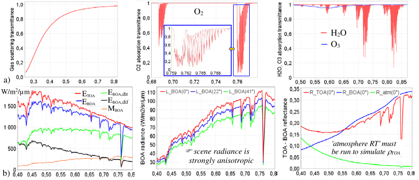
*a) `dart_atmosphere.db`: atmosphere transmittance (scattering gases, O2 and O3 / H2O absorption). b) LUT: TOA & BOA irradiance/exitance, radiance $L_{BOA}(\Omega)$ for 3 directions, and TOA/BOA scene and TOA atmosphere reflectance.*
</img>

!!!note
	TOA scene and atmosphere reflectance need the "Atmosphere RT" mode.

### **3) Vegetation reflectance as a function of LAI: WP0C-FT (CT24 simulations: 10"), WP0C-Lux (CT 24 simulations: 16")**

- <u>*Objective*</u>
  1) $\rho_{plot}(LAI,\rho_{ground})$ of a DART vegetation at $0.4\mu m$ and $1\mu m$.
  2) Use of the DART sequencer of simulations.

- **Copy WP0B-FT as WP0C-FT** with DART tool `Simulation / Save as`.

- **Simulation editor:** 

	- 'Spectral intervals' in 'Passive RS & RB parameters': to create 2 bands. right click +  (spectral range: $0.4-0.4\mu m$, 1 band). Then, create the 2 band with "Add" $(1\mu m, \Delta \lambda=0\mu m$).
	- "Products": remove all products. Then, results are stored only in the LUT of the simulation / sequence.
	- "Directions": add a single direction "Nadir" direction.
	- "Optical properties": set "Multiplicative factor for database: $\checkmark$" for the 1st lambertian property "ground".
	- "Earth scene": set "Whole: sub" 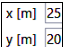 and 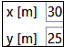 Points 2D   and  .DART-FT: $\Delta x_{cell}=\Delta y_{cell}=5m, \Delta z_{cell}=0.1m$.
	- "Earth scene plots": unset "Ignore this plot in mock-up creation" for the 1st plot.

!!! note
    CT of DART-FT is greatly reduced if in "Passive RS & RB", we set: *Illumination step: D=0.5m*
    
- **Create the sequence** `seq_ground_LAI.xml` {$LAI \in [0 \:6]$, $\Delta_{LAI}=0.5$; $\rho_{ground}(\lambda)=0$ and 0.5 x loam_sandy_brown…} 
 Use the method `Run / SequenceLauncher / Create Sequence`(Figure below), then in the Sequence menu:
	- Click on  then add the group "Rground" {mode *Enumerate*, 2 cases $\rho_{ground}$ defined by "value 1=0" and "value 2=0.5"} and the group "LAI" {mode *linear*, 13 "LAI" defined by an initial value 0 and a step 0.5}.
	- `Preferences / Process…`: define the processes and number of simulations to run in parallel.
	- `Preferences / Delete…`: set the files to delete / keep; here, it deletes all files, apart the LUT.
	- `Preferences / LUT generation`: set the data to store and "Only added directions" ($\implies$ BRF not simulated).

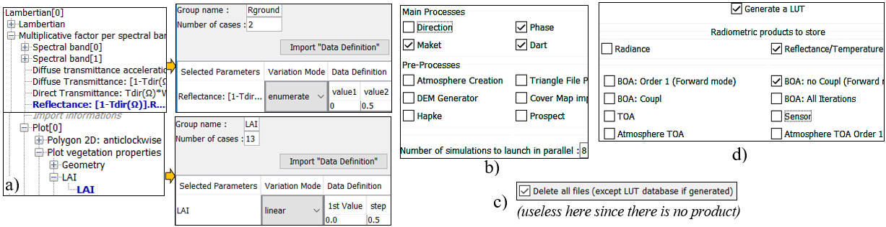
*Sequence creation. The 2 variables are $\rho_{ground}$ (2 values: 0 and 0.5) and LAI (13 values: 0 to 6; step=1).*
</img>

- **Run the sequence:** `Run / SequenceLauncher / Prepare and run sequence`.

- **Display** $\rho_{plot}(LAI)$ with {$\rho_{ground}=0$ and $\rho_{ground}=0.5$x'loam_sandy_brown...' at $0.4\mu m$ and $1\mu m$} with `View / LUT` (see below). As expected, if $\rho_{ground} >0$, $\rho_{plot}(\lambda,LAI)$ increases if LAI increases. It decreases at $4\mu m$ if $\rho_{ground} =0$.

!!! note
    Sequences can be run for any parametrs and any landscape. 
    

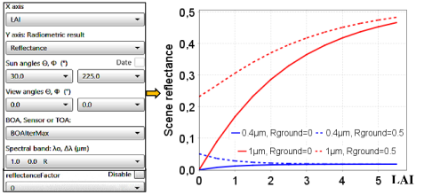
*Nadir ρplot (LAI) at $0.4\mu m$ and $1\mu m$, with $\rho_{ground}(\lambda)=0$ and 0.5 x "loam…".*
</img>

### **4) Time series: WP0D-FT (CT 29 simulations = 13"), WP0D-Lux (CT 29 simulations = 34")**

- <u>*Objective*</u>: variation of $E_{TOA}(t), E_{BOA}(t)$ and $\rho_{plot}(t)$ from 6h to 20h with 30min time steps.

- **Copy WP0C-LUX as WP0D-LUX** with DART tool `Simulation / Save as`.

- **Simulation editor:**
	- "Passive RS & RB parameters / Spectral intervals": set only band $(0.4\mu m, \Delta \lambda=0\mu m$).
	- "Directions": set sun direction (option "Exact date": 5 am on 22/07/2018, Local time, Time zone 0: Figure below).
	

*Definition of sun direction with the option "Exact date".*
</img>

- **Create the sequence** [5h 19h30] {29 steps, $\Delta t=30mn$}: `Run / SequenceLauncher / Create Sequence` (see below)

*Sequence creation {t $\in$ [5h  19h], $\Delta t$=30mn} (a) with specification of data to store in the LUT (b).*
</img>

- **Run the sequence:** `Run / SequenceLauncher / Prepare and Run…`

- **Display LUT results:** `View / LUT / File / Choose Simulation` and select "Exact date" for the Ox axis.  
The images a and b show {$E_{TOA}(t)$, $E_{BOA}(t)$, $E_{BOA,dir}(t)$, $E_{BOA,diff}(t)$} and $\rho_{plot}(0°,t)$ at $0.4\mu m$. $\rho_{plot}$ is larger early and late in the day because at that time $E_{BOA,diff}(t) > E_{BOA,dir}(t)$, whereas $\rho_{plot,diff}(t) > \rho_{plot,dir}(t)$.

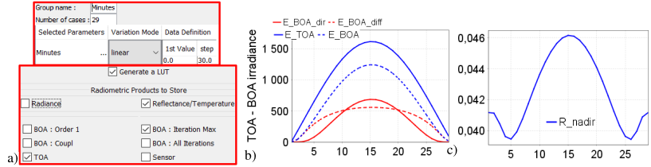
*a) Menu for LUT creation {$t\in[6h \:18h]$, $\Delta t=30mn$}. b) TOA/BOA irradiance. c) Nadir reflectance. $0.4\mu m$.*
</img>

### **5) Topography and trees: WP0E-FT (CT=9"), WP0E-Lux (CT=2")**

<u>*Objective*</u> to simulate topography and trees, and their nadir reflectance.

- **Copy WP0D as WP0E.** Then, remove the sub-zone ($\implies$ scene = 30m x 30m).

- **Spectral intervals**: set 2 bands: $0.67\mu m, 1\mu m$; $\Delta \lambda=0\mu m$. Sun angles: $\theta_s=30°, \phi_s=225°$. Illumination step: 0.015m.

- **Direction**: set sun angles "Viewing angle $\theta s = 30° , \phi s= 225°$". (DART-FT: illumination step = 0.015m).

- **Earth scene**: set "Whole: whole". $\Delta x_{cell}=\Delta y_{cell}=0.25m$ and $\Delta z_{cell}=0.5m$.

- **Earth scene: Plots**, set "Ignore this plot in mock-up creation" for the 2 plots.

- **"Earth scene: trees"**
	- Set option "Exact tree location + random trunk/crown dimensions (mean, standard deviation) per tree specie". 
	- Set "Ignore trees in mock-up creation: $\Box$".
	- Create and import the file 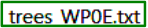 (see the table below) in folder 'input': 4 trees of 2 tree species.
	- Species 1: default species, $LAI_{species1}=0.6$. 
	- Species 2: create it with `right click` Species / Duplicate on Species 1. Then set LAI=0.2 and Crown= truncated cone with Bottom radius= 3m and top radius= 0.5m. Trees will be simulated with facet-crowns (, $Area_{triangle}$: $0.1m^2$), then turbid-crowns.

- **Import 3D object** : Digital Elevation Model(DEM) `dsm_gauss 50cm.obj` (3D object): 
	- right click on `3D imported object / Punctual object` and replace `dsm_50cm.obj`by `dsm_gauss_50cm.obj`.
	- Set "Ignore the Digital Elevation Model (DEM): $\Box$".
	- Set "DEM mode: Used as DEM"; then, scene elements are automatically above this 3D object.
	- "Geometric properties: Position". Center the DEM at (15m, 15m). 
	- Set the DEM optical property $\rho_{ground}$, temperature property to (Tmineral) and color. 
- **Import 3D object** : windows have new altitudes because of the DEM (window 1: 6.8m, window 2: 5.6m).

!!! note
	Same or different scene in repeated simulations. Scenes defined by standard deviations (e.g., dimensions of DART created tree) are identical or not in repeated simulations depending on option .
!!! note
	DEM. Raster and vector (i.e.,3D object treated as a DEM) DEM can be imported. The option ( (Figure below) + user-defined pixel dimensions) creates schematic raster DEMs (e.g., plane, gaussian).
!!! note
	3D object creation: {Maket module + option 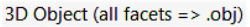  + raster DEM} creates a 3D object dsm.obj with all facets of the scene. It can be the DSM (Digital Surface Model) or the DEM if the scene is a pure ground surface. 
!!! note
	High spatial resolution RBground. The DART default horizontal ground surface is made of 2 triangles. It must contain many small facets to simulate a spatially accurate RBground. A solution is to use a fine resolution vector or raster "plane" DEM. For horizontal scenes, this can be done through the creation of an horizontal DEM (e.g.,   with small cell dimensions) that is later vectorized or not as a 3D object.

*Creation of a 3D object (a) that results of a "schematic DEM" (b) created with resolution: $\Delta x_{cell}=\Delta y_{cell}=0.5m$ (c) and shape (b) that can be horizontal, gaussian,… *
</img>

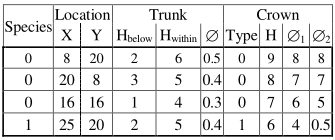
*File `trees_WP0E.txt`: Species (tree optical properties,…), Location, Trunk, Crown. The header of the file `trees.txt` in DART database lists all possible parameters. Here the option "Exact tree location + random dimensions", only uses "Species, X, Y" of the tree file; all other parameters are set in the GUI.*
</img>

Figure below shows DART-Lux and DART-FT nadir reflectance images simulated at $0.67\mu m$ and $1\mu m$, with a $0.25m$ spatial resolution, for 2scene simulations (i.e., tree crowns filled with 1m2 facets or turbid medium). DART-Lux and DART-FT mean reflectance images are very close. However, DART-Lux is much faster. It is also more accurate if Nsample/pixel is large enough. The similarity of results with facet and turbid tree crowns stresses that here, with trees occupying a small part of the scene, the transformation "Turbid  Facets" is interesting as it leads to faster results. 
DART-FT: 

- CT increases if cell size $\Delta r$ decreases, more for "turbid trees" than for "triangle trees". Ex.: for $\Delta r$ from 1m to 0.25m, CT increases $\approx 5$ fold for "triangle trees" and $\approx 100$ fold for "turbid trees" (see below).
- the `dart.txt` file informs if a different (more optimal) number of iterations should be used.

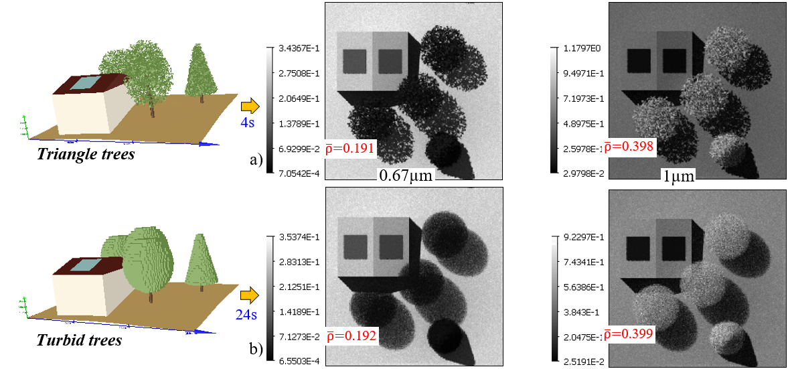
*Nadir DART-FT images. Facet (a,b) and Turbid (c,d) trees. $0.67\mu m$, $1\mu m$. e) $1\mu m$ element images. $\Delta r=1m.$*
</img>

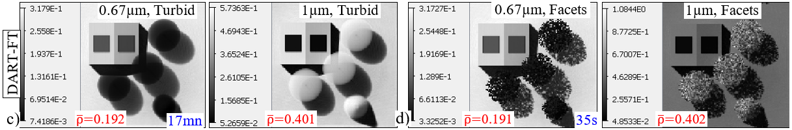
*DART-FT (a,b) & DART-Lux (c,d) images: $0.67\mu m$, $1\mu m$. $\Delta r=0.25m$. a,c) Turbid trees. b,d) Triangle trees.*
</img>

Monte Carlo noise and uncertainty in the simulation of the 3D scene are the 2 usual sources of uncertainty in DART-Lux reflectance. Here, this is illustrated for the case of nadir reflectance $\rho(0°)$ at $0.67\mu m$ and $\mu m$ (Figure below): 

- Pure Monte Carlo noise: here, it is assessed by running $N_{MC} = 5$ times the same simulation with an identical 3D scene both for tree crowns filled with turbid medium and facets. It is done with a sequence that does not run the maket module and that gives 5 values to a DART parameter (e.g., SENSOR altitude) that does not influence $\rho(0°)$. 

- 3D scene uncertainty with combined Monte Carlo noise: here, the 3D scene uncertainty is cause by the facet random position and orientation around the spherical angular distribution. It is assessed with the above sequence, but with a re-simulation of the 3D scene with option "**Use random seed for random operations: $\checkmark$**" at each simulation. 

Although the trees occupy a small portion of the scene, the variability of $\rho(0°)$ caused by the 3D scene uncertainty is larger than that caused by the Monte Carlo noise by a factor of just under 2.  

*DART-Lux uncertainty. a) Turbid crowns. b) Facet crowns with same facet distribution. c) Facet crowns with variable distribution of facets in the tree crowns. 0.67µm (top) and 1µm (bottom).*
</img>

### **6) Presence of a cloud: WP0F-FT** (CT=211"), **WP0F-Lux** (6s)

<u>*Objective :*</u> impact of cloud in images with very schematic cloud simulation

<u>*Scene:*</u> 3 bands (0.4, 0.55, $0.68\mu m$; $\Delta \lambda=0\mu m$). $\Delta r=0.1m$. Cloud: ellipsoidal (33m altitude, reflectance: $\rho_{ellips}=0.4$; diffuse transmittance: $t_{ellips}$=0.3. Facet trees.

!!! warning
    The ellipsoidal should be filled with fluids in order to get realistic results! This is being implemented. CT will greatly increase for DART-FT, and much less for DART-Lux.

!!! note
    DART-FT's greatly decreases with option "1st scattering order, Only for stored image"

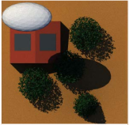
*DART-Lux: scene + cloud.*
</img>

### **7) LiDAR: WP0G**

#### **a) LiDAR mono-pulse: WP0Ga-RC (CT=1"), WP0Ga-Lux (CT=1")**

<u>*Objective:*</u> LiDAR signal of DART-Lux (bi-directional MC) & DART-RC (forward MC)

- Copy WP0E-Lux as WP0Ga-Lux and select "Radiation / Objective": LiDAR
- "LiDAR parameters": Energy of each pulse : $1 mJ$ ($\approx 5.35 10^{15}$); Number of rays used to sample photons : $10^6$.
	- "Spectral intervals": 1.064µm 
	- "LiDAR geometry ": 
		- Stored waveform for height above/below minimum altitude : 50m
		- Footprint / FOV central direction  $(0°)$, center  (15m, 15m)
		- "Radii" : footprint: 12m, FOV: 15m. 
		- "ALS" : altitude: 10km. 
- "Products": convolved waveform, photon image, per scene element type and photon information (Figure below).
-  "Scene": $\Delta x = \Delta y = 1m$. "Urban", "Plots", "Trees", "3D objects": ignore all elements; then, the scene is bare ground.

*LiDAR mono pulse: menu.*
</img>

***1) Bare ground***
  The bare ground scene is simulated without and with the DEM. The figure below shows the resulting LiDAR images:

- BOA incident LiDAR pulse: 2D distribution of photons in footprint. We have: $N_{photons} \approx 5.35 10^{15} (N_{pixels} = 448)$.
- BOA backscattered LiDAR signal: $N_{photons} = 0$ in the part of the FOV outside the footprint.
- BOA equivalent LiDAR reflectance: its mean value is $0.45825$ that is very close to the actual $\rho_{ground} = 0.48578$. The slight vertical dissymmetry is being corrected. 

Figure 141 shows two types of waveforms without and with the DEM:

- Raw waveform: theoretical case where all photons are launched at the same time ($\Delta t_{pulse} = 0s$). It is stored in output / file `LIDAR_DART_wave.txt`. 
- Convolved waveforms: convolution of the raw waveforms with the realistic pulse signal ($\Delta t_{pulse} > 0s$).

The raw and convolved waveforms have the same number of photons: $8.28 10^5$ with no DEM and $8.09 10^5$ with the DEM. The number of photons is smaller in presence of the DEM because its sloppy surfaces are less illuminated than the horizontal ground surface.

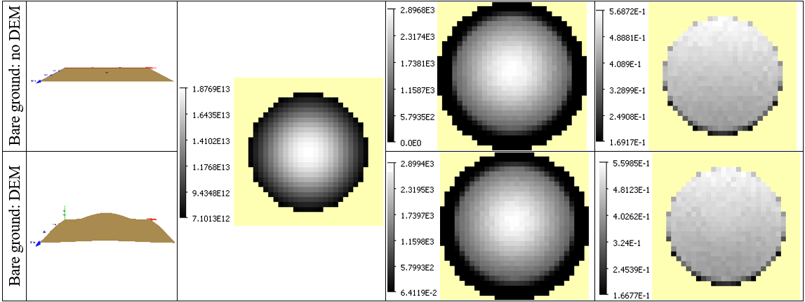
*LiDAR mono pulse:LiDAR images ffor bare ground without DEM and with DEM.*
</img>

*LiDAR mono pulse of bare ground. a) Without DEM. b) With DEM. *
</img>

**2) 3D scene plus trees, house and DEM**

The scene is simulated with the DART created trees, house (with its skylights) and the DEM (Figure below). Here, the number of rays used to sample photons is $10^5$. Figure below shows the waveforms of the scene and per type of scene element (i.e., ground, roof, vegetation, etc.), where the scene element is the last scatterer. Their shapes depend on the altitudes of scene elements, including the DEM, on single and multiple scattering by and between scene elements, and also on the laser pulse duration. These interaction explain that the waveform of the ground is not a Dirac function and has non null values for negative time on the horizontal axis (i.e., time = 0 ns for horizontal ground without scattering). 

*LiDAR mono pulse: a) DART editor: scene with footprint and FOV. b) 2D view. c) 3D view.*
</img>

*LiDAR mono pulse: raw waveform per type of scene element.*
</img>

DART-Lux and DART-RC results are very similar. The figure below shows images at the scene level (i.e., BOA): incident LiDAR pulse, backscattered LiDAR signal and equivalent LiDAR reflectance. The two skylights appear with dark tones because their reflectance is very low. 

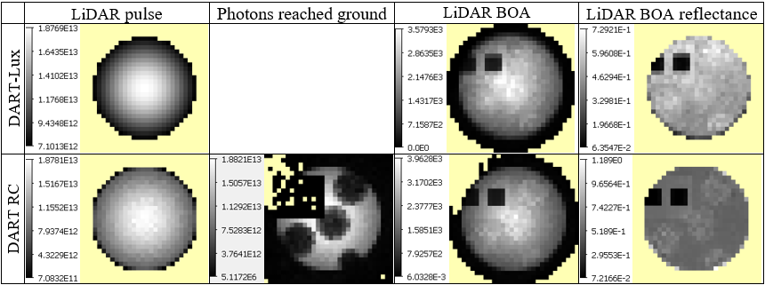
*LiDAR mono pulse: LiDAR pulse, Photons reached ground, LiDAR BOA signal and LiDAR BOA signal reflectance. Top:DART-Lux. Bottom: DART-RC.*
</img>

DART-RC simulates the exact and apparent location of 3D last scattering per volume and scatterer (Figure below). This is not yet implemented in DART-Lux.

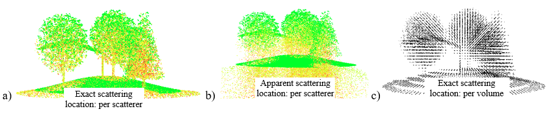
*a) 1st and multiple order 1D waveform. b) Exact scattering location: c) Apparent scattering location. d) Backscattered energy per volume unitThe energy can be thresholded. *
</img>

#### **b) LiDAR multi-pulse: WP0Gb-FT (CT= 40") and DART-Lux (1'43")**

<u>*Objectve*</u>: to illustrate the simulation of ALS.

DART-Lux input parameters are given below. They are the same for DART-FT. Presently, DART-RC is advised because DART-Lux is slower. It will be improved soon. 

- Copy WP0Ga-Lux as WP0Gb-Lux.
- DART-Lux: LiDAR / LiDAR parameters: 
	- Number of rays used to sample photons : Nphotons=4 104.
	- / Geometry / Radii : footprint= 0.3m, FOV=0.4m
	- / ALS / Swath :  altitude=1km
	- / Swath:  swath width,   Start (7m, 7m) /  end (23m, 23m) points, 
	  control point (0m, 0m), 
	  azimuth / range resolutions: 1m.

*Multi-pulse menu.*
</img>

*ALS. Waveform of pulse 254 and 3D view of all waveforms.*
</img>

#### **c) LiDAR Discrte return: WP0Gc** (CT=23")

With option "LiDAR Type": Discrete Return", a discrete points cloud is derived from a Gaussian decomposition (GD) of DART waveforms. To ensure that all discrete points are detected by GD, set "Number of points per pulse" to 10 or larger. File DetectedPoints.txt stores the point cloud. The open source code CloudCompare (Figure below) can display it. 

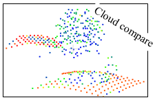
*Point cloud `DetectedPoints.txt`.*
</img>

### **8) Large scene and DART-Lux parameters: WP0H-Lux**

<u>*Objective:*</u> to illustrate the type of sensitivity study to perform in order to determine the values for $N_{scattering}, N_{sample/direction},$ and $N_{sample/pixel}$ given the Monte Carlo noise of DART-Lux. This question is considered below for scene reflectance derived from BRF maps and also from images.

- Scene: (Figure below) 100m x 100m schematic DEM (3D object) with the Järvselja birch stand from the RAMI experiment (rami-benchmark.jrc.ec.europa.eu) that consists of 1047 trees in 18 species (acer, populus,…). All trees are simulated as clones of 18 tree obj trees stored in "input\trees_simplified". Sun direction: $\theta s=36.6°, \phi s=180°$. 

*DEM, a few trees of the RAMI Järvselja birch forest, with the DART-Lux simulated 3D scene.*
</img>

- Rectangular (BRF map) and derived polar plot of $\rho(\theta,\phi)$
  Figure below shows the BRF map at $0.44\mu m$ and polar plots of $\rho(\theta,\phi)$ derived from BRF maps at $0.44\mu m, 0.57\mu m, 0.66\mu m$ and $1\mu m$. These results are for $N_{sample/direction} = 100, N_{scattering} = 80$ and BRF maps simulated with 1° view zenith and azimuth resolution over the whole angular range (i.e., the BRF map has 90 lines and 360 rows). Two features can be noted in the BRF map at $0.44\mu m$:

	- Maximal values around the hot spot direction (i.e., $\theta s=36.6°, \phi s=180°$). This maximum also appears in the polar plots for the 4 spectral bands. It is not only due to vegetation because it also appears with "bare ground + DEM". 

	- Absence of reflectance values (yellow color) for viewing directions $\bar{\Omega}_V$  with "large view zenith angles combined and small or large view azimuth angles" such that $\bar{\Omega}_V.\bar{\Omega}_{slope}   < 0$.

*Directional reflectance of RAMI Järvselja birch forest. Top: BRF map (90 lines x 360 rows) at $0.44\mu m$. Bottom: polar plots at $0.44\mu m, 0.57µm, 0.66\mu m$ and $1\mu m$. $N_{sample/direction} = 100$. $N_{scattering} = 80$.*
</img>

- Scene nadir reflectance $\rho(0°)$ at $0.44\mu m$ and $1\mu m$ (Figure below), as derived from 2 independent products:
	- BRF map. $\rho(0°)$ is the mean value of the 1st line of the BRF map. Here, $N_{sample/direction}$ is from 1 to 100 with 25 intermediate results using $\Delta _{BRF\ map}^{save} = 4$. 
	- Reflectance image of the scene. $\rho(0°)$ is the mean value of the nadir reflectance image. Here, $N_{sample/pixel}$ is from 1 to 20 with 20 intermediate results using $\Delta _{image}^{save} = 4$. 

Each product is simulated $N_{MC} = 5$ times to evaluate the Monte Carlo noise. Here, it is done by setting 5 distinct values to a DART parameter (e.g., SENSOR altitude) that does not influence $\rho(0°)$. Each product is also simulated for $3\ N_{scattering}$ (i.e., $10, 20$ and $80$) values to evaluate the influence of the scattering order on $\rho(0°)$. It leads to 30 simulations (i.e., $2$ x $N_{MC}$ x $N_{scattering}$) computed by 2 sequences: one sequence simulates 15 spectral nadir images at $0.05m$ with 20 saving steps each, and one sequence simulates 15 spectral BRF maps with 25 saving steps each. Here, the mean value of any image is computed with a number of samples (i.e., $N_{pixel}$ x $N_{sample/pixel}$ where $N_{pixel} = 4 10^6$ as $\Delta r = 0.5m$) much larger than the BRF map (i.e., $N_{sample/direction}$). Therefore, the nadir image leads to a more accurate $\rho(0°)$ than the BRF map. 

For $\rho(0°)$ derived from the nadir image, $\rho(0°)$ at 0.44µm is nearly the same at $N_{scattering} = 10, 20$ and $80$. At $1\mu m$, $\rho(0°)$ increases from $N_{scattering} = 10$ to $N_{scattering} = 20$, whereas its change from $N_{scattering} = 10$ to $N_{scattering} = 20$ is within the Monte Carlo noise.

Figure below shows relative errors on $\rho(0°)$ derived from BRF maps and images. The reference $\rho(0°)$ is the average of all images simulated with {"$N_{sample/pixel} = 20$", $N_{scattering} = 80$}; it is $0.013294$ at $0.44\mu m$ and $0.250654 at 1\mu m$. The relative error of $\rho(0°)$ derived from the BRF map with $N_{sample/direction} = 100$ is $\approx 0.01$ at $0.44\mu m$ and $1\mu m$; it decreases down to $0.002$ with $N_{sample/direction} = 1000$. The relative error of $\rho(0°)$ derived from the nadir image is much smaller because $N_{pixel}$ is much larger than $N_{sample/direction}$. It is less than $0.0013$ with $N_{sample/pixel} = 1$.

*Variation of nadir reflectance $\rho(0°)$ with $5\ N_{MC}$ and 3 $N_{scattering} (10, 20, 80)$ values. Top: $\rho(0°)$ from the BRF map with $N_{sample/direction} = 100$ and $\Delta _{BRF\ map}^{save}  = 4$. Bottom: $\rho(0°)$ = mean value of nadir image with $N_{sample/pixel} = 20$ and $\Delta _{image}^{save} = 1$. Left: $0.44\mu m$. Right: $1\mu m$.*
</img>

*Relative error of $\rho(0°)$ at $0.44\mu m$ (blue) and $1\mu m$ (red) derived from image (solid line) and BRF map (dotted line).*
</img>

- Nadir images: DART-Lux accuracy increases with $N_{sample/pixel}$, and therefore with simulation time. Figure below illustrates this increase with images simulated at $0.44\mu m$ with $N_{sample/pixel}$ equal to 1 and 20 and $N_{scattering} = 80$: reflectance improves considerably at the pixel level, but its average value over the whole image is nearly constant (i.e., relative difference $\approx 3.9 10^{-4}$). On the other hand, computation time (CT) is multiplied by 20. With resolution $\Delta r = 0.05m$, DART-Lux needs less than 3 Gb of RAM for the maket module and $\approx$ 3.8 Gb for the dart module. On the other hand, DART-FT needs more than 400Gb of RAM if $\Delta r = 0.125m$, and much more if $\Delta r = 0.05m$. In addition, DART-FT is much slower. It explains why only DART-Lux results are showned here. Figure below shows DART-FT and Lux color composites with indication of the corresponding CT and RAM. 

*DART-Lux images of Järvselja forest. a) $N_{sample/pixel} = 1$. b) $N_{sample/pixel} = 20$. $\lambda = 0.44\mu m$.*
</img>

*DART images of RAMI Järvselja birch forest. a,d) DART-FT: CT=24h; $\Delta r=12.5cm$; RAM > 400Gb. b,e) DART-Lux: CT=1'; $\Delta r=5cm$. c,f) DART-Lux: CT=5'; $\Delta r=5cm$.*
</img>

