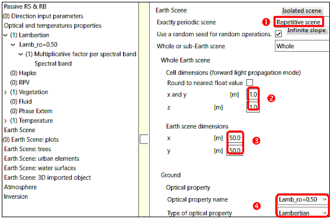

<u>*Objective:*</u> 

- To manipulate lambertian surfaces (i.e., isotropic radiance and reflectance) and spectral / broadband terms: radiance $L_{\lambda}(\Omega)$ / $L_{\Delta \lambda}(\Omega)$, exitance $M_{\lambda}$ / $M_{\Delta \lambda}$, irradiance $E_{\lambda}$ / $E_{\Delta \lambda}$, bi-directional reflectance factor (BRF): $\rho_{\lambda}(\Omega)=\frac {\pi.L_{\lambda}(\Omega)} {E_{\lambda}}$ / $\rho_{\Delta \lambda}(\Omega)=\frac {\pi.L_{\Delta \lambda}(\Omega)} {E_{\Delta \lambda}}$, ...

- To create mono-band (1 band) & multi-band (N bands) simulations of 2D scenes and display images {$\rho_{xy,\lambda}(\Omega), L_{xy,\lambda}(\Omega)$,...} and 2D/1D plots: $\overline{\rho}_{xy,\lambda}(\Omega),\overline{\rho}_{xy,\lambda}(\theta, \phi=cst)$, LUT...

- To create a spectral sequence (cf. [III.5.3](../../DART_functionalities_and_products/5-Run_menu/5.3/sequencer_module.md) ) of mono-band simulations and its LUT.

</img>

The 2 DART modes (Bi-Directional Monte Carlo, Forward: initial mode) give similar image and radiative budget (RB) products. 'Forward' (i.e., 'DART-FT: Passive RS & RB' uses the DOM; 'DART-RC: LiDAR' uses the RC method) is optimal for simple scenes and RB. Being optimal for complex 3D scenes, 'Bi-Directional' (i.e., DART-Lux) is advised here. Screen copies show how to create WP1-Lux and WP1-FT simulations with parameters in Table below. 

*WP1A parameters with those specific to the Forward (DART-FT) and Bi-Directional (DART-LUX) modes. They are stored in xml files (i.e., text files) in the simulation 'input' folder. After entering them in the GUI, save the simulation (command `File / Save simulation`). Then, the symbol " * " on top of the editor menu panel disappears.*
</img>

### 1) Preparation and run of a DART simulation: WP1A-FT (CT=3"), WP1A-Lux (CT=19")

<u>*Objective:*</u> to get started with the edition and run of a DART simulation, 1D and 2D displays,...

- **Create WP1A-* ** (`Simulation / New simulation`): * = FT or LUX. It creates 2 empty folders (input, output) in folder WP1A-*.

- **Enter data of the table above into the simulation** (GUI command `Parameters / Editor`)

 *Light propagation mode*: Bi-Directional ($\implies$ DART-LUX *.Lux simulations) or Forward  (DART-FT)

Radiation menu. *Light propagation mode: 'Forward' to create WP * -FT simulations and 'Bi-Directional' to create WP * -Lux simulations.  'Transition:TOA $\leftrightarrow$ BOA": Analytic model'.*
</img>

- <u>*Irradiance or radiance*</u> (see below): here, an analytic model (option: "TOA $\rightarrow$ BOA transfer") derives BOA irradiance {$E_{BOA,\lambda}, SKYL_{\lambda}$} from "Thuiller-Kurucz" TOA spectral irradiance $E_{TOA,\lambda}$ in database '`solar_constant.db`; $W/m^2/\mu m$) and atmosphere properties in DART database '`dart_atmosphere.db`. It does not compute the BOA $\rightarrow$ TOA transfer and therefore the TOA data ($\implies$ in the LUT: $L_{TOA}^{\uparrow}(\Omega)=L_{BOA}^{\uparrow}(\Omega) \:\forall \Omega$ and $M_{BOA} = M_{TOA}$.

!!! note
    Other scene illumination: "spectral radiance $L_{BOA,\lambda}(\Omega)$", band irradiance/solar constant $E_{BOA,\Delta \lambda}$: $W/m^2$, $SKYL_{\Delta \lambda}$ (1: cloud cover = 100%; 0: atmosphere does not scatter), or "spectral irradiance $E_{BOA,\lambda}$ $(W/m^2/\mu m) + SKYL_{\lambda}=\frac {E_{sky,\lambda}} {E_{BOA,\lambda}}$".
!!!Question
    The analytical model is less accurate than atmosphere RT, and is more accurate for $\rho_{scene}$ than for $L_{scene}$. Why ? 

*Specification of TOA irradiance using the spectral irradiance table ThKur.*
</img>

- <u>*Forward parameters*</u>: DART-FT iterates N times (here, N=5). IterX is the extrapolated data from last 4 iterations.

- <u>*BI-directional parameters*</u>:  Max scattering order,  Pixel size,  Number of samplings/pixel,...

*Parameters specific to the Bi-directional mode  (a) and Forward mode (b).*
</img>

- <u>*Spectral intervals*</u> (see below): {central wavelength $\lambda_m$, bandwidth $\Delta \lambda$; $\mu m$}. A mouse right click on 'Spectral intervals' adds single bands or a range of bands. The index () indicates the number of user defined intervals.

*Setting the spectral band [0.70 0.71] and its mode R.*
</img>

- <u>*DART products*</u> (see below)

*BRF/BTF menu: products. a)  Forward mode (left) and  Bi-Directional mode (right). Here, $\theta _{max} = 25° \implies$ only images with $\theta _v <25°$ are stored to save computer memory.*
</img>

- <u>*Optical property*</u> (see below): create reflectance $\rho=0.5$, called "Lamb_ro=0.50", by multiplying reflectance $\rho=1$ of model "reflect_equal_1_trans_equal_0_0" in database `lambertian_mineral.db` by 0.5 for all bands.

*Setting the optical property "Lamb_ro=0.50": $\rho=0.50$. a) For 1 band only. b) For all bands.*
</img>

<u>*The Earth scene*</u> (see below): infinitely repetitive horizontal 50m x 50m ground scene, with 1m x 1m discrete cells. The ground optical property is "Lamb_ro=0.50. For DART-Lux, spatial resolution is in Bi-directional parameters.

DART input data are stored in xml files (i.e., text files) in the simulation 'input' folder. Once they are all entered, save the simulation (option `File / Save simulation`). Then, the symbol "*" on top of the editor menu panel disappears.

*Scene geometry.:   The scene is repetitive. It could be isolated or with an infinite continuous topography (slope). In DART-Lux, the number of scene repetitions is set in "Bi-directional" parameters.  : $\Delta x=\Delta y, \Delta z$; For DART-FT: the cell size of the scene mock-up is the pixel size of the simulated images. For DART-Lux: cells are only used to simulate the 3D turbid elements elements and 3D RB.   Scene dimensions .    Ground optical properties.*
</img>

**Run DART:** menu `Run / DART` runs sequentially 4 modules (*directions, phase, maket, dart*) and modules set in the "Properties" menu. Modules can be run 1 per 1. The GUI "Console" shows log data.

**Display DART discrete directions:** menu `View / Directions 3D View`

This 3D view shows the user-defined $U$ upward and $D$ downward discrete directions that sub-divide the $4\pi$ space, and $V$ user-added viewing directions. DART-FT tracks radiation in the $U+D$ discrete directions, whereas DART-Lux tracks it in Monte Carlo derived directions. Images $X_{xy}(\Omega_V)$, with $X =$ radiance $L$, reflectance $\rho$ or brightness temperature $T_B$, are stored for all $V + U$ * directions, with $U$ * a user-defined subset of the $U$ directions. DART-FT simulates them for all U + V directions, and DART-Lux for $V + U$ * directions. Text files (`brf`, `radiance`, `tapp`) store {$\theta _V, \phi _V$, mean value $\bar{X}_{xy}(\Omega_V)$ per simulated image $X_{xy}(\Omega_V,\Delta\Omega_V)$. For the ($U - U$ * ) directions where DART-Lux does not simulate images, they store $\bar{X}_{xy}(\Omega_V)$ as an interpolation of data of the BRF map over $\Delta\Omega_V$. 
Image `BRF map`: $X_{xy}(\theta_V \in [0;89], \phi_V \in [359]; \Delta\theta_V=\Delta\phi_V=1°$). Only DART-Lux (bi-directional mode) creates it, if one sets the option  in the Editor or option  in the LUT.

*a) 3D view of directions. b) Simulated and stored images, and stored brf file. $X = \rho, L$ or $T_B$.*
</img>

**2D display of the scene** (only DART-FT : menu `View/ Scene 2D`)
It shows xy, xz and yz cross sections of the scene (see below). 3D data (e.g., scene temperature) can be overlaid.

**3D view of the scene** (menu `View/ Scene 3D`)
It shows a 3D view of the scene, including the Ox, Oy and Oz axes and sun rays (Figure below).

*The simulated scene. a) 2D view: xy, xz, yz planes. Here: $1^{st}$ xy plane. b) 3D view: axes, sun direction and the scene.*
</img>

 
**`Display dart.txt` and `simulation.properties.txt`** (output folder): menu `View/Report-Data files`

- dart.txt: sIt stores input data ( band irradiance $E_{TOA,\lambda}$ , $E_{BOA,\lambda}$, $SKYL_{\lambda}$,…)and a few results: 
    - DART-Lux: exitance $M_\lambda$ and albedo $A_\lambda$ or brightness temperature $T_{B,_\lambda}$, possibly per time step i.
    - DART-FT. 3 data per iteration i $\in [1\ 1]$ and extrapolation $X$ from $I-3$ to $I$. 
        - 1) Albedo $A_{\lambda,i}$ / $A_{\lambda,X}$ if band mode = R or Brightness temperature $T_{B,\lambda,i}$ / $T_{B,\lambda,X}$ if band mode = T or R+T; 
        - 2) $A_{\lambda,X(i)}$/$T_{B,\lambda,X(i)}$ extrapolated from $i-4$ to $i-1$ 
        - 3) Exitance $M_{BOA,\lambda,i}$ / $M_{BOA,\lambda,X}$. Convergence if  $\frac{A_{\lambda,X(i)}}{T_{B,\lambda,X(i)}} \approx \frac{A_{\lambda,X}}{T_{B,\lambda,X}}$.
!!!Question
    Verify that $M_\lambda =A_\lambda$ x $E_{BOA,\lambda}$
- simulation.properties.txt (see below): input data of DART modules.

*`SimulationProperties` file: input parameters of DART modules. Although designed for "computer usage", this file is useful to check DART input parameters. Here, the $1^{st}$ (index o) lambertian property stores reflectance $R_0 = 0.5$, Diffuse transmittance TauDiffus=0, direct transmittance TauDirect = 0.*
</img>

**Display DART images:** menu `View / Image` (see below)  
A reflectance / radiance directional image `imaN_VZ=xx_VA=y.mp#` is a scene parallel projection onto a plane perpendicular to the viewing direction number N with zenith xx and azimuth yy angles. Hence, for an oblique direction it has a diamond shape (see below). Its ortho image (i.e., scene rectangular reference) is in the folder 'IMAGE PROJETEE'. Ortho images 'Exitance', 'Irradiance' and 'Albedo' are angular integrals of ortho images over $2\pi^{+}$.
    
!!!note
    Option 'Save as': to copy a current simulation as a new simulation with the same input folder. Here, WP1A-FT can be created from WP1A-Lux, then replacing light mode 'Bi-directional' by 'Forward'.
!!!Question
    Tool'Stats' of 'Mask Editor' (Figure 165.a): check that scene reflectance $\rho(x,y)$ fluctuates around 0.5 in all DART-Lux images and is exactly 0.5 in all DART-FT images (Figure below .b). Why?
!!!question
    "Simulation / Simulation explorer": short-cut to the files of the simulation. Example: check that the "output" folder of the simulation stores DART products per spectral band q, in folders BANDq in folders 'BRF' and 'Radiance', and per iteration i in folders ITERi, each one with a folder 'IMAGES_DART' that stores DART images.
!!!question
    The BRF map {$\rho_{scene}(\theta,\phi), \theta \in [0 89], \phi \in [0 359], \Delta\theta=\Delta\phi=1°$} (90 lines x 360 columns) of DART-Lux has $\bar{\rho}_{scene}= 0.5001$ and $\sigma_{\rho_{scene}} = 5 10^{-2}$. In theory, $\bar{\rho}_{scene}= 0$ and $\sigma_{\rho_{scene}}= 0$. How to decrease $\sigma_{\rho_{scene}}$? 
!!!question
    Check: $M_{xy,\lambda}^{DART-FT}=A_{xy,\lambda}^{DART-FT}. E_{BOA,\lambda}  =\pi . L_{xy,\lambda}^{DART-FT}$. Conversely to DART-FT, DART-Lux does not simulate $M_{xy,\lambda}$  images.

*DART images 	and menus 'View' / 'Image' to display images and image statistics. a) DART-Lux: nadir image (correct mean value (i.e., 0.5); Monte Carlo noisy aspect) and BRF map. b) DART-FT: nadir and oblique ($\theta_v=22.4°, \phi_v=30°$) images. Pixels outside the simulated scene have a NaN value (yellow color).*
</img>

**Plot 1D and 2D scene reflectance:** 

 View/Directonal R.../1D $\rho_{scene}(\theta_V , \phi_V = cst)$. Plot of file BRF $(\theta_V,\phi_V,\rho_{scene}(\theta_V , \phi_V))$ with or without interpolation. 

 View/Directonal R.../2D $\rho_{scene}(\theta_V , \phi_V = cst)$. Plot of file BRF $(\theta_V,\phi_V,\rho_{scene}(\theta_V , \phi_V))$ with interpolation. 

 View BRF map: $\rho_{scene}(\theta_V , \phi_V)$. Plot from $\rho_{scene}(\theta_V , \phi_V )$ in the BRF map with $\theta_V \in [0;89]$ and $\phi_V \in [0;359]$.

 Extract & View from LUT: $\rho_{scene}(\theta_V , \phi_V)$. Plot from $\rho_{scene}(\theta_V , \phi_V )$ in the BRF

!!!Question
    $\rho_{scene}^{DART-FT}(\Omega_V) = 0.5 \forall Omega_V$ and pixel $(x,y)$, while $\rho_{scene}^{DART-Lux}(\Omega_V)$ has slignt fluctuation that decrase with $N_{sample,BRF}$. Why?

*a) Folder IMAGES_DART of DART images. b) File brf: mean image reflectance {$\theta_v, \phi_v, \rho(\theta_v, \phi_v)$}.*
</img>

*DART-Lux and DART-FT plots of 1D $\rho_{scene}(\theta,\phi=cst)$ & 2D $\rho_{scene}(\theta,\phi)$ with discrete (x) and sun (•) directions. DART-FT and DART-Lux*
</img>

### 2) Scene spectral & broadband terms (8 bands: $[0.4 \:0.8\mu m]$, $\Delta \lambda=0.05\mu m$)

<u>*Objective:*</u> to create a sequence of 8 mono-band simulations {$\lambda_n$, $\Delta \lambda_n=0.05\mu m$, $n \in [1 \:8]$} and LUT stores results ($E_{BOA,\lambda}$ , $M_{BOA,\Delta \lambda,…}$)

The broadband module transforms results into broadband data ($E_{BOA,\Delta \lambda}$ , $M_{BOA,\Delta \lambda}$ … with $\Delta \lambda=\sum_n \Delta \lambda_n$).

!!!note
    Create WP1B- * from WP1A- * , with * = Lux or FT, with the option `Save as`. 

***Editor*** (to reduce CT): 2m x 2m scene, only nadir image (**`Maximalzenith angle of image`**: 1), no ortho-image(**`OrthoImage`**: No)

***Run menu: create / edit and run the sequence*** (Sequence Launcher) WP1B-FT (CT=3s), WP1B-Lux (18s).

!!!warning
    The root simulation must be "mono-band" (i.e., 1 spectral band) in spectral sequences (i.e., $\lambda$ is a varying variable).

- <u>*Create a sequence*</u>
(file `*.xml`; here: `spectral_seq.xml`)

 Process & threads to run: to reduce computer time, run N simulations in parallel and only needed processes. Total number of threads is M.N if each simulation uses M threads.

 Delete (not used here): reduce hard disk memory (automatic deletion or zip of products)

 LUT: SQL database that can store most DART non imaging products ($\rho_{scene}, L_{scene}$,...).

 Add the variable parameters. Here: {"Central wavelength $\lambda_{mean}$" and "Spectral bandwidth $\Delta \lambda$" equal to $0.5\mu m$} with "Linear" variation mode to define 8 adjacent bands in $[0.4\mu m\: 0.8\mu m]$.

- <u>*Edit a sequence*</u>: to edit an already created sequence. 

- <u>*Prepare / Run Sequence:*</u> it creates the `*_Launcher.xml` file (here: `spectral_seq_Launcher.xml`) that stores the definition of all simulations (e.g., spectral_seq_0, spectral_seq_1,…), then creates the folder 'sequence' in the root simulation with all simulations and input folders, then runs the `*launcher.xml` file.
- <u>*Start/Continue Sequence.*</u> : used to continue a sequence previously stopped with the command `Stop sequence`.

!!! Question
    Verify with the plotsof the LUT: $M_{scene,\lambda}$ = $\rho_{scene,\lambda}.E_{scene,\lambda}, M_{scene,\lambda} = \pi.L_{scene,\lambda}$.

***Multi-band simulation*** (8 bands [0.4 0.45],...,[0.75 0.8]): WP1B-Lux_multi

- Editor menu (option "Add range of"): set the 8 bands $\iff$ 
- Set the LUT creation in the "Run" menu.

!!!Question
    The multi-band has the same results as the sequence of mono-band simulations and is much faster. Why?

*Sequence of 8 mono-band simulations: $[0.4 \:0.45\mu m]$, $[0.45 \:0.5\mu m]$,...*
</img>

a) General menu. b) Preferences and display options for the run of the sequence:  Processes to run with N simulations in parallel (larger N $\implies$ larger RAM).  To delete products.  Data to store in the LUT.  Values (here : $\overline{\lambda}$, $\Delta \lambda$) and variation mode (here : linear) of the variable parameters (they vary together in a same group, and independently if not).

*Data from the LUT: a) Plots: $E_{TOA,\lambda}, E_{BOA_\lambda}, E_{BOA_\lambda}^{direct}, E_{BOA_\lambda}^{diffuse}, M_{BOA,\lambda}, L_{BOA,\lambda}$ <u>Top of atmosphere (TOA) spectral irradiance:</u> $E_{TOA,\lambda}$ = spectral solar cst x cos(sun zenith angle). <u>Bottom of atmosphere (BOA) spectral irradiance:</u> $E_{BOA,\lambda} = [t_{sun,dir}(\Omega_s) + t_{sun,dif}].E_{TOA,\lambda}$, with direct (along $\Omega_s$) $t_{sun,dir}$ and diffuse $t_{sun,dif}$ transmittance atmosphere that is simulated here as {gas: US Standard; aerosol: Rural 23km}. b) Values: reflectance, irradiance,… per spectral band.*
</img>

**Apply** `Tools / Band calculation tools / Broadband / Spectral sequence of monoband simulations` to the sequence. The Broadband folder stores broadband $\rho_{BOA,\Delta \lambda}, E_{TOA,\Delta \lambda}$,... with $\Delta \lambda = 0.4\mu m$. 

*Broadband (Tools / Band calculation tools).Broadband data $E_{BOA,\Delta\lambda}, M_{BOA,\Delta\lambda} and A_{\Delta\lambda}$. They can be computed (not here) using a sensor spectral sensitivity and sub-zones (i.e., masks) possibly created in `DART View image` menu. The Broadband folder also stores $\rho_{\Delta\lambda}$ and $L_{\Delta\lambda}$.
*
</img>

*Names and locations of files that store BroadBand and Scene spectra data in simulation WP1B.*
</img>

!!! note
    Other method for Broadband (see below): run broadband.py with `Tools / Python Script Launcher`.

*Tools / Python Script Launcher. It runs DART python modules. To run the Broadband.py module, get its command in the Broadband console , copy its script parameters in the bottom window  and set paths between apostrophes (').*
</img>

### 3) Vegetation spectra 
(12 bands: $[0.4\mu m \:1\mu m]$, $\Delta \lambda=0.05\mu m$): WP1C

<u>*Objective:*</u> sequence and multi-band simulations as in WP1B with $\rho_{ground}=\rho_{vegetation}$ instead of 0.5.

- ***Editor***: Set $\rho_{ground}(\lambda) = \rho_{grass\: rye}(\lambda)$ from database `Lambertian_vegetation.db`; unset its multiplicative factor since it is equal to 1 ($\implies$ simpler visual aspect of the menu), and use  to plot $\rho_{ground}(\lambda)$ (see below).

*Menu "Optical & Temperatures properties": spectral reflectance "grass_rye" of database "Lambertian_vegetation".*
</img>

***Sequence of 12 mono-band simulations:*** WP1C-FT (CT=5"), WP1C-Lux (CT=28")

Plot the LUT spectral data (tool `View / LUT` to view): $\rho_{scene}(\lambda)$, $M_{scene}(\lambda)$, $L_{scene}(\lambda)$,… (see below).

!!!Question
    Exitance $M_{scene}(\lambda)$ and radiance $L_{scene}(\lambda)$ spectra are proportional. Why? What is the factor?

!!!Question
     $\frac {\partial E_{BOA}(\lambda)} {\partial \lambda}$ and $\frac {\partial M_{BOA}(\lambda)} {\partial \lambda}$ vary differently; example: at $\lambda \approx 0.7\mu m$, $\frac {\partial M_{BOA}(\lambda)} {\partial \lambda} > 0$ and $\frac {\partial E_{BOA}(\lambda)} {\partial \lambda} < 0$. Why ?

*Tool `View / LUT`: scene reflectance (a), and irradiance / exitance / radiance (b).*
</img>

***Multi-band simulation*** (12 bands): WP1C-FT_multi (CT=1"), WP1C-Lux_multi (CT=2")

!!! question
    The multi-band simulation gives the same results as the sequence, but is much faster. Why? 

### 4) Atmosphere analytic model vs. Atmosphere RT 
(270 bands: $[0.3\mu m \:3\mu m]$, $\Delta \lambda=0.01\mu m$): WP1D-FT (CT=1")

<u>*Objective:*</u> to compare $E_{BOA}$ simulated with the "Analytical model" and "Atmosphere radiative transfer (RT)" modes.

***Default atmosphere***: gas model: US Standard, aerosol model: Rural (VIS=23km).
The Analytic model (Figure 158.a) (DART-FT: CT=1"; DART-Lux: CT=7") is less accurate and faster than the atmosphere RT (Figure 158.b) (DART-FT-RT: CT=5'30"; DART-Lux-RT: CT=5'40"). The file atmosphereMaket.nc stores atmosphere properties: transmittance per absorbing gas, for all scattering gases and aerosols, etc. 

*Irradiance / exitance LUT spectra ($[0.3 - 3\mu m]$, $\Delta \lambda=0.01\mu m$) from the LUT. The irradiance spectra of the analytic model (a) is close to that of the "exact" atmosphere RT (b).*
</img>

<u>*Sun irradiance calculator:*</u> [www.pvlighthouse.com.au/calculators/solar%20spectrum%20calculator/solar%20spectrum%20cal culator.aspx](https://www.pvlighthouse.com.au/calculators/solar%20spectrum%20calculator/solar%20spectrum%20cal culator.aspx).

### 5) Scene UV/VIS/ IR radiative budget: WP1E

<u>*Objective:*</u> to assess with sequence and multi-band simulations the accuracy of surface ($\rho_{ground}=\rho_{grass\: rye}$) radiative budget $RB_{BOA}= E_{BOA}- M_{BOA}$ over $\Delta \lambda_{sun} =[0.3\: 2.5\mu m]$, for different numbers $N_{band}$ of bands to sample $\Delta \lambda_{sun}$ , with $N_{band} = 1$, 3 (UV $[0.3\: 0.4\mu m]$, VIS $[0.4\: 0.7\mu m]$, SWIR $[0.7\: 2.5\mu m]$), 30 (10 bands for UV, VIS, SWIR). 

$RB_{BOA,\Delta \lambda}$: the LUT and `dart.txt` file store it if $N_{band} = 1$; the tool `Band calculation \ BroadBand` computes it if $N_{band} > 1$, possibly with wieghts $g(\lambda)$ on ground reflectance and atmosphere terms $X(\lambda)$ ($\implies X_{\Delta \lambda} = \frac {\int_{\Delta \lambda} X(\lambda).g(\lambda).d\lambda} {g_{\Delta \lambda}=\int_{\Delta \lambda} g(\lambda).d\lambda}$; see below):

<u>*Weighting of reflectance:*</u> for a lambertian surface, the DART product $M_{BOA,\Delta \lambda}^{DART}=\rho_{ground,\Delta \lambda}.E_{BOA,\Delta \lambda}$ is equal to the actual value $M_{BOA,\Delta \lambda} = \int_{\Delta \lambda} \rho_{ground}(\lambda).E_{BOA}(\lambda).d\lambda$ if $\rho_{ground,\Delta \lambda}$ is computed with the spectral weight $g(\lambda) = E_{sun,BOA}(\lambda)$: 

$\rho_{ground,\Delta \lambda} = \frac {1} {\Delta \lambda}.\frac {\int_{\Delta \lambda} \rho_{ground}(\lambda).E_{sun,BOA}(\lambda).d\lambda} {\int_{\Delta \lambda} E_{sun,BOA}(\lambda).d\lambda} \neq \frac {\int_{\Delta \lambda} \rho_{ground}(\lambda).d\lambda} {\Delta \lambda}$
with $E_{sun, BOA}(\lambda)$ from the DART atmosphere analytic model.

<u>*Weighting of atmosphere terms*</u> $X_{\Delta \lambda}$ (in `atmosphere.txt` file) with the weight $E_{sun, TOA}(\lambda): X_{\Delta \lambda} = \frac {\int_{\Delta \lambda} X(\lambda).E_{sun,BOA}(\lambda).d\lambda} {\int_{\Delta \lambda} E_{sun,BOA}(\lambda).d\lambda}$ with X={$T_{g,abs},T_{g,scat},\omega_{aer}$}; $\Delta \tau_{aer}^{*}=\frac {\int_{\Delta \lambda} \Delta \tau_{aer}(\lambda).E_{sun,BOA}(\lambda).d\lambda} {\int_{\Delta \lambda} E_{sun,BOA}(\lambda).d\lambda}$. DART gives $\Delta \tau_{aer}^{*}$ but $\Delta \tau_{aer}^{**}=-ln(\frac {\int_{\Delta \lambda} e^{\Delta \tau_{aer}(\lambda)}.E_{sun,BOA}(\lambda).d\lambda} {\int_{\Delta \lambda} E_{sun,BOA}(\lambda).d\lambda})$ is a bit better.

*Weighting of atmosphere terms  and reflectance .*
</img>

#### **WP1Ea: multiband with 3 bands** (UV, VIS, SWIR)

The 3 spectral TOA irradiance $E_{BOA,\Delta \lambda_i}$ , BOA exitance $M_{BOA,\Delta \lambda_i}$ ,... from the LUT and `dart.txt` file (see below) show that $E_{TOA,\Delta \lambda}$ is larger in the VIS band, "Total back-scattered to BOA" is null in the absence of atmosphere RT,…

- $M_{BOA,\Delta \lambda_i}$ can greatly change if $E_{BOA}(\lambda)$ weight is used or not for computing $\rho_{ground,\Delta \lambda}$ . For example, over $[0.7\: 2.5\mu m]$, $M_{BOA,\lambda} =70.1 \:W/m^2/\mu m$ without weight and 100.1 $W/m^2/\mu m$ with weight (table below). Why?

*$E_{\Delta \lambda}$ and $M_{\Delta \lambda}$ per band: `dart.txt` file (left) and LUT (right).*
</img>

#### **WP1Eb: 1 sequence of 3 mono-band simulations** (UV, VIS,IR)

Set the sequencer: 2 variable parameters (central wavelength, bandwidth) with the 'Enumerate' mode.

!!!question
    Use the sequence's LUT or `dart.txt` per simulation to check that $E_{TOA,\Delta \lambda}$, $E_{BOA,\Delta \lambda}$ and $M_{BOA,\Delta \lambda}$ are as for WP1Ea.

**WP1Ec: 3 sequences** (UV, VIS, IR) of **10 mono-band simulations each** (see below).

Apply the tool "BroadBand" per sequence to get $E_{BOA,\Delta \lambda}$ and $M_{BOA,\Delta \lambda}$ for each broadband UV, VIS and SWIR.

!!!question
    Verify that $E_{TOA,\Delta \lambda}$$, $E_{BOA,\Delta \lambda}$ are identical as in WP1Ea.
!!!question
    Unlike in WP1Ea, $M_{BOA,\Delta \lambda}$ varies very little if $\rho_{ground,\Delta \lambda}$ is computed with or without $E_{sun,BOA}(\lambda)$ weight. Why?

*Sequencer menu. Definition of the 10 spectral bands (i.e., $\lambda_i$, $\Delta \lambda_i$, $i \in [0\: 9]$) that sample the spectral band UV).*
</img>

*TOA and BOA spectral irradiance and BOA exitance of the UV, VIS and SWIR LUTs. Analytic model.*
</img>

#### **WP1Ed: 1 band** $([0.3\mu m \:2.5\mu m])$

!!!question
    $M_{BOA,\Delta \lambda}$ is exact if $\rho_{ground,\Delta \lambda}$ is computed with the $E_{sun,BOA}(\lambda)$ weight, and less accurate otherwise. Why?

#### **WP1Ee, WP1Ef, WP1Eg:** same as WP1Ea, WP1Ec and WP1Ed where "Atmosphere RT" replaces "Analytic model" 

Compared to the "exact" atmosphere radiative transfer, the analytic model gives $E_{BOA,\Delta \lambda}$ and $M_{BOA,\Delta \lambda}$ with a relative error less than 4%.The relative error can increase with larger sun zenith angle.

*TOA and BOA spectral irradiance / exitance $(W/m^2/\mu m$, $W/m^2$) from BroadBand and `dart.txt` file:*
</img>

a) Analytic model. b) Atmosphere RT. $\theta_s =30°$. US standard gas model. RuralV23 aerosol model. Symbol 'nw' stands for 'no weight' for reflectance and atmosphere. Atmosphere backscattering increases BOA irradiance by $\approx 1.2%$ in UV and $\approx 0.8%$ in VIS and SWIR. Most irradiance and exitance data are from the LUT and `dart.txt` files.
