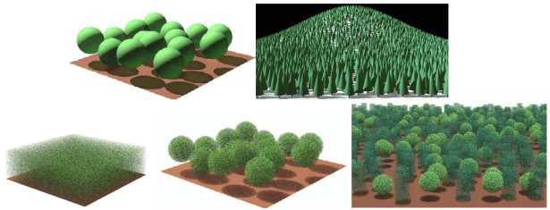
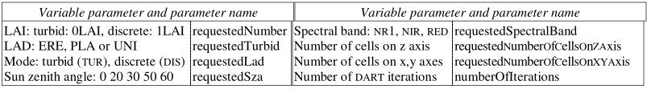
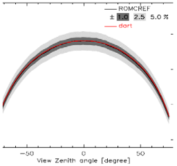

<u>*Objective:*</u> to run DART simulations with Python scripts and to compare results with those of RAMI 3 experiment [https://rami-benchmark.jrc.ec.europa.eu/_www/index.php](https://rami-benchmark.jrc.ec.europa.eu/_www/index.php).

Comparison of radiative transfer models applied to RAMI-3 scenes: angular reflectance products (ground, vegetation 1st and multiple scattering), for 3 spectral bands (NR1, red: 650nm, NIR: 860nm), a few sun zenith angles (usually: 0°, 30°, 60°), 4 LAI (1, 2, 3, 5) and 3 LADs (erectophile: ERE, planophile: PLA, uniform: UNI). Scenes are turbid (i.e., "ground + vegetation plot") and discrete (i.e., tree = set of turbid cells or 3D distribution of disks: see below). We have {$\rho_{g,nr1} = 1, \rho_{l,nr1} = \tau_{l,red} = 0.5$}, {$\rho_{g,red} = 0.127, \rho_{l,red} = 0.0546, \tau_{l,red} = 0.0149$}, {$\rho_{g,nir} = 0.159, \rho_{l,nir} = 0.4957, \tau_{l,nir} = 0.4409$}.

*RAMI 3D scenes: turbid (top) and discrete (bottom). DART provided scripts simulate / manage all RAMI scenes except the conifer forest and the real zoom-in scene.*
</img>

1. Copy Python scripts (CreateRamiSimulations, LaunchRamiSimulations, ExtractDataROMC, SavePlotsRomc) from folder `\bin\python_script\ScriptsRami` to the level of provided DART simulation `RAMI\core`, and modify their settings: `set DART_LOCAL=*`, `set DART_HOME=*`, `set RamiSimulationFolder=*` to specify correct paths. Names of all RAMI cases that DART scripts manage are in `ListRamiSimulations.py`.
2. Run `CreateRamiSimulations.bat`: it creates 3.N simulations that are copies of the root simulation, with N resulting from the variable input parameters that you specify (see below). Each simulation among the N simulations corresponds to a specific combination of these variable input parameters.  
!!!note
    for Linux, the file extension of the scripts is `*.sh` instead of `*.bat` for windows.
3. Run `LaunchRamiSimulations.bat`: it launches the N simulations.
4. Run `ExtractDataROMC.bat`: it extracts the reflectance products of the N simulations, stores them in the folder `RomcResults` with ROMC (RAMI) format. Python script `SavePlotsRomc.bat` can create graphs (pdf format).
5. Zip files in folder `RomcResults`, upload the zip file on [https://romc.jrc.ec.europa.eu/_www/index.php](https://romc.jrc.ec.europa.eu/_www/index.php) and follow steps given in `\bin\python_script\ScriptsRAMI\Doc\RAMI_Submit_Results_ROMC.pdf`.

*Parameters. Valid combinations are in [https://romc.jrc.ec.europa.eu/_www/index.php](https://romc.jrc.ec.europa.eu/_www/index.php)*
</img>

*Example of automatic comparison of DART results with RAMI 3 "mean reflectance" values.*
</img>

