<u>*Objectives:*</u> to map TOA / BOA / Sensor radiometric quantities for any date and world region, and to compute their time variation (hourly, daily,..) for any world coordinates. These quantities correspond to sensor measurements (i.e., radiance, reflectance, brightness temperature) or terms of the Earth-Atmosphere radiation budget (e.g., irradiance, exitance, albedo).

### 1) Africa radiance maps measured by a geostationary satellite

The mapping method has 2 steps:

- <u>*Step 1*</u>. Create a root simulation (e.g., 1m x 1m bare ground scene, 1m resolution). Sensor view direction is defined by satellite location which allows its automatic up-date with new scene location.

- <u>*Step 2.*</u> Run the python script `worldGlobalMap.py` (see below) to run scripts that create / run sequences of simulations and store results in text files and png images. Run run.bat command with Windows operating system. Python scripts are in folder "DART\bin\python_script\RadiometricMaps":
    - `DARTDao.py`: it reads DART input and output parameters in the simulation.properties.txt file.
    - `worldGlobalMapSequenceLauncher.py`: runs the sequence, sets parameters, radiance data,…
    - `worldGlobalMapImageGenerator.py`: it creates PNG images with the world Python basemap.
    - `worldGlobalMapUtility.py`: utilities for all Python scripts

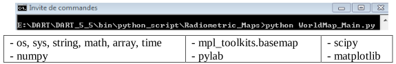
*Python command line and Python libraries and extensions that are used.*
</img>

Parameters of `worldGlobalMap.py`:

- Name of the root simulation: baseSimulationName = 'simulation_name'
- Coordinates of the region to map: minimal / maximal latitude and longitude[^1].
- Number of steps in latitude and longitude. Computation time increases with the number of steps.
- List of dates (year, month, day): dateList = [RGMDate(year = 2012, month = 3, day = 21),…]
- List of time (hour, minute, second) in UTC: timeList = [Time(hour=5,minute=44,second=37),…]
- Flag (True or False) to create / run sequences of simulations, and flag to create images
- Number of simulations to run in parallel
- Results to map (BOA.irradiance,… ; see below). Their names are in the simulation.properties file.

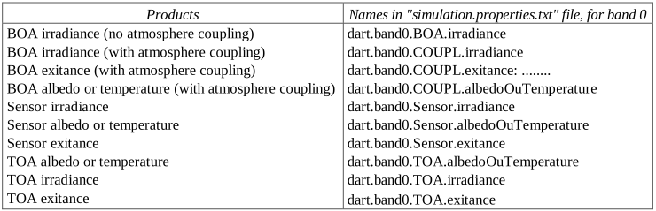
*Some DART products that can be mapped. Their names are in the simulation.properties file)*
</img>

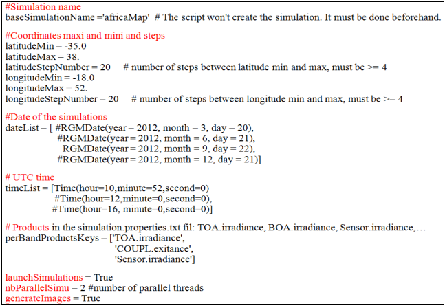
*Part of script worldGlobalMap.py that sets the region coordinates (here, Africa), dates, products,...*
</img>

#### 1.a - Creation of a root simulation (see below).

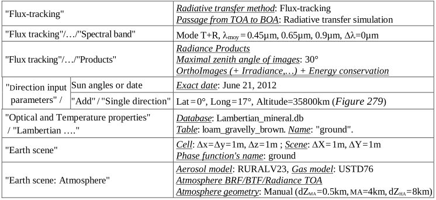
*Parameters to modify in the root simulation.*
</img>

The satellite view direction is added as a single (fictive) direction. It is derived from the user specified scene and satellite coordinates (altitude, longitude, latitude).

Folder `simulation_name\results\coordinate_values\date_value\time_value` in the root simulation stores the products. Its name indicates the region coordinates, date and time. It stores (see below) all spectral bands bounds (bands.txt file), the coordinates all DART simulations (`latlon.txt` file) and 1 folder per product (text file + png image: interpolated map) per spectral band:

- 3 satellite (default) products: TOA, BOA and atmosphere radiance for the satellite view direction.
- user selected radiometric products: BOA / TOA / Sensor irradiance, Coupl_exitance, radiance,…

!!!note
    - NOAA module ([www.esrl.noaa.gov/gmd/grad/solcalc/](https://www.esrl.noaa.gov/gmd/grad/solcalc/)) computes sun direction for any date and location.
    - Module ([www.solar-noon.com/](https://www.solar-noon.com/)) gives UTC time of solar noon anywhere. At (Lat 0°, Lon 0°) it is $\pm 15'$.

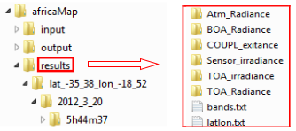
*Folders that store the 6 user required results.*
</img>

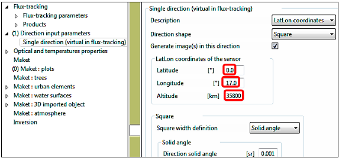
*The satellite viewing direction is added by setting its location (Latitude, Longitude, Altitude).*
</img>

#### 1.b - Create radiometric maps of Africa

- i. Modify the script `worldGlobalMap.py` to set: region (Africa: [-35S 38N], [-18E 52E]), date (e.g., June 21, 2012), time (e.g., 12h UTC), products (e.g., TOA irradiance, BOA irradiance, atmosphere radiance) in addition to TOA / Sensor / BOA upward radiance (satellite view direction).  
!!!question
    First, use 4 steps in latitude and longitude for testing the method with short computation times.
- ii. Run the command: python `worldGlobalMap.py`, and tyhen, display results.

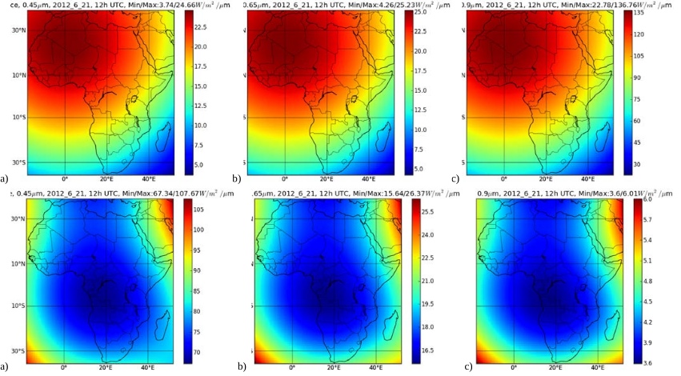</img>

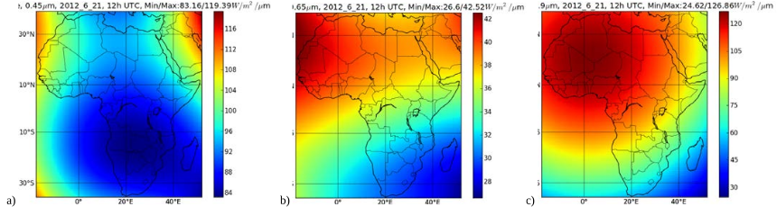
*BOA (top), atmosphere (middle) and TOA (bottom) radiance $(W/m^2/\mu m$), for a geostationary satellite. a) $0.45\mu m$. b) $0.65\mu m$. c) $0.9\mu m$.*
</img>

Application of the mapping method to Europe (35N-72N, -25E-50E) is shown on the image below.

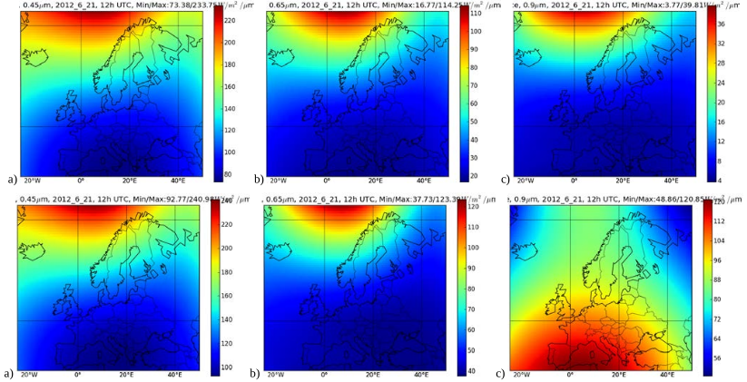
*Atmosphere (top) and satellite TOA (bottom) radiance $(W/m^2/\mu m)$. a) $0.45\mu m$. b) $0.65\mu m$. c) $0.9\mu m$.*
</img>

### 2) Time evolution of TOA radiance for some African cities

DART can compute the time variation of reflectance and radiance associated to a satellite with a given position, for any Earth location. Here, this is illustrated with African cities: Algiers (36.42°N, 3.13°E. UTC+1), Cairo (30.2°N, 31.13°E. UTC+2), Dakar (14.4°N, 17.25°W. UTC), Pretoria (25.45°S, 28.11°E. UTC+2), Mogadiscio (2.02°N, 45.21°E. UTC+3) and Luanda (8.50°S, 13.14°E. UTC+1).

- <u>*Step 1:*</u> create the sequences of interest. The screenshot below shows the sequence associated to Algiers at 8hUTC.

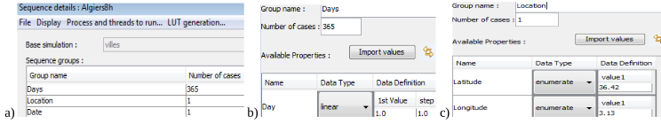
*Sequence Algiers at 8h UTC.*
</img>

- <u>*Step 2:*</u> run the sequences, using the script `dart-sequence.bat` in folder "tool" (as in the screenshot below).

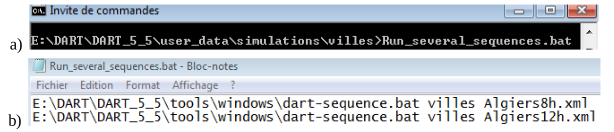
*Command line (a) that launches the sequences Algiers8h and Algiers12h.*
</img>

- <u>*Step 3:*</u> run the python script that extracts $L_{TOA}$, $L_{sensor}$, $L_{BOA}$, atmosphere Latm and useful ($L_u = L_{TOA} - L_{atm}$) radiance values from all sequences (as shown below), and stores them in the "results" folder (1 folder per sequence).

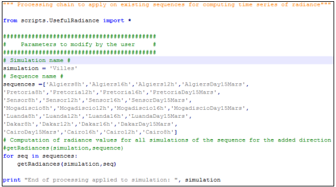
*Python script that retrieves radiance values.*
</img>

The graph below shows $L_{TOA}, L_{atm}$ and $L_u$ at 16hUTC for the African cities, as measured by a geostionary satellite. The "Sensor" curve corresponds to the Earth site at satellite nadir.

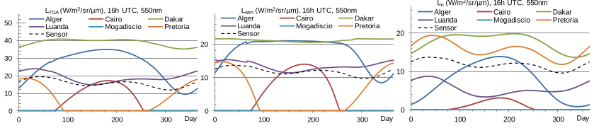
*Python script that retrieves radiance values.*
</img>

The above method processes automatically several sequences. If few sequences are run, then retrieving results directly from the DART SQL database may be faster and simpler. The image below displays results that are stored in the DART SQL database: TOA (red), atmosphere (green), $1^{st}$ order atmosphere (blue) and BOA radiance (cyan) and reflectance values for for Algiers city and a sequence of 365 days at 16hUTC. BOA reflectance is constant, because the Earth surface has a lambertian and constant reflectance.

!!!question
    In the graph above, during summer in northern hemisphere, radiance is larger. It is coherent with smaller local sun zenith angle. Why $\rho_{TOA}, \rho_{atm}, \rho_{atm,1}$ are smaller?

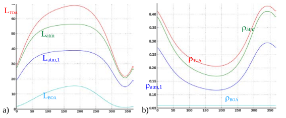
*Daily radiance (a) and reflectance (b) for a geostationary satellite, at 16hUC. Algiers.*
</img>

### 3) Update of atmosphere database with AERONET and ECMWF data

Here, we use atmosphere files that are in the folder Atmosphere of the DART database: 3 files from AERONET and 12 temperature files from ECMWF database.

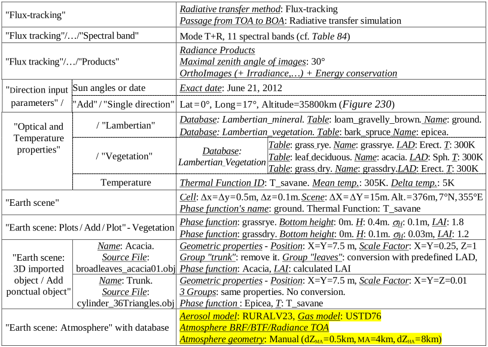
*Parameters to modify in the root simulation.*
</img>

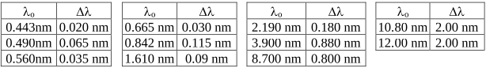
*Selected spectral bands. Bands 0 to 6 are Sentinel-2 bands.*
</img>

The image below illustrates an application of DART simulations. It shows hourly $L_u, L_{sensor\:noise}$ and $L_u$ relative change due to sensor noise $\eta_{SNR} =\frac {\delta L_u(SNR)} {L_u}$ with $SNR_{ref} = 129$ at $\lambda_{ref}$ (Sentinel 2 data), for a grass savannah. These values allow one to compute the domain of validity of $L_u$, acquired by a geostationary satellite, for given sensor SNR (Signal to Noise Ratio) and relative accuracy of radiance measurements. Here, $L_u$ is valid over [8h 17h30] (vertical red lines), if the expected radiance accuracy is 3%.

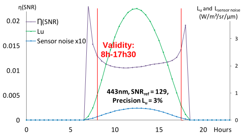
*Hourly $L_u, L_{sensor\: noise}$ and $\eta_{SNR}$ and the domain of validity of $L_u$ acquired by a geostationary satellite. February 7, 2005. Grass savanah (7°41'N, 5°01'W, altitude: 376 m))*
</img>

!!!note
    Work funded by CNES for studying the potential of a high spatial resolution geostationary satellite.

[^1]: France: [42N 52N], [-5E 9E]. USA: [24N 49N], [-125E -65E]. Africa: [-35S 38N], [-18E 52E]. Europe: [35N 72N], [-25E 50E]
