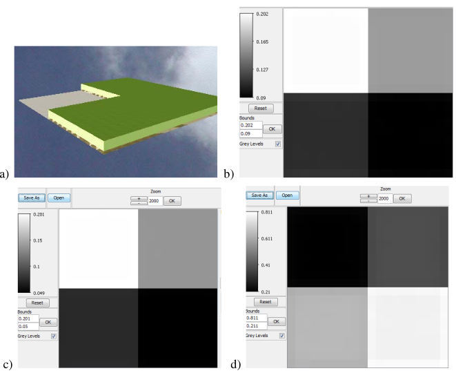

### 1) Inversion of vegetation RS image
LAI and $\rho_{ground}$: WP12A

Here, the inversion is made in 3 steps:

- 1) <u>To create the image to invert.</u>  
The scene {20m x20m, $\Delta x=\Delta y=1m, \Delta z=0.25m$ } is made of 4 plots with plot height = 1m and plot LAI = 0, 1, 3 and 5. Leaf spectral properties are defined by "Leaf_deciduous" database. Ground reflectance is $\rho_{ground} = 0.22$ in all bands. We have 3 spectral bands: $0.55\mu m$, $0.65\mu m$ and $0.9\mu m$ Sun direction is vertical. DART images are created without any oversampling.

- 2) <u>To create a LUT with a sequence</u> ({LAI, $\rho_{ground}$ values encompass the {LAI, $\rho_{ground}$ of the image to invert)  
Root simulation: {1mx1m. $\Delta x=\Delta y=1m. \Delta z=0.25m$. 3 bands: $0.55\mu m, 0.65\mu m, 0.9\mu m.$ 1 vegetation plot}. 330 simulations: 11 values of $\rho_{ground}$ from 0 to 1 ($\Delta=0.1$) and 30 values of $LAI_{plot}$ from 0 to 6 ($\Delta=0.2$).  
  Once the LUT of scene reflectances ρscene is created during the sequence, create the LUT of coefficients that is used by the inversion procedure. (cf. Module_User_manual), LUT_Coefficient).
!!!note
    In order to reduce computer time and memory, do not store images and all iteration orders.  

- 3) <u>Inversion of the image created in step 1</u>, with the LUT_Coefficient created in step 2.  
For that, the 3 images of step 1 are renamed "Green", "Red" and "NIR" and are copied in the input directory of the current simulation.

*a) Scene that is used for creating the image to invert. DART images at $0.55\mu m$ (a), $0.65\mu m$ (c) and $0.9\mu m$ (d).*
</img>

### 2) Inversion of urban RS image: urban material optical properties: WP12B
